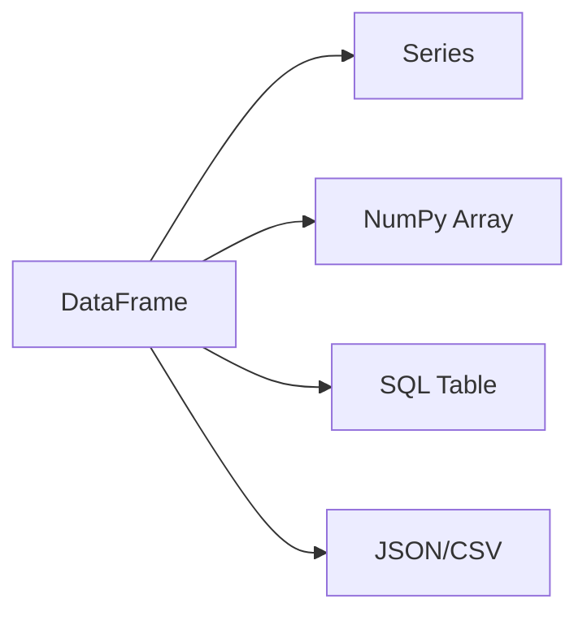

# DataFrame 原理与代码实例讲解

## 1.背景介绍
在现代数据科学和数据分析领域,高效地处理和分析结构化数据是一项关键能力。而 DataFrame 作为一种二维标记数据结构,已经成为了数据分析工作中不可或缺的利器。它为我们提供了一种直观、灵活且高效的方式来存储、操作和分析数据。

DataFrame 最早由 R 语言中的 data.frame 对象启发而来,后来被引入到 Python 的 pandas 库中,成为了 Python 数据分析的核心数据结构。如今,无论是在 R、Python 还是 Spark、Flink 等大数据处理框架中,DataFrame 都扮演着至关重要的角色。

### 1.1 DataFrame 的优势
那么,是什么让 DataFrame 如此备受青睐呢?主要有以下几点优势:

#### 1.1.1 直观的数据表示
DataFrame 以二维表格的形式呈现数据,每一列代表一个变量,每一行代表一个观测。这种形式与我们日常接触的 Excel 表格非常相似,使得数据的理解和分析变得更加直观。

#### 1.1.2 灵活的数据操作
DataFrame 提供了丰富的数据操作方法,如选取、过滤、排序、分组、聚合等,使得复杂的数据转换和计算变得简单高效。我们可以方便地对行、列进行操作,提取感兴趣的数据子集。

#### 1.1.3 整合异构数据
DataFrame 可以容纳不同类型的数据,如数值型、字符型、布尔型等。这使得我们可以在同一个 DataFrame 中整合来自不同来源、格式的数据,方便进行统一的处理和分析。

#### 1.1.4 高性能
DataFrame 经过了优化设计,在内存管理和计算性能上有着出色的表现。即使面对大规模数据,DataFrame 也能提供高效的数据处理和计算能力。

### 1.2 应用场景
DataFrame 在数据科学和数据分析领域有着广泛的应用,一些典型的应用场景包括:

- 数据清洗和预处理:使用 DataFrame 对原始数据进行清洗、转换、过滤、填充缺失值等预处理操作,为后续分析做准备。

- 探索性数据分析:利用 DataFrame 的数据操作和可视化功能,对数据进行探索性分析,发现数据的特征、分布、趋势等。

- 特征工程:使用 DataFrame 进行特征提取、特征转换、特征选择等特征工程任务,构建机器学习模型所需的特征。

- 数据挖掘:运用 DataFrame 对数据进行切片、分组、聚合等操作,挖掘数据中的模式、规律和洞见。

- 数据可视化:基于 DataFrame 的数据绘制各种图表,如折线图、柱状图、散点图等,直观呈现数据的特征和趋势。

## 2.核心概念与联系

### 2.1 DataFrame 的核心概念
DataFrame 有几个核心概念,理解这些概念对于熟练使用 DataFrame 至关重要。

#### 2.1.1 行和列
DataFrame 由行(Row)和列(Column)组成。每一行代表一个观测或记录,每一列代表一个变量或属性。行和列的交叉点是一个单元格,存储着对应行列的数据值。

#### 2.1.2 索引
DataFrame 有两种索引:行索引(Index)和列索引(Column)。行索引为每一行提供了唯一的标识,列索引为每一列提供了唯一的标识。通过行索引和列索引,我们可以方便地定位和访问 DataFrame 中的数据。

#### 2.1.3 数据类型
DataFrame 中的每一列都有其对应的数据类型,如整数、浮点数、字符串、日期等。DataFrame 会自动推断列的数据类型,也支持用户显式指定数据类型。

### 2.2 DataFrame 与其他数据结构的关系
DataFrame 与其他常见的数据结构有着密切的联系。

#### 2.2.1 Series
Series 是一种一维标记数据结构,可以看作是 DataFrame 的一个列。DataFrame 可以由多个 Series 组成,每个 Series 表示一个变量或属性。

#### 2.2.2 NumPy 数组
DataFrame 的底层存储通常使用 NumPy 数组。NumPy 数组提供了高效的数值计算和存储能力,DataFrame 在此基础上提供了更高层次的数据操作和分析功能。

#### 2.2.3 SQL 表
DataFrame 与关系型数据库中的表(Table)概念类似。DataFrame 可以看作是一个内存中的表,支持类似 SQL 的操作,如选择、过滤、连接等。

#### 2.2.4 JSON 和 CSV
DataFrame 支持与 JSON 和 CSV 等常见数据格式的互相转换。我们可以将 JSON 或 CSV 数据读入 DataFrame,也可以将 DataFrame 数据写出为 JSON 或 CSV 格式。

下图展示了 DataFrame 与其他数据结构之间的关系:



## 3.核心算法原理具体操作步骤
DataFrame 的核心算法主要涉及数据的选取、过滤、排序、分组、聚合等操作。下面我们以 Python 的 pandas 库为例,介绍这些操作的具体步骤。

### 3.1 创建 DataFrame
首先,我们需要创建一个 DataFrame。可以使用 `pd.DataFrame()` 函数,传入一个字典或列表来创建。

```python
import pandas as pd

data = {
    'name': ['Alice', 'Bob', 'Charlie', 'David'],
    'age': [25, 30, 35, 40],
    'city': ['New York', 'Paris', 'London', 'Tokyo']
}

df = pd.DataFrame(data)
```

### 3.2 选取数据
DataFrame 提供了多种方式来选取数据。

#### 3.2.1 按列选取
可以使用列名作为索引来选取单个列或多个列。

```python
# 选取单个列
names = df['name']

# 选取多个列
info = df[['name', 'age']]
```

#### 3.2.2 按行选取
可以使用 `loc[]` 和 `iloc[]` 来按行索引或行号选取行。

```python
# 按行索引选取
row1 = df.loc[0]

# 按行号选取
row2 = df.iloc[1]
```

### 3.3 过滤数据
可以使用布尔条件来过滤 DataFrame 中的数据。

```python
# 过滤出年龄大于30的行
filtered_df = df[df['age'] > 30]
```

### 3.4 排序数据
使用 `sort_values()` 函数对 DataFrame 进行排序。

```python
# 按年龄升序排序
sorted_df = df.sort_values('age')

# 按年龄降序排序
sorted_df = df.sort_values('age', ascending=False)
```

### 3.5 分组和聚合
使用 `groupby()` 函数对 DataFrame 进行分组,然后可以对分组后的数据进行聚合操作。

```python
# 按城市分组,计算每个城市的平均年龄
grouped_df = df.groupby('city')['age'].mean()
```

## 4.数学模型和公式详细讲解举例说明
DataFrame 的许多操作都涉及到数学模型和公式。下面我们以几个常见的数学模型为例,详细讲解它们在 DataFrame 中的应用。

### 4.1 均值
均值是一组数据的算术平均值,表示数据的中心趋势。对于 DataFrame 的某一列数据 $x_1, x_2, ..., x_n$,其均值为:

$$\bar{x} = \frac{1}{n} \sum_{i=1}^{n} x_i$$

在 DataFrame 中,可以使用 `mean()` 函数计算某一列的均值。

```python
age_mean = df['age'].mean()
```

### 4.2 标准差
标准差衡量了数据偏离均值的程度,反映数据的离散程度。对于 DataFrame 的某一列数据 $x_1, x_2, ..., x_n$,其标准差为:

$$\sigma = \sqrt{\frac{1}{n} \sum_{i=1}^{n} (x_i - \bar{x})^2}$$

其中,$\bar{x}$ 为数据的均值。在 DataFrame 中,可以使用 `std()` 函数计算某一列的标准差。

```python
age_std = df['age'].std()
```

### 4.3 相关系数
相关系数衡量了两个变量之间的线性相关程度,取值范围为 [-1, 1]。对于 DataFrame 的两列数据 $X = (x_1, x_2, ..., x_n)$ 和 $Y = (y_1, y_2, ..., y_n)$,其相关系数为:

$$r = \frac{\sum_{i=1}^{n} (x_i - \bar{x})(y_i - \bar{y})}{\sqrt{\sum_{i=1}^{n} (x_i - \bar{x})^2} \sqrt{\sum_{i=1}^{n} (y_i - \bar{y})^2}}$$

其中,$\bar{x}$ 和 $\bar{y}$ 分别为两列数据的均值。在 DataFrame 中,可以使用 `corr()` 函数计算两列数据的相关系数。

```python
age_city_corr = df[['age', 'city']].corr()
```

## 5.项目实践：代码实例和详细解释说明
下面我们通过一个实际的项目实践,来演示如何使用 DataFrame 进行数据分析。我们将使用 Python 的 pandas 库,分析一份虚拟的员工数据。

### 5.1 数据准备
首先,我们创建一个包含员工信息的 DataFrame。

```python
import pandas as pd

data = {
    'name': ['Alice', 'Bob', 'Charlie', 'David', 'Eva'],
    'age': [25, 30, 35, 40, 45],
    'salary': [50000, 60000, 70000, 80000, 90000],
    'department': ['Sales', 'Engineering', 'Sales', 'Engineering', 'Marketing']
}

df = pd.DataFrame(data)
```

### 5.2 数据探索
我们可以使用 `head()` 函数查看 DataFrame 的前几行数据,以了解数据的整体情况。

```python
print(df.head())
```

输出结果:
```
     name  age  salary    department
0   Alice   25   50000         Sales
1     Bob   30   60000   Engineering
2  Charlie  35   70000         Sales
3   David   40   80000   Engineering
4     Eva   45   90000     Marketing
```

### 5.3 数据分析
接下来,我们对数据进行一些分析操作。

#### 5.3.1 计算平均年龄和工资
```python
avg_age = df['age'].mean()
avg_salary = df['salary'].mean()

print(f"Average Age: {avg_age}")
print(f"Average Salary: {avg_salary}")
```

输出结果:
```
Average Age: 35.0
Average Salary: 70000.0
```

#### 5.3.2 按部门分组,计算平均工资
```python
dept_avg_salary = df.groupby('department')['salary'].mean()

print(dept_avg_salary)
```

输出结果:
```
department
Engineering    70000
Marketing      90000
Sales          60000
Name: salary, dtype: int64
```

#### 5.3.3 过滤出工资高于平均工资的员工
```python
high_salary_emp = df[df['salary'] > avg_salary]

print(high_salary_emp)
```

输出结果:
```
   name  age  salary    department
3  David  40   80000   Engineering
4   Eva   45   90000     Marketing
```

## 6.实际应用场景
DataFrame 在实际应用中有着广泛的用途。以下是几个典型的应用场景:

### 6.1 销售数据分析
在销售数据分析中,我们通常有一个包含销售记录的 DataFrame,其中包括日期、产品、数量、金额等信息。使用 DataFrame,我们可以:

- 按日期、产品等维度对销售数据进行汇总和聚合
- 计算各个产品的销售总额、销量等指标
- 分析不同时间段的销售趋势
- 识别销售最好和最差的产品

### 6.2 用户行为分析
在用户行为分析中,我们通常有一个记录用户行为的 DataFrame,如用户的点击、浏览、购买等行为。使用 DataFrame,我们可以:

- 统计不同用户群体的行为特征
- 分析用户的行为序列和路径
- 计算用户的留存率、转化率等指标
- 建立用户画像,进行个性化推荐

### 6.3 金融数据分析
在金融领域,DataFrame 被广泛用于分析股票、基金、外汇等金融数据。使用 DataFrame,我们可以:

- 计算金融资产的收益