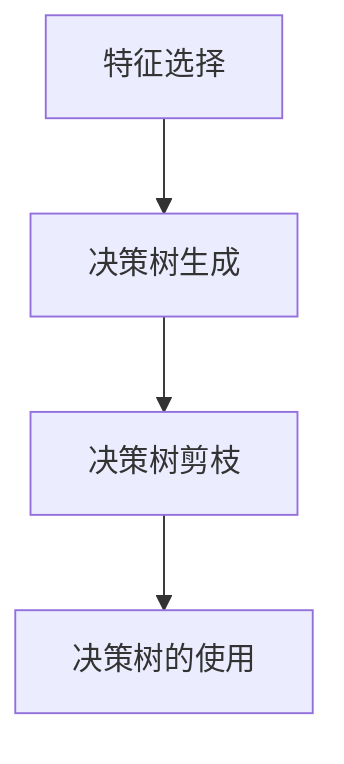

# Decision Trees 原理与代码实战案例讲解

## 1. 背景介绍
### 1.1 机器学习概述
### 1.2 决策树在机器学习中的地位
### 1.3 决策树的应用场景

## 2. 核心概念与联系
### 2.1 决策树的定义
决策树（Decision Tree）是一种常见的机器学习算法,属于监督学习范畴。它可以用于解决分类问题和回归问题。决策树通过树形结构来进行决策,每个内部节点表示一个属性测试,每个分支代表一个测试输出,而每个叶节点存储一个类别标签。
### 2.2 决策树的组成部分
- 根节点:包含样本全集
- 内部节点:对应于特征属性测试
- 叶节点:代表决策结果
- 分支:从一个节点到另一个节点的连接,代表测试的可能结果
### 2.3 决策树与其他机器学习算法的联系
- 决策树与 K 近邻:都是基于实例的学习方法
- 决策树与朴素贝叶斯:都是生成式模型,通过学习联合概率分布来预测
- 决策树与支持向量机:都可以用于分类和回归任务

## 3. 核心算法原理具体操作步骤
### 3.1 决策树的一般流程

### 3.2 特征选择
#### 3.2.1 信息增益
- 定义:信息增益表示得知特征 X 的信息而使类 Y 的信息的不确定性减少的程度。
- 公式:$Gain(D,A) = Ent(D) - \sum_{v=1}^{V}\frac{|D^v|}{|D|}Ent(D^v)$
- 缺点:偏向选择取值较多的特征
#### 3.2.2 信息增益比
- 定义:在信息增益的基础上除以特征 X 的熵,来减少特征取值数量的影响。
- 公式:$GainRatio(D,A) = \frac{Gain(D,A)}{IV(A)}$
#### 3.2.3 基尼指数
- 定义:表示集合的不确定性,基尼值越大,样本集合的不确定性越大。
- 公式:$Gini(D) = 1 - \sum_{k=1}^{|y|}p_k^2$
### 3.3 决策树生成
#### 3.3.1 ID3 算法
- 核心:采用信息增益来选择划分特征
- 步骤:
    1. 计算每个特征的信息增益
    2. 选择信息增益最大的特征作为当前节点的划分特征
    3. 根据选择的特征划分数据集,生成子节点
    4. 对子节点递归执行 1-3 步,直到满足停止条件
#### 3.3.2 C4.5 算法
- 核心:采用信息增益比来选择划分特征,并引入了剪枝操作
- 步骤:
    1. 计算每个特征的信息增益比
    2. 选择信息增益比最大的特征作为当前节点的划分特征
    3. 根据选择的特征划分数据集,生成子节点
    4. 对子节点递归执行 1-3 步,直到满足停止条件
    5. 自底向上进行剪枝
#### 3.3.3 CART 算法
- 核心:采用基尼指数来选择划分特征,生成二叉树
- 步骤:
    1. 计算每个特征的基尼指数
    2. 选择基尼指数最小的特征作为当前节点的划分特征
    3. 根据选择的特征划分数据集,生成左右子节点
    4. 对子节点递归执行 1-3 步,直到满足停止条件
    5. 自底向上进行剪枝
### 3.4 决策树剪枝
#### 3.4.1 预剪枝
- 定义:在决策树生成过程中,对每个节点在划分前进行估计,若当前节点的划分不能带来决策树泛化性能提升,则停止划分并将当前节点标记为叶节点。
- 优点:降低过拟合风险,显著减少决策树训练时间开销和测试时间开销
- 缺点:有欠拟合的风险,剪枝过程依赖验证数据集
#### 3.4.2 后剪枝
- 定义:先从训练集生成一棵完整的决策树,然后自底向上地对非叶节点进行考察,若将该节点对应的子树替换为叶节点能带来决策树泛化性能提升,则将该子树替换为叶节点。
- 优点:欠拟合风险很小,泛化性能往往优于预剪枝决策树
- 缺点:训练时间开销比未剪枝决策树和预剪枝决策树都要大得多

## 4. 数学模型和公式详细讲解举例说明
### 4.1 熵的概念
- 定义:表示随机变量不确定性的度量
- 公式:离散随机变量 X 的熵定义为 $H(X) = -\sum_{i=1}^{n}p(x_i)log_2p(x_i)$
- 例子:抛掷均匀硬币,X 为抛掷结果,X=1 表示正面,X=0 表示反面,则 $H(X) = -(\frac{1}{2}log_2\frac{1}{2} + \frac{1}{2}log_2\frac{1}{2}) = 1$
### 4.2 条件熵的概念  
- 定义:表示在已知随机变量 X 的条件下随机变量 Y 的不确定性
- 公式:$H(Y|X) = \sum_{i=1}^{n}p_iH(Y|X=x_i)$
- 例子:假设有两个相互独立的硬币 A 和 B,A 出现正面的概率为 $\frac{1}{4}$,B 出现正面的概率为 $\frac{1}{2}$,随机变量 X 表示 A 的抛掷结果,Y 表示 B 的抛掷结果,则 $H(Y|X) = \frac{1}{4} \cdot 1 + \frac{3}{4} \cdot 1 = 1$
### 4.3 信息增益的计算
- 例子:假设训练数据集 D 中有 3 个特征:色泽、根蒂、敲声,目标变量为好瓜/坏瓜。现在计算"色泽"这个特征的信息增益。
    - 先计算数据集 D 的熵:$Ent(D) = -(\frac{8}{17}log_2\frac{8}{17} + \frac{9}{17}log_2\frac{9}{17}) \approx 0.998$
    - 再计算按照"色泽"特征划分后的条件熵:
        - 对于"青绿"色泽,其熵为:$Ent(D^{color=green}) = -(\frac{3}{6}log_2\frac{3}{6} + \frac{3}{6}log_2\frac{3}{6}) = 1$
        - 对于"乌黑"色泽,其熵为:$Ent(D^{color=black}) = -(\frac{4}{6}log_2\frac{4}{6} + \frac{2}{6}log_2\frac{2}{6}) \approx 0.918$
        - 对于"浅白"色泽,其熵为:$Ent(D^{color=white}) = -(\frac{1}{5}log_2\frac{1}{5} + \frac{4}{5}log_2\frac{4}{5}) \approx 0.722$
        - 条件熵为:$\sum_{v=1}^{3}\frac{|D^{color=v}|}{|D|}Ent(D^{color=v}) \approx 0.892$
    - 最后计算信息增益:$Gain(D,color) = Ent(D) - \sum_{v=1}^{3}\frac{|D^{color=v}|}{|D|}Ent(D^{color=v}) \approx 0.109$

## 5. 项目实践:代码实例和详细解释说明
下面我们用 Python 实现基于 ID3 算法的决策树分类器:
```python
import numpy as np

class DecisionTree:
    def __init__(self, epsilon=0.1):
        self.epsilon = epsilon  # 阈值
        self.tree = {}

    def calc_ent(self, datasets):
        """计算熵"""
        label_count = {}
        for data in datasets:
            label = data[-1]
            if label not in label_count:
                label_count[label] = 0
            label_count[label] += 1
        
        ent = -sum([(p/len(datasets))*np.log2(p/len(datasets)) for p in label_count.values()])
        return ent

    def calc_gain(self, datasets, axis):
        """计算信息增益"""
        datasets_split = {}
        for data in datasets:
            feature = data[axis]
            if feature not in datasets_split:
                datasets_split[feature] = []
            datasets_split[feature].append(data)
        
        condition_ent = sum([(len(subset)/len(datasets))*self.calc_ent(subset) for subset in datasets_split.values()])
        ent = self.calc_ent(datasets)
        gain = ent - condition_ent
        return gain

    def split_datasets(self, datasets, axis, value):
        """根据特征划分数据集"""
        ret = []
        for data in datasets:
            if data[axis] == value:
                reduced_vec = data[:axis]
                reduced_vec.extend(data[axis+1:])
                ret.append(reduced_vec)
        return ret

    def choose_best_feature(self, datasets):
        """选择最优特征"""
        best_feature = -1
        best_gain = 0
        for i in range(len(datasets[0]) - 1):
            gain = self.calc_gain(datasets, i)
            if gain > best_gain:
                best_gain = gain
                best_feature = i
        return best_feature

    def majority_vote(self, label_list):
        """多数表决"""
        label_count = {}
        for vote in label_list:
            if vote not in label_count.keys(): 
                label_count[vote] = 0
            label_count[vote] += 1
        sorted_label_count = sorted(label_count.items(), key=lambda x: x[1], reverse=True)
        return sorted_label_count[0][0]

    def create_tree(self, datasets, labels):
        """递归创建决策树"""
        label_list = [data[-1] for data in datasets]

        # 若数据集中所有实例属于同一类,则返回该类标记
        if label_list.count(label_list[0]) == len(label_list):
            return label_list[0]
        
        # 若特征集为空,则返回数据集中出现次数最多的类
        if len(datasets[0]) == 1:
            return self.majority_vote(label_list)
        
        best_feature = self.choose_best_feature(datasets)
        best_label = labels[best_feature]
        tree = {best_label:{}}
        del(labels[best_feature])

        feature_values = [data[best_feature] for data in datasets]
        unique_values = set(feature_values)
        for value in unique_values:
            sublabels = labels[:]
            tree[best_label][value] = self.create_tree(self.split_datasets(datasets, best_feature, value), sublabels)
        return tree
    
    def fit(self, train_data, train_label):
        """训练"""
        labels = ['年龄', '有工作', '有自己的房子', '信贷情况']
        datasets = [[data, label] for data, label in zip(train_data, train_label)]
        self.tree = self.create_tree(datasets, labels)

    def predict(self, test_data):
        """预测"""
        def classify(tree, test_data):
            first_key = next(iter(tree))
            second_dict = tree[first_key]
            feature_index = labels.index(first_key)
            for key in second_dict.keys():
                if test_data[feature_index] == key:
                    if type(second_dict[key]).__name__ == 'dict':
                        label = classify(second_dict[key], test_data)
                    else:
                        label = second_dict[key]
            return label
        
        labels = ['年龄', '有工作', '有自己的房子', '信贷情况']
        label = classify(self.tree, test_data)
        return label
```

代码解释:
1. `calc_ent`方法用于计算给定数据集的熵。
2. `calc_gain`方法用于计算按某个特征划分数据集后的信息增益。
3. `split_datasets`方法根据指定特征的值来划分数据集。
4. `choose_best_feature`方法选择信息增益最大的特征作为最优划分特征。
5. `majority_vote`方法使用多数表决的方式决定叶节点的分类。
6. `create_tree`方法递归地创建决策树。
7. `fit`方法根据训练数据构建决策树模型。
8. `predict`方法使用训练好的决策树模型对新样本进行预测。

使用示例:
```python
train_data = [['青年', '否', '否', '一般'],