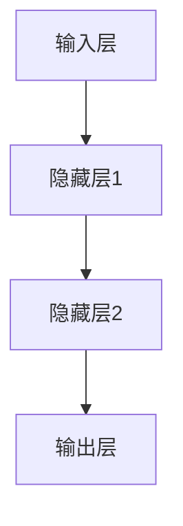
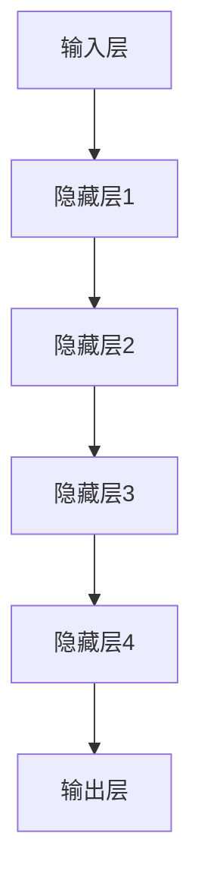
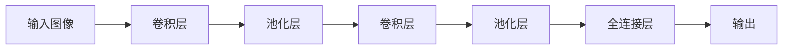
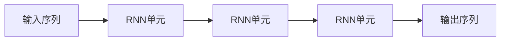
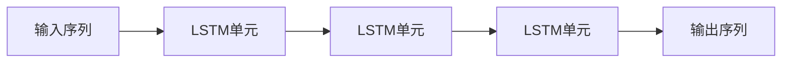
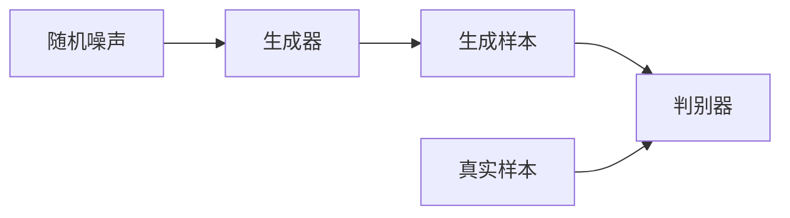

# Deep Learning

## 1.背景介绍

深度学习(Deep Learning)是机器学习的一个新兴热门领域,它源于人工神经网络的研究,近年来在计算机视觉、自然语言处理、语音识别等领域取得了突破性的进展。深度学习的核心思想是通过构建由多层非线性处理单元组成的人工神经网络,来对输入数据进行高层次的模式抽象和表示学习,从而解决机器学习中的一些关键问题。

传统的机器学习算法往往依赖于手工设计的特征,而深度学习则可以直接从原始数据(如图像、文本等)中自动学习特征表示,从而减少了人工工作量,提高了系统的性能和泛化能力。深度学习模型通过对大量数据的训练,可以自主地从底层像素或字符等原始输入中提取出高层次的抽象特征,并通过这些特征来完成相应的任务,如图像识别、语音识别等。

随着算力的不断提升和大数据时代的到来,深度学习得到了迅猛发展,其应用领域也不断扩展。目前,深度学习已成为人工智能领域最为活跃和前沿的研究方向之一,对推动人工智能技术的发展产生了深远的影响。

## 2.核心概念与联系

### 2.1 人工神经网络

人工神经网络(Artificial Neural Network, ANN)是深度学习的基础模型。它借鉴了生物神经网络的工作原理,由大量互连的神经元组成,每个神经元接收来自其他神经元的输入信号,并通过激活函数进行非线性变换,产生输出信号。神经网络通过调整神经元之间连接的权重,从训练数据中学习特征表示和映射关系。



### 2.2 深度神经网络

深度神经网络(Deep Neural Network, DNN)是指包含多个隐藏层的人工神经网络。相比于传统的浅层神经网络,深度神经网络可以学习更加抽象和复杂的特征表示,从而提高模型的表达能力和泛化性能。常见的深度神经网络结构包括卷积神经网络(CNN)、循环神经网络(RNN)、长短期记忆网络(LSTM)等。



### 2.3 卷积神经网络

卷积神经网络(Convolutional Neural Network, CNN)是深度学习在计算机视觉领域的重要突破,它通过卷积操作和池化操作来提取图像的局部特征,并逐层组合形成更高层次的特征表示。CNN在图像识别、目标检测、语义分割等任务中表现出色。



### 2.4 循环神经网络

循环神经网络(Recurrent Neural Network, RNN)是一种专门设计用于处理序列数据(如文本、语音等)的深度神经网络。它通过内部状态的循环传递,可以捕捉序列数据中的长期依赖关系,在自然语言处理、语音识别等任务中表现出色。



### 2.5 长短期记忆网络

长短期记忆网络(Long Short-Term Memory, LSTM)是一种改进的RNN结构,它通过门控机制和记忆单元来解决传统RNN在处理长序列时容易出现的梯度消失或爆炸问题,在机器翻译、语音识别等任务中表现优异。



### 2.6 生成对抗网络

生成对抗网络(Generative Adversarial Network, GAN)是一种基于对抗训练的生成模型,由生成器和判别器两个神经网络组成。生成器负责从随机噪声中生成样本,而判别器则判断生成的样本是真是假。通过生成器和判别器的不断对抗,模型可以学习到数据的真实分布,在图像生成、语音合成等任务中表现出色。



## 3.核心算法原理具体操作步骤

深度学习算法的核心步骤主要包括以下几个方面:

### 3.1 数据预处理

- 数据清洗和标准化
- 数据增强(如图像翻转、裁剪等)
- 将数据划分为训练集、验证集和测试集

### 3.2 构建网络模型

- 选择合适的网络结构(如CNN、RNN等)
- 定义网络层次和参数
- 初始化网络权重

### 3.3 模型训练

- 定义损失函数(如交叉熵损失、均方误差等)
- 选择优化算法(如梯度下降、Adam等)
- 通过反向传播算法计算梯度
- 根据梯度更新网络参数
- 在验证集上评估模型性能

### 3.4 模型调优

- 调整超参数(如学习率、正则化系数等)
- 采用技术手段防止过拟合(如dropout、早停等)
- 根据验证集上的性能进行模型选择

### 3.5 模型部署

- 保存训练好的模型参数
- 在新的输入数据上进行预测
- 可视化和分析预测结果

## 4.数学模型和公式详细讲解举例说明

### 4.1 神经元模型

神经元是深度神经网络的基本计算单元,它接收来自其他神经元的加权输入,并通过激活函数进行非线性变换,产生输出。设第 $j$ 个神经元的输入为 $x_1, x_2, \dots, x_n$,对应的权重为 $w_1, w_2, \dots, w_n$,偏置为 $b$,激活函数为 $f$,则该神经元的输出 $y_j$ 可表示为:

$$y_j = f\left(\sum_{i=1}^n w_i x_i + b\right)$$

常用的激活函数包括Sigmoid函数、ReLU函数等:

$$
\text{Sigmoid}(x) = \frac{1}{1 + e^{-x}}
$$

$$
\text{ReLU}(x) = \max(0, x)
$$

### 4.2 反向传播算法

反向传播算法是训练深度神经网络的关键算法,它通过计算损失函数对网络参数的梯度,并沿着梯度的反方向更新参数,从而最小化损失函数。

设网络的输出为 $\hat{y}$,真实标签为 $y$,损失函数为 $L(\hat{y}, y)$,则对于第 $l$ 层的权重 $W^{(l)}$ 和偏置 $b^{(l)}$,其梯度可以通过链式法则计算:

$$
\frac{\partial L}{\partial W^{(l)}} = \frac{\partial L}{\partial \hat{y}} \frac{\partial \hat{y}}{\partial z^{(l)}} \frac{\partial z^{(l)}}{\partial W^{(l)}}
$$

$$
\frac{\partial L}{\partial b^{(l)}} = \frac{\partial L}{\partial \hat{y}} \frac{\partial \hat{y}}{\partial z^{(l)}} \frac{\partial z^{(l)}}{\partial b^{(l)}}
$$

其中 $z^{(l)}$ 表示第 $l$ 层的加权输入。通过反向传播算法计算出梯度后,可以使用优化算法(如梯度下降、Adam等)更新网络参数。

### 4.3 卷积运算

卷积运算是卷积神经网络中的核心操作,它通过在输入数据(如图像)上滑动卷积核,提取局部特征。设输入数据为 $I$,卷积核为 $K$,则卷积运算可表示为:

$$
(I * K)(i, j) = \sum_{m} \sum_{n} I(i+m, j+n) K(m, n)
$$

其中 $*$ 表示卷积操作,$(i, j)$ 表示输出特征图上的位置。通过堆叠多个卷积层,CNN可以逐层提取更高层次的特征表示。

### 4.4 池化运算

池化运算是另一种常见的操作,它通过对特征图的局部区域进行下采样,来减小特征图的维度,同时保留主要的特征信息。常见的池化方法包括最大池化和平均池化。

设输入特征图为 $F$,池化窗口大小为 $m \times n$,步长为 $s$,则最大池化操作可表示为:

$$
\text{MaxPool}(F)(i, j) = \max_{(k, l) \in R_{i,j}} F(s \cdot i + k, s \cdot j + l)
$$

其中 $R_{i,j} = \{(k, l) \mid 0 \leq k < m, 0 \leq l < n\}$ 表示以 $(i, j)$ 为中心的池化窗口区域。

## 5.项目实践:代码实例和详细解释说明

以下是使用PyTorch框架构建和训练一个简单的卷积神经网络模型进行手写数字识别的代码示例:

```python
import torch
import torch.nn as nn
import torchvision.datasets as datasets
import torchvision.transforms as transforms

# 定义卷积神经网络模型
class ConvNet(nn.Module):
    def __init__(self):
        super(ConvNet, self).__init__()
        self.conv1 = nn.Conv2d(1, 32, kernel_size=3, padding=1)
        self.pool = nn.MaxPool2d(2, 2)
        self.conv2 = nn.Conv2d(32, 64, kernel_size=3, padding=1)
        self.fc1 = nn.Linear(64 * 7 * 7, 128)
        self.fc2 = nn.Linear(128, 10)
        self.relu = nn.ReLU()

    def forward(self, x):
        x = self.relu(self.conv1(x))
        x = self.pool(x)
        x = self.relu(self.conv2(x))
        x = self.pool(x)
        x = x.view(-1, 64 * 7 * 7)
        x = self.relu(self.fc1(x))
        x = self.fc2(x)
        return x

# 加载MNIST数据集
train_dataset = datasets.MNIST(root='data/', train=True, transform=transforms.ToTensor(), download=True)
test_dataset = datasets.MNIST(root='data/', train=False, transform=transforms.ToTensor())

# 定义数据加载器
train_loader = torch.utils.data.DataLoader(dataset=train_dataset, batch_size=64, shuffle=True)
test_loader = torch.utils.data.DataLoader(dataset=test_dataset, batch_size=64, shuffle=False)

# 实例化模型
model = ConvNet()

# 定义损失函数和优化器
criterion = nn.CrossEntropyLoss()
optimizer = torch.optim.Adam(model.parameters(), lr=0.001)

# 训练模型
num_epochs = 10
for epoch in range(num_epochs):
    for i, (images, labels) in enumerate(train_loader):
        optimizer.zero_grad()
        outputs = model(images)
        loss = criterion(outputs, labels)
        loss.backward()
        optimizer.step()

        if (i + 1) % 100 == 0:
            print(f'Epoch [{epoch+1}/{num_epochs}], Step [{i+1}/{len(train_loader)}], Loss: {loss.item():.4f}')

# 测试模型
correct = 0
total = 0
with torch.no_grad():
    for images, labels in test_loader:
        outputs = model(images)
        _, predicted = torch.max(outputs.data, 1)
        total += labels.size(0)
        correct += (predicted == labels).sum().item()

print(f'Accuracy on test set: {100 * correct / total}%')
```

代码解释:

1. 导入所需的PyTorch模块和数据集。
2. 定义卷积神经网络模型`ConvNet`。该模型包含两个卷积层、两个全连接层和一个最大池化层。
3. 加载MNIST手写数字数据集,并将其划分为训练集和测试集。
4. 定义数据加载器,用于批量加载数