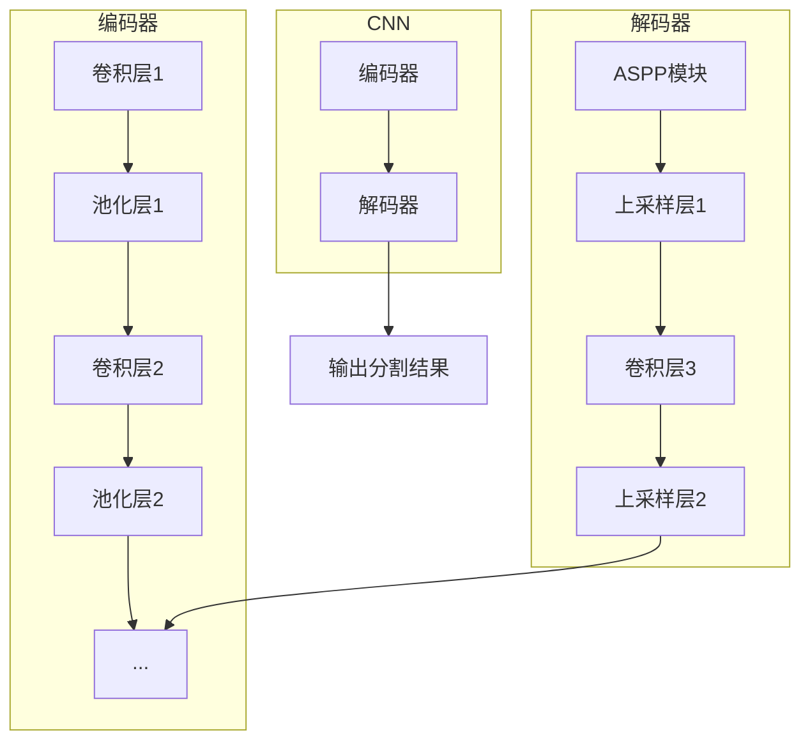
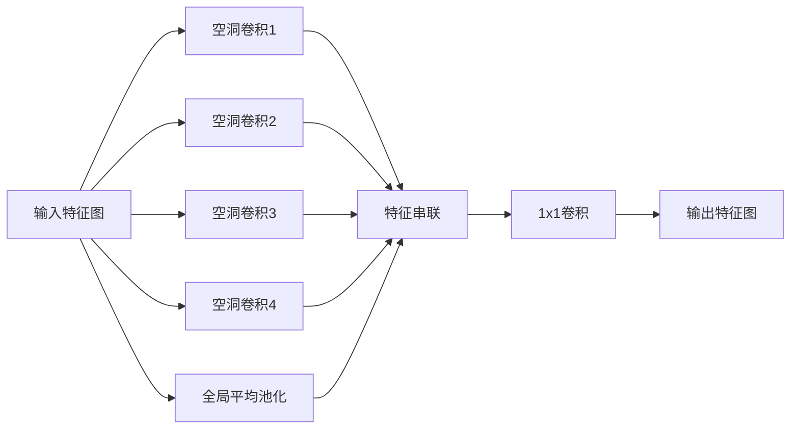

# DeepLab系列原理与代码实例讲解

## 1.背景介绍

### 1.1 语义分割的重要性

在计算机视觉领域,语义分割是一项关键的基础任务。它的目标是对图像中的每个像素进行分类,将图像像素级别地划分为不同的语义类别,如人、车辆、道路、建筑物等。语义分割广泛应用于无人驾驶、增强现实、医学图像分析等诸多领域,是实现高级视觉理解和决策的基础。

### 1.2 DeepLab系列发展历程

DeepLab是由Google推出的一系列卷积神经网络模型,专门用于语义分割任务。自2014年首个DeepLab-v1模型发布以来,DeepLab系列模型在性能和效率上不断取得突破,成为语义分割领域的经典之作。

- DeepLab-v1(2014)首次将空洞卷积(dilated convolution)应用于语义分割,显著提升了分割质量。
- DeepLab-v2(2016)引入了Atrous空间金字塔池化(ASPP)模块,进一步提高了对物体及其边界的识别能力。
- DeepLab-v3(2017)采用了编码器-解码器结构,并引入了DepthwiseConvolution等技术,在速度和准确率上都有所提升。
- DeepLab-v3+(2018)提出了一种简单而有效的解码器模块,显著提高了物体边界的分割质量。

DeepLab系列模型在多个公开基准测试中表现出色,成为语义分割领域的代表性工作。

## 2.核心概念与联系

### 2.1 卷积神经网络

卷积神经网络(CNN)是深度学习领域的核心技术之一,擅长从原始数据(如图像)中自动学习特征表示。CNN由多个卷积层、池化层和全连接层组成,通过反向传播算法不断调整网络参数,最终学习到对输入数据的有效特征表示和分类模型。

### 2.2 编码器-解码器架构

编码器-解码器架构是DeepLab系列模型的核心结构。编码器部分通过卷积和下采样操作逐步捕获输入图像的语义特征,解码器部分则通过上采样操作将特征恢复到输入图像的分辨率,并生成每个像素的类别预测。这种架构能够有效地融合多尺度特征信息,提高分割质量。

### 2.3 空洞卷积(Dilated Convolution)

空洞卷积是DeepLab系列的关键创新之一。传统卷积在每个卷积核位置只关注邻近区域的信息,而空洞卷积则通过在卷积核内引入"空洞"(即跳过部分位置),从而扩大了卷积核的感受野,能够捕获更大范围的上下文信息,这对于精确分割物体边界至关重要。

### 2.4 Atrous空间金字塔池化(ASPP)

ASPP模块是DeepLab-v2中引入的创新,旨在融合多尺度特征信息。它将同一个特征图经过不同空洞率的空洞卷积,捕获不同尺度下的物体信息,然后将这些特征进行融合,从而提高了对不同大小目标物体的识别能力。



上图展示了DeepLab系列模型的基本架构,包括编码器、解码器、ASPP模块等核心组件。编码器通过卷积和下采样逐步提取特征,解码器则通过上采样和ASPP模块融合多尺度特征,最终生成分割结果。

## 3.核心算法原理具体操作步骤

### 3.1 空洞卷积原理

空洞卷积(Dilated Convolution)是DeepLab系列的核心创新之一。与传统卷积不同,空洞卷积在卷积核内引入了"空洞"(即跳过部分位置),从而扩大了卷积核的感受野,能够捕获更大范围的上下文信息。

空洞卷积的操作步骤如下:

1. 定义卷积核大小和空洞率(dilation rate)。空洞率表示卷积核内相邻元素之间的间隔数量。
2. 在卷积核内,跳过空洞率指定的间隔位置,只计算未被跳过的元素。
3. 将未被跳过的元素与输入特征图上对应位置的元素进行卷积运算。
4. 将所有未被跳过元素的卷积结果相加,得到该位置的输出特征值。
5. 在输入特征图上滑动卷积核,重复上述步骤,直至完成整个输出特征图的计算。

空洞卷积的优势在于,它能够在不增加参数量和计算复杂度的情况下,显著扩大卷积核的感受野,从而更好地捕获物体的整体信息和边界细节,这对于精确分割目标物体至关重要。

### 3.2 Atrous空间金字塔池化(ASPP)模块

ASPP模块是DeepLab-v2中引入的创新,旨在融合多尺度特征信息,从而提高对不同大小目标物体的识别能力。ASPP模块的操作步骤如下:

1. 对输入特征图进行4种不同空洞率的空洞卷积,分别捕获不同尺度下的物体信息。
2. 对输入特征图进行全局平均池化,捕获全局上下文信息。
3. 将上述5种特征图进行串联(concatenation),融合不同尺度的特征信息。
4. 通过一个1×1卷积层对融合后的特征图进行特征整合和维度调整。

ASPP模块的关键在于,通过采用不同空洞率的空洞卷积,能够有效地融合多尺度特征信息,从而同时捕获小物体的细节和大物体的整体信息,显著提高了分割质量。



上图展示了ASPP模块的基本结构。输入特征图经过不同空洞率的空洞卷积和全局平均池化,捕获不同尺度的特征信息,然后将这些特征进行串联和整合,最终输出融合了多尺度信息的特征图。

## 4.数学模型和公式详细讲解举例说明

### 4.1 空洞卷积数学模型

设输入特征图为 $F$,卷积核大小为 $(k_h, k_w)$,空洞率为 $r$,则空洞卷积在位置 $(x, y)$ 处的输出特征值 $G[x, y]$ 可表示为:

$$G[x, y] = \sum_{i=1}^{k_h}\sum_{j=1}^{k_w}F[x+r\cdot i, y+r\cdot j]K[i, j]$$

其中 $K$ 为卷积核参数。可以看出,空洞卷积在卷积核内跳过了 $r-1$ 个位置,从而扩大了卷积核的感受野。当 $r=1$ 时,就等价于标准卷积操作。

例如,对于一个 $3\times 3$ 的卷积核,当空洞率 $r=1$ 时,感受野为 $3\times 3$;当 $r=2$ 时,感受野扩大为 $7\times 7$;当 $r=3$ 时,感受野进一步扩大为 $11\times 11$。通过增加空洞率,可以在不增加参数量的情况下,显著扩大卷积核的感受野,从而捕获更大范围的上下文信息。

### 4.2 ASPP模块数学表达

ASPP模块的输出特征图 $P$ 可表示为:

$$P = \beta_0\otimes F_0 + \sum_{i=1}^{n}\beta_i\otimes F_i$$

其中 $\otimes$ 表示特征融合操作(如串联或相加), $F_0$ 为输入特征图经过全局平均池化后的特征图, $F_i$ 为输入特征图经过空洞率为 $r_i$ 的空洞卷积后的特征图, $\beta_i$ 为对应的可学习权重系数。

通过将不同空洞率的空洞卷积特征和全局上下文特征进行融合,ASPP模块能够同时捕获多尺度目标物体的信息,从而提高分割质量。

例如,对于一个 $512\times 512$ 的输入图像,我们可以设置 $n=4$,空洞率分别为 $r_1=6, r_2=12, r_3=18, r_4=24$。这样,ASPP模块就能够同时捕获感受野为 $60\times 60, 132\times 132, 204\times 204, 276\times 276$ 的多尺度特征信息,有效地融合了不同大小目标物体的信息。

## 5.项目实践:代码实例和详细解释说明

以下是DeepLab-v3+模型在PyTorch中的简化实现,包括空洞卷积、ASPP模块和编码器-解码器架构等核心组件。

```python
import torch
import torch.nn as nn
import torch.nn.functional as F

# 空洞卷积实现
class DilatedConv(nn.Module):
    def __init__(self, in_channels, out_channels, kernel_size, dilation_rate):
        super(DilatedConv, self).__init__()
        self.conv = nn.Conv2d(in_channels, out_channels, kernel_size, 
                              padding=dilation_rate*(kernel_size-1)//2,
                              dilation=dilation_rate)
        
    def forward(self, x):
        return self.conv(x)

# ASPP模块实现
class ASPP(nn.Module):
    def __init__(self, in_channels, out_channels, rates):
        super(ASPP, self).__init__()
        self.branches = nn.ModuleList([
            DilatedConv(in_channels, out_channels, 1, 1),
            DilatedConv(in_channels, out_channels, 3, rates[0]),
            DilatedConv(in_channels, out_channels, 3, rates[1]),
            DilatedConv(in_channels, out_channels, 3, rates[2])
        ])
        self.pool = nn.Sequential(
            nn.AdaptiveAvgPool2d(1),
            nn.Conv2d(in_channels, out_channels, 1, bias=False),
            nn.BatchNorm2d(out_channels),
            nn.ReLU(inplace=True)
        )
        self.conv = nn.Conv2d(out_channels*(1+len(rates)), out_channels, 1, bias=False)
        self.bn = nn.BatchNorm2d(out_channels)
        self.relu = nn.ReLU(inplace=True)
        
    def forward(self, x):
        x = torch.cat([branch(x) for branch in self.branches] + [self.pool(x)], dim=1)
        x = self.conv(x)
        x = self.bn(x)
        x = self.relu(x)
        return x

# DeepLab-v3+编码器
class DeepLabEncoder(nn.Module):
    def __init__(self):
        super(DeepLabEncoder, self).__init__()
        # 编码器部分(基于ResNet backbone)
        ...
        
    def forward(self, x):
        # 编码器前向传播
        ...
        return low_level_feat, output

# DeepLab-v3+解码器      
class DeepLabDecoder(nn.Module):
    def __init__(self, num_classes):
        super(DeepLabDecoder, self).__init__()
        self.aspp = ASPP(2048, 256, [12, 24, 36])
        self.conv = nn.Conv2d(256, 256, 3, padding=1, bias=False)
        self.bn = nn.BatchNorm2d(256)
        self.relu = nn.ReLU(inplace=True)
        self.conv2 = nn.Conv2d(512, 256, 3, padding=1, bias=False)
        self.bn2 = nn.BatchNorm2d(256)
        self.relu2 = nn.ReLU(inplace=True)
        self.conv3 = nn.Conv2