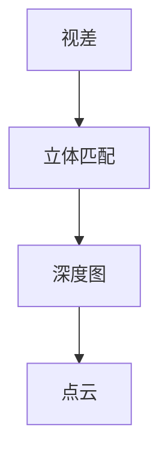

## 1.背景介绍

在计算机视觉领域，3D视觉技术是近年来备受关注的研究方向。它通过对2D图像的深度信息的获取和处理，实现对3D空间的感知和理解。3D视觉技术的应用范围广泛，包括但不限于机器人视觉、无人驾驶、增强现实、虚拟现实等。本文将详细介绍3D视觉的基本原理，并通过一个实战案例，让读者更深入地理解和应用3D视觉技术。

## 2.核心概念与联系

3D视觉的核心概念包括深度图(Depth Map)、点云(Point Cloud)、视差(Disparity)、立体匹配(Stereo Matching)等。深度图是表示图像中每个像素点的深度信息的二维图像，点云则是通过深度图生成的在三维空间中的点的集合。视差是指同一物体在左右眼看到的位置偏差，立体匹配则是通过计算左右图像的视差，获取深度信息的过程。



## 3.核心算法原理具体操作步骤

3D视觉的核心算法是立体匹配算法，其基本步骤如下：

1. **图像校正**：由于摄像头的位置和角度误差，导致左右图像不能完全对齐。图像校正是通过几何变换，使得左右图像在同一水平线上。

2. **特征提取**：在左右图像中提取特征点，常用的特征提取算法有SIFT、SURF、ORB等。

3. **特征匹配**：根据特征描述子，找到左右图像中对应的特征点。

4. **视差计算**：计算匹配的特征点在左右图像中的位置差，即视差。

5. **深度计算**：根据视差和摄像头的焦距，计算出深度信息。

## 4.数学模型和公式详细讲解举例说明

视差和深度的计算是3D视觉的关键，其数学模型如下：

假设摄像头的焦距为$f$，基线（即左右摄像头之间的距离）为$b$，一个点在左右图像上的视差为$d$，那么该点的深度$Z$可以通过以下公式计算得到：

$$
Z = \frac{f \cdot b}{d}
$$

例如，如果$f=800mm$，$b=65mm$，$d=10mm$，那么深度$Z=5200mm$。

## 5.项目实践：代码实例和详细解释说明

这里我们使用Python的OpenCV库来实现一个简单的3D视觉系统。首先，我们需要安装OpenCV库，可以通过`pip install opencv-python`命令进行安装。

以下是一个简单的立体匹配的代码实例：

```python
import cv2
import numpy as np

# 读取左右图像
left_img = cv2.imread('left.jpg', 0)
right_img = cv2.imread('right.jpg', 0)

# 创建SGBM立体匹配对象
window_size = 5
min_disp = 16
num_disp = 192 - min_disp
stereo = cv2.StereoSGBM_create(
    minDisparity=min_disp,
    numDisparities=num_disp,
    blockSize=window_size,
    uniquenessRatio=10,
    speckleWindowSize=100,
    speckleRange=32,
    disp12MaxDiff=1,
    P1=8 * 3 * window_size ** 2,
    P2=32 * 3 * window_size ** 2,
)

# 计算视差图
disparity = stereo.compute(left_img, right_img).astype(np.float32) / 16.0

# 显示视差图
cv2.imshow('disparity', (disparity - min_disp) / num_disp)
cv2.waitKey()
cv2.destroyAllWindows()
```

## 6.实际应用场景

3D视觉技术在许多领域都有广泛的应用，例如：

- **机器人视觉**：机器人通过3D视觉技术获取环境的深度信息，进行避障、定位和导航。

- **无人驾驶**：无人驾驶汽车通过3D视觉技术获取周围环境的深度信息，进行行人检测、车辆检测和避障。

- **增强现实和虚拟现实**：AR和VR设备通过3D视觉技术获取真实环境的深度信息，将虚拟物体和真实环境融合。

## 7.工具和资源推荐

- **OpenCV**：一个开源的计算机视觉库，提供了丰富的图像处理和计算机视觉算法。

- **PCL(Point Cloud Library)**：一个开源的点云处理库，提供了丰富的点云处理算法。

- **KITTI Vision Benchmark Suite**：一个公开的计算机视觉数据集，包含了立体图像、点云数据等，适合3D视觉相关的研究。

## 8.总结：未来发展趋势与挑战

随着深度学习技术的发展，3D视觉技术也在不断进步，但仍面临许多挑战，例如在复杂环境下的稳定性、实时性等。但我们相信，随着技术的不断发展，3D视觉将在更多领域发挥更大的作用。

## 9.附录：常见问题与解答

**Q: 为什么我的视差图看起来很奇怪？**

A: 这可能是因为立体匹配的参数设置不正确，或者左右图像没有正确对齐。

**Q: 如何获取更准确的深度信息？**

A: 可以通过调整立体匹配的参数，或者使用更高质量的摄像头，或者使用更准确的摄像头校准方法。

**Q: 我可以用单目摄像头做3D视觉吗？**

A: 单目摄像头也可以获取深度信息，但需要额外的方法，例如结构光、飞行时间(ToF)等，或者使用深度学习方法。

作者：禅与计算机程序设计艺术 / Zen and the Art of Computer Programming