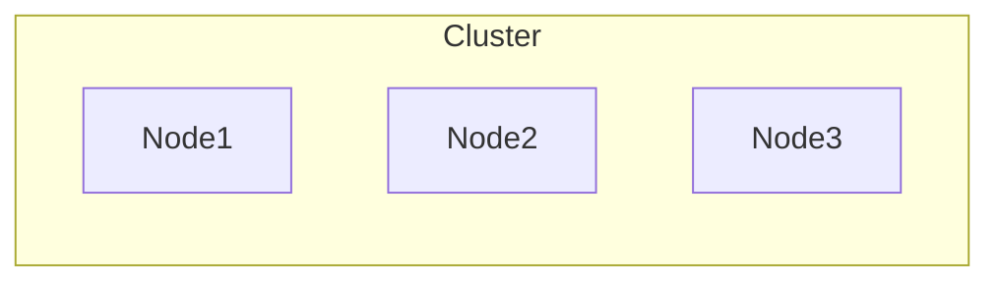
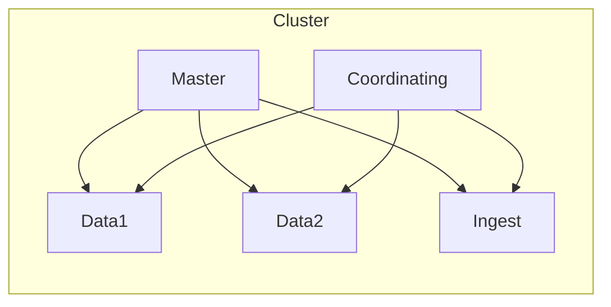
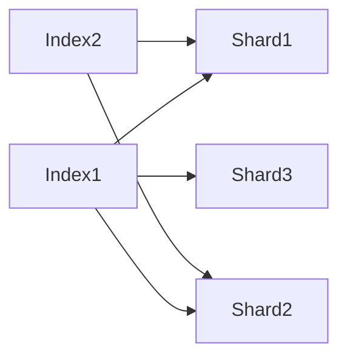
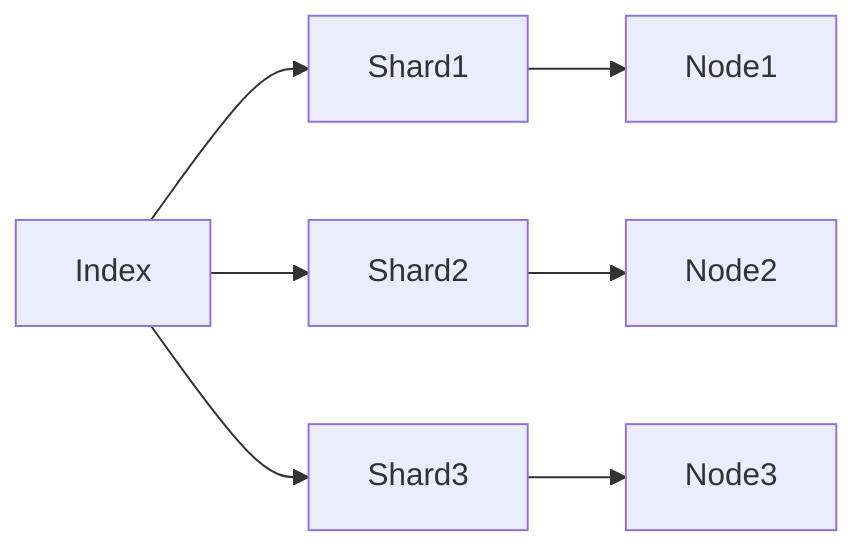
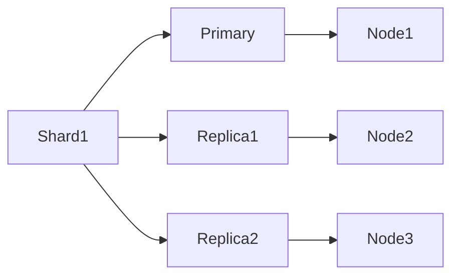
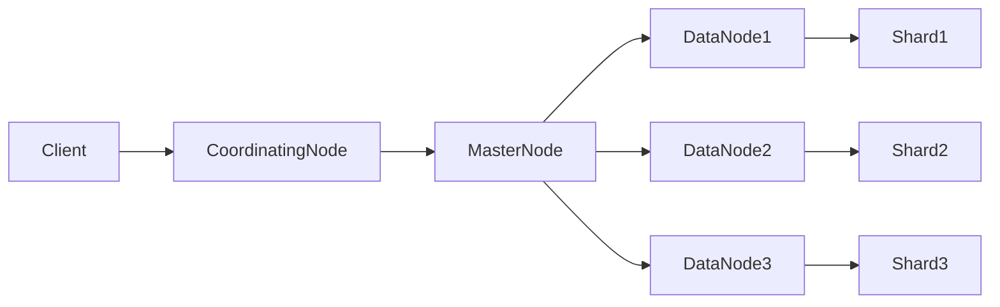

# ES搜索原理与代码实例讲解

## 1.背景介绍

在当今的数字时代,数据正以前所未有的速度和规模不断增长。无论是电子商务网站、社交媒体平台还是物联网设备,都在持续产生大量的结构化和非结构化数据。有效地存储、检索和分析这些海量数据对于企业和组织来说是一个巨大的挑战。这就是Elasticsearch(ES)大放异彩的时候。

Elasticsearch是一个分布式、RESTful风格的搜索和分析引擎,基于Apache Lucene构建。它能够快速地存储、搜索和分析大量的数据,并提供了一个简单而强大的查询语言。Elasticsearch不仅可以用于全文搜索,还可以执行结构化搜索、数据分析和可视化等任务。

### 1.1 Elasticsearch的优势

Elasticsearch拥有以下主要优势:

- **分布式架构**:Elasticsearch可以轻松扩展到数百台服务器,处理PB级数据。
- **高性能**:Elasticsearch使用了诸多优化技术,能够提供近乎实时的搜索体验。
- **多租户能力**:支持多索引、多租户,并提供跨集群搜索能力。
- **数据导入导出工具**:提供了多种数据导入导出工具,如Logstash、Beats等。
- **插件生态系统**:拥有活跃的社区和丰富的插件生态系统。

### 1.2 应用场景

Elasticsearch可以广泛应用于以下场景:

- **网站搜索**:用于构建高性能的网站搜索引擎。
- **日志分析**:实时分析和挖掘大量日志数据。
- **基础设施监控**:收集和分析来自云平台和服务器的指标数据。
- **应用程序搜索**:为企业级应用程序提供搜索功能。
- **地理位置数据**:存储和查询地理位置相关的数据。

## 2.核心概念与联系

要理解Elasticsearch的工作原理,我们需要先了解一些核心概念。

### 2.1 集群(Cluster)

Elasticsearch本质上是一个分布式系统,可以包含多个节点(Node),这些节点组成一个集群(Cluster)。集群通过集群名(cluster.name)来区分,默认为"elasticsearch"。



### 2.2 节点(Node)

节点是组成集群的单个服务器,存储数据,参与集群的索引和搜索功能。一个节点可以同时扮演多个角色:

- **主节点(Master Node)**:负责集群管理,如创建或删除索引、添加或移除节点等。
- **数据节点(Data Node)**:负责存储分片数据,处理数据相关的读写操作。
- **ingest节点(Ingest Node)**:负责数据的预处理,如数据格式转换、清理等。
- **协调节点(Coordinating Node)**:负责接收客户端请求,将请求分发到合适的节点,最后收集返回结果。



### 2.3 索引(Index)

索引是Elasticsearch中的逻辑数据分区,用于存储相关的文档数据。它类似于关系型数据库中的数据库概念。每个索引都有一个或多个主分片(Primary Shard)和副本分片(Replica Shard)。



### 2.4 文档(Document)

文档是Elasticsearch中的最小数据单元,类似于关系型数据库中的一行记录。每个文档都属于一个索引,并由一个唯一的ID标识。文档以JSON格式存储,可以是结构化或非结构化的数据。

```json
{
  "_index": "products",
  "_id": 1,
  "_source": {
    "name": "Product A",
    "price": 19.99,
    "tags": ["electronics", "gadget"]
  }
}
```

### 2.5 映射(Mapping)

映射类似于关系型数据库中的表结构定义,用于定义索引中文档的字段名、数据类型以及如何分词等规则。Elasticsearch会自动推导出映射,但也可以手动定义。

```json
{
  "properties": {
    "name": {
      "type": "text"
    },
    "price": {
      "type": "double"
    },
    "tags": {
      "type": "keyword"
    }
  }
}
```

### 2.6 分片(Shard)

分片是Elasticsearch实现分布式和并行化的关键。每个索引都被分成多个分片,每个分片是一个独立的Lucene索引。分片可以分布在集群的不同节点上,提高了系统的可扩展性和容错性。



### 2.7 副本(Replica)

为了提高数据的可用性和容错性,Elasticsearch会为每个主分片创建一个或多个副本分片。副本分片会分布在不同的节点上,当主分片发生故障时,副本分片可以接管请求,保证数据的可用性。



## 3.核心算法原理具体操作步骤

Elasticsearch的核心算法原理主要包括以下几个方面:

### 3.1 倒排索引

倒排索引是Elasticsearch实现全文搜索的核心技术。传统的数据库通过B+树索引实现精确匹配查询,而倒排索引则是为全文搜索量身定制的索引结构。

倒排索引的基本思想是:将文档中的每个词及其位置信息存储在一个索引结构中,从而实现快速的全文搜索。具体步骤如下:

1. **分词(Tokenization)**: 将文本按照一定的规则分解为一个个词条(Term)。
2. **词条过滤(Term Filter)**: 过滤掉一些常见的无意义词条,如"the"、"and"等。
3. **词条归档(Term Dictionary)**: 将词条存储在一个词典中,记录每个词条在哪些文档中出现过。
4. **位置存储(Position Storage)**: 记录每个词条在文档中的位置信息,用于实现短语搜索等功能。
5. **倒排索引生成(Inverted Index)**: 根据词典中的信息,构建倒排索引,即每个词条对应的文档列表。


倒排索引的搜索过程是:首先对查询进行分词和过滤,然后查找倒排索引,获取包含这些词条的文档列表,最后根据相关性算分排序,返回最匹配的结果。

### 3.2 分布式架构

Elasticsearch采用分布式架构,可以将数据分散存储在多个节点上,从而实现高可扩展性和高可用性。其核心原理包括以下几个方面:

1. **分片(Sharding)**: 将索引数据分散存储在多个分片上,每个分片是一个独立的Lucene索引。
2. **副本(Replication)**: 为每个主分片创建一个或多个副本分片,副本分片分布在不同节点上,提高数据可用性。
3. **集群发现(Cluster Discovery)**: 节点通过集群发现机制相互发现并加入集群。
4. **主节点选举(Master Election)**: 集群中的节点会选举一个主节点,负责集群管理操作。
5. **分片分配(Shard Allocation)**: 主节点根据一定的策略,将分片分配到不同的数据节点上。
6. **请求路由(Request Routing)**: 协调节点根据请求的索引和文档ID,计算出目标分片,并将请求路由到相应的数据节点。
7. **集群扩展(Cluster Scaling)**: 可以通过添加新节点来扩展集群的存储和计算能力。



### 3.3 相关性算分

Elasticsearch使用一种基于TF-IDF(Term Frequency-Inverse Document Frequency)的相关性算分模型,来评估文档与查询的匹配程度。具体步骤如下:

1. **词频(Term Frequency,TF)**: 统计每个词条在文档中出现的频率,出现频率越高,相关性越大。
2. **逆向文档频率(Inverse Document Frequency,IDF)**: 计算每个词条在整个索引中的出现频率,出现频率越低,代表区分度越高,相关性越大。
3. **字段长度规范化(Field Length Norm)**: 考虑文档字段的长度,对较长字段的TF进行惩罚。
4. **查询规范化(Query Norm)**: 对查询进行规范化处理,避免过长的查询获得较高的分数。
5. **协调因子(Coordination Factor)**: 考虑查询中词条之间的关系,如果词条之间距离较近,相关性更高。
6. **算分公式(Scoring Formula)**: 将上述因素综合计算,得到文档与查询的相关性分数。

$$
\text{score}(q,d) = \sum_{t \in q} \frac{tf(t,d)}{k_1 \times ((1-b) + b \times \frac{|d|}{avgdl})} \times idf(t)^2 \times \text{boost}(t.field) \times \text{norm}(q)
$$

其中:

- $tf(t,d)$是词条$t$在文档$d$中的词频
- $|d|$是文档$d$的长度
- $avgdl$是索引中所有文档的平均长度
- $k_1$和$b$是调节因子,用于调整TF和字段长度的影响程度
- $idf(t)$是词条$t$的逆向文档频率
- $boost(t.field)$是针对字段的权重增强
- $norm(q)$是查询规范化因子

通过这种相关性算分模型,Elasticsearch可以有效地评估文档与查询的匹配程度,并返回最相关的结果。

## 4.数学模型和公式详细讲解举例说明

在上一节中,我们介绍了Elasticsearch中相关性算分的核心公式。现在让我们深入探讨其中涉及的数学模型和公式。

### 4.1 词频(TF)

词频(Term Frequency,TF)是指一个给定的词条在文档中出现的次数。一个简单的TF计算公式如下:

$$
tf(t,d) = \frac{n_{t,d}}{\sum_{t' \in d} n_{t',d}}
$$

其中:

- $n_{t,d}$是词条$t$在文档$d$中出现的次数
- $\sum_{t' \in d} n_{t',d}$是文档$d$中所有词条出现次数的总和

例如,假设一个文档包含以下内容:"The quick brown fox jumps over the lazy dog",我们计算"the"这个词条的TF:

$$
tf("the", d) = \frac{2}{9} = 0.22
$$

然而,这种简单的TF计算方式存在一些问题,比如无法很好地处理词条在同一文档中出现多次的情况。为了解决这个问题,Elasticsearch采用了一种更加复杂的TF计算公式:

$$
tf(t,d) = \frac{f(t,d)}{f(t,d) + k_1 \times (1 - b + b \times \frac{|d|}{avgdl})}
$$

其中:

- $f(t,d)$是词条$t$在文档$d$中的原始出现次数
- $|d|$是文档$d$的长度(字段长度)
- $avgdl$是索引中所有文档的平均长度
- $k_1$和$b$是调节因子,用于调整TF和字段长度的影响程度

这种计算方式能够更好地处理词条在同一文档中多次出现的情况,并且考虑了文档长度对TF的影响。较长的文档会降低单个词条的TF值,避免过长文档获得过高的相关性分数。