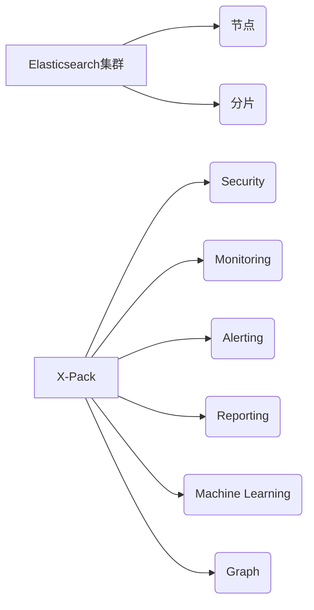

# ElasticSearch X-Pack原理与代码实例讲解

## 1.背景介绍
### 1.1 ElasticSearch简介
ElasticSearch是一个基于Lucene的搜索服务器。它提供了一个分布式多用户能力的全文搜索引擎，基于RESTful web接口。ElasticSearch是用Java语言开发的，并作为Apache许可条款下的开放源码发布，是一种流行的企业级搜索引擎。

### 1.2 X-Pack插件简介
X-Pack是Elastic Stack的一个扩展，提供了安全、警报、监控、报告、机器学习和图形功能等。通过X-Pack，用户可以轻松地保护、监控和管理Elasticsearch集群。X-Pack使得Elasticsearch成为一个功能更加全面的数据分析平台。

### 1.3 X-Pack的重要性
随着Elasticsearch在企业中的广泛应用，集群的安全性、可维护性和可扩展性变得越来越重要。X-Pack通过提供一系列高级功能来满足企业级用户对Elasticsearch的需求，使Elasticsearch成为一个更加完善、强大的数据分析平台。

## 2.核心概念与联系
### 2.1 Elasticsearch集群
- 节点(Node)：运行Elasticsearch实例的单个服务器
- 集群(Cluster)：一组拥有相同cluster.name的节点集合
- 分片(Shard)：Elasticsearch将索引分成多个分片，分布在集群的各个节点上

### 2.2 X-Pack核心模块
- Security：提供身份验证、授权和加密功能，保护Elasticsearch集群的安全
- Monitoring：实时监控Elasticsearch集群的性能和健康状况
- Alerting：基于监控数据创建告警，及时发现并解决问题
- Reporting：生成Elasticsearch数据的可视化报告
- Machine Learning：应用机器学习算法，从数据中自动发现异常情况
- Graph：探索数据之间的关系，发现隐藏的关联

### 2.3 核心概念关系图


## 3.核心算法原理具体操作步骤
### 3.1 Security模块
#### 3.1.1 身份验证
- 支持多种身份验证方式：基本身份验证、基于PKI的身份验证、Kerberos、LDAP、Active Directory等
- 身份验证过程：客户端发送请求 -> Elasticsearch验证用户身份 -> 通过验证则允许访问

#### 3.1.2 授权
- 基于角色的访问控制(RBAC)：定义角色并分配权限，用户通过角色获得相应的访问权限
- 授权过程：用户请求 -> Elasticsearch检查用户角色 -> 根据角色权限允许或拒绝请求

#### 3.1.3 加密
- 传输层加密(TLS/SSL)：保护Elasticsearch节点之间以及客户端与服务器之间的通信安全
- 存储加密：对Elasticsearch索引的静态数据进行加密，防止未经授权的访问

### 3.2 Monitoring模块
#### 3.2.1 数据收集
- 从Elasticsearch集群的各个节点收集指标数据，如CPU使用率、JVM堆内存使用情况、索引统计信息等
- 通过Metricbeat等工具收集操作系统和容器的指标数据

#### 3.2.2 数据存储
- 监控数据存储在专用的Elasticsearch监控集群中
- 通过索引模板定义监控索引的设置和映射

#### 3.2.3 可视化展示
- Kibana中提供了预建的监控仪表板，展示Elasticsearch集群的关键指标
- 用户可以创建自定义仪表板，根据需要组合不同的指标和图表

### 3.3 Alerting模块
#### 3.3.1 告警规则定义
- 基于监控数据定义告警规则，设置触发条件和阈值
- 告警规则可以应用于集群、索引、节点等不同级别

#### 3.3.2 告警检测
- 定期运行告警规则，检查监控数据是否满足触发条件
- 当满足条件时生成告警实例

#### 3.3.3 告警通知
- 通过电子邮件、Slack、PagerDuty等渠道发送告警通知
- 支持自定义告警消息模板，包含关键信息

### 3.4 Reporting模块
#### 3.4.1 报告定义
- 在Kibana中创建报告定义，指定要包含的仪表板和可视化
- 设置报告的生成周期和格式（PDF、PNG等）

#### 3.4.2 报告生成
- 根据报告定义自动生成报告
- 报告生成过程在后台异步进行，不影响Kibana的使用

#### 3.4.3 报告管理
- 提供报告管理界面，可以查看、下载和删除生成的报告
- 支持将报告通过电子邮件发送给指定收件人

### 3.5 Machine Learning模块
#### 3.5.1 数据收集与预处理
- 从Elasticsearch索引中提取数据，进行特征工程和数据预处理
- 处理缺失值、归一化数据等，为机器学习做准备

#### 3.5.2 异常检测
- 应用机器学习算法（如随机森林、支持向量机等）建立异常检测模型
- 实时或定期对新数据进行预测，识别异常情况

#### 3.5.3 结果可视化
- 在Kibana中提供机器学习仪表板，展示异常检测结果
- 通过图表和警报突出显示异常情况，帮助用户快速定位问题

### 3.6 Graph模块
#### 3.6.1 数据建模
- 将Elasticsearch索引中的数据建模为图结构
- 定义节点类型和边类型，表示数据之间的关系

#### 3.6.2 图查询与分析
- 使用Elasticsearch的查询DSL进行图查询，如查找最短路径、相邻节点等
- 应用图算法（如PageRank、社区检测等）进行图分析

#### 3.6.3 图可视化
- 在Kibana中提供交互式图可视化界面
- 通过节点和边的布局、颜色等属性直观展示图结构和分析结果

## 4.数学模型和公式详细讲解举例说明
### 4.1 异常检测中的Local Outlier Factor (LOF)算法
LOF是一种用于异常检测的无监督学习算法，它通过测量数据点与其邻域的密度差异来识别异常点。

给定数据集 $D=\{x_1,x_2,...,x_n\}$，对于每个数据点 $x_i$，定义其 k-距离邻域 $N_k(x_i)$ 为与 $x_i$ 距离最近的 k 个数据点的集合。

数据点 $x_i$ 的局部可达密度 $lrd_k(x_i)$ 定义为：

$$lrd_k(x_i)=\frac{|N_k(x_i)|}{\sum_{x_j \in N_k(x_i)} reach-dist_k(x_i,x_j)}$$

其中，$reach-dist_k(x_i,x_j)=max\{k-distance(x_j),d(x_i,x_j)\}$，表示 $x_i$ 到 $x_j$ 的可达距离。

数据点 $x_i$ 的局部离群因子 $LOF_k(x_i)$ 定义为：

$$LOF_k(x_i)=\frac{\sum_{x_j \in N_k(x_i)} \frac{lrd_k(x_j)}{lrd_k(x_i)}}{|N_k(x_i)|}$$

$LOF_k(x_i)$ 反映了数据点 $x_i$ 与其邻域密度的差异程度。通常，$LOF_k(x_i)$ 显著大于1的数据点被认为是异常点。

举例说明：假设有一个二维数据集，其中大部分数据点聚集在一个密集区域，而有一些数据点远离该区域。通过计算每个数据点的LOF值，我们可以发现那些远离密集区域的点具有较高的LOF值，从而被识别为异常点。

### 4.2 图分析中的PageRank算法
PageRank是一种用于评估图中节点重要性的算法，最初用于评估网页的重要性。

给定一个有向图 $G=(V,E)$，其中 $V$ 表示节点集合，$E$ 表示边集合。定义 $PR(v_i)$ 为节点 $v_i$ 的PageRank值，$d$ 为阻尼因子（通常取0.85），$N$ 为图中节点总数。

PageRank值的计算公式如下：

$$PR(v_i)=\frac{1-d}{N}+d \sum_{v_j \in IN(v_i)} \frac{PR(v_j)}{OUT(v_j)}$$

其中，$IN(v_i)$ 表示指向节点 $v_i$ 的节点集合，$OUT(v_j)$ 表示节点 $v_j$ 指向的节点数量。

PageRank算法通过迭代计算收敛到稳定的PR值。初始时，所有节点的PR值都设为 $\frac{1}{N}$。每一轮迭代中，根据上述公式更新每个节点的PR值，直到PR值的变化小于某个阈值。

举例说明：假设有一个社交网络图，节点表示用户，边表示用户之间的关注关系。通过运行PageRank算法，我们可以识别出图中的重要节点（影响力大的用户），他们通常有较多的入度边（被多个用户关注）和较高的PR值。

## 5.项目实践：代码实例和详细解释说明
### 5.1 使用X-Pack Security进行身份验证和授权
```java
// 创建包含用户名和密码的凭据提供程序
CredentialsProvider credentialsProvider = new BasicCredentialsProvider();
credentialsProvider.setCredentials(AuthScope.ANY, 
    new UsernamePasswordCredentials("elastic", "password"));

// 创建REST客户端，并设置凭据提供程序
RestClientBuilder builder = RestClient.builder(new HttpHost("localhost", 9200))
    .setHttpClientConfigCallback(httpClientBuilder -> 
        httpClientBuilder.setDefaultCredentialsProvider(credentialsProvider));

// 创建Elasticsearch客户端
RestHighLevelClient client = new RestHighLevelClient(builder);

// 创建索引
CreateIndexRequest createIndexRequest = new CreateIndexRequest("my-index");
createIndexRequest.settings(Settings.builder()
    .put("index.number_of_shards", 1)
    .put("index.number_of_replicas", 0)
);
createIndexRequest.mapping("my-type", 
    "title", "type=text", 
    "content", "type=text"
);
CreateIndexResponse createIndexResponse = client.indices().create(createIndexRequest, RequestOptions.DEFAULT);

// 关闭客户端
client.close();
```

在上述代码中，我们首先创建了一个`CredentialsProvider`，并设置了用户名和密码。然后，在创建`RestHighLevelClient`时，通过`setHttpClientConfigCallback`方法设置凭据提供程序，以便在发送请求时自动包含身份验证信息。

接下来，我们使用`CreateIndexRequest`创建了一个名为"my-index"的索引，并设置了分片数和副本数。同时，我们定义了索引的映射，包含"title"和"content"两个字段。

通过`client.indices().create`方法发送创建索引请求，Elasticsearch会根据请求中的身份验证信息进行用户验证和授权。如果身份验证成功且用户有足够的权限，索引将被成功创建。

### 5.2 使用X-Pack Monitoring监控Elasticsearch集群
```java
// 创建REST客户端
RestClientBuilder builder = RestClient.builder(new HttpHost("localhost", 9200));
RestHighLevelClient client = new RestHighLevelClient(builder);

// 启用监控
ClusterUpdateSettingsRequest updateSettingsRequest = new ClusterUpdateSettingsRequest();
updateSettingsRequest.persistentSettings(Settings.builder()
    .put("xpack.monitoring.collection.enabled", true)
);
ClusterUpdateSettingsResponse updateSettingsResponse = client.cluster().putSettings(updateSettingsRequest, RequestOptions.DEFAULT);

// 获取集群健康状态
ClusterHealthRequest healthRequest = new ClusterHealthRequest();
ClusterHealthResponse healthResponse = client.cluster().health(healthRequest, RequestOptions.DEFAULT);
String clusterName = healthResponse.getClusterName();
String clusterStatus = healthResponse.getStatus().toString();

// 获取节点统计信息
NodesStatsRequest nodesStatsRequest = new NodesStatsRequest();
NodesStatsResponse nodesStatsResponse = client.nodes().stats(nodesStatsRequest, RequestOptions.DEFAULT);
for (NodeStats nodeStats : nodesStatsResponse.getNodes()) {
    String nodeId = nodeStats.getNode().getId();
    long totalIndexingCount = nodeStats.getIndices().getIndexing().getTotal().getIndexCount();
    // ...
}

// 关闭客户端
client.close();
```

在上述代码中，我们首先创建了