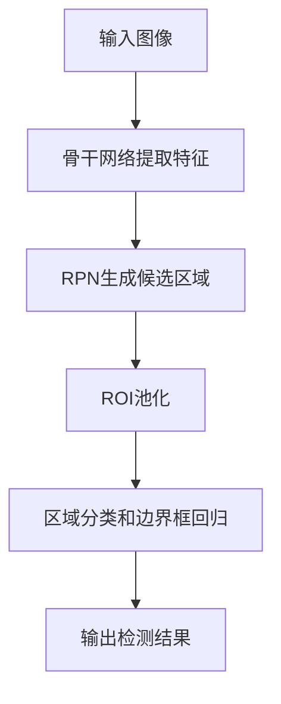

# Faster R-CNN原理与代码实例讲解

## 1. 背景介绍

目标检测是计算机视觉领域的一个重要研究方向,其目标是在给定的图像中检测出特定的物体,并给出其对应的类别和位置信息。近年来,随着深度学习技术的快速发展,目标检测的性能得到了显著提升。其中,Faster R-CNN是一种经典的两阶段目标检测算法,在精度和速度上都取得了很好的平衡,被广泛应用于各种场景中。

### 1.1 目标检测的发展历程

- 传统方法:如Haar特征+AdaBoost、HOG特征+SVM等
- 基于深度学习的方法:
  - R-CNN系列:R-CNN、Fast R-CNN、Faster R-CNN
  - YOLO系列:YOLO v1-v5
  - SSD等单阶段检测器

### 1.2 Faster R-CNN的优势

- 引入区域建议网络(RPN),实现了端到端的训练
- 采用共享卷积特征,大大提高了检测效率
- 在精度和速度上取得了很好的平衡

## 2. 核心概念与联系

### 2.1 卷积神经网络(CNN)

CNN是一种常用的深度学习模型,特别适合处理图像数据。其主要由卷积层、池化层和全连接层组成,可以自动提取图像的特征。

### 2.2 区域建议网络(RPN) 

RPN是Faster R-CNN的核心创新点,用于生成高质量的目标候选区域。其主要包括:

- 在共享的卷积特征图上滑动一个小网络
- 对每个位置生成k个不同尺度和比例的锚框(anchor box)
- 通过softmax分类器判断锚框是否包含目标
- 通过边界框回归修正锚框位置

### 2.3 ROI池化(ROI Pooling)

ROI池化层将不同大小的候选区域统一池化为固定尺寸的特征图,便于后续的分类和回归。

### 2.4 Mermaid流程图



## 3. 核心算法原理具体操作步骤

### 3.1 骨干网络

- 常用的有VGG、ResNet等
- 去除最后的全连接层,保留卷积层和池化层
- 输出共享的卷积特征图

### 3.2 区域建议网络(RPN)

1. 在共享特征图上滑动一个3x3的卷积核,生成256维的特征向量
2. 将特征向量送入两个并行的全连接层:
   - 分类层:判断是前景还是背景
   - 回归层:修正锚框坐标
3. 对每个位置生成k个锚框(如k=9),每个锚框对应2个分类分数和4个坐标偏移量
4. 根据分类分数和边界框回归偏移量,筛选出高质量的候选区域

### 3.3 ROI池化

1. 将RPN生成的候选区域投影到共享特征图上
2. 将不同大小的区域统一池化为固定尺寸(如7x7)
3. 将池化后的特征图展平送入后续网络

### 3.4 区域分类和边界框回归

- 分类:使用softmax判断候选区域的类别(如N+1类)
- 回归:对候选框进一步微调,得到更精确的边界框

### 3.5 损失函数

Faster R-CNN的损失函数由4部分组成:
$$
L = L_{cls}(p_i, p_i^*) + \lambda_1 L_{reg}(t_i, t_i^*) + \lambda_2 L_{cls}^{rpn}(p_i, p_i^*) + \lambda_3 L_{reg}^{rpn}(t_i, t_i^*)
$$

- $L_{cls}$:RPN分类损失
- $L_{reg}$:RPN回归损失  
- $L_{cls}^{rpn}$:最终分类损失
- $L_{reg}^{rpn}$:最终回归损失
- $\lambda_1, \lambda_2, \lambda_3$:平衡系数

## 4. 数学模型和公式详细讲解举例说明

### 4.1 锚框(Anchor Box)

锚框是一组预定义的矩形框,用于在图像中搜索潜在的目标。其定义为:
$$
A = \{(w_k, h_k) | k=1,2,...,K\}
$$

- $w_k, h_k$表示第k个锚框的宽度和高度
- 通常选取3种尺度(如128、256、512)和3种比例(如1:1、1:2、2:1),共9种组合

对每个锚框,RPN需要预测其是否包含目标以及边界框的偏移量:
$$
p^* = 
\begin{cases}
1, & \text{if IoU(A, G) > 0.7} \\
0, & \text{if IoU(A, G) < 0.3}
\end{cases}
$$

$$
t^* = (t_x^*, t_y^*, t_w^*, t_h^*) = (\frac{x-x_a}{w_a}, \frac{y-y_a}{h_a}, \log\frac{w}{w_a}, \log\frac{h}{h_a})
$$

- $p^*$表示锚框的真实标签,1为正样本,0为负样本
- $t^*$表示锚框相对于真实边界框$G$的偏移量
- $x,y,w,h$分别表示预测框和锚框的中心坐标和宽高

### 4.2 RPN损失函数

RPN的损失函数包括分类损失和回归损失两部分:

$$
L_{rpn} = \frac{1}{N_{cls}} \sum_i L_{cls}(p_i, p_i^*) + \lambda \frac{1}{N_{reg}} \sum_i p_i^* L_{reg}(t_i, t_i^*)
$$

- 分类损失$L_{cls}$采用交叉熵损失函数
- 回归损失$L_{reg}$采用Smooth L1损失函数:

$$
L_{reg}(t_i, t_i^*) = 
\begin{cases}
0.5 (t_i - t_i^*)^2, & \text{if } |t_i - t_i^*| < 1 \\
|t_i - t_i^*| - 0.5, & \text{otherwise}
\end{cases}
$$

### 4.3 ROI池化

设候选区域在原图上的坐标为$[x_1, y_1, x_2, y_2]$,对应的特征图区域坐标为$[x'_1, y'_1, x'_2, y'_2]$,ROI池化的过程为:

1. 将特征图区域划分为 $k \times k$ 个子区域(如$k=7$)
2. 对每个子区域进行最大池化操作,得到一个固定大小的特征图

$$(i, j) = (\lfloor \frac{y-y'_1}{h'} \rfloor, \lfloor \frac{x-x'_1}{w'} \rfloor)$$
$$ROI(i,j) = \max_{(y,x) \in bin(i,j)} feature\_map(y,x)$$

- $h',w'$分别表示候选区域在特征图上的高度和宽度
- $bin(i,j)$表示第$(i,j)$个子区域

## 5. 项目实践：代码实例和详细解释说明

下面以PyTorch为例,给出Faster R-CNN的简要实现:

```python
import torch
import torch.nn as nn
import torchvision

# 定义Faster R-CNN模型
class FasterRCNN(nn.Module):
    def __init__(self, num_classes):
        super(FasterRCNN, self).__init__()
        # 骨干网络
        self.backbone = torchvision.models.vgg16(pretrained=True).features
        self.backbone.out_channels = 512
        
        # 区域建议网络
        self.rpn = RegionProposalNetwork(512, 512, 9)
        
        # ROI池化层
        self.roi_pool = ROIPool((7, 7), 1.0/16.0)
        
        # 分类和回归头
        self.cls_loc = nn.Linear(25088, 4096)
        self.score = nn.Linear(4096, num_classes)
        self.bbox_pred = nn.Linear(4096, num_classes * 4)
        
    def forward(self, x):
        # 提取卷积特征图
        feat = self.backbone(x)
        
        # 区域建议网络
        rpn_locs, rpn_scores, rois, roi_indices, anchor = self.rpn(feat)
        
        # ROI池化
        roi_pool_feat = self.roi_pool(feat, rois, roi_indices)
        
        # 分类和回归
        fc7 = self.cls_loc(roi_pool_feat.view(roi_pool_feat.size(0), -1))
        roi_cls_locs = self.bbox_pred(fc7)
        roi_scores = self.score(fc7)
        
        return roi_cls_locs, roi_scores, rois

# 区域建议网络
class RegionProposalNetwork(nn.Module):
    def __init__(self, in_channels, mid_channels, n_anchor):
        super(RegionProposalNetwork, self).__init__()
        
        self.conv1 = nn.Conv2d(in_channels, mid_channels, 3, 1, 1)
        self.score = nn.Conv2d(mid_channels, n_anchor * 2, 1, 1, 0)
        self.loc = nn.Conv2d(mid_channels, n_anchor * 4, 1, 1, 0)
        
        # 生成锚框
        self.anchor_base = self._generate_anchor_base()
        
    def forward(self, x):
        n, _, h, w = x.shape
        
        # 卷积层
        x = torch.relu(self.conv1(x))
        
        # 分类预测
        rpn_scores = self.score(x)
        rpn_softmax_scores = torch.softmax(rpn_scores.view(n, 2, -1), dim=1)
        rpn_fg_scores = rpn_softmax_scores[:, 1, :]
        rpn_scores = rpn_scores.view(n, -1, 2)
        
        # 边界框预测
        rpn_locs = self.loc(x)
        rpn_locs = rpn_locs.view(n, -1, 4)
        
        # 生成锚框并应用边界框变换
        anchor = self._generate_anchor(rpn_locs.shape[1], h, w)
        rois = self._apply_bbox_deltas(anchor, rpn_locs)
        
        # 根据分数选取Top-N候选区域
        rois, roi_indices = self._get_top_n_rois(rois, rpn_fg_scores)
        
        return rpn_locs, rpn_scores, rois, roi_indices, anchor
    
    def _generate_anchor_base(self):
        # 生成基础锚框(9个)
        anchor_base = torch.Tensor([[0, 0, 15, 15], [0, 0, 25, 25], [0, 0, 40, 40],
                                    [0, 0, 60, 60], [0, 0, 90, 90], [0, 0, 130, 130],
                                    [0, 0, 180, 180], [0, 0, 250, 250], [0, 0, 320, 320]])
        return anchor_base
    
    def _generate_anchor(self, n_anchor, h, w):
        # 生成所有锚框
        offset_x = torch.arange(0, w).view(-1, 1).repeat(1, h)
        offset_y = torch.arange(0, h).view(1, -1).repeat(w, 1)
        offset = torch.stack((offset_x, offset_y, offset_x, offset_y), dim=0).float()
        anchor = self.anchor_base.view(1, 9, 4) + offset.view(4, -1, 1)
        anchor = anchor.permute(1, 2, 0).contiguous().view(-1, 4)
        return anchor[:n_anchor]
    
    def _apply_bbox_deltas(self, boxes, deltas):
        # 应用边界框变换
        widths = boxes[:, 2] - boxes[:, 0]
        heights = boxes[:, 3] - boxes[:, 1]
        ctr_x = boxes[:, 0] + 0.5 * widths
        ctr_y = boxes[:, 1] + 0.5 * heights

        dx = deltas[:, 0::4]
        dy = deltas[:, 1::4]
        dw = deltas[:, 2::4]
        dh = deltas[:, 3::4]

        pred_ctr_x = dx * widths.unsqueeze(1) + ctr_x.unsqueeze(1)
        pred_ctr_y = dy * heights.unsqueeze(1) + ctr_y.unsqueeze(1)
        pred_w = torch.exp(dw) * widths.unsqueeze(1)
        pred_h = torch.exp(dh) * heights.unsqueeze(1)

        pred_boxes = torch.zeros_like(deltas)
        pred_boxes[:, 0::4] = pred_ctr_x - 0.5 * pred_w
        pred_boxes[:, 1::4] = pred_ctr_y - 0.