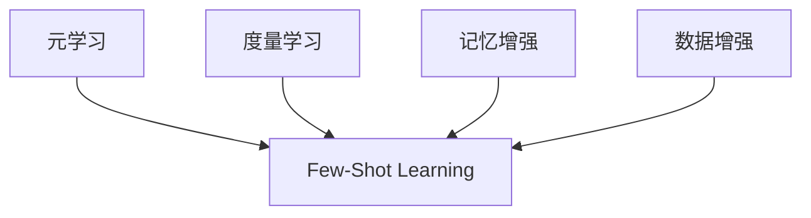

# Few-Shot Learning原理与代码实例讲解

## 1.背景介绍
### 1.1 什么是Few-Shot Learning
Few-Shot Learning(少样本学习)是指在只给定非常少量的训练样本的情况下,让机器学习模型能够很好地学习新的概念或完成新的任务。与传统的机器学习范式不同,传统机器学习通常需要大量的有标注数据来训练模型,而Few-Shot Learning旨在通过很少的样本(如每个类别只有1~5个样本)来学习新知识。

### 1.2 Few-Shot Learning的研究意义
Few-Shot Learning之所以受到学术界和工业界的广泛关注,主要基于以下几点原因:

1. 现实世界中很多任务的标注数据非常稀缺,标注成本很高,因此Few-Shot Learning对于实际应用具有重要意义。
2. 人类具有强大的少样本学习能力,通过Few-Shot Learning构建更加智能的机器学习系统,有助于缩小人工智能与人类智能的差距。
3. Few-Shot Learning有利于实现机器学习模型的快速迁移和泛化,提高模型的适应性和鲁棒性。

### 1.3 Few-Shot Learning的主要挑战
尽管Few-Shot Learning近年来取得了长足的进展,但仍然面临着诸多挑战:

1. 如何在小样本条件下提取到足够多的有效特征?
2. 如何避免模型过拟合,提高泛化性能?
3. 如何构建高效的度量学习和元学习范式?
4. 如何将先验知识更好地融入到Few-Shot Learning框架中?

## 2.核心概念与联系
### 2.1 元学习(Meta-Learning)
元学习是Few-Shot Learning的核心概念之一。元学习也被称为"学会学习"(Learning to Learn),它不是去学习一个特定的任务,而是去学习一个如何学习新任务的过程。通过元学习,模型能够在面对新任务时快速适应。

### 2.2 度量学习(Metric Learning)  
度量学习是Few-Shot Learning的另一个重要概念。度量学习旨在学习一个度量空间,在该空间中,相似的样本距离较近,不同类别的样本距离较远。通过度量学习,可以非常高效地对新类别的样本进行分类。

### 2.3 记忆增强(Memory Augmented)
记忆增强是指将外部记忆模块与神经网络相结合,赋予模型快速记忆和提取的能力。记忆增强网络能够在Few-Shot场景下快速编码输入的信息,并将其存入外部记忆中,当推理时再从记忆中读取,从而实现快速学习。

### 2.4 数据增强(Data Augmentation)
数据增强是一种提高Few-Shot Learning性能的常用技巧。通过对原始样本进行旋转、平移、缩放、添加噪声等操作,可以扩充小样本数据集,一定程度缓解过拟合问题。

### 2.5 概念之间的关系
下面是元学习、度量学习、记忆增强、数据增强在Few-Shot Learning中的关系示意图:



元学习是Few-Shot Learning的核心范式,度量学习和记忆增强是实现Few-Shot Learning的两种主要途径,数据增强是提升Few-Shot Learning性能的常用技术。它们相互配合,共同推动了Few-Shot Learning的发展。

## 3.核心算法原理具体操作步骤
本节将详细介绍Few-Shot Learning的两大类核心算法:基于度量学习的原型网络(Prototypical Networks)和基于元学习的模型无关元学习(Model-Agnostic Meta-Learning, MAML)。

### 3.1 原型网络(Prototypical Networks)
原型网络是一种基于度量学习的Few-Shot Learning算法,核心思想是学习一个度量空间,每个类别由其支持集样本的均值向量(原型)表示。具体步骤如下:

1. 将所有样本通过神经网络映射到嵌入空间中。
2. 对于每个类别,计算其支持集样本嵌入向量的均值,作为该类原型向量。 
3. 对于查询集样本,计算其嵌入向量与每个原型向量的距离。
4. 根据距离对查询集样本进行分类,距离最近的原型所属类别即为预测类别。

训练过程采用Episode训练范式,每个Episode随机采样N个类别,每个类别采样K个样本作为支持集,其余作为查询集,计算查询集的损失并更新网络参数。

### 3.2 模型无关元学习(MAML)
MAML是一种基于元学习的Few-Shot Learning算法,目标是学习一个对新任务具有良好初始化的模型参数。MAML的核心是通过二次梯度优化来实现元学习。具体步骤如下:

1. 随机初始化一个模型参数。
2. 在每个元训练步骤中,随机采样一个Batch的任务。
3. 对每个任务,将当前模型参数作为初始参数,利用支持集进行一次或多次梯度下降,得到任务特定的模型参数。
4. 用查询集评估每个任务特定的模型,计算损失并通过二次梯度传播更新初始模型参数。
5. 重复步骤2-4,直到初始模型参数收敛。

测试时,对于新任务,只需用支持集在初始模型参数的基础上进行少量梯度下降步骤即可得到任务特定的模型。

## 4.数学模型和公式详细讲解举例说明
本节以原型网络为例,对其核心数学模型进行详细推导和说明。

### 4.1 问题定义
假设有一个包含$N$个类别的Few-Shot分类任务,每个类别有$K$个标注样本作为支持集,即$N-way$ $K-shot$。我们的目标是利用支持集训练一个分类器,对查询集样本进行分类。

### 4.2 特征嵌入
将输入样本$\boldsymbol{x} \in \mathbb{R}^D$通过特征嵌入函数 $f_{\phi}:\mathbb{R}^D \to \mathbb{R}^M$ 映射到$M$维嵌入空间,得到嵌入向量$\boldsymbol{e}=f_{\phi}(\boldsymbol{x})$。嵌入函数 $f_{\phi}$ 通常是一个深度神经网络,参数为$\phi$。

### 4.3 原型计算
对于每个类别$c$,计算其支持集样本$S_c=\{\boldsymbol{x}_1,\ldots,\boldsymbol{x}_K\}$的嵌入向量的均值,作为该类的原型向量:

$$\boldsymbol{p}_c=\frac{1}{K}\sum_{\boldsymbol{x} \in S_c}f_{\phi}(\boldsymbol{x})$$

### 4.4 距离度量与分类
对于查询集样本$\boldsymbol{x}$,计算其嵌入向量$\boldsymbol{e}=f_{\phi}(\boldsymbol{x})$与每个原型向量$\boldsymbol{p}_c$的距离$d(\boldsymbol{e},\boldsymbol{p}_c)$,常用的距离度量包括欧氏距离和余弦相似度等。

然后根据距离对查询样本进行分类,距离最近的原型所属类别即为预测类别:

$$\hat{y}=\arg\min_c d(\boldsymbol{e},\boldsymbol{p}_c)$$

### 4.5 损失函数与优化
原型网络的损失函数采用交叉熵损失:

$$\mathcal{L}(\phi)=-\sum_i\log\frac{\exp(-d(f_{\phi}(\boldsymbol{x}_i),\boldsymbol{p}_{y_i}))}{\sum_c \exp(-d(f_{\phi}(\boldsymbol{x}_i),\boldsymbol{p}_c))}$$

其中$\boldsymbol{x}_i$为查询集样本,$y_i$为其真实类别。

训练时采用随机梯度下降等优化算法最小化损失函数,更新嵌入网络参数$\phi$。

### 4.6 举例说明
假设我们有一个$5-way$ $1-shot$的Few-Shot图像分类任务,即5个类别,每个类别只有1个标注样本。

首先,将所有图像通过卷积神经网络提取特征,得到嵌入向量。

然后,对于每个类别,将其标注样本的嵌入向量作为原型向量。

最后,对于查询图像,计算其嵌入向量与5个原型向量的欧氏距离,距离最近的原型所属类别即为预测类别。

通过Episode训练,不断优化嵌入网络参数,使得同类样本的嵌入向量聚集,异类样本的嵌入向量分离,从而提高分类性能。

## 5.项目实践:代码实例和详细解释说明
本节将使用PyTorch实现一个简单的原型网络,并在Omniglot数据集上进行Few-Shot字符分类实验。

### 5.1 数据准备
Omniglot数据集包含来自50个不同字母表的1623个手写字符,每个字符有20个样本。我们将数据集划分为训练集(1200个字符)和测试集(423个字符)。

```python
import os
import torch
from PIL import Image
from torch.utils.data import Dataset, DataLoader
from torchvision.transforms import ToTensor, Resize, Compose

class OmniglotDataset(Dataset):
    def __init__(self, root_dir, transform=None):
        self.root_dir = root_dir
        self.transform = transform
        self.classes = sorted(os.listdir(root_dir))
        self.class_to_idx = {cls_name: i for i, cls_name in enumerate(self.classes)}
        
    def __len__(self):
        return len(self.classes)
    
    def __getitem__(self, idx):
        class_name = self.classes[idx]
        class_dir = os.path.join(self.root_dir, class_name)
        images = [Image.open(os.path.join(class_dir, img_name)) for img_name in sorted(os.listdir(class_dir))]
        if self.transform:
            images = [self.transform(img) for img in images]
        return torch.stack(images), self.class_to_idx[class_name]

transform = Compose([Resize((28, 28)), ToTensor()])
train_dataset = OmniglotDataset('data/Omniglot/images_background', transform=transform)
test_dataset = OmniglotDataset('data/Omniglot/images_evaluation', transform=transform)
```

### 5.2 原型网络实现
我们使用4层卷积网络作为特征提取器,将输入图像映射到64维嵌入空间。原型网络的核心逻辑在`ProtoNet`类的`forward`方法中实现。

```python
import torch
import torch.nn as nn
import torch.nn.functional as F

class Convnet(nn.Module):
    def __init__(self, in_channels=1, hid_channels=64, out_channels=64):
        super().__init__()
        self.encoder = nn.Sequential(
            conv_block(in_channels, hid_channels),
            conv_block(hid_channels, hid_channels),
            conv_block(hid_channels, hid_channels),
            conv_block(hid_channels, out_channels)
        )
    
    def forward(self, x):
        x = self.encoder(x)
        return x.view(x.size(0), -1)

def conv_block(in_channels, out_channels):
    return nn.Sequential(
        nn.Conv2d(in_channels, out_channels, 3, padding=1),
        nn.BatchNorm2d(out_channels),
        nn.ReLU(),
        nn.MaxPool2d(2)
    )

class ProtoNet(nn.Module):
    def __init__(self, hid_dim=64):
        super().__init__()
        self.encoder = Convnet(out_channels=hid_dim)
    
    def forward(self, support_images, support_labels, query_images):
        # 提取嵌入向量
        embeddings = self.encoder(torch.cat([support_images, query_images], dim=0))
        support_embeddings = embeddings[:support_images.size(0)]
        query_embeddings = embeddings[support_images.size(0):]
        
        # 原型计算
        prototypes = torch.zeros(torch.max(support_labels)+1, support_embeddings.size(1)).to(support_images.device)
        for c in torch.unique(support_labels):
            prototypes[c] = support_embeddings[support_labels==c].mean(dim=0)
        
        # 计算距离并分类
        distances = torch.cdist(query_embeddings, prototypes)
        preds = F.log_softmax(-distances, dim=1)
        return preds
```

### 5.3 Episode训练
我们采用Episode训练范式,每个Episode随机采样$N$个类别,每个类别采样$K$个样本作为支持集,其余作为查询