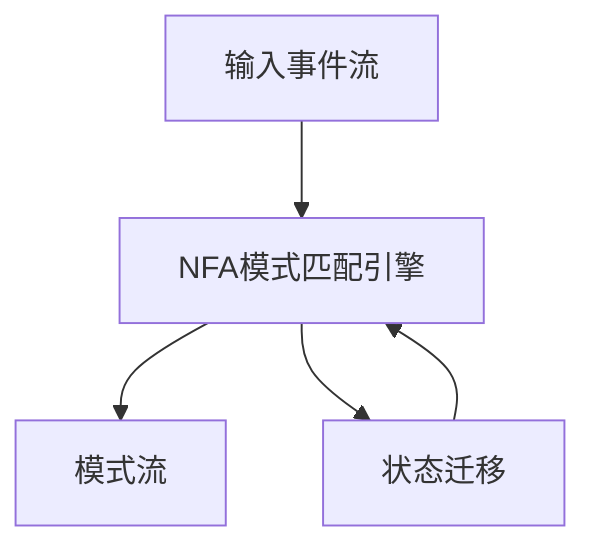
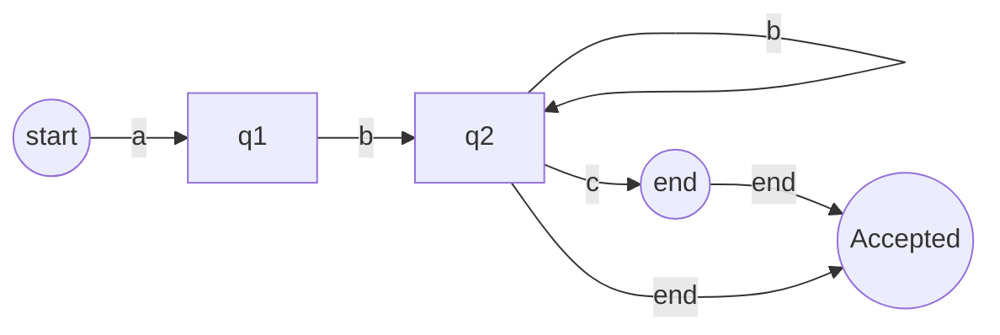

# Flink CEP原理与代码实例讲解

## 1.背景介绍

在当今大数据时代,实时数据处理和复杂事件处理(CEP)已经成为许多企业和组织的关键需求。Apache Flink作为一个开源的分布式流处理框架,提供了强大的CEP库,能够高效地对无界数据流进行模式匹配和复杂事件处理。Flink CEP广泛应用于金融欺诈检测、网络安全监控、预测性维护等领域。

### 1.1 什么是复杂事件处理(CEP)

复杂事件处理(Complex Event Processing,CEP)是一种从大量事件数据中识别有意义的事件模式的技术。CEP系统可以持续地从各种数据源(如数据库日志、传感器数据、交易记录等)获取事件流,并对其进行处理、分析和关联,以发现符合预定义模式的复杂事件。

### 1.2 CEP在实时数据处理中的作用

在实时数据处理场景中,CEP扮演着至关重要的角色。它能够从海量的事件流中快速检测出符合特定条件的复杂事件模式,并及时做出响应。这对于及时发现异常情况、识别欺诈行为、预测潜在问题等具有重要意义。

## 2.核心概念与联系

在深入探讨Flink CEP的原理和实现之前,我们需要先了解一些核心概念。

### 2.1 事件(Event)

事件是CEP系统处理的基本单元,它可以是任何带有时间戳的数据记录,如日志条目、传感器读数、交易记录等。每个事件都包含一些属性,用于描述事件的特征和上下文信息。

### 2.2 模式(Pattern)

模式是用于描述我们感兴趣的复杂事件的规则或条件。它由一个或多个模式序列组成,每个模式序列又由一个或多个单个事件组成。模式可以使用逻辑运算符(如AND、OR、NOT)和时间约束来定义复杂的条件。

### 2.3 模式流(Pattern Stream)

模式流是根据定义的模式从输入事件流中检测到的匹配事件序列组成的流。每个模式流中的元素都是一个ComplexEvent,它包含了与模式匹配的事件序列。

### 2.4 Flink CEP库

Flink CEP库提供了一组API,用于定义模式、应用模式到事件流并获取模式流。它支持各种模式操作,如时间约束、迭代、组合等,并提供了多种模式语法,如规则语法和序列语法。

## 3.核心算法原理具体操作步骤

Flink CEP库的核心算法原理基于有限状态机(Finite State Machine,FSM)和incrementalStreamingPattern构建模式匹配的NFA(Non-deterministic Finite Automaton)。



1. **输入事件流**:CEP系统从各种数据源持续获取事件流作为输入。

2. **NFA模式匹配引擎**:Flink CEP库根据用户定义的模式构建一个NFA(非确定有限状态自动机)。NFA由多个状态和状态转移组成,用于对输入事件流进行模式匹配。

3. **状态迁移**:当有新的事件到来时,NFA根据该事件和当前状态进行状态迁移。如果达到了接受状态,则表示找到了一个与模式匹配的事件序列。

4. **模式流**:所有与模式匹配的事件序列将被输出到模式流中,每个元素都是一个ComplexEvent,包含了匹配的事件序列。

Flink CEP库使用incrementalStreamingPattern构建NFA,这种方法能够有效地处理无界数据流,并支持各种模式操作,如时间约束、迭代、组合等。

## 4.数学模型和公式详细讲解举例说明

在Flink CEP库中,模式匹配的核心数学模型是**非确定有限状态自动机(NFA)**。NFA由一组状态、一组输入符号(事件)、一个初始状态、一组接受状态和一组状态转移函数组成。

我们可以使用一个5元组来形式化地定义NFA:

$$
NFA = (Q, \Sigma, q_0, F, \delta)
$$

其中:

- $Q$是一个有限的状态集合
- $\Sigma$是一个有限的输入符号集合(事件类型)
- $q_0 \in Q$是初始状态
- $F \subseteq Q$是一组接受状态
- $\delta: Q \times \Sigma \rightarrow 2^Q$是状态转移函数

在Flink CEP库中,NFA是通过incrementalStreamingPattern构建的。这种方法能够有效地处理无界数据流,并支持各种模式操作,如时间约束、迭代、组合等。

我们以一个简单的模式为例,说明NFA是如何工作的:

```
pattern = start a b+ c? end
```

这个模式匹配以"start"开头、后跟一个"a"事件、一个或多个"b"事件、一个可选的"c"事件,最后以"end"结尾的事件序列。

对应的NFA可以用下图表示:



- 状态$q_0$是初始状态,对应模式的"start"
- 状态$q_1$对应模式中的"a"事件
- 状态$q_2$是一个循环状态,对应模式中的"b+"(一个或多个"b"事件)
- 状态$q_3$对应模式中的可选"c"事件
- 状态$q_4$是接受状态,对应模式的"end"

当有新的事件到来时,NFA根据当前状态和事件类型进行状态迁移。如果达到了接受状态$q_4$,则表示找到了一个与模式匹配的事件序列。

通过这种方式,Flink CEP库能够高效地对无界数据流进行模式匹配,并输出与模式匹配的ComplexEvent。

## 5.项目实践:代码实例和详细解释说明

让我们通过一个实际的代码示例来展示如何使用Flink CEP库进行模式匹配。我们将检测一个简单的模式:连续三次失败的登录尝试。

### 5.1 定义输入事件流

首先,我们定义一个`LoginEvent`类,表示登录事件:

```java
@Data
@AllArgsConstructor
@NoArgsConstructor
public static class LoginEvent {
    public String userId;
    public String ipAddress;
    public Boolean success;
    public Long timestamp;
}
```

每个`LoginEvent`包含用户ID、IP地址、登录是否成功以及时间戳信息。

然后,我们创建一个模拟的登录事件流:

```java
private static DataStream<LoginEvent> createLoginEventStream(StreamExecutionEnvironment env) {
    List<LoginEvent> events = Arrays.asList(
        new LoginEvent("user_1", "192.168.0.1", false, 1L),
        new LoginEvent("user_1", "192.168.0.1", false, 2L),
        new LoginEvent("user_2", "192.168.0.2", true, 3L),
        new LoginEvent("user_1", "192.168.0.1", false, 4L),
        new LoginEvent("user_2", "192.168.0.2", true, 5L),
        new LoginEvent("user_2", "192.168.0.2", false, 6L)
    );

    return env.fromCollection(events)
        .assignTimestampsAndWatermarks(WatermarkStrategy.<LoginEvent>forMonotonousTimestamps()
            .withTimestampAssigner((event, timestamp) -> event.timestamp));
}
```

这个模拟的事件流包含了几个用户的登录尝试记录,其中`user_1`连续三次登录失败。

### 5.2 定义模式

接下来,我们定义要检测的模式:连续三次失败的登录尝试。我们使用Flink CEP库提供的Pattern API来描述这个模式:

```java
private static Pattern<LoginEvent, ?> getPattern() {
    return Pattern.<LoginEvent>begin("start")
        .where(event -> !event.success)
        .next("next")
        .where(event -> !event.success)
        .next("next")
        .where(event -> !event.success)
        .within(Time.seconds(10));
}
```

这个模式匹配三个连续的失败登录事件,并且这三个事件必须在10秒内发生。

- `begin("start")`定义了模式的起始状态,命名为"start"。
- `where(event -> !event.success)`是一个条件过滤器,只匹配失败的登录事件。
- `next("next")`定义了模式的下一个状态,命名为"next"。
- `within(Time.seconds(10))`设置了一个时间约束,要求三个失败登录事件必须在10秒内发生。

### 5.3 应用模式并处理模式流

最后,我们将定义的模式应用到输入事件流,并对匹配的模式流进行处理:

```java
public static void main(String[] args) throws Exception {
    StreamExecutionEnvironment env = StreamExecutionEnvironment.getExecutionEnvironment();

    DataStream<LoginEvent> loginEventStream = createLoginEventStream(env);

    Pattern<LoginEvent, ?> pattern = getPattern();

    PatternStream<LoginEvent> patternStream = CEP.pattern(loginEventStream, pattern);

    DataStream<String> alerts = patternStream.process(
        new PatternProcessFunction<LoginEvent, String>() {
            @Override
            public void processMatch(Map<String, List<LoginEvent>> pattern, Context ctx, Collector<String> out) throws Exception {
                List<LoginEvent> events = pattern.get("start");
                String userId = events.get(0).userId;
                out.collect("User " + userId + " has failed to log in three times consecutively.");
            }
        }
    );

    alerts.print();

    env.execute();
}
```

1. 我们首先创建一个`DataStream<LoginEvent>`作为输入事件流。
2. 然后,我们将之前定义的模式应用到输入事件流,生成一个`PatternStream<LoginEvent>`。
3. 对于`PatternStream`中的每个匹配模式,我们使用`process`方法来处理它。在这个示例中,我们简单地输出一条警告消息。
4. 最后,我们执行Flink作业。

运行这个程序,您将看到以下输出:

```
User user_1 has failed to log in three times consecutively.
```

这表明我们成功地检测到了`user_1`连续三次失败的登录尝试。

通过这个示例,您可以看到如何使用Flink CEP库定义模式、应用模式到输入事件流,并处理匹配的模式流。您可以根据自己的需求定制模式和处理逻辑,来解决各种复杂事件处理的场景。

## 6.实际应用场景

Flink CEP库可以广泛应用于各种领域,用于实时检测复杂事件模式。以下是一些典型的应用场景:

### 6.1 金融欺诈检测

在金融领域,CEP可以用于检测各种欺诈行为,如信用卡欺诈、洗钱活动等。例如,我们可以定义一个模式来检测异常的交易活动,如短时间内大额转账、同一账户在不同地点进行交易等。一旦检测到匹配的模式,就可以及时发出警报,防止欺诈行为发生。

### 6.2 网络安全监控

在网络安全领域,CEP可以用于实时监控网络流量,检测各种网络攻击模式,如分布式拒绝服务攻击(DDoS)、端口扫描、恶意软件活动等。通过定义合适的模式,我们可以快速发现这些攻击行为,并采取相应的防御措施。

### 6.3 预测性维护

在工业自动化和物联网领域,CEP可以用于预测性维护。我们可以从各种传感器收集设备运行数据,并使用CEP来检测异常模式,如温度、振动、噪音等参数超出正常范围。一旦检测到这些模式,就可以提前采取维护措施,避免设备故障导致的停机时间和成本。

### 6.4 业务活动监控

在企业IT系统中,CEP可以用于监控各种业务活动,如订单处理、库存管理、客户服务等。通过定义特定的模式,我们可以实时检测业务流程中的异常情况,如订单处理延迟、库存短缺、客户投诉等,并及时采取相应的措施。

### 6.5 物联网数据处理

在物联网场景中,CEP可以用于处理来自各种传感器和设备的大量事件数据流。我们