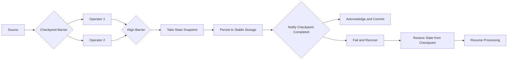

# Flink Checkpoint容错机制原理与代码实例讲解

## 1. 背景介绍
### 1.1 Flink简介
#### 1.1.1 Flink的起源与发展
#### 1.1.2 Flink的核心特性
#### 1.1.3 Flink在实时计算领域的地位
### 1.2 容错机制的重要性  
#### 1.2.1 分布式系统面临的故障问题
#### 1.2.2 容错机制对流处理系统的意义
#### 1.2.3 Flink Checkpoint在容错方面的优势

## 2. 核心概念与联系
### 2.1 Flink中的状态
#### 2.1.1 算子状态与键控状态
#### 2.1.2 状态后端(State Backend)
#### 2.1.3 状态一致性
### 2.2 Checkpoint机制
#### 2.2.1 Checkpoint的定义与原理
#### 2.2.2 Checkpoint的触发方式
#### 2.2.3 Checkpoint的存储
### 2.3 Savepoint机制
#### 2.3.1 Savepoint的概念
#### 2.3.2 Savepoint与Checkpoint的区别
#### 2.3.3 Savepoint的使用场景

## 3. 核心算法原理与具体操作步骤
### 3.1 Checkpoint的核心算法
#### 3.1.1 Chandy-Lamport分布式快照算法
#### 3.1.2 Flink Checkpoint算法的改进
#### 3.1.3 Barrier对齐与异步Barrier快照  
### 3.2 Checkpoint的具体操作步骤
#### 3.2.1 Checkpoint的初始化
#### 3.2.2 Checkpoint Barrier的传播
#### 3.2.3 算子状态的快照
#### 3.2.4 Checkpoint的完成与确认
### 3.3 Checkpoint的恢复过程
#### 3.3.1 故障检测与任务重启
#### 3.3.2 状态恢复与数据重放
#### 3.3.3 一致性检查与处理

## 4. 数学模型和公式详细讲解举例说明
### 4.1 Chandy-Lamport算法的数学模型
#### 4.1.1 系统模型与假设
#### 4.1.2 算法的形式化描述
#### 4.1.3 正确性证明
### 4.2 Flink Checkpoint的数学模型 
#### 4.2.1 Flink中状态的数学表示
#### 4.2.2 Checkpoint Barrier传播的数学描述
#### 4.2.3 并发Checkpoint的数学分析
### 4.3 Checkpoint性能优化的数学分析
#### 4.3.1 Checkpoint开销的数学建模
#### 4.3.2 Checkpoint间隔的优化模型
#### 4.3.3 Checkpoint存储的数学优化

## 5. 项目实践：代码实例和详细解释说明
### 5.1 Flink程序中启用Checkpoint
#### 5.1.1 Checkpoint配置参数详解
#### 5.1.2 Checkpoint代码示例
#### 5.1.3 Checkpoint与状态后端结合
### 5.2 Checkpoint的监控与管理
#### 5.2.1 Checkpoint监控指标
#### 5.2.2 Checkpoint History查询
#### 5.2.3 Checkpoint清理策略
### 5.3 Savepoint的使用
#### 5.3.1 Savepoint的触发与存储
#### 5.3.2 从Savepoint恢复任务
#### 5.3.3 Savepoint与作业版本升级

## 6. 实际应用场景
### 6.1 Exactly-once语义的实现
#### 6.1.1 端到端的exactly-once
#### 6.1.2 Flink+Kafka端到端状态一致性
#### 6.1.3 Flink+分布式文件系统的端到端一致性
### 6.2 任务的暂停与恢复
#### 6.2.1 任务迁移
#### 6.2.2 蓝绿部署与金丝雀发布
#### 6.2.3 A/B测试
### 6.3 应对延迟反压
#### 6.3.1 背压问题与Checkpoint
#### 6.3.2 Checkpoint对吞吐和延迟的影响
#### 6.3.3 Checkpoint参数调优

## 7. 工具和资源推荐
### 7.1 Checkpoint相关配置
#### 7.1.1 StateBackend配置
#### 7.1.2 Checkpoint参数调优
#### 7.1.3 容错恢复策略设置  
### 7.2 Checkpoint的监控工具
#### 7.2.1 Flink Web UI
#### 7.2.2 Flink Metrics系统
#### 7.2.3 第三方监控系统集成
### 7.3 Checkpoint学习资源
#### 7.3.1 官方文档
#### 7.3.2 技术博客与论文
#### 7.3.3 开源项目与代码示例

## 8. 总结：未来发展趋势与挑战
### 8.1 Checkpoint机制的优化方向  
#### 8.1.1 Checkpoint开销的进一步降低
#### 8.1.2 Checkpoint的自适应触发
#### 8.1.3 增量Checkpoint
### 8.2 Checkpoint与新场景的结合
#### 8.2.1 Checkpoint在大状态场景下的应用 
#### 8.2.2 Checkpoint在机器学习场景中的应用
#### 8.2.3 Serverless场景下的Checkpoint
### 8.3 Checkpoint面临的挑战
#### 8.3.1 极大状态的Checkpoint瓶颈
#### 8.3.2 Checkpoint与异构资源的适配
#### 8.3.3 Checkpoint的云原生挑战

## 9. 附录：常见问题与解答
### 9.1 Checkpoint的最佳实践
#### 9.1.1 Checkpoint的合理间隔设置
#### 9.1.2 Checkpoint与重启策略的协同
#### 9.1.3 Checkpoint的高可用存储
### 9.2 Checkpoint常见问题排查
#### 9.2.1 Checkpoint失败问题定位
#### 9.2.2 Checkpoint对性能影响的分析
#### 9.2.3 Checkpoint数据丢失与恢复
### 9.3 Checkpoint的局限性
#### 9.3.1 Checkpoint对处理语义的局限
#### 9.3.2 Checkpoint的性能瓶颈
#### 9.3.3 Checkpoint的适用边界



上图是Flink Checkpoint容错机制的核心流程图。Source节点周期性地触发Checkpoint，向下游算子发送Barrier。当算子收到Barrier时，会停止处理，对齐Barrier，并对当前状态做快照。快照会持久化到稳定存储中。当所有算子完成快照，Checkpoint被标记为完成状态，向Flink Master汇报。如果期间发生故障，Flink会从最近完成的Checkpoint恢复状态，重新处理。

Flink Checkpoint是一种非常有效且低开销的容错机制。它基于Chandy-Lamport分布式快照算法，通过Barrier对齐的方式，能够在分布式环境中获取全局一致的状态快照。Checkpoint可以容忍各种故障场景，包括任务失败、节点宕机、网络中断等，保证exactly-once的状态一致性。

Checkpoint的核心算法可以简要总结为：

1. Flink Master周期性地发起一次Checkpoint，为本次Checkpoint生成一个递增的ID。
2. Checkpoint Barrier被注入到数据流中，作为数据记录与之一起流向下游算子。
3. 算子收到Barrier时，会停止处理数据，将Barrier对齐，并启动本地State快照。
4. 各算子将State异步复制到持久化存储，并将快照完成的消息汇报给Flink Master。
5. 当Flink Master收到所有算子的快照完成消息后，本次Checkpoint完成。

在代码实现上，Flink提供了一套易用的State和Checkpoint API。开发者可以通过在代码中添加几行简单的配置，就能启用Checkpoint机制：

```java
StreamExecutionEnvironment env = StreamExecutionEnvironment.getExecutionEnvironment();

// 启用Checkpoint，每1000 ms触发一次
env.enableCheckpointing(1000);

// 设置Checkpoint模式为exactly-once
env.getCheckpointConfig().setCheckpointingMode(CheckpointingMode.EXACTLY_ONCE);

// 设置Checkpoint最小间隔为500 ms 
env.getCheckpointConfig().setMinPauseBetweenCheckpoints(500);

// 设置同时进行的Checkpoint数量最多为1
env.getCheckpointConfig().setMaxConcurrentCheckpoints(1);

// 设置Checkpoint超时时间为1分钟
env.getCheckpointConfig().setCheckpointTimeout(60000);
```

Checkpoint机制使得Flink成为高可靠的流处理引擎，在实际生产中得到了广泛应用。一些典型的应用场景包括：

1. 实现端到端的exactly-once语义。利用Checkpoint，Flink可以将源端、计算过程、以及输出端的状态改变协调在一起，实现端到端的一次且仅一次语义。

2. 任务的暂停与恢复。Checkpoint可以在任务升级、迁移、扩容时，提供暂停点，使状态可以平滑迁移。结合Savepoint，还可以支持任务的版本升级。  

3. 延迟反压的处理。当出现反压时，Checkpoint能够提供任务重启的安全点，避免数据丢失和状态损坏。

总的来说，Flink Checkpoint机制是流处理领域一项开创性的贡献，极大地推动了流处理技术的发展。未来Checkpoint机制还将在性能、适用性等方面持续优化，以支持更加复杂多变的流处理场景。同时一些新的研究方向，如增量Checkpoint、异构环境下的Checkpoint，以及在机器学习、Serverless等场景下的应用，都将成为未来的热点。Checkpoint机制必将在未来流处理技术的发展中，扮演越来越重要的角色。

作者：禅与计算机程序设计艺术 / Zen and the Art of Computer Programming