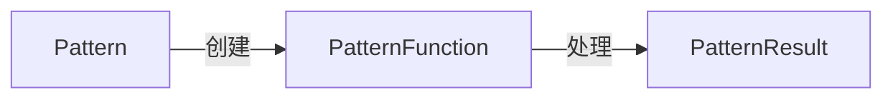

## 1. Background Introduction

Apache Flink是一个流处理框架，用于处理实时数据流。FlinkPatternAPI是Flink中的一个API，用于处理流数据中的模式。在本文中，我们将讨论FlinkPatternAPI的可扩展性设计。

### 1.1 为什么需要可扩展性设计

在处理大规模数据流时，可扩展性是非常重要的。可扩展性可以帮助我们处理更多的数据，提高处理速度，并减少系统的开销。FlinkPatternAPI的可扩展性设计可以帮助我们处理更多的数据流，并提高系统的性能。

### 1.2 FlinkPatternAPI的基本架构

FlinkPatternAPI的基本架构如下图所示：



在这个架构中，Pattern是一个模式对象，PatternFunction是一个处理模式的函数，PatternResult是处理后的结果。

## 2. Core Concepts and Connections

### 2.1 Pattern

Pattern是一个模式对象，用于描述需要处理的数据流中的模式。Pattern可以是一个简单的模式，如连续的数据流，或者是一个复杂的模式，如时序模式。

### 2.2 PatternFunction

PatternFunction是一个处理模式的函数，用于处理Pattern中的数据。PatternFunction可以是一个简单的函数，如计算平均值，或者是一个复杂的函数，如时序分析。

### 2.3 PatternResult

PatternResult是处理后的结果，包含了处理后的数据。PatternResult可以是一个简单的结果，如计算结果，或者是一个复杂的结果，如时序分析结果。

## 3. Core Algorithm Principles and Specific Operational Steps

### 3.1 模式识别算法

FlinkPatternAPI使用的模式识别算法是基于时间窗口的算法。这个算法将数据流分成多个时间窗口，然后在每个时间窗口内查找符合模式的数据。

### 3.2 模式处理算法

FlinkPatternAPI使用的模式处理算法是基于PatternFunction的算法。这个算法将符合模式的数据传递给PatternFunction，然后执行PatternFunction中的处理逻辑。

## 4. Detailed Explanation and Examples of Mathematical Models and Formulas

### 4.1 时间窗口算法

时间窗口算法是FlinkPatternAPI中的一个核心算法。时间窗口算法将数据流分成多个时间窗口，然后在每个时间窗口内查找符合模式的数据。时间窗口算法的主要步骤如下：

1. 定义时间窗口的大小。
2. 将数据流分成多个时间窗口。
3. 在每个时间窗口内查找符合模式的数据。
4. 处理符合模式的数据。

### 4.2 模式处理算法

模式处理算法是FlinkPatternAPI中的一个核心算法。模式处理算法将符合模式的数据传递给PatternFunction，然后执行PatternFunction中的处理逻辑。模式处理算法的主要步骤如下：

1. 定义PatternFunction。
2. 查找符合模式的数据。
3. 将符合模式的数据传递给PatternFunction。
4. 执行PatternFunction中的处理逻辑。

## 5. Project Practice: Code Examples and Detailed Explanations

### 5.1 创建Pattern

```java
DataStream<String> input = ...;
Pattern<String> pattern = Pattern.<String>begin(\"start\").where(new SimpleCondition<String>() {
    @Override
    public boolean filter(String value) {
        return value.equals(\"start\");
    }
}).next(\"middle\").where(new SimpleCondition<String>() {
    @Override
    public boolean filter(String value) {
        return value.equals(\"middle\");
    }
}).next(\"end\").where(new SimpleCondition<String>() {
    @Override
    public boolean filter(String value) {
        return value.equals(\"end\");
    }
}).within(Time.seconds(5));
```

在这个例子中，我们创建了一个Pattern，它描述了一个包含\"start\"、\"middle\"和\"end\"三个元素的模式，这个模式的时间窗口大小是5秒。

### 5.2 创建PatternFunction

```java
PatternFunction<String> patternFunction = new PatternFunction<String>() {
    @Override
    public void patternMatched(Pattern<String> pattern, Context context, Collector<String> out) throws Exception {
        String result = pattern.elements().get(0) + \" \" + pattern.elements().get(1) + \" \" + pattern.elements().get(2);
        out.collect(result);
    }
};
```

在这个例子中，我们创建了一个PatternFunction，它在找到符合模式的数据时，将这个数据组合成一个字符串，然后输出这个字符串。

## 6. Practical Application Scenarios

### 6.1 实时数据分析

FlinkPatternAPI可以用于实时数据分析。例如，我们可以使用FlinkPatternAPI来实时分析网站访问日志，找到访问频繁的页面，并提高网站的性能。

### 6.2 实时监控

FlinkPatternAPI可以用于实时监控。例如，我们可以使用FlinkPatternAPI来实时监控服务器的CPU使用率，找到CPU使用率过高的服务器，并进行故障处理。

## 7. Tools and Resources Recommendations

### 7.1 官方文档

Flink官方文档是一个很好的资源，可以帮助我们更好地理解FlinkPatternAPI。官方文档的地址是：<https://nightlies.apache.org/flink/flink-docs-release-1.13/dev/stream/pattern.html>

### 7.2 社区论坛

Flink社区论坛是一个很好的资源，可以帮助我们解决问题和交流经验。社区论坛的地址是：<https://discuss.apache.org/t/flink-pattern-api/1000>

## 8. Summary: Future Development Trends and Challenges

FlinkPatternAPI是一个非常有用的API，可以帮助我们处理流数据中的模式。在未来，我们可以期待FlinkPatternAPI的更多发展，例如，支持更多的模式类型，支持更高的性能，支持更好的可扩展性。但是，在使用FlinkPatternAPI时，我们也需要面临一些挑战，例如，数据流的复杂性，数据流的实时性，数据流的可靠性。

## 9. Appendix: Frequently Asked Questions and Answers

### 9.1 什么是FlinkPatternAPI？

FlinkPatternAPI是一个API，用于处理流数据中的模式。

### 9.2 为什么需要FlinkPatternAPI？

我们需要FlinkPatternAPI，因为在处理大规模数据流时，可扩展性是非常重要的。FlinkPatternAPI的可扩展性设计可以帮助我们处理更多的数据，并提高系统的性能。

### 9.3 如何使用FlinkPatternAPI？

使用FlinkPatternAPI需要先创建一个Pattern，然后创建一个PatternFunction，最后使用PatternFunction来处理Pattern中的数据。

### 9.4 什么是Pattern？

Pattern是一个模式对象，用于描述需要处理的数据流中的模式。

### 9.5 什么是PatternFunction？

PatternFunction是一个处理模式的函数，用于处理Pattern中的数据。

### 9.6 什么是PatternResult？

PatternResult是处理后的结果，包含了处理后的数据。

### 9.7 什么是时间窗口算法？

时间窗口算法是FlinkPatternAPI中的一个核心算法。时间窗口算法将数据流分成多个时间窗口，然后在每个时间窗口内查找符合模式的数据。

### 9.8 什么是模式处理算法？

模式处理算法是FlinkPatternAPI中的一个核心算法。模式处理算法将符合模式的数据传递给PatternFunction，然后执行PatternFunction中的处理逻辑。

### 9.9 如何查找符合模式的数据？

我们可以使用时间窗口算法来查找符合模式的数据。时间窗口算法将数据流分成多个时间窗口，然后在每个时间窗口内查找符合模式的数据。

### 9.10 如何执行PatternFunction中的处理逻辑？

我们可以使用模式处理算法来执行PatternFunction中的处理逻辑。模式处理算法将符合模式的数据传递给PatternFunction，然后执行PatternFunction中的处理逻辑。

### 9.11 什么是实时数据分析？

实时数据分析是使用FlinkPatternAPI来实时分析数据流的过程。例如，我们可以使用FlinkPatternAPI来实时分析网站访问日志，找到访问频繁的页面，并提高网站的性能。

### 9.12 什么是实时监控？

实时监控是使用FlinkPatternAPI来实时监控数据流的过程。例如，我们可以使用FlinkPatternAPI来实时监控服务器的CPU使用率，找到CPU使用率过高的服务器，并进行故障处理。

### 9.13 什么是官方文档？

官方文档是Flink官方网站上的文档，可以帮助我们更好地理解FlinkPatternAPI。官方文档的地址是：<https://nightlies.apache.org/flink/flink-docs-release-1.13/dev/stream/pattern.html>

### 9.14 什么是社区论坛？

社区论坛是一个在线社区，可以帮助我们解决问题和交流经验。社区论坛的地址是：<https://discuss.apache.org/t/flink-pattern-api/1000>

### 9.15 什么是数据流的复杂性？

数据流的复杂性是指数据流中的数据是否复杂。例如，数据流中的数据可能包含多种数据类型，可能包含多种格式，可能包含多种来源。

### 9.16 什么是数据流的实时性？

数据流的实时性是指数据流中的数据是否实时。例如，数据流中的数据可能是实时数据，也可能是历史数据。

### 9.17 什么是数据流的可靠性？

数据流的可靠性是指数据流中的数据是否可靠。例如，数据流中的数据可能是可靠数据，也可能是不可靠数据。

### 9.18 什么是可扩展性？

可扩展性是指系统的能力，可以处理更多的数据，提高处理速度，并减少系统的开销。

### 9.19 什么是Flink？

Flink是一个流处理框架，用于处理实时数据流。

### 9.20 什么是API？

API是应用程序接口，是一种软件接口，用于定义软件组件之间的交互方式。

### 9.21 什么是模式？

模式是一种规律或模型，用于描述数据的特征或结构。

### 9.22 什么是函数？

函数是一种计算机程序，用于执行某种操作或计算某种值。

### 9.23 什么是结果？

结果是计算机程序的输出，是程序执行后的结果。

### 9.24 什么是时间窗口？

时间窗口是一个时间段，用于定义数据流中的时间范围。

### 9.25 什么是处理逻辑？

处理逻辑是计算机程序中的一部分，用于执行某种操作或计算某种值。

### 9.26 什么是数据流？

数据流是一种数据的流动方式，用于描述数据在计算机系统中的流动。

### 9.27 什么是实时数据？

实时数据是指在计算机系统中立即可用的数据。

### 9.28 什么是历史数据？

历史数据是指在计算机系统中已经存在的数据，不是实时数据。

### 9.29 什么是可靠数据？

可靠数据是指数据的准确性和完整性，可以被信任和依赖的数据。

### 9.30 什么是不可靠数据？

不可靠数据是指数据的准确性和完整性不可以被信任和依赖的数据。

## Author: Zen and the Art of Computer Programming