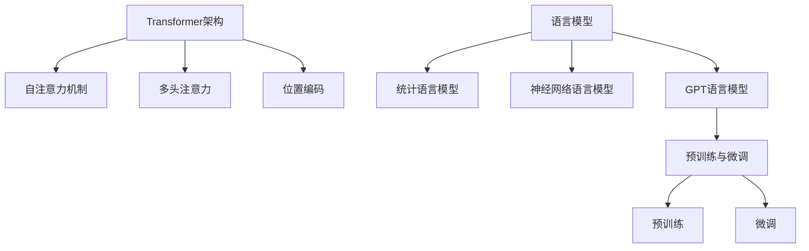

# GPT 原理与代码实例讲解

## 1. 背景介绍
### 1.1 GPT的起源与发展
#### 1.1.1 GPT的诞生
#### 1.1.2 GPT的发展历程
#### 1.1.3 GPT的版本演进

### 1.2 GPT的应用现状
#### 1.2.1 GPT在自然语言处理领域的应用
#### 1.2.2 GPT在对话系统中的应用  
#### 1.2.3 GPT在文本生成任务中的应用

## 2. 核心概念与联系
### 2.1 Transformer架构
#### 2.1.1 自注意力机制
#### 2.1.2 多头注意力
#### 2.1.3 位置编码

### 2.2 语言模型
#### 2.2.1 统计语言模型
#### 2.2.2 神经网络语言模型 
#### 2.2.3 GPT语言模型

### 2.3 预训练与微调
#### 2.3.1 预训练的概念与意义
#### 2.3.2 微调的概念与意义
#### 2.3.3 GPT的预训练与微调策略

### 2.4 GPT核心概念关系图


## 3. 核心算法原理具体操作步骤
### 3.1 Transformer的编码器
#### 3.1.1 输入嵌入
#### 3.1.2 位置编码
#### 3.1.3 自注意力层
#### 3.1.4 前馈神经网络层 

### 3.2 Transformer的解码器
#### 3.2.1 输入嵌入和位置编码
#### 3.2.2 掩码自注意力层
#### 3.2.3 编码-解码注意力层
#### 3.2.4 前馈神经网络层

### 3.3 GPT的训练过程
#### 3.3.1 预训练阶段
#### 3.3.2 微调阶段
#### 3.3.3 生成阶段

## 4. 数学模型和公式详细讲解举例说明
### 4.1 自注意力机制的数学表示
#### 4.1.1 查询、键、值的计算
$$Attention(Q,K,V) = softmax(\frac{QK^T}{\sqrt{d_k}})V$$
其中，$Q$是查询矩阵，$K$是键矩阵，$V$是值矩阵，$d_k$是键向量的维度。

#### 4.1.2 多头注意力的计算
$$MultiHead(Q,K,V) = Concat(head_1,...,head_h)W^O$$
$$head_i = Attention(QW_i^Q, KW_i^K, VW_i^V)$$
其中，$W_i^Q, W_i^K, W_i^V$和$W^O$是可学习的权重矩阵。

### 4.2 前馈神经网络层的数学表示 
$$FFN(x) = max(0, xW_1 + b_1)W_2 + b_2$$
其中，$W_1, b_1, W_2, b_2$是可学习的权重矩阵和偏置。

### 4.3 语言模型的数学表示
给定一个单词序列$w_1, w_2, ..., w_n$，语言模型的目标是估计该序列的概率：
$$P(w_1, w_2, ..., w_n) = \prod_{i=1}^n P(w_i|w_1, ..., w_{i-1})$$
GPT使用Transformer的解码器结构来建模这个条件概率。

## 5. 项目实践：代码实例和详细解释说明
### 5.1 使用PyTorch实现GPT模型
```python
import torch
import torch.nn as nn

class GPT(nn.Module):
    def __init__(self, vocab_size, d_model, nhead, num_layers, dim_feedforward, max_seq_length, pos_dropout, trans_dropout):
        super().__init__()
        
        self.pos_encoder = PositionalEncoding(d_model, pos_dropout, max_seq_length)
        encoder_layer = nn.TransformerEncoderLayer(d_model, nhead, dim_feedforward, trans_dropout)
        self.transformer = nn.TransformerEncoder(encoder_layer, num_layers) 
        self.embedding = nn.Embedding(vocab_size, d_model)
        self.fc = nn.Linear(d_model, vocab_size)
        
    def forward(self, src, src_mask):
        src = self.embedding(src) * math.sqrt(self.d_model)
        src = self.pos_encoder(src)
        output = self.transformer(src, src_mask)
        output = self.fc(output)
        return output
```
以上代码定义了GPT模型的基本结构，包括位置编码、Transformer编码器层、嵌入层和全连接输出层。

### 5.2 GPT的训练流程
```python
criterion = nn.CrossEntropyLoss()
optimizer = torch.optim.Adam(model.parameters(), lr=learning_rate)

def train(model, data, optimizer, criterion, batch_size, num_epochs):
    model.train()
    for epoch in range(num_epochs):
        for i in range(0, len(data), batch_size):
            batch = data[i:i+batch_size]
            optimizer.zero_grad()
            output = model(batch[:-1])
            loss = criterion(output.view(-1, vocab_size), batch[1:].view(-1))
            loss.backward()
            optimizer.step()
```
以上代码展示了GPT模型的训练流程，使用交叉熵损失函数和Adam优化器，通过迭代数据集的方式来更新模型参数。

## 6. 实际应用场景
### 6.1 文本生成
#### 6.1.1 开放域对话生成
#### 6.1.2 故事生成
#### 6.1.3 诗歌生成

### 6.2 文本摘要
#### 6.2.1 新闻摘要
#### 6.2.2 论文摘要
#### 6.2.3 评论摘要

### 6.3 机器翻译
#### 6.3.1 单语种翻译
#### 6.3.2 多语种翻译

## 7. 工具和资源推荐
### 7.1 开源实现
- OpenAI GPT：https://github.com/openai/finetune-transformer-lm
- Hugging Face Transformers：https://github.com/huggingface/transformers

### 7.2 预训练模型
- OpenAI GPT-2：https://openai.com/blog/better-language-models/
- OpenAI GPT-3：https://openai.com/blog/openai-api/

### 7.3 相关论文
- Attention Is All You Need：https://arxiv.org/abs/1706.03762
- Language Models are Unsupervised Multitask Learners：https://d4mucfpksywv.cloudfront.net/better-language-models/language_models_are_unsupervised_multitask_learners.pdf

## 8. 总结：未来发展趋势与挑战
### 8.1 GPT模型的发展趋势
#### 8.1.1 模型规模的增大
#### 8.1.2 多模态学习的探索
#### 8.1.3 模型的多样化应用

### 8.2 GPT面临的挑战
#### 8.2.1 训练资源的消耗  
#### 8.2.2 模型的可解释性
#### 8.2.3 模型的公平性和伦理问题

## 9. 附录：常见问题与解答
### 9.1 GPT和BERT的区别是什么？
GPT是一种基于Transformer解码器结构的单向语言模型，主要用于文本生成任务。而BERT是基于Transformer编码器结构的双向语言模型，主要用于自然语言理解任务，如文本分类、命名实体识别等。

### 9.2 GPT-2和GPT-3的区别是什么？
GPT-2和GPT-3都是OpenAI开发的语言模型，主要区别在于模型的规模。GPT-2有1.5B的参数，而GPT-3有175B的参数，使其在许多自然语言处理任务上取得了更好的性能。

### 9.3 如何微调GPT模型以适应特定任务？
微调GPT模型通常需要以下步骤：
1. 准备特定任务的数据集
2. 加载预训练的GPT模型
3. 根据任务的输入和输出格式，调整模型的输入和输出层
4. 使用任务数据集对模型进行微调
5. 评估微调后模型在任务上的性能

作者：禅与计算机程序设计艺术 / Zen and the Art of Computer Programming