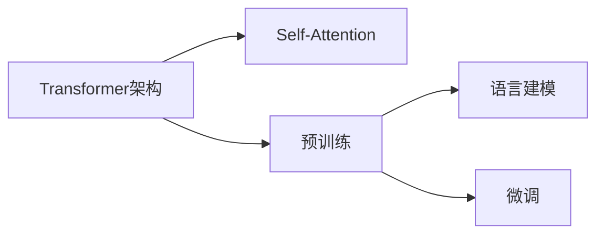

# GPT-2原理与代码实例讲解

## 1.背景介绍
### 1.1 GPT-2的诞生
GPT-2(Generative Pre-trained Transformer 2)是由OpenAI在2019年2月推出的一种大型语言模型。它是在GPT(Generative Pre-Training)的基础上进行改进和扩展而成的下一代语言模型。GPT-2在海量无标注文本语料上进行了预训练,通过自监督学习的方式学习到了强大的语言理解和生成能力。

### 1.2 GPT-2的意义
GPT-2的出现标志着自然语言处理(NLP)领域迈入了一个新的里程碑。它展示了在海量数据和计算资源的支持下,语言模型可以学习到令人惊叹的语言能力。GPT-2在多个NLP任务上取得了当时最先进的成果,包括语言建模、文本生成、阅读理解、问答等。它的成功激发了学术界和工业界对于大规模预训练语言模型的广泛关注和研究热情。

### 1.3 GPT-2的影响
GPT-2的发布引发了人们对AI系统生成假新闻、恶意内容等潜在风险的担忧和讨论。OpenAI出于对负面影响的考虑,最初只发布了GPT-2的小型版本,并逐步开放了更大规模的模型。这引发了关于AI技术透明度和责任的思考。同时,GPT-2也为后续更强大的语言模型如GPT-3奠定了基础,推动了NLP技术的快速发展。

## 2.核心概念与联系
### 2.1 Transformer架构
GPT-2采用了Transformer的架构。Transformer是一种基于自注意力机制(Self-Attention)的神经网络架构,它摒弃了传统的循环神经网络(RNN)和卷积神经网络(CNN),通过Self-Attention实现了并行计算和长距离依赖建模。Transformer由编码器(Encoder)和解码器(Decoder)组成,GPT-2只使用了Decoder部分。

### 2.2 自注意力机制(Self-Attention) 
Self-Attention是Transformer的核心组件。它允许模型在处理每个词时,都能够关注到输入序列中的任意位置,捕捉词之间的依赖关系。通过计算Query、Key、Value三个向量之间的注意力权重,Self-Attention可以动态地确定每个词对其他词的重要性,实现了全局信息的融合。

### 2.3 预训练(Pre-training)
GPT-2采用了预训练的方法,即在大规模无标注语料上进行自监督学习。通过设计合适的预训练任务,如语言建模,GPT-2可以学习到通用的语言表示和语言规律。预训练使得模型能够从海量数据中习得丰富的语言知识,为下游任务提供了良好的初始化参数。

### 2.4 微调(Fine-tuning) 
在预训练之后,GPT-2可以通过微调(Fine-tuning)的方式适应特定的下游任务。微调是在预训练模型的基础上,使用任务特定的标注数据对模型进行进一步训练。通过微调,GPT-2可以快速适应新的任务,并在少量标注数据的情况下取得良好的性能。

### 2.5 语言建模(Language Modeling)
GPT-2的预训练任务是语言建模,即根据给定的上文预测下一个词。通过最大化下一个词的条件概率,语言模型可以学习到语言的统计规律和语义信息。GPT-2在海量无标注文本上进行语言建模训练,学习到了强大的语言生成能力。

下面是GPT-2核心概念之间的关系图:



## 3.核心算法原理具体操作步骤
### 3.1 Transformer的计算流程
1. 输入编码:将输入序列转化为词嵌入向量,并加入位置编码。
2. Self-Attention:通过计算Query、Key、Value向量之间的注意力权重,得到每个位置的注意力表示。
3. 前馈神经网络:对Self-Attention的输出进行非线性变换。
4. 残差连接和层归一化:将前一层的输出与当前层的输出相加,并进行层归一化。
5. 重复步骤2-4多次,构成多个Transformer Block。
6. 输出:将最后一个Transformer Block的输出传入线性层和Softmax层,得到下一个词的概率分布。

### 3.2 Self-Attention的计算步骤
1. 将输入序列X转化为三个矩阵:Query矩阵Q、Key矩阵K、Value矩阵V。
2. 计算Q与K的点积,得到注意力分数矩阵。
3. 对注意力分数矩阵进行缩放和Softmax归一化,得到注意力权重矩阵。
4. 将注意力权重矩阵与V相乘,得到加权求和的注意力表示。
5. 将多头注意力的结果拼接起来,并经过线性变换得到最终的Self-Attention输出。

### 3.3 预训练的具体步骤
1. 构建大规模无标注文本语料库。
2. 对文本进行预处理,如分词、编码等。
3. 设计预训练任务,如语言建模。
4. 初始化GPT-2模型参数。
5. 将文本数据分批次输入GPT-2模型。
6. 计算语言建模的损失函数,如交叉熵损失。
7. 使用优化算法(如Adam)更新模型参数,最小化损失函数。
8. 重复步骤5-7,直到模型收敛或达到预设的训练轮数。

### 3.4 微调的具体步骤
1. 加载预训练好的GPT-2模型参数。
2. 根据下游任务准备标注数据集。
3. 将标注数据转化为模型可接受的格式。
4. 在GPT-2模型的基础上添加任务特定的输出层。
5. 使用标注数据对模型进行微调训练。
6. 计算任务的损失函数,并使用优化算法更新模型参数。
7. 重复步骤5-6,直到模型在任务上达到满意的性能。

## 4.数学模型和公式详细讲解举例说明
### 4.1 Self-Attention的数学表示
给定输入序列 $X \in \mathbb{R}^{n \times d}$,其中 $n$ 为序列长度,$d$ 为特征维度。Self-Attention的计算过程如下:

1. 计算Query、Key、Value矩阵:
$$
\begin{aligned}
Q &= XW^Q \\
K &= XW^K \\
V &= XW^V
\end{aligned}
$$
其中,$W^Q, W^K, W^V \in \mathbb{R}^{d \times d_k}$ 为可学习的参数矩阵。

2. 计算注意力分数矩阵:
$$
A = \frac{QK^T}{\sqrt{d_k}}
$$
其中,$A \in \mathbb{R}^{n \times n}$ 为注意力分数矩阵,$\sqrt{d_k}$ 为缩放因子。

3. 对注意力分数矩阵进行Softmax归一化:
$$
\text{Attention}(Q,K,V) = \text{softmax}(\frac{QK^T}{\sqrt{d_k}})V
$$

4. 多头注意力的计算:
$$
\begin{aligned}
\text{MultiHead}(X) &= \text{Concat}(\text{head}_1, \ldots, \text{head}_h)W^O \\
\text{head}_i &= \text{Attention}(XW_i^Q, XW_i^K, XW_i^V)
\end{aligned}
$$
其中,$h$ 为注意力头的数量,$W^O \in \mathbb{R}^{hd_k \times d}$ 为可学习的参数矩阵。

### 4.2 语言建模的数学表示
给定文本序列 $X = (x_1, x_2, \ldots, x_n)$,语言建模的目标是最大化下一个词的条件概率:
$$
P(X) = \prod_{i=1}^n P(x_i | x_{<i})
$$
其中,$x_{<i}$ 表示 $x_i$ 之前的所有词。

在GPT-2中,使用Transformer的Decoder结构来建模条件概率:
$$
P(x_i | x_{<i}) = \text{softmax}(W_e h_i + b_e)
$$
其中,$h_i$ 为第 $i$ 个位置的Transformer Decoder的输出,$W_e \in \mathbb{R}^{d \times |V|}, b_e \in \mathbb{R}^{|V|}$ 为可学习的参数,|V|为词表大小。

训练时,最小化交叉熵损失函数:
$$
\mathcal{L} = -\sum_{i=1}^n \log P(x_i | x_{<i})
$$

### 4.3 示例说明
以一个简单的句子"I love natural language processing"为例,说明GPT-2的工作原理。

1. 将句子转化为词嵌入序列:
$$
X = [\mathbf{e}_I, \mathbf{e}_{love}, \mathbf{e}_{natural}, \mathbf{e}_{language}, \mathbf{e}_{processing}]
$$

2. 通过Transformer的Self-Attention计算每个位置的注意力表示:
$$
\begin{aligned}
h_1 &= \text{Attention}([\mathbf{e}_I], [\mathbf{e}_I], [\mathbf{e}_I]) \\
h_2 &= \text{Attention}([\mathbf{e}_I, \mathbf{e}_{love}], [\mathbf{e}_I, \mathbf{e}_{love}], [\mathbf{e}_I, \mathbf{e}_{love}]) \\
&\ldots \\
h_5 &= \text{Attention}(X, X, X)
\end{aligned}
$$

3. 根据每个位置的注意力表示,预测下一个词的概率分布:
$$
\begin{aligned}
P(x_2 | x_1) &= \text{softmax}(W_e h_1 + b_e) \\
P(x_3 | x_1, x_2) &= \text{softmax}(W_e h_2 + b_e) \\
&\ldots \\
P(x_6 | x_1, \ldots, x_5) &= \text{softmax}(W_e h_5 + b_e)
\end{aligned}
$$

4. 计算交叉熵损失,并使用优化算法更新模型参数:
$$
\mathcal{L} = -\log P(love | I) - \log P(natural | I, love) - \ldots - \log P(EOS | I, love, natural, language, processing)
$$
其中,EOS表示句子的结束符。

通过不断地在大规模语料上训练,GPT-2可以学习到丰富的语言知识,生成连贯、流畅的文本。

## 5.项目实践:代码实例和详细解释说明
下面是一个使用PyTorch实现GPT-2的简化版代码示例:

```python
import torch
import torch.nn as nn

class SelfAttention(nn.Module):
    def __init__(self, d_model, n_heads):
        super().__init__()
        self.d_model = d_model
        self.n_heads = n_heads
        self.head_dim = d_model // n_heads
        
        self.q_linear = nn.Linear(d_model, d_model)
        self.k_linear = nn.Linear(d_model, d_model)
        self.v_linear = nn.Linear(d_model, d_model)
        self.out_linear = nn.Linear(d_model, d_model)
    
    def forward(self, x):
        batch_size, seq_len, _ = x.size()
        
        q = self.q_linear(x).view(batch_size, seq_len, self.n_heads, self.head_dim).transpose(1, 2)
        k = self.k_linear(x).view(batch_size, seq_len, self.n_heads, self.head_dim).transpose(1, 2)
        v = self.v_linear(x).view(batch_size, seq_len, self.n_heads, self.head_dim).transpose(1, 2)
        
        attn_scores = torch.matmul(q, k.transpose(-2, -1)) / (self.head_dim ** 0.5)
        attn_probs = nn.Softmax(dim=-1)(attn_scores)
        
        attn_output = torch.matmul(attn_probs, v).transpose(1, 2).contiguous().view(batch_size, seq_len, self.d_model)
        attn_output = self.out_linear(attn_output)
        
        return attn_output

class TransformerBlock(nn.Module):
    def __init__(self, d_model, n_heads, dim_feedforward, dropout=0.1):
        super().__init__()
        self.attention = SelfAttention(d_model, n_heads)
        self.linear1 = nn.Linear(d_model, dim_