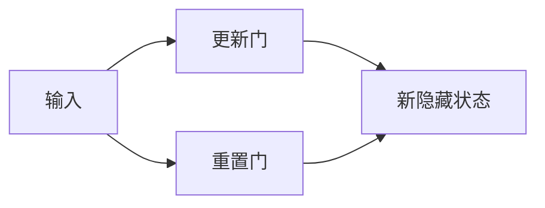

## 1.背景介绍

在深度学习领域，循环神经网络（RNN）已经被广泛应用于处理序列数据。然而，传统的RNN存在着梯度消失和梯度爆炸的问题，这使得RNN在处理长序列时变得非常困难。为了解决这个问题，研究者们提出了一种新型的RNN变体——门控循环单元（Gated Recurrent Units，GRU）。GRU通过引入门机制，使得网络可以更好地捕捉序列中的长距离依赖关系。

## 2.核心概念与联系

GRU是由Cho等人在2014年提出的。它的主要思想是引入了两个门（更新门和重置门）来控制信息的流动。更新门负责决定何时更新隐藏状态，而重置门则决定何时忽略之前的隐藏状态。这两个门的引入，使得GRU可以更好地捕捉序列中的长距离依赖关系。



## 3.核心算法原理具体操作步骤

GRU的计算过程可以分为以下几步：

1. 计算更新门和重置门的值。这两个门的值都是在0和1之间，可以通过sigmoid函数得到。

    $$
    z_t = \sigma(W_z \cdot [h_{t-1}, x_t])
    $$
    $$
    r_t = \sigma(W_r \cdot [h_{t-1}, x_t])
    $$

2. 计算候选隐藏状态。这个状态是基于当前输入和之前的隐藏状态计算得到的，但是在计算过程中，会考虑到重置门的值。

    $$
    \tilde{h}_t = tanh(W \cdot [r_t \cdot h_{t-1}, x_t])
    $$

3. 计算新的隐藏状态。新的隐藏状态是基于更新门、之前的隐藏状态以及候选隐藏状态计算得到的。

    $$
    h_t = (1 - z_t) \cdot h_{t-1} + z_t \cdot \tilde{h}_t
    $$

这就是GRU的核心计算过程。通过引入更新门和重置门，GRU可以更好地捕捉序列中的长距离依赖关系。

## 4.数学模型和公式详细讲解举例说明

在这一部分，我们将详细解释上述公式。

首先，更新门$z_t$和重置门$r_t$的计算过程。这两个门的值都是在0和1之间，可以通过sigmoid函数得到。其中，$W_z$和$W_r$是权重矩阵，$h_{t-1}$是上一时刻的隐藏状态，$x_t$是当前时刻的输入。

然后，我们来看候选隐藏状态$\tilde{h}_t$的计算过程。这个状态是基于当前输入$x_t$和经过重置门$r_t$调节后的上一时刻隐藏状态$r_t \cdot h_{t-1}$计算得到的。$W$是权重矩阵。

最后，我们来看新的隐藏状态$h_t$的计算过程。新的隐藏状态是基于更新门$z_t$、之前的隐藏状态$h_{t-1}$以及候选隐藏状态$\tilde{h}_t$计算得到的。具体来说，新的隐藏状态是之前的隐藏状态和候选隐藏状态的线性插值，插值的权重由更新门$z_t$决定。

## 5.项目实践：代码实例和详细解释说明

下面我们用Python和PyTorch来实现一个简单的GRU。

```python
import torch
import torch.nn as nn

class GRU(nn.Module):
    def __init__(self, input_size, hidden_size):
        super(GRU, self).__init__()
        self.input_size = input_size
        self.hidden_size = hidden_size
        self.sigmoid = nn.Sigmoid()
        self.tanh = nn.Tanh()
        self.reset_gate = nn.Linear(input_size + hidden_size, hidden_size)
        self.update_gate = nn.Linear(input_size + hidden_size, hidden_size)
        self.transform = nn.Linear(input_size + hidden_size, hidden_size)
        
    def forward(self, x, h):
        combined = torch.cat((x, h), 1)
        z = self.sigmoid(self.update_gate(combined))
        r = self.sigmoid(self.reset_gate(combined))
        combined_r = torch.cat((x, r * h), 1)
        h_tilda = self.tanh(self.transform(combined_r))
        h_new = (1 - z) * h + z * h_tilda
        return h_new
```

在这个代码中，我们首先定义了GRU的结构，包括输入大小、隐藏状态大小、sigmoid函数、tanh函数、重置门、更新门和状态转换函数。然后，在forward函数中，我们实现了GRU的计算过程。

## 6.实际应用场景

GRU已经被广泛应用于各种序列处理任务，包括语言模型、文本分类、语音识别、机器翻译等。由于其能够有效地捕捉序列中的长距离依赖关系，GRU在处理这些任务时都取得了非常好的效果。

## 7.工具和资源推荐

对于想要深入学习和使用GRU的读者，我推荐以下工具和资源：

- PyTorch：一个非常强大的深度学习框架，可以方便地实现GRU以及其他各种深度学习模型。
- TensorFlow：另一个非常强大的深度学习框架，也可以方便地实现GRU。
- 《深度学习》：这本书由深度学习领域的三位大牛共同撰写，详细介绍了深度学习的各种理论和技术，包括GRU。

## 8.总结：未来发展趋势与挑战

虽然GRU已经在处理序列数据上取得了非常好的效果，但是它仍然面临着一些挑战。首先，虽然GRU通过引入门机制解决了传统RNN的梯度消失问题，但是它仍然存在着梯度爆炸的问题。其次，GRU的计算复杂度相对较高，这在处理大规模数据时可能会成为瓶颈。针对这些问题，未来的研究可以从改进模型结构、优化训练算法等方面进行探索。

## 9.附录：常见问题与解答

- Q: GRU和LSTM有什么区别？
- A: GRU和LSTM都是为了解决传统RNN的梯度消失问题而提出的。它们的主要区别在于，GRU有两个门，而LSTM有三个门；GRU的计算过程相对简单，而LSTM的计算过程相对复杂。

- Q: GRU适合处理哪些类型的任务？
- A: GRU适合处理各种序列处理任务，包括语言模型、文本分类、语音识别、机器翻译等。

- Q: 我应该如何选择GRU和其他RNN变体？
- A: 这主要取决于你的任务需求和数据情况。一般来说，如果你的任务需要捕捉长距离依赖关系，那么GRU和LSTM都是不错的选择。如果你的数据量很大，那么可能需要考虑使用计算复杂度较低的模型。

作者：禅与计算机程序设计艺术 / Zen and the Art of Computer Programming