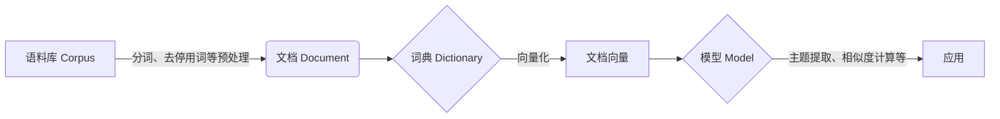

# Gensim 原理与代码实战案例讲解

## 1. 背景介绍
### 1.1 Gensim 概述
Gensim 是一个用于从原始的非结构化文本中自动提取语义主题的 Python 库。它支持包括 TF-IDF、LSA、LDA、Word2Vec 在内的多种主题模型算法,可以处理原始的、非结构化的文本,并高效地将文档转化为语义向量空间,进而使用向量空间模型实现文本相似度计算、信息检索等功能。

### 1.2 Gensim 的优势
- 内存独立性:在内存方面表现出色,即使是在上亿规模的语料库上也能展现出优异的性能。
- 可扩展性:分布式计算,可以在多台机器上并行运行,处理更大规模的语料库。
- 高性能:使用 Cython 等技术优化性能,速度表现优异。
- 易用性:简洁的 API 接口,上手容易。

## 2. 核心概念与联系
### 2.1 语料库(Corpus)
语料库是一系列文档的集合。在 Gensim 中,语料库是指输入到模型中用于训练的文本集合。通常以迭代器的方式输入,每次返回一个可用于训练的文档。

### 2.2 文档(Document)
文档是语料库的基本组成单位。在 Gensim 中,一个文档通常是指一段文本序列,如一个句子、一个段落、一篇文章等。文档经过分词、去停用词等预处理后以稀疏向量的形式输入到模型中。

### 2.3 词典(Dictionary) 
词典是将所有文档中出现的词进行去重后得到的词表。它将每个词映射到一个唯一的整数 id,并记录了词的文档频率。词典可以看作是语料库的词汇表。

### 2.4 向量(Vector)
向量是将文档映射到向量空间后的数学表示。通常使用词袋模型(Bag-of-words),将文档表示为其包含词的权重向量。常见的向量化模型有 TF-IDF、LSA、LDA、Word2Vec 等。

### 2.5 模型(Model) 
模型是 Gensim 中进行主题提取、相似度计算的算法实现。不同的模型可以从不同角度挖掘语料库中蕴含的语义信息。

### 2.6 流程图
下图展示了 Gensim 的核心概念以及它们之间的关系:



## 3. 核心算法原理具体操作步骤
### 3.1 TF-IDF
TF-IDF(Term Frequency-Inverse Document Frequency)是一种简单但有效的向量化算法。它认为一个词对文档的重要性与它在该文档中出现的频率成正比,与它在整个语料库中出现的文档频率成反比。

TF-IDF 的具体计算步骤如下:

1. 计算每个词 t 在文档 d 中的词频 $tf_{t,d}$
2. 计算每个词 t 在整个语料库 D 中的文档频率 $df_t$
3. 计算逆文档频率 $idf_t = \log(\frac{N}{df_t})$,其中 N 为语料库中文档总数
4. 计算词 t 在文档 d 中的权重 $w_{t,d} = tf_{t,d} \times idf_t$

最终得到的文档向量 $\vec{d} = (w_{1,d}, w_{2,d}, ..., w_{n,d})$ 就是 TF-IDF 的结果。

### 3.2 LSA
LSA(Latent Semantic Analysis)是一种基于 SVD 分解的主题模型算法。它通过矩阵分解,将文档从原始的高维词向量空间映射到一个低维的主题向量空间,从而挖掘出词与词、文档与文档之间的隐含语义关系。

LSA 的具体计算步骤如下:

1. 对语料库进行向量化,得到文档-词矩阵 A
2. 对矩阵 A 进行 SVD 分解:$A = U\Sigma V^T$
3. 取前 k 个最大奇异值对应的左奇异向量 $U_k$、右奇异向量 $V_k$ 以及对角矩阵 $\Sigma_k$
4. 文档在主题空间中的表示即为 $D_k = U_k\Sigma_k$,主题-词矩阵为 $T_k = \Sigma_kV_k^T$

通过 LSA 得到的文档主题向量 $D_k$ 可以用于文本相似度计算、信息检索等任务。

### 3.3 LDA
LDA(Latent Dirichlet Allocation)是一种基于概率图模型的主题模型算法。它假设每个文档由多个主题组成,每个主题又由多个词组成。通过估计这些隐含变量的后验分布,可以得到文档的主题分布和主题的词分布。

LDA 的生成过程如下:

1. 从狄利克雷分布 $\alpha$ 中采样出文档 d 的主题分布 $\theta_d$
2. 对于文档 d 中的每个词 w:
   a. 从多项分布 $\theta_d$ 中采样出一个主题 $z$
   b. 从狄利克雷分布 $\beta$ 中采样出主题 z 的词分布 $\phi_z$ 
   c. 从多项分布 $\phi_z$ 中采样出词 w

LDA 的推断过程就是根据观测到的文档 d 和词 w,反推隐含变量 $\theta$ 和 $\phi$ 的后验分布。常用的推断算法有变分推断(Variational Inference)和 Gibbs 采样等。

### 3.4 Word2Vec
Word2Vec 是一种神经网络语言模型,可以学习到词的分布式表示(Distributed Representation),即将词映射到一个低维的连续向量空间中,使得语义相似的词在该空间中距离很近。

Word2Vec 主要有两种模型:CBOW(Continuous Bag-of-Words)和 Skip-gram。

CBOW 模型的训练目标是根据中心词的上下文来预测中心词。其损失函数为:

$$J_\theta = -\frac{1}{T}\sum_{t=1}^T\log p(w_t|w_{t-c},...,w_{t-1},w_{t+1},...,w_{t+c})$$

Skip-gram 模型的训练目标是根据中心词来预测其上下文。其损失函数为:

$$J_\theta = -\frac{1}{T}\sum_{t=1}^T\sum_{-c \leq j \leq c, j \neq 0}\log p(w_{t+j}|w_t)$$

其中 $\theta$ 为模型参数,$c$ 为上下文窗口大小。通过最小化损失函数,可以学习到词向量。

## 4. 数学模型和公式详细讲解举例说明
### 4.1 TF-IDF
假设有如下两个文档:

- d1: "I like to watch movies. I like movies."
- d2: "I like to watch football games."

对于词 "like",它在 d1 中出现了 2 次,在 d2 中出现了 1 次,在整个语料库中出现了 2 个文档。因此:

$$tf_{like,d1} = 2, tf_{like,d2} = 1, df_{like} = 2, idf_{like} = \log(\frac{2}{2}) = 0$$

$$w_{like,d1} = 2 \times 0 = 0, w_{like,d2} = 1 \times 0 = 0$$

可见,虽然 "like" 在 d1 中出现了 2 次,但它对表达 d1 的主题并没有太大作用。

### 4.2 LSA
对于矩阵:

$$A = \begin{bmatrix} 
1 & 2 & 0\\ 
0 & 1 & 1\\
2 & 1 & 3
\end{bmatrix}$$

进行 SVD 分解,取 k=2,得到:

$$U_2 = \begin{bmatrix}
-0.46 & -0.84\\
-0.64 & 0.54\\
-0.62 & 0.03
\end{bmatrix}, \Sigma_2 = \begin{bmatrix}
3.68 & 0\\
0 & 1.86
\end{bmatrix}, V_2 = \begin{bmatrix}
-0.61 & -0.22\\
-0.54 & 0.84\\
-0.58 & -0.50
\end{bmatrix}$$

文档在主题空间的表示为:

$$D_2 = U_2\Sigma_2 = \begin{bmatrix}
-1.69 & -1.56\\
-2.35 & 1.00\\
-2.28 & 0.06 
\end{bmatrix}$$

可见原本 3 维的文档向量被压缩到了 2 维的主题空间,但仍保留了大部分信息。

### 4.3 LDA
假设有 3 个主题,每个主题的词分布和每个文档的主题分布如下:

$$\phi_1 = (0.2, 0.3, 0.5), \phi_2 = (0.5, 0.2, 0.3), \phi_3 = (0.3, 0.5, 0.2)$$

$$\theta_1 = (0.5, 0.2, 0.3), \theta_2 = (0.3, 0.5, 0.2)$$

则文档 1 生成词 w 的概率为:

$$p(w|\theta_1) = 0.5 \times \phi_{1w} + 0.2 \times \phi_{2w} + 0.3 \times \phi_{3w}$$

假设文档 1 的词序列为 $(w_1, w_2, w_3) = (1, 2, 3)$,则其生成概率为:

$$p(w_1,w_2,w_3|\theta_1) = 0.5 \times 0.2 + 0.2 \times 0.2 + 0.3 \times 0.2 = 0.2$$

### 4.4 Word2Vec
假设词表大小为 5,词向量维度为 3,中心词 $w_t$ 的上下文为 $(w_{t-1},w_{t+1})$。CBOW 模型的前向传播过程为:

$$h = \frac{1}{2}(v(w_{t-1}) + v(w_{t+1}))$$
$$u_j = \text{softmax}(W_{out}h)$$

其中 $v(w)$ 为词 $w$ 的输入向量,$W_{out}$ 为输出矩阵。Skip-gram 模型的前向传播过程为:

$$u_j = \text{softmax}(W_{out,j}v(w_t))$$

假设 $w_t$ 的上下文词为 $(w_1,w_2)$,则 Skip-gram 模型的损失函数为:

$$J_\theta = -\log p(w_1|w_t) - \log p(w_2|w_t)$$

通过梯度下降法最小化损失函数,可以学习到词向量。

## 5. 项目实践:代码实例和详细解释说明
下面以 Python 和 Gensim 为例,展示如何进行文本主题提取和相似度计算。

### 5.1 环境准备

```python
import gensim
from gensim import corpora
```

### 5.2 准备语料库

```python
documents = [
    "Human machine interface for lab abc computer applications",
    "A survey of user opinion of computer system response time",
    "The EPS user interface management system",
    "System and human system engineering testing of EPS",
    "Relation of user perceived response time to error measurement",
    "The generation of random binary unordered trees",
    "The intersection graph of paths in trees",
    "Graph minors IV Widths of trees and well quasi ordering",
    "Graph minors A survey"
]
```

### 5.3 文本预处理

```python
# 分词
texts = [[word for word in document.lower().split()] for document in documents]

# 去除停用词
from gensim.parsing.preprocessing import STOPWORDS
texts = [[word for word in text if word not in STOPWORDS] for text in texts]
```

### 5.4 创建词典

```python
dictionary = corpora.Dictionary(texts)
print(dictionary)
```

### 5.5 创建语料库

```python
corpus = [dictionary.doc2bow(text) for text in texts]
print(corpus)
```

### 5.6 TF-IDF 模型

```python
tfidf = gensim.models.TfidfModel(corpus)
corpus_tfidf = tfidf[corpus]
for doc in corpus_tfidf:
    print(doc)
```

### 5.7 LSA 模型

```python
lsa = gensim.models.LsiModel(corpus_tfidf, id2word=dictionary, num_topics=2)
corpus_lsa = lsa[corpus_tfidf]
for doc in corpus_lsa:
    print(