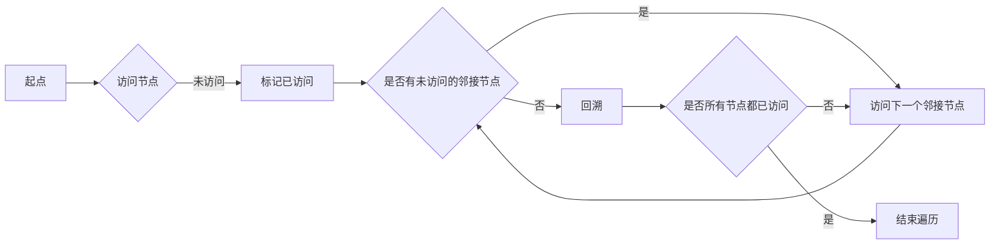

# Graph Traversal图遍历原理与代码实例讲解

## 1.背景介绍
### 1.1 图论基础
#### 1.1.1 图的定义
#### 1.1.2 图的分类
#### 1.1.3 图的表示方法
### 1.2 图遍历的重要性 
#### 1.2.1 图遍历在实际问题中的应用
#### 1.2.2 图遍历算法的研究意义

## 2.核心概念与联系
### 2.1 图遍历的定义
### 2.2 图遍历的分类
#### 2.2.1 广度优先搜索(BFS)  
#### 2.2.2 深度优先搜索(DFS)
### 2.3 BFS与DFS的区别与联系
#### 2.3.1 遍历顺序差异
#### 2.3.2 数据结构使用差异
#### 2.3.3 时间复杂度分析

## 3.核心算法原理具体操作步骤
### 3.1 广度优先搜索(BFS)算法
#### 3.1.1 BFS算法描述
#### 3.1.2 BFS算法流程图
#### 3.1.3 BFS算法复杂度分析
### 3.2 深度优先搜索(DFS)算法  
#### 3.2.1 DFS算法描述
#### 3.2.2 DFS算法流程图  
#### 3.2.3 DFS算法复杂度分析

## 4.数学模型和公式详细讲解举例说明
### 4.1 图的数学表示
#### 4.1.1 邻接矩阵
#### 4.1.2 邻接表
### 4.2 BFS的数学模型 
#### 4.2.1 队列的数学定义
#### 4.2.2 BFS遍历公式推导
### 4.3 DFS的数学模型
#### 4.3.1 栈的数学定义 
#### 4.3.2 DFS遍历公式推导

## 5.项目实践：代码实例和详细解释说明
### 5.1 BFS代码实现
#### 5.1.1 邻接矩阵BFS实现
#### 5.1.2 邻接表BFS实现  
#### 5.1.3 BFS代码解释
### 5.2 DFS代码实现
#### 5.2.1 邻接矩阵DFS实现
#### 5.2.2 邻接表DFS实现
#### 5.2.3 DFS代码解释

## 6.实际应用场景
### 6.1 最短路径问题
#### 6.1.1 问题描述
#### 6.1.2 BFS求解最短路径
### 6.2 连通性问题
#### 6.2.1 问题描述  
#### 6.2.2 DFS判断连通性
### 6.3 拓扑排序
#### 6.3.1 问题描述
#### 6.3.2 基于DFS的拓扑排序算法

## 7.工具和资源推荐
### 7.1 图可视化工具
### 7.2 在线OJ平台 
### 7.3 算法学习资源

## 8.总结：未来发展趋势与挑战
### 8.1 图遍历算法的优化
### 8.2 图遍历在人工智能领域的应用
### 8.3 图遍历算法的并行化

## 9.附录：常见问题与解答
### 9.1 如何选择BFS和DFS？
### 9.2 图遍历算法如何避免重复访问？
### 9.3 图遍历算法能否用于带权图？



图遍历是图论中的基础问题，旨在按照一定的规则，不重不漏地访问图中的每一个节点。常见的图遍历算法包括广度优先搜索(BFS)和深度优先搜索(DFS)。

BFS从起点开始，先访问起点的所有邻接节点，再依次访问这些节点的所有未访问过的邻接节点，直到图中所有节点都被访问到。BFS使用队列来存储待访问的节点，其遍历顺序类似于一层一层地向外扩展，因此又称为层序遍历。

DFS则是从起点开始，沿着一条路径不断深入，直到无法继续为止，然后回溯到上一个节点，再从另一条路径继续深入，直到所有节点都被访问到。DFS使用栈来存储待访问的节点，其遍历顺序是沿着一条路径走到底，再回溯回来。

下面是BFS和DFS的示例代码，以邻接表形式存储的无向图为例：

```cpp
// BFS 
vector<int> bfs(vector<vector<int>>& graph, int start) {
    vector<int> res;
    vector<bool> visited(graph.size(), false);
    queue<int> q;
    
    visited[start] = true;
    q.push(start);
    
    while (!q.empty()) {
        int node = q.front();
        q.pop();
        res.push_back(node);
        
        for (int neighbor : graph[node]) {
            if (!visited[neighbor]) {
                visited[neighbor] = true;
                q.push(neighbor);
            }
        }
    }
    
    return res;
}

// DFS
vector<int> dfs(vector<vector<int>>& graph, int start) {
    vector<int> res;
    vector<bool> visited(graph.size(), false);
    stack<int> stk;
    
    stk.push(start);
    
    while (!stk.empty()) {
        int node = stk.top();
        stk.pop();
        
        if (!visited[node]) {
            visited[node] = true;
            res.push_back(node);
            
            for (int neighbor : graph[node]) {
                if (!visited[neighbor]) {
                    stk.push(neighbor);
                }
            }
        }
    }
    
    return res;
}
```

图遍历在实际问题中有广泛的应用，例如在地图应用中寻找最短路径，在网络爬虫中抓取所有可达的网页，在社交网络中寻找好友关系等。掌握图遍历算法，对于提高编程能力和算法思维有重要意义。

未来图遍历算法还有很大的优化空间，如何进一步降低时间复杂度和空间复杂度是一个持续的研究方向。此外，图遍历算法在人工智能领域也有重要应用，如知识图谱的构建、推理等。随着图数据规模的增大，图遍历算法的并行化也是一个值得关注的方向。

总之，图遍历是图论的基础，也是算法的重要内容。深入理解和掌握图遍历算法，对于提高编程能力和解决实际问题都有重要意义。

作者：禅与计算机程序设计艺术 / Zen and the Art of Computer Programming