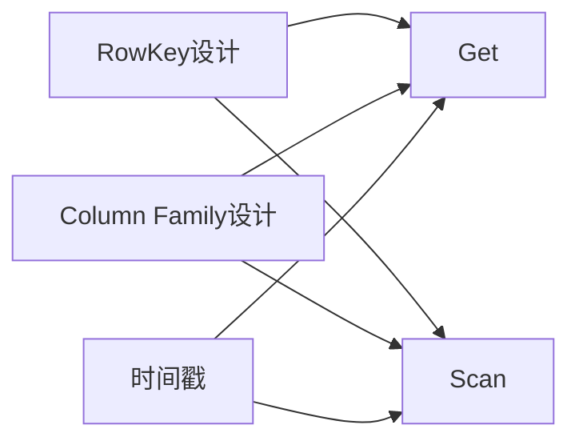

# HBase最佳实践:Scan与Get的高级用法

## 1.背景介绍
### 1.1 HBase简介
HBase是一个高可靠性、高性能、面向列、可伸缩的分布式存储系统,利用HBase技术可在廉价PC Server上搭建起大规模结构化存储集群。

### 1.2 HBase的数据模型
HBase的数据模型与关系型数据库有很大的不同。HBase是一个稀疏、多维度、排序的映射表,这张表的索引是行键、列族、列限定符和时间戳。

### 1.3 HBase的读取方式
HBase提供了两种主要的数据读取方式:单行读取(Get)和范围扫描(Scan)。Get和Scan是在海量数据下进行查询的重要手段,高效地使用它们可以极大提升系统性能。

## 2.核心概念与联系
### 2.1 RowKey的设计 
RowKey是HBase表的主键,通过RowKey可以快速定位到某行数据。RowKey的设计很大程度上决定了HBase的读写性能。

### 2.2 Column Family的设计
HBase的表在水平方向有一个或多个Column Family。一个Column Family是一组列的集合,列的成员是动态的。Column Family需要在表创建时指定,之后不能轻易修改。

### 2.3 时间戳
HBase通过时间戳来标识数据的不同版本。时间戳默认是系统时间,也可以由用户显式指定。

### 2.4 Get与Scan的区别
- Get用于获取单行数据,需要指定完整的RowKey。 
- Scan用于获取多行数据,可以指定RowKey的范围。

它们之间的关系可以用下面的Mermaid图来表示:



## 3.核心算法原理具体操作步骤
### 3.1 Get的基本用法
Get用于获取单行数据。使用Get时,需要指定表名和完整的RowKey。

```java
Get get = new Get(Bytes.toBytes("row1"));
Result result = table.get(get);
```

### 3.2 Scan的基本用法  
Scan用于获取多行数据。使用Scan时,需要指定表名和RowKey的范围。

```java
Scan scan = new Scan();
scan.withStartRow(Bytes.toBytes("row1")); 
scan.withStopRow(Bytes.toBytes("row100"));
ResultScanner scanner = table.getScanner(scan);
```

### 3.3 指定Column Family和Column
Get和Scan都可以指定要查询的Column Family和Column,这样可以减少网络传输数据量。

```java
Get get = new Get(Bytes.toBytes("row1"));
get.addColumn(Bytes.toBytes("cf"), Bytes.toBytes("col1"));

Scan scan = new Scan();
scan.addColumn(Bytes.toBytes("cf"), Bytes.toBytes("col1"));
```

### 3.4 指定时间戳
Get和Scan可以指定查询的时间戳范围,返回的结果只包含这个时间范围内的数据版本。

```java
Get get = new Get(Bytes.toBytes("row1"));
get.setTimeRange(1000L, 2000L);

Scan scan = new Scan();
scan.setTimeRange(1000L, 2000L);
```

### 3.5 限制返回版本数
Get和Scan可以限制返回的最大版本数,减少数据传输量。

```java
Get get = new Get(Bytes.toBytes("row1"));
get.setMaxVersions(1);

Scan scan = new Scan();
scan.setMaxVersions(1);
```

## 4.数学模型和公式详细讲解举例说明
HBase的性能优化很大程度上依赖于RowKey的设计。一个好的RowKey设计需要考虑数据的访问模式,使相关的行在物理上也相邻,提高数据局部性。

假设我们有一张用户表,存储了用户的基本信息。我们希望RowKey能够支持如下的查询模式:
1. 根据用户ID查询用户信息
2. 查询某个省份的所有用户
3. 查询某个省份某个年龄段的用户

我们可以将RowKey设计为如下格式:

$RowKey = MD5(Province + City + UserID)$

其中,MD5是一个哈希函数,可以将任意长度的输入映射到固定长度的输出。通过这种设计,相同省份的用户在RowKey上具有相同的前缀,物理上存储在相邻的位置。查询时,可以利用RowKey的前缀过滤,快速定位到目标数据。

如果还希望支持根据年龄段查询,可以在RowKey中添加年龄信息:

$RowKey = MD5(Province + City + Age + UserID)$

这样,相同省份、相同年龄段的用户在RowKey上也具有相同的前缀。查询时可以利用Scan的startRow和stopRow参数,限定RowKey的范围。

## 5.项目实践：代码实例和详细解释说明
下面是一个使用Get和Scan读取数据的完整示例:

```java
// 创建连接
Configuration config = HBaseConfiguration.create();
Connection connection = ConnectionFactory.createConnection(config);
Table table = connection.getTable(TableName.valueOf("user_table"));

// 单行读取
Get get = new Get(Bytes.toBytes("row1"));
get.addColumn(Bytes.toBytes("cf"), Bytes.toBytes("name"));
get.setMaxVersions(1);
Result getResult = table.get(get);
String name = Bytes.toString(getResult.getValue(Bytes.toBytes("cf"), Bytes.toBytes("name")));
System.out.println("Get Result: " + name);

// 范围扫描  
Scan scan = new Scan();
scan.withStartRow(Bytes.toBytes("row10"));
scan.withStopRow(Bytes.toBytes("row20"));  
scan.addColumn(Bytes.toBytes("cf"), Bytes.toBytes("age"));
scan.setMaxVersions(1);
ResultScanner scanner = table.getScanner(scan);
for (Result scanResult : scanner) {
    String rowKey = Bytes.toString(scanResult.getRow());
    int age = Bytes.toInt(scanResult.getValue(Bytes.toBytes("cf"), Bytes.toBytes("age")));
    System.out.println("Scan Result: " + rowKey + ", Age: " + age);
}

// 关闭连接
scanner.close();
table.close();
connection.close();
```

这个示例首先创建了HBase连接和表对象。然后演示了Get和Scan的用法:

- Get示例指定了要读取的RowKey、Column Family、Column Qualifier和最大版本数。 
- Scan示例指定了RowKey的范围、Column Family、Column Qualifier和最大版本数。

最后,关闭Scan结果集、表和连接,释放资源。

## 6.实际应用场景
Get和Scan在实际应用中有广泛的使用场景,下面列举几个典型的例子:

### 6.1 用户画像
在电商、社交等领域,通常需要构建用户画像,存储用户的各种属性标签。使用HBase存储用户画像数据,可以支持快速的属性查询和更新。

### 6.2 时序数据
HBase非常适合存储时序数据,如物联网传感器数据、监控数据等。每个RowKey对应一个时间点,Column对应不同的指标。可以使用Scan读取一段时间内的数据。

### 6.3 推荐系统
推荐系统需要存储用户的历史行为数据,如浏览、点击、购买等。将这些数据存储在HBase中,可以方便地根据用户ID或者物品ID进行查询和分析。

## 7.工具和资源推荐
### 7.1 HBase Shell
HBase Shell是HBase的命令行工具,可以用于表管理、数据操作等。适合在开发调试阶段使用。

### 7.2 HBase REST API
HBase提供了RESTful API,可以通过HTTP请求操作HBase。这对于非Java语言的应用集成很有帮助。

### 7.3 Apache Phoenix
Phoenix是构建在HBase之上的SQL层,可以使用标准的SQL语法查询HBase数据。对于复杂的查询场景,使用Phoenix可以大大简化开发。

### 7.4 Cloudera Manager
Cloudera Manager是大数据平台的管理工具,提供了对HBase集群的部署、监控、诊断等功能,是运维HBase不可或缺的利器。

## 8.总结：未来发展趋势与挑战
HBase作为NoSQL数据库的代表,在大数据时代有着广阔的应用前景。未来HBase的发展趋势和面临的挑战主要有:

### 8.1 与云平台的深度整合
越来越多的企业将数据平台迁移到云上。HBase需要与各种云平台(如AWS、阿里云等)进行深度整合,提供更多的管理和优化功能。

### 8.2 SQL化 
为了降低使用门槛,HBase需要提供更友好的SQL支持。除了Phoenix,社区还在探索其他的SQL on HBase方案。

### 8.3 与机器学习平台的结合
HBase作为海量数据存储,可以为机器学习平台提供数据支撑。需要在数据格式、API等方面,与机器学习平台进行更紧密的结合。

### 8.4 多模融合
除了结构化数据,HBase还需要支持非结构化数据,如图片、视频等。多模融合是HBase需要探索的重要方向。

## 9.附录：常见问题与解答
### 9.1 如何选择合适的RowKey?
RowKey的选择需要考虑数据的访问模式。一般原则是:
- RowKey要能够唯一标识一行数据
- 相关的行在RowKey上应该有相同的前缀,物理上连续存储
- RowKey要尽量短小,减少存储空间

### 9.2 如何解决RowKey热点问题?
热点问题是指某些RowKey的访问量远大于其他RowKey,导致负载不均衡。解决方法包括:
- 在RowKey前面添加随机前缀,打散热点
- 将热点RowKey拆分成多个RowKey
- 调整表的Region分布,将热点Region分散到不同的服务器

### 9.3 如何控制存储的版本数?
HBase支持多版本,默认为1。可以在创建表时,通过`VERSIONS`参数指定每个列族的最大版本数。也可以在Get或Scan操作时,通过`setMaxVersions`方法指定读取的最大版本数。

### 9.4 HBase的二级索引方案有哪些?
HBase原生不支持二级索引。常见的二级索引方案有:
- 维护一张索引表,存储二级索引到RowKey的映射
- 使用Coprocessor实现索引
- 使用Phoenix的二级索引功能
- 使用Solr、ES等外部索引方案

以上就是关于HBase的Get和Scan的高级用法的全面介绍。希望这些知识能够帮助你更好地使用HBase,发挥其在大数据存储和分析中的巨大作用。

作者：禅与计算机程序设计艺术 / Zen and the Art of Computer Programming