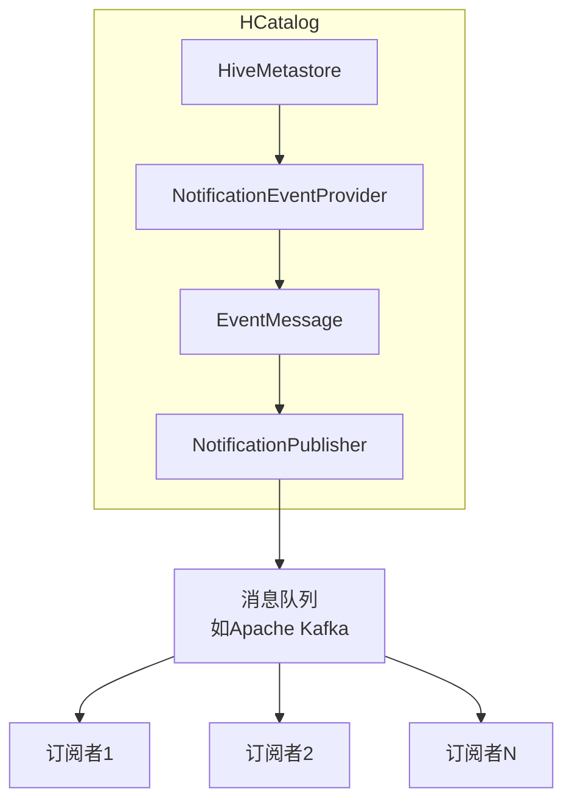

# HCatalog Notification机制原理与代码实例讲解

## 1. 背景介绍

在大数据生态系统中,Apache Hive作为数据仓库的核心组件,为海量数据的存储和查询提供了强大的支持。然而,随着数据量的不断增长和业务需求的不断变化,单纯依赖Hive进行数据处理已经无法满足现代数据架构的需求。因此,HCatalog应运而生,作为Hive的一个重要补充,它提供了一种统一的元数据管理服务,使得不同的数据处理系统能够共享和访问相同的数据集。

HCatalog的一个关键特性就是Notification机制,它允许其他系统订阅Hive元数据的变化事件,并在发生变化时得到实时通知。这种机制不仅提高了数据处理的效率,还增强了系统的可扩展性和灵活性。本文将深入探讨HCatalog Notification机制的原理和实现,并通过代码示例帮助读者更好地理解和应用这一强大功能。

## 2. 核心概念与联系

### 2.1 HCatalog简介

HCatalog是Apache Hive的一个子项目,旨在为不同的数据处理系统提供统一的元数据管理服务。它允许用户在Hive中定义表结构,并将这些元数据信息共享给其他系统,如Apache Pig、Apache MapReduce等。这样,不同的系统就可以访问和处理相同的数据集,而无需重复定义表结构。

HCatalog的核心组件包括:

- **HCatLoader**: 用于将数据加载到Hive表中。
- **HCatOutputFormat**: 用于将MapReduce作业的输出数据写入Hive表。
- **HCatInputFormat**: 用于从Hive表中读取数据,作为MapReduce作业的输入。
- **HCatRecordReader**: 用于解析Hive表中的数据格式。
- **HCatRecordWriter**: 用于将数据写入Hive表的特定格式。

### 2.2 Notification机制概述

HCatalog Notification机制允许其他系统订阅Hive元数据的变化事件,例如创建、修改或删除表、分区等操作。当这些事件发生时,HCatalog会实时通知已订阅的系统,使它们能够及时响应元数据的变化。

这种机制的核心思想是将元数据变化事件存储在一个可靠的消息队列中,例如Apache Kafka。订阅系统可以从消息队列中读取事件,并根据需要执行相应的操作,如更新本地缓存或触发下游处理流程。

Notification机制的主要优势包括:

1. **实时性**: 元数据变化可以被及时捕获和处理,提高了系统的响应能力。
2. **解耦性**: 发布者(Hive)和订阅者(其他系统)之间实现了解耦,增强了系统的可扩展性和灵活性。
3. **可靠性**: 依赖于可靠的消息队列,确保事件不会丢失。
4. **扩展性**: 新的订阅者可以轻松加入,无需修改Hive的代码。

### 2.3 Notification机制架构

HCatalog Notification机制的架构如下所示:



1. **HiveMetastore**: Hive的元数据存储,记录了表、分区等信息。
2. **NotificationEventProvider**: 监视HiveMetastore中的元数据变化,并将变化事件封装成EventMessage对象。
3. **EventMessage**: 表示元数据变化事件的数据结构,包含事件类型、表名、分区信息等。
4. **NotificationPublisher**: 将EventMessage发布到消息队列中。
5. **MessageBroker**: 可靠的消息队列,如Apache Kafka。
6. **NotificationSubscriber**: 订阅消息队列,接收并处理元数据变化事件。

整个流程如下:

1. 当Hive元数据发生变化时,NotificationEventProvider会捕获这些变化事件。
2. NotificationEventProvider将事件封装成EventMessage对象。
3. NotificationPublisher将EventMessage发布到消息队列中。
4. 订阅了该消息队列的NotificationSubscriber会接收到EventMessage。
5. NotificationSubscriber根据事件类型和内容,执行相应的操作,如更新本地缓存或触发下游处理流程。

## 3. 核心算法原理具体操作步骤

HCatalog Notification机制的核心算法原理可以概括为以下几个步骤:

### 3.1 事件捕获

NotificationEventProvider通过监听HiveMetastore的事件流,捕获元数据变化事件。具体来说,它会订阅以下几种事件:

- **CREATE_TABLE**: 创建新表。
- **ALTER_TABLE**: 修改表结构。
- **DROP_TABLE**: 删除表。
- **ADD_PARTITION**: 添加新分区。
- **ALTER_PARTITION**: 修改分区信息。
- **DROP_PARTITION**: 删除分区。

对于每一种事件类型,NotificationEventProvider都会执行相应的处理逻辑,从HiveMetastore中提取相关信息,并封装成EventMessage对象。

### 3.2 事件发布

NotificationPublisher负责将EventMessage发布到消息队列中。它首先需要初始化一个消息生产者(Producer),连接到消息队列服务器。然后,它会将EventMessage序列化为字节数组,并通过生产者发送到指定的主题(Topic)中。

为了确保消息的可靠性,NotificationPublisher通常会设置一些关键参数,如消息确认模式(Acknowledgment)、重试次数等。这样可以避免由于网络故障或服务器宕机而导致的消息丢失。

### 3.3 事件订阅

NotificationSubscriber作为消费者(Consumer),需要先连接到消息队列服务器,并订阅感兴趣的主题。一旦有新的EventMessage到达,消费者就会接收到消息,并对其进行反序列化,还原为EventMessage对象。

根据EventMessage中的事件类型和内容,NotificationSubscriber可以执行不同的操作,如更新本地缓存、触发下游处理流程等。例如,对于CREATE_TABLE事件,订阅者可能需要在本地创建一个与Hive表结构相同的表;对于DROP_PARTITION事件,订阅者可能需要删除本地缓存中对应的分区数据。

### 3.4 事件重新传递

在某些情况下,NotificationSubscriber可能由于各种原因(如网络故障、服务器宕机等)而无法及时处理事件。为了避免事件丢失,消息队列通常会保留一段时间的消息历史记录。因此,NotificationSubscriber可以从消息队列中重新获取遗漏的事件,并进行重新处理。

这种事件重新传递机制确保了系统的可靠性和一致性,即使发生故障,也不会导致数据丢失或不一致。

## 4. 数学模型和公式详细讲解举例说明

在HCatalog Notification机制中,虽然没有直接涉及复杂的数学模型,但是在实现可靠的事件传递时,需要考虑一些概率模型和公式。

### 4.1 消息确认模式

消息队列通常提供多种消息确认模式(Acknowledgment),用于控制消息的可靠性和性能之间的权衡。Apache Kafka中常用的确认模式包括:

- **acks=0**: 生产者不等待任何确认,这种模式提供了最低的延迟,但也存在消息丢失的风险。
- **acks=1**: 生产者只需要等待集群的领导者(Leader)确认即可,这种模式提供了较低的延迟,但如果领导者宕机,仍然可能导致消息丢失。
- **acks=all**: 生产者需要等待集群中所有副本(Replica)都确认,这种模式提供了最高的可靠性,但延迟也最高。

假设集群中有N个副本,每个副本的可用性为p,那么在acks=all模式下,消息成功传递的概率为:

$$P_{success} = p^N$$

可以看出,随着副本数量N的增加,消息成功传递的概率会呈指数级下降。因此,在设置确认模式时,需要权衡可靠性和性能的要求。

### 4.2 重试次数

为了提高消息传递的可靠性,生产者通常会设置一定的重试次数。假设每次重试的成功概率为p,重试次数为n,那么最终消息成功传递的概率为:

$$P_{success} = 1 - (1 - p)^{n+1}$$

可以看出,随着重试次数n的增加,消息成功传递的概率也会逐渐增加,但增长速度会逐渐放缓。因此,在设置重试次数时,需要权衡可靠性和性能开销。

### 4.3 消息堆积

在高负载场景下,消息队列可能会出现消息堆积的情况,即生产者的发送速度远远大于消费者的消费速度。这种情况下,消息队列需要提供足够的缓冲空间,以避免消息丢失。

假设消息队列的缓冲空间大小为M,生产者的发送速率为λ,消费者的消费速率为μ,那么消息堆积的概率可以用排队理论中的M/M/1/M模型来描述:

$$P_{queue} = \frac{(1 - \rho)\rho^M}{1 - \rho^{M+1}}$$

其中,ρ=λ/μ表示系统的利用率。可以看出,当利用率ρ接近1时,消息堆积的概率会急剧增加。因此,在设计消息队列时,需要合理评估系统的吞吐量,并提供足够的缓冲空间。

## 5. 项目实践: 代码实例和详细解释说明

为了更好地理解HCatalog Notification机制的实现,我们将提供一个基于Apache Kafka的代码示例。该示例包括NotificationPublisher和NotificationSubscriber两个部分,分别模拟了事件的发布和订阅过程。

### 5.1 NotificationPublisher

NotificationPublisher负责将元数据变化事件发布到Kafka主题中。下面是一个简化版本的Java代码示例:

```java
import org.apache.kafka.clients.producer.KafkaProducer;
import org.apache.kafka.clients.producer.ProducerRecord;

import java.util.Properties;

public class NotificationPublisher {
    private static final String TOPIC = "hcatalog-notifications";
    private static final String BOOTSTRAP_SERVERS = "localhost:9092";

    public static void main(String[] args) {
        // 配置Kafka生产者属性
        Properties props = new Properties();
        props.put("bootstrap.servers", BOOTSTRAP_SERVERS);
        props.put("key.serializer", "org.apache.kafka.common.serialization.StringSerializer");
        props.put("value.serializer", "org.apache.kafka.common.serialization.StringSerializer");

        // 创建Kafka生产者实例
        KafkaProducer<String, String> producer = new KafkaProducer<>(props);

        // 模拟元数据变化事件
        String eventMessage = "CREATE_TABLE:default.my_table";

        // 发送事件消息到Kafka主题
        ProducerRecord<String, String> record = new ProducerRecord<>(TOPIC, eventMessage);
        producer.send(record);

        // 关闭生产者
        producer.flush();
        producer.close();
    }
}
```

代码解释:

1. 首先配置Kafka生产者的属性,包括Bootstrap服务器地址、键值序列化器等。
2. 创建KafkaProducer实例。
3. 模拟一个元数据变化事件,假设是创建一个名为"my_table"的表。
4. 将事件消息封装成ProducerRecord对象,并发送到Kafka主题"hcatalog-notifications"中。
5. 最后关闭生产者实例。

### 5.2 NotificationSubscriber

NotificationSubscriber作为消费者,订阅Kafka主题,接收并处理元数据变化事件。下面是一个简化版本的Java代码示例:

```java
import org.apache.kafka.clients.consumer.ConsumerRecord;
import org.apache.kafka.clients.consumer.ConsumerRecords;
import org.apache.kafka.clients.consumer.KafkaConsumer;

import java.time.Duration;
import java.util.Collections;
import java.util.Properties;

public class NotificationSubscriber {
    private static final String TOPIC = "hcatalog-notifications";
    private static final String BOOTSTRAP_SERVERS = "localhost:9092";
    private static final String GROUP_ID = "my-group";

    public static void main(String[] args) {
        // 配置Kafka消费者属性
        Properties props = new Properties();
        props.put("bootstrap.servers", BOOTSTRAP_SERVERS);
        props.