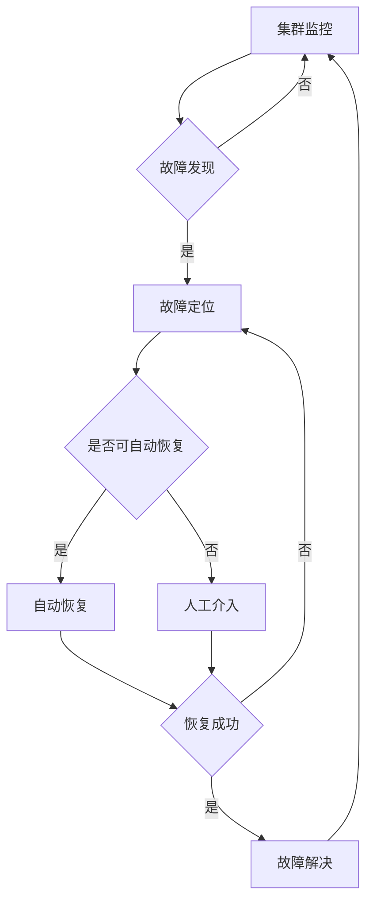

# Hadoop故障排除：应对突发状况

## 1.背景介绍
### 1.1 Hadoop的重要性
### 1.2 Hadoop集群故障的严重影响
### 1.3 故障排除的必要性和紧迫性

## 2.核心概念与联系
### 2.1 Hadoop核心组件
#### 2.1.1 HDFS分布式文件系统
#### 2.1.2 MapReduce分布式计算框架 
#### 2.1.3 YARN资源管理器
### 2.2 组件间的关系和依赖
### 2.3 常见故障类型
#### 2.3.1 HDFS故障
#### 2.3.2 MapReduce故障
#### 2.3.3 YARN故障

## 3.核心算法原理具体操作步骤
### 3.1 故障检测算法
#### 3.1.1 心跳机制
#### 3.1.2 阈值判断
#### 3.1.3 故障报告
### 3.2 故障定位算法
#### 3.2.1 根因分析
#### 3.2.2 关联分析
#### 3.2.3 日志分析
### 3.3 故障恢复算法  
#### 3.3.1 重启服务
#### 3.3.2 数据恢复
#### 3.3.3 任务重试

## 4.数学模型和公式详细讲解举例说明
### 4.1 故障检测模型
#### 4.1.1 心跳超时模型
$Timeout(t) = \begin{cases}
1, & t > threshold \\
0, & t \leq threshold
\end{cases}$
#### 4.1.2 异常阈值模型
$Anomaly(x) = \begin{cases}
1, & x > \mu + k\sigma \quad or \quad x < \mu - k\sigma \\
0, & otherwise
\end{cases}$
### 4.2 故障定位模型
#### 4.2.1 根因分析模型
$RootCause = argmax_{c \in C} P(c|e_1,e_2,...,e_n)$
#### 4.2.2 关联规则挖掘
$Support(A \Rightarrow B) = P(A \cup B)$ 
$Confidence(A \Rightarrow B) = P(B|A)$
### 4.3 故障恢复模型
#### 4.3.1 指数回退重试
$Interval_n = InitialInterval * BackoffFactor^{n-1}$
#### 4.3.2 数据修复优先级
$Priority(block) = \alpha * Size(block) + \beta * AccessFrequency(block)$

## 5.项目实践：代码实例和详细解释说明
### 5.1 HDFS故障排除
#### 5.1.1 NameNode故障恢复
```java
// 启动备用NameNode
$ hadoop-daemon.sh start namenode -backup
// 将备用NameNode转为Active
$ hdfs haadmin -failover --forcefence --forceactive nn2 nn1
```
#### 5.1.2 DataNode故障处理
```bash
# 检查DataNode进程
$ jps | grep DataNode
# 若DataNode未启动，则手动重启  
$ hadoop-daemon.sh start datanode
```
### 5.2 MapReduce故障排除
#### 5.2.1 任务重试和推测执行
```xml
<!-- 配置任务最大失败重试次数 -->
<property>
  <name>mapreduce.map.maxattempts</name>
  <value>4</value>
</property>
<property>  
  <name>mapreduce.reduce.maxattempts</name>
  <value>4</value>
</property>

<!-- 开启推测执行 --> 
<property>
  <name>mapreduce.map.speculative</name>
  <value>true</value>
</property>
<property>
  <name>mapreduce.reduce.speculative</name>  
  <value>true</value>
</property>
```
#### 5.2.2 诊断和分析工具
```bash
# 查看任务日志
$ yarn logs -applicationId <app_id> 

# 分析任务计数器
$ yarn app -status <app_id>
```
### 5.3 YARN故障排除
#### 5.3.1 NodeManager故障恢复
```bash
# 检查NodeManager状态
$ yarn node -list -states LOST 
# 重启NodeManager
$ yarn-daemon.sh start nodemanager
```
#### 5.3.2 ApplicationMaster故障转移
```bash
# 检查ApplicationMaster状态
$ yarn application -list 
# 杀死失败的ApplicationMaster  
$ yarn application -kill <app_id>
# 客户端重新提交应用
```

## 6.实际应用场景
### 6.1 电商大数据平台
#### 6.1.1 双11大促期间故障应急预案
#### 6.1.2 故障实时监控和快速定位
#### 6.1.3 关键任务容错和恢复
### 6.2 车联网数据处理
#### 6.2.1 海量车辆数据实时接入
#### 6.2.2 数据丢失和延迟检测
#### 6.2.3 节点动态扩容和数据再平衡
### 6.3 金融风控系统
#### 6.3.1 模型训练任务的容错
#### 6.3.2 风险事件的及时发现和处置
#### 6.3.3 历史数据的灾备和恢复

## 7.工具和资源推荐
### 7.1 集群监控工具
#### 7.1.1 Ganglia
#### 7.1.2 Nagios
#### 7.1.3 Zabbix
### 7.2 故障诊断工具
#### 7.2.1 Hadoop Web UI  
#### 7.2.2 Yarn Health Check
#### 7.2.3 Hadoop Vaidya
### 7.3 数据恢复工具
#### 7.3.1 HDFS FSCK
#### 7.3.2 HDFS Image Viewer
#### 7.3.3 HBase HBCK

## 8.总结：未来发展趋势与挑战
### 8.1 Hadoop生态系统的快速演进 
### 8.2 新硬件技术带来的机遇和挑战
### 8.3 数据规模和业务复杂度的持续增长
### 8.4 智能化运维和故障自愈的需求

## 9.附录：常见问题与解答
### 9.1 如何应对HDFS数据倾斜导致的故障？
### 9.2 MapReduce任务反复失败怎么办？
### 9.3 YARN资源不足如何扩容和调优？
### 9.4 集群安全漏洞如何修复？
### 9.5 如何制定Hadoop故障应急预案？



Hadoop作为大数据处理的事实标准，在各行各业得到了广泛应用。但同时，Hadoop集群规模越大，发生故障的风险也就越高。及时发现故障、准确定位根因、快速恢复数据和服务，是保障Hadoop稳定运行的关键。

本文系统梳理了Hadoop故障排除的核心概念、常见故障类型、关键算法、实用工具和最佳实践。通过理论与实践相结合，案例与代码并重的方式，为读者提供了一个全面的Hadoop故障排除指南。

展望未来，Hadoop生态系统还将持续演进，数据规模和业务复杂度还会不断提升，对故障排除提出更高要求。智能化运维、故障自愈、混合云环境将成为大势所趋。无论技术如何发展，保持故障敏感性，遵循故障排除的基本思路和方法，提高故障应对的实战能力，将使我们能够从容应对Hadoop的各种突发状况，让大数据应用稳定高效地运行下去。

作者：禅与计算机程序设计艺术 / Zen and the Art of Computer Programming