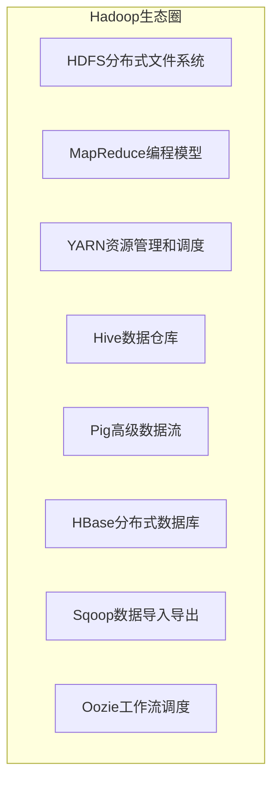
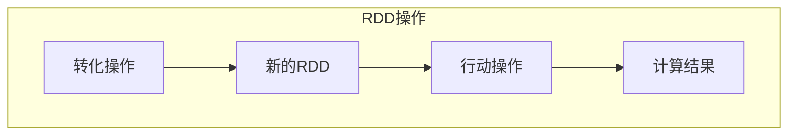
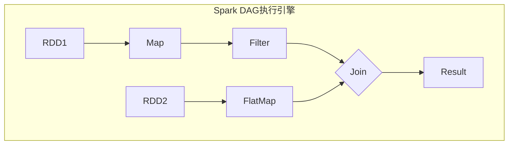
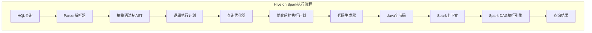

# HiveonSpark：批处理数据分析

## 1.背景介绍

### 1.1 大数据时代的到来

随着互联网、物联网、云计算等新兴技术的飞速发展,数据呈现出爆炸式增长。根据IDC(International Data Corporation)的预测,到2025年全球数据总量将达到175ZB(1ZB=1万亿TB)。传统的数据处理方式已经无法满足海量数据的存储和计算需求,大数据时代已经到来。

### 1.2 大数据处理的挑战

大数据处理面临着诸多挑战:

- **数据量大**:单机无法存储和处理如此庞大的数据
- **数据种类多**:结构化数据、半结构化数据、非结构化数据等
- **数据价值密度低**:有价值的数据稀缺,需要从海量数据中提取
- **数据流动性强**:数据来源多样,持续不断产生新数据

### 1.3 大数据处理框架的需求

为了解决大数据带来的挑战,需要一种全新的大数据处理框架,具有以下特点:

- **高扩展性**:能够通过增加节点来线性扩展计算能力
- **高容错性**:能够自动容错,避免单点故障导致整个系统瘫痪
- **高吞吐量**:能够高效处理海量数据
- **低延迟**:对于批处理和流处理均有较低的延迟

## 2.核心概念与联系

### 2.1 Hadoop生态圈

Apache Hadoop是一个开源的大数据分布式处理框架,由Apache软件基金会开发和维护。它主要包括以下几个核心组件:

- **HDFS**(Hadoop分布式文件系统):一个高可靠、高吞吐量的分布式文件系统
- **MapReduce**:一种编程模型,用于大规模数据集的并行处理
- **YARN**(Yet Another Resource Negotiator):一种新的资源管理和调度框架

Hadoop生态圈还包括了其他很多重要的项目,比如Hive、Pig、HBase、Sqoop、Oozie等,共同构建了一个强大的大数据处理平台。

### 2.2 Spark简介

Apache Spark是一种基于内存计算的快速、通用的大数据分析引擎。相比Hadoop MapReduce,Spark具有以下优势:

- **快速**:基于内存计算,运行速度比Hadoop MapReduce快100倍以上
- **通用**:不仅支持批处理,还支持流处理、机器学习、图计算等多种计算模型
- **易用**:提供了Python、Java、Scala、R等多种语言的API
- **容错**:基于RDD(Resilient Distributed Dataset)的容错机制

Spark可以与Hadoop无缝集成,支持读写HDFS、HBase等数据源,充分利用Hadoop生态圈的优势。

### 2.3 Hive简介

Apache Hive是基于Hadoop的一个数据仓库工具,可以将结构化的数据文件映射为一张数据库表,并提供类SQL的查询语言HQL(Hive Query Language)来管理和查询数据。Hive支持多种数据格式,包括TextFile、SequenceFile、RCFile、ORC等。

Hive最初是基于MapReduce的批处理查询引擎,查询延迟较高。后来Hive引入了Tez和Spark两种执行引擎,大幅提高了查询性能。

### 2.4 Hive on Spark

Hive on Spark是指将Spark作为Hive的执行引擎,用来执行Hive查询。相比原来的MapReduce执行引擎,Hive on Spark具有以下优势:

- **查询性能更快**:充分利用了Spark的内存计算和DAG执行引擎
- **延迟更低**:避免了MapReduce启动Job的开销
- **资源利用率更高**:Spark的有效缓存和高并发特性
- **支持更多功能**:Spark SQL的丰富功能,如窗口函数等

Hive on Spark是当前大数据批处理分析的主流方案,结合了Hive的SQL友好性和Spark的高性能特点。

## 3.核心算法原理具体操作步骤

### 3.1 Spark核心概念

#### 3.1.1 RDD

RDD(Resilient Distributed Dataset)是Spark的核心数据抽象,是一个不可变、分区的记录集合。RDD具有以下特点:

- **不可变**:RDD中的数据在整个计算过程中是只读的,不会被修改
- **分区**:RDD中的数据被划分为多个分区,可以在集群中的多个节点上并行计算
- **容错**:RDD采用了基于血统(Lineage)的容错机制,可以通过重新计算来恢复丢失的数据分区
- **延迟计算**:RDD是一个逻辑执行计划,只有在需要计算结果时才会真正执行

#### 3.1.2 转化操作和行动操作

RDD支持两种操作:转化操作(Transformation)和行动操作(Action)。

- **转化操作**:从现有RDD创建一个新的RDD,比如map、filter、flatMap等
- **行动操作**:在RDD上触发计算,并返回结果,比如count、collect、reduce等

转化操作是延迟计算的,只有在遇到行动操作时,才会触发实际的计算。这种设计可以让Spark构建出高效的执行计划。

#### 3.1.3 DAG执行引擎

Spark将RDD上的操作转化为一个有向无环图DAG(Directed Acyclic Graph),通过DAG执行引擎高效地执行这些操作。

DAG执行引擎具有以下优势:

- **管道化**:将多个操作合并为一个任务,减少了任务调度和数据传输的开销
- **基于数据本地性**:优先将任务分配到存有相应数据的节点上,减少了数据传输
- **有向无环**:避免了死锁等并发问题
- **基于Stage的执行**:将DAG划分为多个Stage,每个Stage是一个任务集合

### 3.2 Hive on Spark执行流程

当使用Hive on Spark执行HQL查询时,整个执行流程如下:

1. **Parser解析器**将HQL查询语句解析为抽象语法树AST
2. 将AST转换为逻辑执行计划(LogicalPlan)
3. **查询优化器**对逻辑执行计划进行优化,生成优化后的执行计划
4. **代码生成器**将优化后的执行计划转换为Java字节码
5. 通过SparkContext将Java字节码提交给Spark集群执行
6. Spark的**DAG执行引擎**高效执行查询计划,得到最终结果

### 3.3 Hive on Spark查询优化

Hive on Spark支持多种查询优化策略,以提高查询性能:

#### 3.3.1 谓词下推优化

将查询条件(WHERE/FILTER)下推到数据源,避免加载不需要的数据。

#### 3.3.2 列剪裁优化  

只读取查询中需要的列,减少数据读取量。

#### 3.3.3 分区剪裁优化

根据分区条件过滤掉不需要的分区,避免扫描整个表。

#### 3.3.4 投射剪裁优化

在聚合之前先做投影操作,减少聚合的数据量。

#### 3.3.5 Join重排序优化

对多表Join按照代价从小到大排序,减少中间结果的大小。

#### 3.3.6 常量折叠优化

将查询中的常量表达式预先计算,减少运行时的计算量。

#### 3.3.7 子查询去关联优化

将子查询转化为Join操作,避免子查询的重复执行。

## 4.数学模型和公式详细讲解举例说明

在大数据分析中,常常需要使用一些数学模型和公式,下面将详细讲解几个常用的模型和公式。

### 4.1 TF-IDF

TF-IDF(Term Frequency-Inverse Document Frequency)是一种用于信息检索和文本挖掘的常用加权技术,用于评估一个词对于一个文档集或一个语料库中的其他文档的重要程度。

TF-IDF由两部分组成:

- **TF(Term Frequency)**:词频,表示词条在文档中出现的频率
- **IDF(Inverse Document Frequency)**:逆文档频率,用于度量词条的稀有程度

对于文档$d_j$中的词条$t_i$,其TF-IDF定义为:

$$\mathrm{tfidf}(t_i, d_j) = \mathrm{tf}(t_i, d_j) \times \mathrm{idf}(t_i)$$

其中:

- $\mathrm{tf}(t_i, d_j)$是词条$t_i$在文档$d_j$中的词频
- $\mathrm{idf}(t_i) = \log\frac{N}{n_i}$,其中$N$是语料库中文档的总数,$n_i$是包含词条$t_i$的文档数量

词频$\mathrm{tf}(t_i, d_j)$通常使用以下公式计算:

- 词条出现次数计数: $\mathrm{tf}(t_i, d_j) = \mathrm{count}(t_i, d_j)$
- 词条频率: $\mathrm{tf}(t_i, d_j) = \frac{\mathrm{count}(t_i, d_j)}{\sum\limits_k \mathrm{count}(t_k, d_j)}$
- 词条频率的对数平滑: $\mathrm{tf}(t_i, d_j) = 1 + \log\mathrm{count}(t_i, d_j)$

TF-IDF可以用于文本相似度计算、文档聚类、主题模型等应用场景。

### 4.2 PageRank

PageRank是一种由Google提出的重要链接分析算法,用于评估网页的重要性和排名。PageRank的基本思想是:一个高质量的网页往往会从其他高质量的网页链接过来。

对于网页$p_i$,其PageRank值$\mathrm{PR}(p_i)$计算公式为:

$$\mathrm{PR}(p_i) = (1 - d) + d \sum\limits_{p_j \in M(p_i)} \frac{\mathrm{PR}(p_j)}{L(p_j)}$$

其中:

- $M(p_i)$是链接到$p_i$的所有网页集合
- $L(p_j)$是网页$p_j$的出链数量
- $d$是一个阻尼系数,通常取值0.85,表示随机浏览网页的概率

PageRank算法通过迭代计算来获得每个网页的稳定的PageRank值。在每一轮迭代中,网页$p_i$的PageRank值由链接到它的其他网页的PageRank值决定。

PageRank算法可以用于网页排名、社交网络分析、推荐系统等领域。

### 4.3 协同过滤算法

协同过滤(Collaborative Filtering)是一种常用的推荐算法,基于用户对项目的历史评分数据,发现用户之间或项目之间的相似性,从而为用户推荐感兴趣的项目。

常见的协同过滤算法包括:

- **基