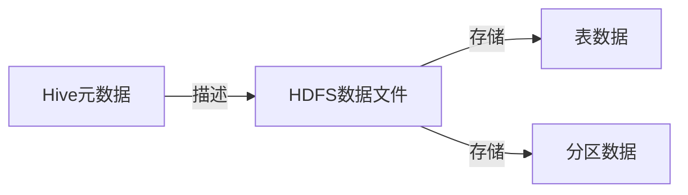
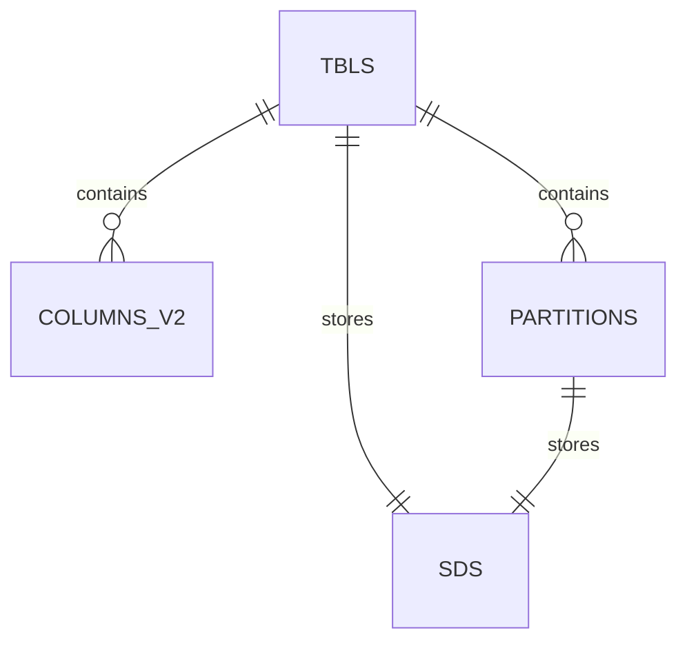

# Hive元数据：数据仓库的灵魂

## 1. 背景介绍
### 1.1 数据仓库的重要性
在大数据时代，企业需要处理和分析海量的数据，以获得有价值的商业洞察。数据仓库作为一种集中式的数据存储和管理系统，为企业提供了一个统一的数据视图，方便进行数据分析和决策支持。

### 1.2 Hive在数据仓库中的地位
Hive是一个构建在Hadoop之上的数据仓库工具，它提供了一种类SQL的查询语言HiveQL，可以方便地对存储在HDFS中的大规模数据进行查询和分析。Hive已经成为了大数据领域中数据仓库的标准工具之一。

### 1.3 元数据的重要性
在Hive数据仓库中，元数据扮演着至关重要的角色。元数据记录了数据的结构、格式、存储位置等信息，是数据仓库的"灵魂"所在。没有元数据，数据仓库就无法正常运转。本文将深入探讨Hive元数据的核心概念、原理和应用。

## 2. 核心概念与联系
### 2.1 Hive元数据概述  
Hive元数据是Hive数据仓库的核心组成部分，它包含了Hive表、分区、列、存储格式等所有的结构化信息。Hive通过读取元数据来理解和解释底层的HDFS数据。

### 2.2 元数据存储 
Hive默认使用内嵌的Derby数据库存储元数据。为了获得更好的性能和可靠性，生产环境通常使用MySQL等外部关系型数据库存储Hive元数据。

### 2.3 元数据表
Hive在元数据库中创建了一系列的表来记录元数据信息，主要包括： 
- TBLS表：记录Hive表的基本信息，如表名、所属数据库等。
- COLUMNS_V2表：记录表中的列信息。  
- PARTITIONS表：记录表的分区信息。
- SDS表：记录表的存储信息，如存储格式、HDFS路径等。

### 2.4 元数据与数据的关系
下图展示了Hive元数据与实际HDFS数据文件之间的关系：



## 3. 核心实现原理
### 3.1 Hive如何使用元数据  
当用户提交一个HiveQL查询时，Hive会执行以下步骤：

1. Hive首先根据元数据库中的信息，检查查询引用的表和列是否存在。
2. 接着Hive会生成一个逻辑执行计划，将HiveQL转换为一系列的MapReduce任务。  
3. 在执行过程中，Hive会根据元数据中记录的HDFS路径，访问实际的数据文件。
4. 最后将查询结果返回给用户。

### 3.2 元数据的同步
为保证元数据与实际数据的一致性，在进行数据导入、表结构变更等操作时，Hive会自动更新元数据。例如当用户创建一个新表时，Hive会在元数据库的TBLS表中添加一条新纪录。

## 4. 元数据的数学模型
### 4.1 关系代数
Hive元数据可以用关系代数来形式化描述。我们可以将元数据库看作一个关系型数据库，每个元数据表都是一个关系。例如TBLS表可以表示为：

$TBLS(TBL\_ID,DB\_ID,TBL\_NAME,TBL\_TYPE,...)$

### 4.2 E-R图
元数据表之间存在复杂的关联关系，可以用E-R图来建模。下图展示了Hive元数据的核心E-R图：



## 5. 代码实例
下面通过一个简单的代码实例，展示如何用Java API读取Hive元数据。

```java
// 创建Hive元数据客户端
HiveMetaStoreClient client = new HiveMetaStoreClient(new HiveConf());

// 获取指定数据库中的所有表
String dbName = "default";
List<String> tables = client.getAllTables(dbName);

// 输出表名  
for(String tableName : tables) {
    System.out.println(tableName);
}

// 获取表的元数据信息
String tableName = "employees";  
Table table = client.getTable(dbName, tableName);

// 输出表的基本信息
System.out.println("表名：" + table.getTableName());
System.out.println("所属数据库：" + table.getDbName());  
System.out.println("存储信息：" + table.getSd().getLocation());
```

## 6. 应用场景
### 6.1 元数据查询与管理
Hive提供了一系列的元数据查询命令，如SHOW TABLES、DESCRIBE TABLE等，方便用户查看和管理元数据。 

### 6.2 数据血缘分析
通过分析Hive元数据，我们可以追踪数据的来源和影响范围，进行数据血缘分析。这对于数据治理和数据质量管理非常有价值。

### 6.3 数据安全与权限控制
Hive支持在元数据级别设置安全权限。管理员可以控制不同用户对数据库、表的访问权限，提高数据安全性。

## 7. 工具和资源推荐
### 7.1 HiveMetaTool
一个用于Hive元数据迁移和校验的工具。

### 7.2 Cloudera Navigator
Cloudera公司提供的一款元数据管理与数据治理工具，可以分析Hive等组件的元数据。

### 7.3 官方文档
Hive官网提供了详尽的用户和管理员文档，是学习元数据管理的权威资料。
  
## 8. 未来发展趋势与挑战
### 8.1 元数据量的快速增长
随着数据量的不断增长，Hive元数据库也面临着扩展性的挑战。未来需要更高效的元数据存储和管理方案。

### 8.2 元数据治理
如何建立企业级的元数据治理体系，确保元数据的准确性和一致性，是一个亟待解决的问题。

### 8.3 元数据的智能化
利用机器学习等技术，挖掘元数据中隐藏的信息，实现元数据的智能化管理和应用，将是未来的一个重要方向。

## 9. 常见问题与解答  
### Q1：Hive元数据可以存储在哪些数据库中？
A1：Hive支持多种关系型数据库存储元数据，如MySQL、PostgreSQL、Oracle等。

### Q2：如何备份和恢复Hive元数据？  
A2：可以使用mysqldump等工具对Hive元数据库进行备份，需要同时备份Hive配置文件。恢复时需要先恢复元数据库，再拷贝配置文件。

### Q3：Hive元数据可以跨集群迁移吗？
A3：可以，但需要谨慎操作。一般采用先在目标集群搭建新的Hive，然后导出源集群元数据，再导入到目标集群的方式。

---

作者：禅与计算机程序设计艺术 / Zen and the Art of Computer Programming