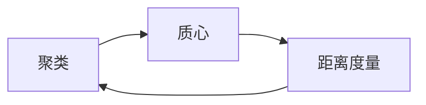

# K-Means Clustering 原理与代码实战案例讲解

## 1. 背景介绍
### 1.1 聚类分析概述
#### 1.1.1 什么是聚类分析
#### 1.1.2 聚类分析的应用场景
#### 1.1.3 聚类分析的主要方法

### 1.2 K-Means算法简介 
#### 1.2.1 K-Means算法的起源与发展
#### 1.2.2 K-Means算法的基本思想
#### 1.2.3 K-Means算法的优缺点

## 2. 核心概念与联系
### 2.1 聚类
#### 2.1.1 聚类的定义
#### 2.1.2 聚类的目标
#### 2.1.3 聚类的评估指标

### 2.2 质心
#### 2.2.1 质心的定义
#### 2.2.2 质心的作用
#### 2.2.3 质心的更新方式

### 2.3 距离度量
#### 2.3.1 欧氏距离
#### 2.3.2 曼哈顿距离
#### 2.3.3 余弦相似度

### 2.4 概念之间的联系


## 3. 核心算法原理具体操作步骤
### 3.1 算法输入
#### 3.1.1 数据集
#### 3.1.2 聚类数K
#### 3.1.3 最大迭代次数

### 3.2 初始化质心
#### 3.2.1 随机选取K个数据点作为初始质心
#### 3.2.2 K-Means++初始化方法

### 3.3 迭代优化
#### 3.3.1 计算每个数据点到各个质心的距离
#### 3.3.2 将每个数据点分配到距离最近的质心所在的簇
#### 3.3.3 重新计算每个簇的质心
#### 3.3.4 重复步骤3.3.1到3.3.3直到满足终止条件

### 3.4 算法输出
#### 3.4.1 每个数据点的簇标签
#### 3.4.2 每个簇的质心坐标

## 4. 数学模型和公式详细讲解举例说明
### 4.1 目标函数
K-Means算法的目标是最小化所有数据点到其所属簇质心的平方距离之和,即:

$$J = \sum_{i=1}^{n}\sum_{j=1}^{k}w_{ij}||x_i - \mu_j||^2$$

其中,$n$是数据点的数量,$k$是聚类数,$w_{ij}$表示数据点$x_i$是否属于第$j$个簇,$\mu_j$是第$j$个簇的质心。

### 4.2 质心更新
在每次迭代中,重新计算每个簇的质心,即:

$$\mu_j = \frac{\sum_{i=1}^{n}w_{ij}x_i}{\sum_{i=1}^{n}w_{ij}}$$

### 4.3 距离计算
常用的距离度量有欧氏距离和曼哈顿距离。欧氏距离计算公式为:

$$d(x,y) = \sqrt{\sum_{i=1}^{m}(x_i - y_i)^2}$$

其中,$m$是数据维度。曼哈顿距离计算公式为:

$$d(x,y) = \sum_{i=1}^{m}|x_i - y_i|$$

## 5. 项目实践：代码实例和详细解释说明
下面是使用Python实现K-Means算法的示例代码:

```python
import numpy as np

class KMeans:
    def __init__(self, n_clusters, max_iter=300):
        self.n_clusters = n_clusters
        self.max_iter = max_iter
        self.centroids = None
        
    def fit(self, X):
        # 随机选取初始质心
        idx = np.random.choice(X.shape[0], self.n_clusters, replace=False)
        self.centroids = X[idx]
        
        for _ in range(self.max_iter):
            # 计算每个数据点到质心的距离
            distances = self._calc_distances(X)
            
            # 将每个数据点分配到最近的簇
            labels = np.argmin(distances, axis=1)
            
            # 更新质心
            for i in range(self.n_clusters):
                self.centroids[i] = X[labels == i].mean(axis=0)
                
        return labels
    
    def _calc_distances(self, X):
        distances = np.zeros((X.shape[0], self.n_clusters))
        for i, centroid in enumerate(self.centroids):
            distances[:, i] = np.linalg.norm(X - centroid, axis=1)
        return distances
```

代码解释:
- `__init__`方法初始化了聚类数和最大迭代次数。
- `fit`方法执行K-Means算法的主要步骤,包括初始化质心、计算距离、分配数据点和更新质心。
- `_calc_distances`方法计算每个数据点到所有质心的欧氏距离。
- 在`fit`方法的每次迭代中,先计算距离矩阵,然后根据距离将数据点分配到最近的簇,最后更新每个簇的质心。

使用示例:
```python
from sklearn.datasets import make_blobs

# 生成示例数据
X, _ = make_blobs(n_samples=200, centers=4, random_state=42)

# 创建K-Means对象并拟合数据
kmeans = KMeans(n_clusters=4)
labels = kmeans.fit(X)

# 输出结果
print(labels)
```

## 6. 实际应用场景
### 6.1 客户细分
利用K-Means算法对客户数据进行聚类,根据客户的消费行为、人口统计学特征等将其分为不同的群组,制定针对性的营销策略。

### 6.2 图像分割
将图像像素点作为数据点,使用K-Means算法对其进行聚类,实现图像分割,提取感兴趣的目标区域。

### 6.3 文本聚类
将文本数据转换为向量表示,然后使用K-Means算法对文本进行聚类,发现文本主题或对文档进行分类。

### 6.4 异常检测
利用K-Means算法对数据进行聚类,将距离质心较远的数据点标记为异常点,实现异常检测。

## 7. 工具和资源推荐
### 7.1 scikit-learn
scikit-learn是一个Python机器学习库,提供了易用的K-Means算法实现。

### 7.2 ELKI
ELKI是一个开源的数据挖掘软件,包含多种聚类算法,其中也有K-Means的实现。

### 7.3 Weka
Weka是一个基于Java的机器学习工具集,提供了用户友好的界面,支持K-Means聚类。

### 7.4 聚类分析相关书籍
- 《数据挖掘:概念与技术》(Jiawei Han等)
- 《模式识别与机器学习》(Christopher Bishop)
- 《统计学习方法》(李航)

## 8. 总结：未来发展趋势与挑战
### 8.1 算法优化
研究者不断探索K-Means算法的改进方向,如处理高维数据、加速收敛、自适应确定聚类数等,以提升算法的性能和适用性。

### 8.2 与深度学习的结合
将K-Means与深度学习模型相结合,如在卷积神经网络中使用K-Means进行初始化或作为损失函数的一部分,可以提升模型的性能。

### 8.3 大数据场景下的挑战
在海量数据的场景下,K-Means算法面临计算效率和存储开销的挑战,需要研究适合大数据处理的分布式、并行化的K-Means算法变体。

### 8.4 聚类结果的可解释性
K-Means算法的聚类结果可能难以直观解释,需要研究如何提取聚类结果的特征表示,增强聚类过程和结果的可解释性,以便用户理解和应用。

## 9. 附录：常见问题与解答
### 9.1 如何确定最优的聚类数K?
可以使用手肘法、轮廓系数等方法评估不同K值下的聚类质量,选择聚类结果最优的K值。也可以根据先验知识或业务需求来确定K值。

### 9.2 K-Means算法对初始质心的选择敏感吗?
是的,K-Means算法的聚类结果会受到初始质心选择的影响。可以使用K-Means++等初始化策略来获得更好的初始质心,提升聚类效果。

### 9.3 K-Means算法是否能发现非凸形状的簇?
K-Means算法假设簇是凸形的,对于非凸形状的簇,如环形、螺旋形等,K-Means算法的聚类效果可能不佳。此时可以考虑使用其他聚类算法,如谱聚类、DBSCAN等。

### 9.4 K-Means算法如何处理离群点?
K-Means算法对离群点敏感,离群点可能会影响质心的位置,导致聚类结果偏差。可以在数据预处理阶段去除离群点,或使用对离群点鲁棒的聚类算法,如K-Medoids。

### 9.5 K-Means算法的时间复杂度是多少?
K-Means算法的时间复杂度为$O(nkt)$,其中$n$是数据点数,$k$是聚类数,$t$是迭代次数。在实践中,K-Means通常在少数迭代后就能收敛,因此算法总体效率较高。

作者：禅与计算机程序设计艺术 / Zen and the Art of Computer Programming