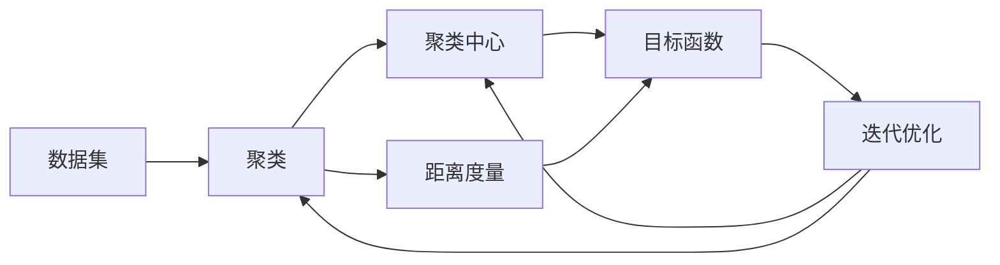
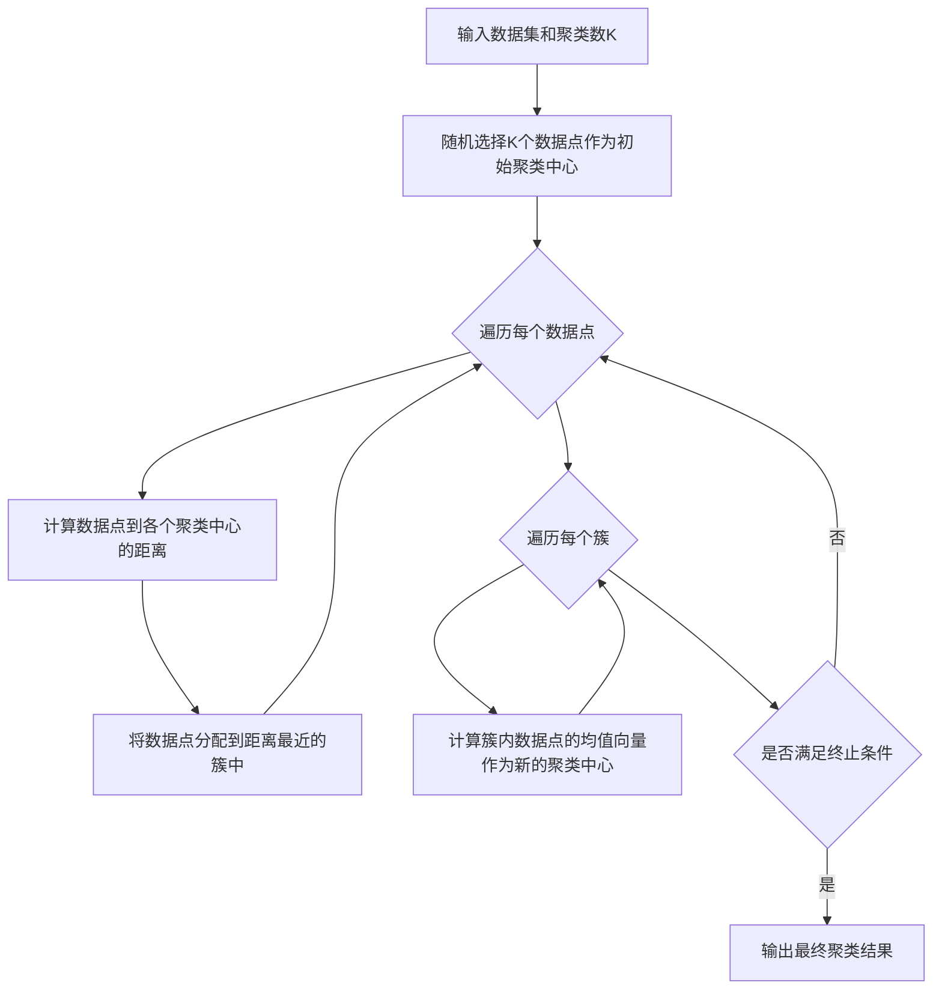

# K-Means聚类：揭示数据背后的隐藏结构

## 1. 背景介绍

### 1.1 聚类分析的重要性

在大数据时代,我们面临着海量的数据,如何从这些数据中挖掘出有价值的信息和知识,是数据科学家和机器学习工程师面临的重大挑战。聚类分析作为一种无监督学习方法,可以在没有预先标记数据的情况下,自动将相似的数据点归类到同一个簇中,从而揭示数据内在的结构和模式。聚类分析在数据挖掘、模式识别、图像分割、市场细分等领域有着广泛的应用。

### 1.2 K-Means算法的优势

在众多聚类算法中,K-Means因其简单、高效、可解释性强等优点而备受青睐。K-Means通过迭代优化的方式,不断更新聚类中心,使得每个数据点到其所属簇的中心点的距离最小化,从而得到紧凑且独立的簇结构。与其他聚类算法相比,K-Means具有以下优势:

1. 算法简单易懂,容易实现。
2. 计算复杂度较低,适用于大规模数据集。  
3. 聚类结果直观,便于解释和应用。
4. 对球形、凸型的簇结构效果较好。

### 1.3 K-Means的局限性

尽管K-Means有诸多优点,但它也存在一些局限性:

1. 需要预先指定聚类数K,但在实际应用中K值的选择并不容易。
2. 对噪声和异常点敏感,容易受到极端值的影响。
3. 对于非凸型、非球形的簇结构效果不佳。
4. 聚类结果依赖于初始聚类中心的选择。

因此,在使用K-Means时需要考虑这些局限性,并根据具体问题采取相应的优化策略。

## 2. 核心概念与联系

### 2.1 聚类(Clustering)

聚类是一种无监督学习方法,旨在将数据集划分为若干个簇(Cluster),使得同一簇内的数据点相似度较高,而不同簇之间的数据点相似度较低。聚类可以帮助我们发现数据内在的分组结构,找出具有相似特征的数据子集。

### 2.2 聚类中心(Centroid)

在K-Means算法中,每个簇都有一个聚类中心,即该簇所有数据点的均值向量。聚类中心代表了该簇的中心位置,新的数据点可以通过计算与各个聚类中心的距离来确定其所属簇。

### 2.3 距离度量(Distance Metric)

为了衡量数据点之间的相似性,需要定义一个距离度量。常用的距离度量包括欧氏距离、曼哈顿距离、余弦相似度等。K-Means通常使用欧氏距离作为默认的距离度量。

### 2.4 目标函数(Objective Function)  

K-Means的优化目标是最小化所有数据点到其所属簇中心的距离平方和,即最小化下面的目标函数:

$$J = \sum_{i=1}^{n} \sum_{j=1}^{k} w_{ij} \lVert x_i - \mu_j \rVert^2$$

其中,$n$是数据点的数量,$k$是聚类数,$w_{ij}$表示数据点$x_i$是否属于第$j$个簇,$\mu_j$是第$j$个簇的中心点。

### 2.5 迭代优化(Iterative Optimization)

K-Means通过迭代的方式优化上述目标函数。在每次迭代中,算法分两步进行:

1. 分配步骤:对每个数据点,计算其到各个聚类中心的距离,并将其分配到距离最近的簇中。
2. 更新步骤:对每个簇,根据当前簇内的数据点重新计算聚类中心。

算法不断重复这两个步骤,直到聚类中心不再发生明显变化或达到最大迭代次数为止。

### 2.6 概念联系图

下图展示了K-Means算法中核心概念之间的联系:



## 3. 核心算法原理具体操作步骤

K-Means算法的具体步骤如下:

1. 初始化:随机选择K个数据点作为初始聚类中心。
2. 分配数据点:对每个数据点,计算其到各个聚类中心的距离,并将其分配到距离最近的簇中。
3. 更新聚类中心:对每个簇,计算当前簇内所有数据点的均值向量,并将其作为新的聚类中心。
4. 重复步骤2和3,直到满足终止条件(聚类中心不再变化或达到最大迭代次数)。
5. 输出最终的聚类结果。

算法流程图如下:



## 4. 数学模型和公式详细讲解举例说明

### 4.1 目标函数

K-Means的优化目标是最小化所有数据点到其所属簇中心的距离平方和,即最小化如下目标函数:

$$J = \sum_{i=1}^{n} \sum_{j=1}^{k} w_{ij} \lVert x_i - \mu_j \rVert^2$$

其中:
- $n$:数据点的数量
- $k$:聚类数
- $x_i$:第$i$个数据点
- $\mu_j$:第$j$个簇的中心点
- $w_{ij}$:指示变量,表示数据点$x_i$是否属于第$j$个簇

$$
w_{ij} = 
\begin{cases}
1, & \text{if } x_i \text{ belongs to cluster } j \\
0, & \text{otherwise}
\end{cases}
$$

### 4.2 距离度量

K-Means通常使用欧氏距离作为默认的距离度量。对于两个$d$维数据点$x=(x_1,\ldots,x_d)$和$y=(y_1,\ldots,y_d)$,它们之间的欧氏距离定义为:

$$d(x,y) = \sqrt{\sum_{i=1}^{d} (x_i - y_i)^2}$$

### 4.3 聚类中心更新

在每次迭代的更新步骤中,对于第$j$个簇,其聚类中心$\mu_j$的更新公式为:

$$\mu_j = \frac{\sum_{i=1}^{n} w_{ij} x_i}{\sum_{i=1}^{n} w_{ij}}$$

即第$j$个簇内所有数据点的加权平均值。

### 4.4 举例说明

考虑以下二维数据集:

```
x1 = (1, 2)
x2 = (1.5, 1.8)
x3 = (5, 8) 
x4 = (8, 8)
x5 = (1, 0.6)
x6 = (9, 11)
```

假设我们要将数据集聚类为2个簇(k=2),并随机选择x1和x4作为初始聚类中心。

在第一次迭代中:

1. 分配数据点:
   - 对于x1,其到两个聚类中心的距离分别为d(x1,x1)=0,d(x1,x4)=9.90,因此x1属于簇1。
   - 对于x2,d(x2,x1)=0.53,d(x2,x4)=8.32,因此x2属于簇1。
   - 对于x3,d(x3,x1)=7.81,d(x3,x4)=3.00,因此x3属于簇2。
   - 对于x4,d(x4,x1)=9.90,d(x4,x4)=0,因此x4属于簇2。
   - 对于x5,d(x5,x1)=1.40,d(x5,x4)=10.63,因此x5属于簇1。
   - 对于x6,d(x6,x1)=13.45,d(x6,x4)=3.16,因此x6属于簇2。

2. 更新聚类中心:
   - 簇1包含x1,x2,x5,新的聚类中心为$\mu_1=(\frac{1+1.5+1}{3},\frac{2+1.8+0.6}{3})=(1.17,1.47)$。
   - 簇2包含x3,x4,x6,新的聚类中心为$\mu_2=(\frac{5+8+9}{3},\frac{8+8+11}{3})=(7.33,9.00)$。

算法继续迭代,直到聚类中心不再发生明显变化。最终,我们得到两个簇:$\{x1,x2,x5\}$和$\{x3,x4,x6\}$。

## 5. 项目实践：代码实例和详细解释说明

下面是使用Python实现K-Means算法的示例代码:

```python
import numpy as np

class KMeans:
    def __init__(self, n_clusters, max_iter=300):
        self.n_clusters = n_clusters
        self.max_iter = max_iter
        self.centroids = None
        
    def fit(self, X):
        # 随机选择初始聚类中心
        idx = np.random.choice(X.shape[0], self.n_clusters, replace=False)
        self.centroids = X[idx]
        
        for _ in range(self.max_iter):
            # 分配数据点到最近的聚类中心
            labels = self._assign_labels(X)
            
            # 更新聚类中心
            old_centroids = self.centroids.copy()
            for i in range(self.n_clusters):
                self.centroids[i] = np.mean(X[labels == i], axis=0)
            
            # 检查聚类中心是否发生变化
            if np.all(old_centroids == self.centroids):
                break
        
        return self
    
    def _assign_labels(self, X):
        distances = self._calc_distances(X)
        return np.argmin(distances, axis=1)
    
    def _calc_distances(self, X):
        distances = np.zeros((X.shape[0], self.n_clusters))
        for i in range(self.n_clusters):
            distances[:, i] = np.linalg.norm(X - self.centroids[i], axis=1)
        return distances
    
    def predict(self, X):
        distances = self._calc_distances(X)
        return np.argmin(distances, axis=1)
```

代码解释:

1. 在`__init__`方法中,我们初始化了聚类数`n_clusters`和最大迭代次数`max_iter`,并定义了一个变量`centroids`用于存储聚类中心。

2. `fit`方法用于训练K-Means模型:
   - 首先,我们使用`np.random.choice`随机选择`n_clusters`个数据点作为初始聚类中心。
   - 然后,进入迭代过程,每次迭代分两步:
     - 调用`_assign_labels`方法将数据点分配到最近的聚类中心。
     - 对于每个簇,计算簇内数据点的均值,并将其作为新的聚类中心。
   - 迭代结束条件是聚类中心不再发生变化或达到最大迭代次数。

3. `_assign_labels`方法用于将数据点分配到最近的聚类中心:
   - 调用`_calc_distances`方法计算每个数据点到各个聚类中心的距离。
   - 使用`np.argmin`找到每个数据点距离最近的聚类中心,并返回对应的标签。

4. `_calc_distances`方法用于计算数据点到聚类中心的距离:
   - 创建一个形状为(n_samples, n_clusters)的距离矩阵。
   - 对于每个聚类中心,计算所有数据点到该中心的欧氏距离,并存储在距离矩阵的对应列中。

5. `predict`方法用于对新的数据点进行聚类:
   - 调用`_calc_distances`方法计算新数据点到各个聚类中心的距离。
   - 使用`np.argmin`找到距离最近的聚类中心,并返回对应的标签