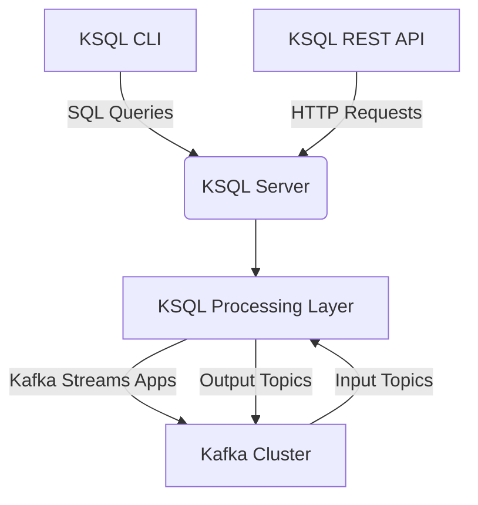
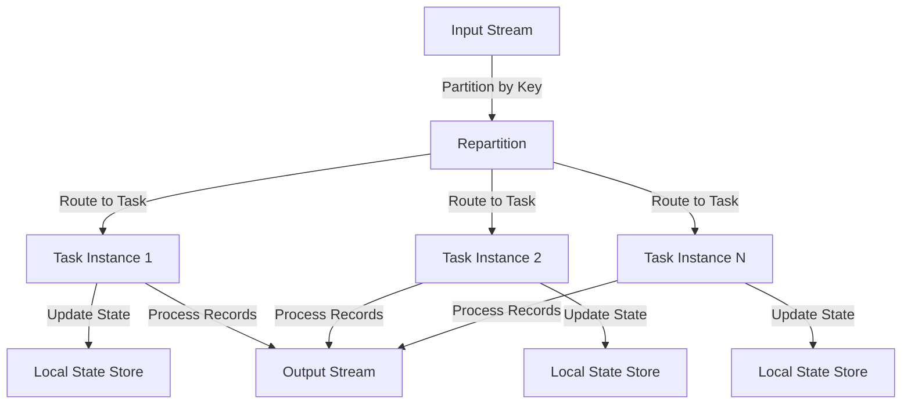

# Kafka KSQL原理与代码实例讲解

## 1.背景介绍

在当今数据驱动的世界中,实时数据处理和分析已经成为许多企业的关键需求。Apache Kafka是一个分布式流处理平台,它提供了可靠、可扩展和高吞吐量的消息队列功能,广泛应用于日志收集、数据管道、流处理和事件驱动架构等场景。

然而,直接使用Kafka进行数据处理和分析可能会显得复杂和繁琐,特别是对于那些不太熟悉流处理概念和Kafka API的开发人员而言。这就是Kafka SQL(KSQL)应运而生的原因。KSQL是Confluent公司基于Kafka Streams开发的流式SQL引擎,它为Kafka提供了类SQL的查询接口,使开发人员能够使用熟悉的SQL语法来处理Kafka中的实时数据流。

## 2.核心概念与联系

### 2.1 KSQL架构概览

KSQL的架构由以下几个核心组件组成:

- **KSQL Server**: KSQL服务器是KSQL的核心组件,负责处理SQL查询、管理持久化查询(Persistent Queries)以及与Kafka集群进行交互。
- **KSQL CLI**: KSQL命令行界面(CLI)提供了一个交互式的SQL shell,允许用户直接输入SQL查询并查看结果。
- **KSQL REST API**: KSQL REST API允许其他应用程序通过HTTP请求与KSQL服务器进行交互,提交SQL查询和读取查询结果。
- **KSQL处理层**: KSQL处理层负责将SQL查询转换为Kafka Streams应用程序,并在Kafka集群上执行相应的流处理操作。

下面是KSQL架构的Mermaid流程图:



### 2.2 KSQL流和表

在KSQL中,数据被组织为流(Stream)或表(Table)。

- **流(Stream)**: 流代表一个无边界的、持续不断的数据记录序列,例如日志条目、传感器读数或金融交易等。每个记录都是一个自包含的、不可变的数据单元,并且按照时间顺序排列。
- **表(Table)**: 表是一个持久化的、可变的数据集合,其中每个记录都是基于其键(Key)的最新值。表可以被视为一个具有主键的数据库表,其中每个键只能有一个值。

KSQL允许您使用SQL语句从流中创建表,或者从表中创建新的流。这种流和表之间的转换为构建复杂的流处理管道提供了极大的灵活性。

## 3.核心算法原理具体操作步骤

### 3.1 KSQL查询类型

KSQL支持多种类型的SQL查询,包括:

1. **创建流或表**: 使用`CREATE STREAM`或`CREATE TABLE`语句从Kafka主题创建流或表。
2. **持久化查询(Persistent Queries)**: 使用`CREATE STREAM ... AS SELECT`或`CREATE TABLE ... AS SELECT`语句从现有流或表中创建新的流或表。这些查询会持续运行,并将结果写入新的Kafka主题。
3. **推送查询(Push Queries)**: 使用`INSERT INTO ... SELECT`语句将查询结果插入现有的Kafka主题。
4. **拉取查询(Pull Queries)**: 使用`SELECT`语句从流或表中读取数据,并将结果直接返回给客户端。

### 3.2 KSQL流处理算法

KSQL的流处理算法基于Kafka Streams,它使用了一种称为"重新分区(repartition)"的技术来实现有状态的流处理。

1. **数据分区**: 输入流中的记录根据其键(Key)被划分到不同的分区(Partition)中。
2. **重新分区**: 当需要进行基于记录键的聚合或连接操作时,KSQL会对输入流进行重新分区,以确保具有相同键的记录被路由到同一个任务实例(Task Instance)。
3. **本地状态存储**: 每个任务实例维护一个本地状态存储(如RocksDB或内存中的哈希表),用于存储和更新与该任务实例相关的记录状态。
4. **流处理操作**: 任务实例对输入记录执行相应的流处理操作,如过滤、映射、聚合或连接等,并将结果写入输出主题。

下面是KSQL流处理算法的Mermaid流程图:



## 4.数学模型和公式详细讲解举例说明

在KSQL中,一些常见的流处理操作涉及到数学模型和公式,例如窗口聚合和连接操作。

### 4.1 窗口聚合

窗口聚合是一种常见的流处理操作,它允许您对一段时间内的数据记录进行聚合计算,例如计算每分钟的点击量或每小时的销售总额。KSQL支持多种类型的窗口,包括时间窗口、会话窗口和跳跃窗口。

对于时间窗口,KSQL使用以下公式计算窗口边界:

$$
\begin{align*}
\text{Window Start} &= \lfloor \frac{\text{Record Timestamp} - \text{Window Start Delay}}{\text{Window Size}} \rfloor \times \text{Window Size} + \text{Window Start Delay} \\
\text{Window End} &= \text{Window Start} + \text{Window Size}
\end{align*}
$$

其中:

- $\text{Record Timestamp}$ 是记录的时间戳
- $\text{Window Start Delay}$ 是窗口起始时间的延迟
- $\text{Window Size}$ 是窗口的大小

例如,对于每小时的滚动窗口聚合,我们可以设置:

- $\text{Window Start Delay} = 0$
- $\text{Window Size} = 1 \text{ hour}$

如果一条记录的时间戳为 `2023-05-31 14:23:45`,那么它将被分配到以下窗口:

$$
\begin{align*}
\text{Window Start} &= \lfloor \frac{2023-05-31\ 14:23:45 - 0}{1\ \text{hour}} \rfloor \times 1\ \text{hour} + 0 \\
                   &= 2023-05-31\ 14:00:00 \\
\text{Window End} &= 2023-05-31\ 14:00:00 + 1\ \text{hour} \\
                  &= 2023-05-31\ 15:00:00
\end{align*}
$$

因此,该记录将被计入 `2023-05-31 14:00:00` 到 `2023-05-31 15:00:00` 这个小时的窗口中。

### 4.2 流连接

KSQL支持多种类型的流连接,包括内连接(Inner Join)、外连接(Outer Join)和流-表连接(Stream-Table Join)。在进行连接操作时,KSQL使用一种称为"时间窗口连接(Windowed Join)"的技术,它允许将具有相同键且时间戳落在指定时间窗口内的记录进行连接。

对于流-流连接,KSQL使用以下公式计算连接窗口:

$$
\begin{align*}
\text{Join Window Start} &= \max(\text{Left Stream Window Start}, \text{Right Stream Window Start}) \\
\text{Join Window End} &= \min(\text{Left Stream Window End}, \text{Right Stream Window End})
\end{align*}
$$

其中:

- $\text{Left Stream Window Start/End}$ 是左侧流的窗口起始/结束时间
- $\text{Right Stream Window Start/End}$ 是右侧流的窗口起始/结束时间

例如,假设我们要连接两个流 `orders` 和 `payments`,并且它们的窗口分别为:

- `orders` 窗口: `2023-05-31 14:00:00` 到 `2023-05-31 15:00:00`
- `payments` 窗口: `2023-05-31 14:30:00` 到 `2023-05-31 15:30:00`

那么,连接窗口将被计算为:

$$
\begin{align*}
\text{Join Window Start} &= \max(2023-05-31\ 14:00:00, 2023-05-31\ 14:30:00) \\
                         &= 2023-05-31\ 14:30:00 \\
\text{Join Window End} &= \min(2023-05-31\ 15:00:00, 2023-05-31\ 15:30:00) \\
                       &= 2023-05-31\ 15:00:00
\end{align*}
$$

因此,只有在 `2023-05-31 14:30:00` 到 `2023-05-31 15:00:00` 这个时间窗口内的 `orders` 和 `payments` 记录才会被连接。

## 5.项目实践：代码实例和详细解释说明

### 5.1 创建流和表

首先,我们需要从Kafka主题创建流和表。下面是一个示例:

```sql
-- 创建订单流
CREATE STREAM orders (
    order_id VARCHAR KEY,
    customer_id VARCHAR,
    order_total DOUBLE,
    order_timestamp BIGINT
) WITH (
    kafka_topic='orders',
    value_format='AVRO',
    partitions=4
);

-- 创建支付流
CREATE STREAM payments (
    payment_id VARCHAR KEY,
    order_id VARCHAR,
    payment_amount DOUBLE,
    payment_timestamp BIGINT
) WITH (
    kafka_topic='payments',
    value_format='AVRO',
    partitions=4
);

-- 创建客户表
CREATE TABLE customers (
    customer_id VARCHAR PRIMARY KEY,
    customer_name VARCHAR,
    customer_email VARCHAR
) WITH (
    kafka_topic='customers',
    value_format='AVRO',
    partitions=4
);
```

在上面的示例中,我们从Kafka主题 `orders`、`payments` 和 `customers` 分别创建了 `orders` 流、`payments` 流和 `customers` 表。这些流和表的数据格式为 Avro,并且被分割为 4 个分区。

### 5.2 持久化查询

接下来,我们可以使用持久化查询从现有流和表中创建新的流或表。下面是一个示例,它计算每个客户的订单总额:

```sql
CREATE TABLE customer_orders WITH (
    partitions=4
) AS
SELECT
    c.customer_id,
    c.customer_name,
    SUM(o.order_total) AS total_order_value
FROM orders o
INNER JOIN customers c ON o.customer_id = c.customer_id
WINDOW TUMBLING (SIZE 1 HOUR)
GROUP BY c.customer_id, c.customer_name;
```

在这个查询中,我们从 `orders` 流和 `customers` 表中选择数据,并使用 1 小时的滚动窗口对每个客户的订单总额进行聚合。结果被持久化到一个新的 `customer_orders` 表中。

### 5.3 拉取查询

我们还可以使用拉取查询从流或表中读取数据,并将结果直接返回给客户端。下面是一个示例,它查询最近一小时内的订单总额:

```sql
SELECT
    c.customer_name,
    SUM(o.order_total) AS total_order_value
FROM orders o
INNER JOIN customers c ON o.customer_id = c.customer_id
WINDOW TUMBLING (SIZE 1 HOUR)
GROUP BY c.customer_name
EMIT CHANGES;
```

在这个查询中,我们使用 1 小时的滚动窗口对每个客户的订单总额进行聚合,并使用 `EMIT CHANGES` 子句实时输出结果。

## 6.实际应用场景

KSQL可以应用于各种实时数据处理和分析场景,包括但不限于:

1. **物联网(IoT)数据处理**: 对来自传感器和设备的实时数据流进行过滤、转换和聚合,用于监控、预测维护和异常检测等。
2. **金融交易处理**: 实时处理金融交易数据,进行欺诈检测、风险管理和实时报告等。
3. **用户行为分析**: 分析用户在网站或应用程序中的实时行为数据,用于个性化推荐、营销活动和用户体验优化等。
4. **物流和供应链管理**: 跟踪实时货物流动,优化物流路线和库存管理等。
5. **实时数据集成**: 将来自多个数据源的实时数据流集成到数据