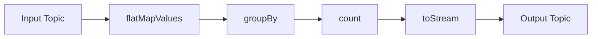

# Kafka Streams原理与代码实例讲解

## 1.背景介绍
### 1.1 实时流处理的重要性
在当今数据驱动的世界中,实时流处理变得越来越重要。企业需要快速响应不断变化的业务需求,及时洞察海量数据中蕴含的价值。传统的批处理模式已经无法满足实时性要求,转向流处理成为大势所趋。
### 1.2 Kafka在流处理中的地位
Apache Kafka作为分布式消息队列,以其高吞吐、低延迟、可扩展等特性在流处理领域占据重要地位。越来越多的公司选择Kafka作为流处理的基础设施。
### 1.3 Kafka Streams的诞生
为了进一步降低流处理的门槛,Kafka推出了Kafka Streams。它是一个用于构建实时流处理应用程序的轻量级库。Kafka Streams 提供了高级流处理DSL和底层处理器API,大大简化了流处理应用的开发。

## 2.核心概念与联系
### 2.1 Stream 
Stream是Kafka Streams中的核心抽象,代表一个无界的、持续更新的数据流。Stream中的每个数据都是一个键值对。
### 2.2 Topology
Topology定义了流处理的计算逻辑,包括数据源、数据转换和数据输出。Topology是一个有向无环图(DAG),节点是处理器,边代表数据流向。
### 2.3 Processor
Processor执行实际的数据处理操作,包括转换、过滤、聚合等。Kafka Streams提供了多种内置的Processor,也允许用户自定义Processor。
### 2.4 State Store  
State Store提供了状态存储功能,可以存储中间计算结果,支持快照和恢复。Kafka Streams支持多种State Store实现,如基于RocksDB的KeyValueStore。
### 2.5 时间概念
Kafka Streams支持事件时间(event-time)和处理时间(processing-time)两种时间概念,可以灵活选择时间语义。

## 3.核心算法原理与操作步骤
### 3.1 数据重分区
- 根据key对数据进行重分区,保证相同key的数据在同一分区,为后续聚合等操作提供保证。
- 采用一致性哈希算法,将key映射到对应的分区。

### 3.2 滑动窗口
- 滑动窗口(Sliding Window)用于处理一段时间内的数据,如计算过去5分钟的平均值。
- 窗口持续滑动,每次滑动步长为设定的时间间隔。
- 通过Processor维护窗口状态,窗口到期时输出计算结果。

### 3.3 会话窗口  
- 会话窗口(Session Window)基于会话活动自动调整窗口边界。
- 会话超时后,触发窗口计算并输出结果。
- 通过 Session Store 维护会话状态。

### 3.4 状态恢复
- 定期对State Store执行快照,持久化状态数据。
- 故障恢复时,从快照恢复状态,保证exactly-once语义。
- Kafka Streams自动管理状态恢复过程。

## 4.数学模型与公式
### 4.1 一致性哈希
数据重分区采用一致性哈希,将key映射到对应分区。设$N$为分区数,$hash(key)$为键的哈希值,则分区号$p$为:

$$p = hash(key) \bmod N$$  

一致性哈希可以尽量避免分区数变化时的大量数据迁移。

### 4.2 滑动窗口模型
滑动窗口可以表示为$(start, end, slide)$,其中$start$为窗口起始时间,$end$为窗口结束时间,$slide$为滑动步长。

假设事件时间为$t$,则事件所属窗口的起始时间$w_start$为:

$$w_start = \lfloor \frac{t - start}{slide} \rfloor \times slide + start$$

### 4.3 会话窗口模型
会话窗口根据会话超时$timeout$动态调整,设事件时间为$t$,则事件所属会话窗口的起始时间$s_start$和结束时间$s_end$为:

$$
\begin{aligned}
s_start &= max(s_start, t) \\
s_end &= max(s_end, t + timeout)
\end{aligned}
$$

## 5.项目实践：代码实例
下面是一个使用Kafka Streams进行单词计数的示例代码:

```java
// 定义输入和输出的 topic
String inputTopic = "input-topic";  
String outputTopic = "output-topic";

// 配置 Kafka Streams
Properties props = new Properties();
props.put(StreamsConfig.APPLICATION_ID_CONFIG, "wordcount-app");
props.put(StreamsConfig.BOOTSTRAP_SERVERS_CONFIG, "localhost:9092");

// 创建 Topology
StreamsBuilder builder = new StreamsBuilder();
KStream<String, String> textLines = builder.stream(inputTopic);

KTable<String, Long> wordCounts = textLines
    .flatMapValues(line -> Arrays.asList(line.toLowerCase().split(" ")))
    .groupBy((keyIgnored, word) -> word) 
    .count();

wordCounts.toStream().to(outputTopic, Produced.with(Serdes.String(), Serdes.Long()));

// 启动 Kafka Streams
KafkaStreams streams = new KafkaStreams(builder.build(), props);  
streams.start();
```

上述代码的处理流程如下:



1. 从输入topic读取文本行
2. 使用`flatMapValues`将每行文本按空格分割为单词
3. 使用`groupBy`按单词分组  
4. 对每个单词进行计数
5. 将结果转换为`KStream`并写入输出topic

## 6.实际应用场景
Kafka Streams在多个领域有广泛应用,如:

- 实时欺诈检测:分析交易流,实时识别异常行为
- 实时推荐系统:根据用户行为流,实时生成个性化推荐
- 实时监控告警:分析系统指标流,及时发现异常并告警
- 物联网数据处理:处理传感器数据流,实现设备监控和预测性维护

## 7.工具和资源推荐
- **Kafka官方文档**: Kafka Streams部分提供了详尽的概念解释、API文档和示例代码。
- **Confluent博客**: Confluent是Kafka的主要贡献者,其博客有很多高质量的Kafka Streams技术文章。 
- **Interactive Queries**: Kafka Streams的交互式查询功能允许外部应用从State Store实时获取聚合结果。
- **Kafka Streams测试库**: 官方提供的测试工具,帮助编写Kafka Streams的单元测试和集成测试。

## 8.总结与展望  
Kafka Streams是一个功能强大的流处理库,结合Kafka的高性能,为实时数据处理提供了完整的解决方案。Kafka Streams的发展趋势主要有:

- 改进交互式查询,支持更灵活的状态查询方式
- 提供更丰富的内置Processor,进一步降低开发门槛
- 支持非Java语言,如Python、Go等,拓展用户群体
- 与机器学习平台整合,实现流数据的实时模型训练和推理

当然,Kafka Streams也面临一些挑战:

- 有状态应用的状态管理开销
- 大规模集群的部署和运维复杂度
- 流处理的端到端一致性保证

相信Kafka Streams会在社区的推动下不断发展,为流处理领域带来更多创新。

## 9.附录:常见问题解答
### 9.1 Kafka Streams与Spark Streaming的区别?
- Kafka Streams是一个库,Spark Streaming是一个分布式计算框架
- Kafka Streams基于Kafka,Spark Streaming支持多种数据源
- Kafka Streams是无批次的纯流处理,Spark Streaming使用微批次模型

### 9.2 Kafka Streams是否支持Exactly-Once语义?
Kafka Streams支持Exactly-Once语义,通过幂等写入和事务机制保证。

### 9.3 Kafka Streams应用程序的伸缩性如何?
Kafka Streams通过改变流分区数和应用实例数可以实现伸缩。应用实例之间通过Kafka的consumer group机制自动负载均衡。

### 9.4 Kafka Streams是否支持流joins?
Kafka Streams支持流-流join和表-表join。流-表join可以通过将表转换为流来实现。

作者：禅与计算机程序设计艺术 / Zen and the Art of Computer Programming