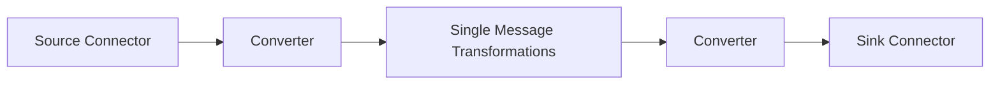

# KafkaConnect：使用SMT进行数据转换

## 1. 背景介绍

### 1.1 Kafka生态系统概述
#### 1.1.1 Kafka的核心组件
#### 1.1.2 Kafka在数据管道中的角色
#### 1.1.3 Kafka Connect的定位

### 1.2 数据转换的重要性
#### 1.2.1 不同系统间数据格式的差异
#### 1.2.2 数据转换在数据集成中的作用
#### 1.2.3 传统ETL工具的局限性

### 1.3 Kafka Connect & SMT简介
#### 1.3.1 Kafka Connect的基本概念
#### 1.3.2 Single Message Transformations (SMTs)
#### 1.3.3 SMT在Kafka Connect中的应用

## 2. 核心概念与联系

### 2.1 Kafka Connect核心组件
#### 2.1.1 Source Connector
#### 2.1.2 Sink Connector 
#### 2.1.3 Converter

### 2.2 SMT的分类与功能
#### 2.2.1 转换SMT
#### 2.2.2 过滤SMT
#### 2.2.3 路由SMT

### 2.3 Kafka Connect与SMT的关系

## 3. 核心算法原理具体操作步骤

### 3.1 配置Kafka Connect
#### 3.1.1 standalone模式
#### 3.1.2 distributed模式
#### 3.1.3 REST API交互

### 3.2 常用SMT详解
#### 3.2.1 InsertField
#### 3.2.2 ReplaceField
#### 3.2.3 MaskField
#### 3.2.4 ValueToKey
#### 3.2.5 ExtractField
#### 3.2.6 RegexRouter

### 3.3 多个SMT的组合使用
#### 3.3.1 SMT执行顺序
#### 3.3.2 SMT链式调用
#### 3.3.3 复杂转换案例

## 4. 数学模型和公式详细讲解举例说明

### 4.1 数据转换的数学基础
#### 4.1.1 关系代数
#### 4.1.2 集合论
#### 4.1.3 图论

### 4.2 正则表达式原理
#### 4.2.1 正则语法
#### 4.2.2 捕获组
#### 4.2.3 贪婪与非贪婪匹配

### 4.3 字符串匹配算法
#### 4.3.1 KMP算法
#### 4.3.2 Boyer-Moore算法
#### 4.3.3 Rabin-Karp算法

## 5. 项目实践：代码实例和详细解释说明

### 5.1 搭建Kafka Connect环境
#### 5.1.1 本地模式
#### 5.1.2 Docker模式
#### 5.1.3 K8s模式

### 5.2 编写自定义SMT
#### 5.2.1 实现Transformation接口
#### 5.2.2 配置定义
#### 5.2.3 打包部署

### 5.3 使用Kafka Connect REST API
#### 5.3.1 Connector管理
#### 5.3.2 任务管理
#### 5.3.3 插件管理

### 5.4 SMT测试与调试
#### 5.4.1 本地测试
#### 5.4.2 集成测试
#### 5.4.3 性能测试

## 6. 实际应用场景

### 6.1 数据脱敏
#### 6.1.1 敏感信息屏蔽
#### 6.1.2 数据脱敏策略
#### 6.1.3 脱敏SMT实现

### 6.2 数据富集
#### 6.2.1 关联维度数据
#### 6.2.2 字段衍生
#### 6.2.3 数据富集SMT实现

### 6.3 数据路由
#### 6.3.1 分发到不同目的地
#### 6.3.2 动态路由规则
#### 6.3.3 路由SMT实现

### 6.4 数据过滤
#### 6.4.1 按字段过滤
#### 6.4.2 按条件过滤 
#### 6.4.3 过滤SMT实现

## 7. 工具和资源推荐

### 7.1 Kafka Connect UI工具
#### 7.1.1 Kafka Connect UI
#### 7.1.2 Kafka Connect Studio
#### 7.1.3 Confluent Control Center

### 7.2 SMT开发工具
#### 7.2.1 IDE插件
#### 7.2.2 单元测试框架
#### 7.2.3 打包部署工具

### 7.3 学习资源
#### 7.3.1 官方文档
#### 7.3.2 社区案例
#### 7.3.3 视频教程

## 8. 总结：未来发展趋势与挑战

### 8.1 Kafka Connect的发展方向
#### 8.1.1 云原生
#### 8.1.2 Serverless
#### 8.1.3 数据mesh

### 8.2 SMT的创新空间
#### 8.2.1 机器学习驱动
#### 8.2.2 流处理集成
#### 8.2.3 实时数据质量

### 8.3 挑战与展望
#### 8.3.1 性能瓶颈
#### 8.3.2 数据一致性
#### 8.3.3 标准化与互操作

## 9. 附录：常见问题与解答

### 9.1 如何选择合适的SMT？
### 9.2 SMT的执行顺序如何控制？
### 9.3 如何对SMT进行单元测试？
### 9.4 SMT的性能优化有哪些建议？
### 9.5 如何平滑升级Kafka Connect和SMT？

作者：禅与计算机程序设计艺术 / Zen and the Art of Computer Programming