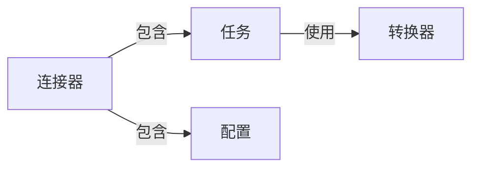

## 1.背景介绍

Apache Kafka是一个分布式流处理平台，被广泛应用于实时数据流的处理和分析。Kafka Connect是Apache Kafka的一个组件，专门用于构建和运行可重用的数据连接器，实现将数据从外部系统导入Kafka，或从Kafka导出数据到外部系统。

Kafka Connect的出现，让数据的导入和导出变得更为简单和高效，而不再需要开发人员编写大量的特定用途的数据导入/导出代码。它的出现，对于大数据处理领域来说，无疑是一种革新。

## 2.核心概念与联系

在深入了解Kafka Connect如何运行连接器之前，我们首先需要理解一些核心概念：

- **连接器（Connector）**：连接器是Kafka Connect的核心组件，负责管理数据的导入和导出。每个连接器都会运行在一个或多个任务（Task）中，任务是连接器的并行执行单元。

- **任务（Task）**：任务是连接器的工作单元，一个连接器可以拥有一个或多个任务。每个任务都会独立地处理数据的导入和导出。

- **转换器（Transform）**：转换器用于在数据导入或导出过程中，对数据进行转换处理，例如修改数据的格式、添加字段等。

- **配置（Config）**：配置是定义连接器行为的一组参数，包括连接器的名字、连接器类名、任务数量、连接器特定配置等。

这些核心概念之间的关系可以通过以下的Mermaid流程图进行展示：



## 3.核心算法原理具体操作步骤

要运行Kafka Connect连接器，我们需要遵循以下步骤：

1. **创建连接器配置**：首先，我们需要创建一个配置文件，定义连接器的行为。这个配置文件应该包含连接器的名字、连接器类名、任务数量、连接器特定配置等信息。

2. **启动Kafka Connect**：然后，我们需要启动Kafka Connect。Kafka Connect可以运行在独立模式或分布式模式。独立模式适合于开发和测试，而分布式模式适合于生产环境。

3. **提交连接器配置**：在Kafka Connect启动后，我们可以通过REST API提交连接器配置，启动连接器。

4. **监控连接器运行**：最后，我们可以通过Kafka Connect的REST API监控连接器的运行状态，包括连接器的运行状态、任务的运行状态等。

## 4.数学模型和公式详细讲解举例说明

在Kafka Connect中，数据的导入和导出都需要经过一系列的转换处理。这些转换处理可以用函数$f(x)$来表示，其中$x$是输入数据，$f(x)$是转换后的数据。

例如，我们有一个转换器，它的作用是将所有的字符串转换为大写。如果输入数据是字符串"hello"，那么转换后的数据$f("hello")$就是"HELLO"。

这个转换过程可以用以下的公式来表示：

$$
f(x) = x.toUpperCase()
$$

这个公式说明了，对于任何输入数据$x$，转换器都会调用$x$的`toUpperCase`方法，将$x$转换为大写。

## 5.项目实践：代码实例和详细解释说明

接下来，让我们通过一个简单的例子，来看看如何在实践中运行Kafka Connect连接器。

首先，我们需要创建一个连接器配置文件`my-connector.properties`，内容如下：

```properties
name=my-connector
connector.class=org.apache.kafka.connect.file.FileStreamSourceConnector
tasks.max=1
file=test.txt
topic=test
```

然后，我们可以通过以下命令启动Kafka Connect（独立模式）：

```bash
./bin/connect-standalone.sh config/connect-standalone.properties my-connector.properties
```

在Kafka Connect启动后，我们可以通过以下命令提交连接器配置：

```bash
curl -X POST -H "Content-Type: application/json" --data @my-connector.json http://localhost:8083/connectors
```

最后，我们可以通过以下命令监控连接器的运行状态：

```bash
curl http://localhost:8083/connectors/my-connector/status
```

## 6.实际应用场景

Kafka Connect在许多实际应用场景中都发挥了重要作用。例如，在实时数据流处理中，我们可以使用Kafka Connect将实时数据从各种数据源导入Kafka，然后使用Kafka Streams或KSQL进行实时数据处理，最后再使用Kafka Connect将处理结果导出到各种数据系统。

此外，Kafka Connect还被广泛应用于日志收集、数据库变更捕获（CDC）、数据同步等场景。

## 7.工具和资源推荐

如果你希望深入学习和使用Kafka Connect，以下是一些推荐的工具和资源：

- **Apache Kafka官方文档**：Apache Kafka的官方文档是学习Kafka和Kafka Connect的最佳资源。

- **Confluent Developer**：Confluent Developer提供了大量的Kafka和Kafka Connect的教程和示例。

- **Kafka Connect Hub**：Kafka Connect Hub是一个收集了大量Kafka Connect连接器的网站。

## 8.总结：未来发展趋势与挑战

随着大数据和实时数据处理的发展，Kafka Connect的重要性将越来越高。然而，Kafka Connect也面临着一些挑战，例如如何提高数据的导入和导出效率，如何处理大量的并发任务，如何保证数据的准确性和完整性等。

未来，我们期待Kafka Connect能够通过不断的创新和优化，更好地解决这些挑战，为大数据处理提供更强大的支持。

## 9.附录：常见问题与解答

在使用Kafka Connect过程中，你可能会遇到一些问题。以下是一些常见问题及其解答：

- **问：我可以在一个连接器中运行多个任务吗？**
  
  答：是的，你可以在连接器配置中设置`tasks.max`参数，定义任务的数量。

- **问：我可以在数据导入和导出过程中修改数据吗？**
  
  答：是的，你可以使用转换器在数据导入和导出过程中修改数据。

- **问：我如何监控连接器的运行状态？**
  
  答：你可以通过Kafka Connect的REST API监控连接器的运行状态。

作者：禅与计算机程序设计艺术 / Zen and the Art of Computer Programming