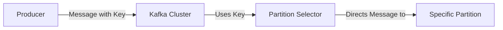

## 1.背景介绍
Apache Kafka是一种高吞吐量的分布式发布订阅消息系统，它可以处理消费者网站的所有动作流数据。这种动作（页面浏览，搜索和其他用户的行为）都是在现代网络上的许多社交媒体网站的关键数据，这些数据提供了实时处理的方式来进行推荐，广告和其他实时服务。在这篇文章中，我们将深入探讨Kafka的消息密钥机制，这是一种精准路由的利器。

## 2.核心概念与联系
在Kafka中，消息是以键值对的形式发送的，其中键（key）是可选的，而值（value）是消息的主体内容。消息密钥在Kafka的消息路由过程中起着至关重要的作用。具体来说，生产者在发送消息到Kafka集群时，可以选择指定一个密钥。这个密钥将被用于确定这条消息应该被发送到哪个分区。



## 3.核心算法原理具体操作步骤
在Kafka中，消息的路由过程遵循以下步骤：

1. 生产者创建一条消息，可以选择为这条消息指定一个密钥。
2. Kafka集群接收到这条消息后，将使用密钥来选择一个分区。
3. Kafka集群将消息发送到选定的分区。

在选择分区时，Kafka使用了一个简单但有效的算法：`hash(key) mod num_partitions`。这个算法确保了同一个密钥的所有消息都会被发送到同一个分区。

## 4.数学模型和公式详细讲解举例说明
Kafka使用的分区选择算法可以用以下的数学模型进行表示：

$$
\text{partition} = hash(\text{key}) \mod \text{num_partitions}
$$

其中，`hash(key)`是将密钥通过哈希函数转换得到的哈希值，`num_partitions`是主题的分区数量。

例如，假设我们有一个主题，它有3个分区，我们有一个密钥`"key1"`，通过哈希函数我们得到的哈希值是10，那么这条消息将被发送到分区`10 mod 3 = 1`。

## 5.项目实践：代码实例和详细解释说明
接下来，让我们通过一个简单的Java程序来演示如何使用Kafka的消息密钥。

```java
public class ProducerDemo {
    public static void main(String[] args) {
        Properties props = new Properties();
        props.put("bootstrap.servers", "localhost:9092");
        props.put("key.serializer", "org.apache.kafka.common.serialization.StringSerializer");
        props.put("value.serializer", "org.apache.kafka.common.serialization.StringSerializer");

        Producer<String, String> producer = new KafkaProducer<>(props);
        for (int i = 0; i < 100; i++) {
            producer.send(new ProducerRecord<String, String>("my-topic", Integer.toString(i), Integer.toString(i)));
        }

        producer.close();
    }
}
```
在这个程序中，我们创建了一个生产者，然后发送了100条消息到`"my-topic"`主题。每条消息的密钥和值都是消息的序号。

## 6.实际应用场景
Kafka的消息密钥机制在许多实际应用中都发挥了重要作用。例如，在日志处理系统中，我们可以使用日志事件的源IP地址作为密钥，这样来自同一个源的所有日志事件都会被发送到同一个分区，从而保证了同一个源的日志事件的处理顺序。在电商网站中，我们可以使用用户ID作为密钥，这样同一个用户的所有行为都会被发送到同一个分区，从而保证了同一个用户的行为的处理顺序。

## 7.工具和资源推荐
如果你想深入了解Kafka的消息密钥机制，我推荐以下的工具和资源：

- Kafka官方文档：这是学习Kafka的最好资源，它详细介绍了Kafka的各种特性和使用方法。
- Kafka源码：如果你想了解Kafka的内部工作原理，阅读Kafka的源码是最好的方法。

## 8.总结：未来发展趋势与挑战
随着数据处理需求的增长，Kafka的消息密钥机制将发挥越来越重要的作用。然而，这也带来了一些挑战，例如如何有效地处理大量的密钥，如何处理密钥的变化等。

## 9.附录：常见问题与解答
**问：我可以不使用消息密钥吗？**

答：可以。如果你不指定消息的密钥，Kafka会随机选择一个分区来发送消息。

**问：我可以更改消息的密钥吗？**

答：一旦消息被发送，你就不能更改它的密钥了。如果你需要更改密钥，你需要重新发送这条消息。

**问：消息的密钥和值可以是任何类型的数据吗？**

答：是的，只要你的数据可以被序列化，你就可以使用它作为密钥或值。

作者：禅与计算机程序设计艺术 / Zen and the Art of Computer Programming
