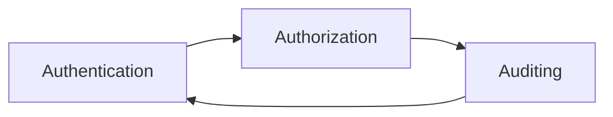

# Knox原理与代码实例讲解

## 1.背景介绍

Knox原理是分布式系统中保障数据安全的重要原理,由Mike Burrows在2006年提出。它为分布式系统中的数据存储和访问提供了一种安全可靠的机制。在当今大数据时代,数据安全和隐私保护至关重要,Knox原理为此提供了有力的理论基础和实践指导。

### 1.1 分布式系统面临的安全挑战
#### 1.1.1 数据泄露风险
#### 1.1.2 未授权访问
#### 1.1.3 数据完整性受到威胁

### 1.2 Knox原理的提出背景
#### 1.2.1 Mike Burrows的研究
#### 1.2.2 Google内部项目的需求
#### 1.2.3 学术界对分布式安全的探索

### 1.3 Knox原理的意义
#### 1.3.1 为分布式系统提供安全保障
#### 1.3.2 推动数据安全和隐私保护
#### 1.3.3 为后续研究奠定基础

## 2.核心概念与联系

Knox原理包含三个核心概念:Authentication(认证)、Authorization(授权)和Auditing(审计)。它们相互关联,共同构成了Knox原理的基础。

### 2.1 Authentication(认证)
#### 2.1.1 定义:验证用户身份
#### 2.1.2 常见认证方式:用户名密码、数字证书等
#### 2.1.3 在Knox原理中的作用

### 2.2 Authorization(授权)  
#### 2.2.1 定义:控制用户对资源的访问权限
#### 2.2.2 常见授权模型:ACL、RBAC等
#### 2.2.3 在Knox原理中的作用

### 2.3 Auditing(审计)
#### 2.3.1 定义:记录和检查用户行为
#### 2.3.2 审计的重要性
#### 2.3.3 在Knox原理中的作用

### 2.4 三者之间的关系


## 3.核心算法原理具体操作步骤

Knox原理的核心是通过一系列算法和协议来实现认证、授权和审计功能。下面详细介绍其中的几个关键算法。

### 3.1 Kerberos认证协议
#### 3.1.1 Kerberos协议原理
#### 3.1.2 Kerberos认证过程
#### 3.1.3 Kerberos的优缺点

### 3.2 ACL访问控制
#### 3.2.1 ACL的基本概念  
#### 3.2.2 ACL的数据结构
#### 3.2.3 ACL的授权过程

### 3.3 审计日志生成与分析
#### 3.3.1 审计日志的格式
#### 3.3.2 生成审计日志的方法
#### 3.3.3 审计日志的分析技术

## 4.数学模型和公式详细讲解举例说明

Knox原理涉及到一些数学模型和公式,这里选取几个代表性的进行讲解。

### 4.1 访问控制矩阵模型
访问控制矩阵用于描述主体对客体的访问权限关系,可表示为:

$$
A = 
\begin{bmatrix}
a_{11} & a_{12} & \cdots & a_{1n}\\
a_{21} & a_{22} & \cdots & a_{2n}\\
\vdots & \vdots & \ddots & \vdots\\
a_{m1} & a_{m2} & \cdots & a_{mn}
\end{bmatrix}
$$

其中,$a_{ij}$表示主体$S_i$对客体$O_j$拥有的权限。

举例:假设有用户Alice和Bob,资源File1和File2,矩阵A可能为:

$$
A = 
\begin{bmatrix}
read & write\\  
\emptyset & read
\end{bmatrix}
$$

表示Alice对File1有读写权限,对File2无权限;Bob对File1无权限,对File2有读权限。

### 4.2 贝尔-拉帕杜拉模型
该模型是一个保密性模型,引入主体和客体的安全级别的概念。其数学定义为:

1. $L(S_i) \leq L(O_j)$ (No Read Up) 
2. $L(O_j) \leq L(S_i)$ (No Write Down)

其中,$L(S_i)$和$L(O_j)$分别表示主体$S_i$和客体$O_j$的安全级别。直观地说,就是主体只能读取比自己级别低的客体,只能写入比自己级别高的客体。

## 5.项目实践:代码实例和详细解释说明

下面通过一个简单的Java项目来演示Knox原理的代码实现。项目包含用户认证、访问控制和审计日志等功能。

### 5.1 用户认证
```java
public class AuthenticationService {
  public boolean authenticate(String username, String password) {
    // 从数据库获取用户信息
    User user = userDao.getUser(username);
    if (user != null) {
      // 验证密码
      return user.getPassword().equals(password);
    }
    return false;
  }
}
```
`AuthenticationService`类提供了`authenticate`方法,用于验证用户名和密码。它首先从数据库获取用户信息,然后比对密码是否正确。

### 5.2 访问控制
```java
public class AuthorizationService {
  public boolean checkPermission(String username, String resource, String action) {
    // 获取用户拥有的角色  
    List<String> roles = userDao.getUserRoles(username);
    // 获取资源对应的权限
    List<Permission> permissions = permissionDao.getPermissions(resource);
    // 检查用户是否具有指定权限
    for (Permission p : permissions) {
      if (roles.contains(p.getRole()) && p.getActions().contains(action)) {
        return true;
      }
    }
    return false;
  }
}
```
`AuthorizationService`类提供了`checkPermission`方法,用于检查用户是否具有对特定资源执行特定操作的权限。它首先获取用户拥有的角色,然后获取资源对应的权限列表,最后检查用户的角色是否包含所需的权限。

### 5.3 审计日志
```java
public class AuditLogger {
  public void log(String username, String resource, String action, boolean success) {
    // 创建审计日志对象
    AuditLog log = new AuditLog();
    log.setUsername(username);
    log.setResource(resource);
    log.setAction(action);
    log.setSuccess(success);
    log.setTimestamp(new Date());
    // 保存审计日志到数据库
    auditLogDao.save(log);
  }  
}
```
`AuditLogger`类提供了`log`方法,用于记录用户对资源的访问行为。它创建一个`AuditLog`对象,设置相关属性,然后将其保存到数据库中。

## 6.实际应用场景

Knox原理在实际系统中有广泛的应用,下面列举几个典型场景。

### 6.1 企业内部系统
- 员工身份认证
- 不同部门的数据隔离
- 记录员工的操作行为

### 6.2 在线金融服务
- 用户的身份验证
- 账户信息的授权访问
- 交易行为的审计

### 6.3 医疗信息系统  
- 医护人员和患者的身份认证
- 控制对病历等敏感信息的访问
- 记录并审查医疗操作

## 7.工具和资源推荐
- Apache Ranger:实现Knox原理的企业级安全框架
- Spring Security:基于Knox原理的Java安全框架
- JAAS(Java Authentication and Authorization Service):Java标准的安全框架
- OAuth 2.0:广泛应用的授权协议
- OpenID Connect:基于OAuth 2.0的认证协议

## 8.总结:未来发展趋势与挑战

Knox原理为分布式系统的安全提供了重要的理论基础和实践指导。未来在大数据、云计算、物联网等领域,对数据安全和隐私保护的要求将更加严格,Knox原理也面临新的挑战和发展机遇。

### 8.1 细粒度的访问控制
### 8.2 隐私保护与数据脱敏
### 8.3 新的认证授权模型
### 8.4 审计数据的智能分析

## 9.附录:常见问题与解答

### Q1:Knox原理适用于哪些系统?
A1:Knox原理适用于需要认证、授权和审计的分布式系统,如企业内部系统、在线服务等。

### Q2:Knox原理如何保证数据安全?  
A2:通过可靠的用户认证、严格的访问控制和详细的审计记录,Knox原理从多方面保障数据安全。

### Q3:实现Knox原理需要哪些技术?
A3:常见的技术有Kerberos、JAAS、Spring Security、Apache Ranger等,也可以使用OAuth、OpenID Connect等标准协议。

作者：禅与计算机程序设计艺术 / Zen and the Art of Computer Programming