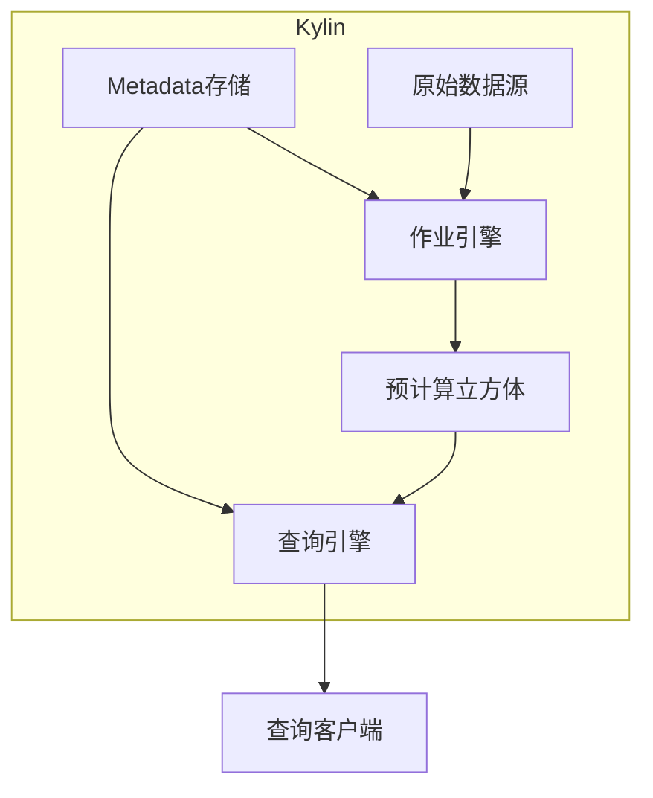

# Kylin原理与代码实例讲解

## 1.背景介绍

Apache Kylin是一个开源的分析型大数据处理引擎,旨在提供SQL查询在Hadoop之上的低延迟、高性能分析能力。它最初由eBay公司开发,后捐赠给Apache软件基金会。Kylin的核心是预计算技术,通过构建预计算立方体来加速查询处理,大幅降低查询延迟。

在大数据时代,企业需要快速分析海量数据以获取洞见和做出决策。然而,直接在Hadoop/Spark等分布式存储系统上执行复杂分析查询通常会遇到延迟高、效率低的问题。Kylin的出现就是为了解决这一痛点,充分利用Hadoop的低成本存储,同时提供快速的SQL交互分析能力。

### 1.1 Kylin架构概览

Kylin的总体架构由以下几个核心组件组成:



- **Metadata存储**: 存储Kylin的元数据信息,包括数据模型、作业配置等。
- **查询引擎**: 接收SQL查询请求,利用预计算立方体快速返回结果。
- **作业引擎**: 根据元数据配置,从原始数据源抽取数据,构建预计算立方体。
- **预计算立方体**: Kylin的核心,存储预先计算好的聚合数据。
- **原始数据源**: 存放原始数据的Hadoop/Hive等大数据平台。

## 2.核心概念与联系  

### 2.1 预计算立方体

预计算立方体(Cube)是Kylin的核心概念。它是一种数据预处理技术,通过预先计算常用的维度组合和度量值,将原始数据转换为高度压缩和优化的数据结构。

预计算立方体包含以下几个关键概念:

- **维度(Dimension)**: 用于数据切分和过滤的属性字段,如日期、城市、产品类别等。
- **基础立方体(Base Cube)**: 包含全量原始数据记录的立方体。
- **衍生立方体(Derived Cube)**: 基于基础立方体进行聚合和分区的立方体。
- **分区(Partition)**: 将立方体按时间或其他维度分割成多个独立的数据块。
- **层级(Hierarchy)**: 维度的层次结构,如"国家->省份->城市"。

通过构建多层次的预计算立方体,Kylin能够快速响应各种维度组合和聚合粒度的查询请求,避免了实时计算的高延迟。

### 2.2 查询重写

Kylin的查询引擎会自动将用户的SQL查询重写为对预计算立方体的查询。这个过程包括以下几个步骤:

1. **查询解析**: 解析SQL语句,识别查询涉及的维度、度量和过滤条件。
2. **立方体选择**: 根据查询条件,选择最佳匹配的预计算立方体。
3. **查询重写**: 将原始SQL转换为对立方体的查询,包括维度映射、聚合函数转换等。
4. **查询执行**: 在Hadoop/Spark上执行重写后的查询,获取结果。

查询重写的关键在于充分利用预计算立方体中的数据,最大限度减少实时计算的开销。

## 3.核心算法原理具体操作步骤

### 3.1 立方体构建算法

Kylin采用了一种称为"基于层次的立方体算法"(Hierarchical Cubing Algorithm)来构建预计算立方体。该算法的核心思想是:

1. 首先构建基础立方体,包含全量原始数据记录。
2. 然后基于基础立方体,按层次构建衍生立方体。
3. 每一层次的立方体都是对上一层次立方体进行聚合和分区操作得到的。

算法的具体步骤如下:

1. **数据抽取**: 从原始数据源(如Hive表)抽取全量数据,构建基础立方体。
2. **层次分解**: 根据维度层次关系,确定立方体构建的层次顺序。
3. **立方体迭代**:
    a. 初始化当前层次为基础立方体。
    b. 对当前层次的立方体执行分区和聚合操作,生成下一层次的立方体。
    c. 将下一层次立方体作为当前层次,重复步骤b,直到达到最顶层。
4. **立方体存储**: 将生成的各层次立方体持久化存储,作为查询时的数据源。

这种分层构建的方式,可以有效控制立方体数量和存储空间,同时满足不同粒度查询的需求。

### 3.2 查询重写算法

Kylin的查询重写算法需要将用户的原始SQL查询转换为对预计算立方体的等效查询。算法的核心步骤包括:

1. **查询解析**: 解析SQL语句,提取查询涉及的维度、度量和过滤条件。
2. **立方体选择**: 根据查询条件,从元数据中选择最匹配的预计算立方体。
    a. 评估每个立方体与查询的匹配程度。
    b. 选择匹配度最高的立方体作为候选立方体。
3. **查询重写**:
    a. 将查询中的维度映射到立方体的维度。
    b. 将聚合函数转换为立方体中已计算的聚合形式。
    c. 将过滤条件转换为立方体分区条件。
    d. 生成对立方体的等效查询语句。
4. **查询执行**: 在Hadoop/Spark上执行重写后的查询,获取结果。

查询重写算法的关键在于充分利用预计算立方体中的数据,尽可能避免昂贵的实时计算操作。算法需要在查询覆盖率和计算开销之间寻找平衡。

## 4.数学模型和公式详细讲解举例说明  

### 4.1 数据立方体模型

数据立方体模型是Kylin预计算技术的理论基础。一个数据立方体可以形式化地表示为:

$$
C = (D_1, D_2, \ldots, D_n, M_1, M_2, \ldots, M_m)
$$

其中:
- $C$ 表示立方体
- $D_i$ 表示第 $i$ 个维度
- $M_j$ 表示第 $j$ 个度量值

每个维度 $D_i$ 都有一组有限的成员值,表示该维度的不同分类。例如,产品维度可能包含"电子产品"、"服装"等成员值。

度量值 $M_j$ 表示需要统计和分析的数值,如销售额、库存数量等。

通过不同维度成员的组合,立方体可以细分为不同的单元格,每个单元格包含对应维度组合下的度量值。例如,在"产品=电子产品,区域=北京"这个单元格中,可以查询到电子产品在北京地区的销售额。

### 4.2 立方体分区策略

为了优化存储和查询效率,Kylin采用了分区(Partition)技术将立方体划分为多个独立的数据块。常用的分区策略有:

1. **范围分区(Range Partition)**

   根据某个维度的值范围对立方体进行分区,常用于时间维度。例如,按年分区可将数据划分为"2020年"、"2021年"等多个分区。

   范围分区的优点是可以快速过滤掉不需要的分区,但分区数量有限制。

2. **散列分区(Hash Partition)** 

   根据维度值的哈希值对立方体进行分区,可实现更细粒度的数据划分。

   散列分区可支持更多分区数量,但查询时需要扫描所有分区。

3. **复合分区(Composite Partition)**

   将多种分区策略组合使用,如先按范围分区,再在每个范围分区内进行散列分区。

通过合理的分区策略,可以显著提高查询效率和存储利用率。

### 4.3 查询代价模型

为了选择最优的预计算立方体,Kylin采用了基于代价的查询优化模型。该模型旨在最小化查询执行的代价,包括计算代价和I/O代价。

查询代价可以表示为:

$$
\text{Cost}(Q, C) = w_1 \cdot \text{ComputeCost}(Q, C) + w_2 \cdot \text{IOCost}(Q, C)
$$

其中:
- $Q$ 表示查询
- $C$ 表示立方体
- $\text{ComputeCost}(Q, C)$ 表示在立方体 $C$ 上执行查询 $Q$ 的计算代价
- $\text{IOCost}(Q, C)$ 表示查询的I/O代价
- $w_1$、$w_2$ 是计算代价和I/O代价的权重系数

计算代价取决于查询涉及的计算操作的复杂度,如聚合、连接等。I/O代价则与需要扫描的数据量有关。

在查询重写过程中,Kylin会评估所有候选立方体的代价,并选择代价最小的立方体执行查询。

通过数学建模和代价优化,Kylin可以实现高效的查询执行,充分利用预计算立方体的优势。

## 5.项目实践:代码实例和详细解释说明

本节将通过一个实际项目案例,展示如何使用Kylin进行数据建模、立方体构建和查询分析。我们将基于一个在线零售商场的销售数据集,构建预计算立方体并执行常见的业务智能查询。

### 5.1 数据准备

我们的数据集存储在Hive表中,包含以下字段:

- `order_id`: 订单ID
- `order_date`: 订单日期
- `customer_id`: 客户ID
- `customer_name`: 客户姓名
- `customer_city`: 客户所在城市
- `product_id`: 产品ID
- `product_name`: 产品名称
- `product_category`: 产品类别
- `order_amount`: 订单金额

### 5.2 Kylin模型定义

首先,我们需要在Kylin中定义数据模型,指定维度和度量。以下是模型的JSON描述:

```json
{
  "uuid": "89af4464-2cdb-4b07-b39e-4c29856309aa",
  "name": "ecom_sales_model",
  "fact_table": "ecom_sales_fact",
  "dimensions": [
    {
      "table": "ecom_sales_fact",
      "columns": ["order_date", "customer_city", "product_category"]
    }
  ],
  "measures": [
    {
      "name": "total_order_amount",
      "function": {
        "expression": "SUM(order_amount)",
        "returnType": "decimal(38,2)"
      }
    }
  ]
}
```

在这个模型中,我们将`order_date`、`customer_city`和`product_category`作为维度,`order_amount`的总和作为度量值。

### 5.3 立方体构建

接下来,我们需要配置并启动立方体构建作业。以下是一个示例作业配置:

```json
{
  "name": "ecom_sales_cube",
  "model_name": "ecom_sales_model",
  "dimensions": [
    {
      "name": "order_date",
      "hierarchy": [
        {
          "level": "YEAR",
          "coding": "datetime"
        },
        {
          "level": "MONTH",
          "coding": "datetime"
        },
        {
          "level": "DAY",
          "coding": "datetime"
        }
      ]
    },
    {
      "name": "customer_city",
      "hierarchy": [
        {
          "level": "CITY"
        }
      ]
    },
    {
      "name": "product_category",
      "hierarchy": [
        {
          "level": "CATEGORY"
        }
      ]
    }
  ]
}
```

在这个配置中,我们定义了三个维度的层次结构:
- `order_date`按年、月、日分层
- `customer_city`只有一个城市层级
- `product_category`只有一个类别层级

Kylin将根据这些配置,构建出多层次的预计算立方体。

执行以下命令启动立方体构建:

```bash
kylin.sh org.apache.kylin.job.BuildCuboidJob -cube ecom_sales_cube -project learn_kylin
```

构建完成后,Kylin会将立方体数据持久化存储在Hadoop/Hive中。

### 5.4 查询分析

现在,我们可以通过SQL查询利用预计算立方体进行分析。例如,查询每个产品类别在每个城市的总销售额:

```sql