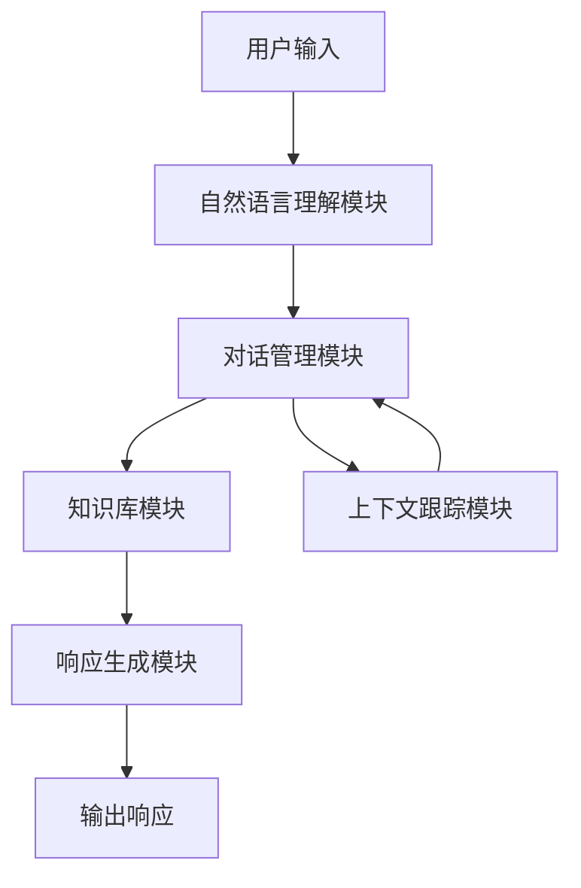

# LLM-based Chatbot System Architecture

## 1. 背景介绍

在当今信息时代,人工智能(AI)技术的发展日新月异,其中以大型语言模型(LLM)为代表的自然语言处理(NLP)技术备受关注。传统的基于规则或检索的对话系统已难以满足用户对智能化、个性化和多场景交互的需求。而基于LLM的对话系统(Chatbot)凭借其强大的语言理解和生成能力,为构建高质量的人机交互体验提供了新的契机。

本文将深入探讨基于LLM的Chatbot系统架构,揭示其核心原理、关键技术,并介绍在实际应用中的最佳实践。无论您是AI开发者、架构师还是技术爱好者,相信这篇文章都将为您提供有价值的见解。

## 2. 核心概念与联系

### 2.1 大型语言模型(LLM)

大型语言模型是指具有数十亿乃至上万亿参数的深度神经网络模型,通过预训练的方式在海量文本数据上学习语义和上下文知识。这些模型擅长捕捉语言的内在规律和模式,可用于广泛的NLP任务,如文本生成、机器翻译、问答等。

常见的LLM包括:

- GPT(Generative Pre-trained Transformer)系列模型
- BERT(Bidirectional Encoder Representations from Transformers)
- XLNet
- T5(Text-to-Text Transfer Transformer)
- ...

### 2.2 Chatbot系统

Chatbot系统旨在模拟人类的对话方式,通过自然语言与用户进行交互。基于LLM的Chatbot具有以下优势:

- **语境理解能力强** 可捕捉对话的语义和上下文
- **响应生成自然流畅** 输出类似于人类写作风格
- **知识覆盖面广** 预训练数据包含各领域知识
- **可扩展和迁移** 支持通过少量数据快速调整到新领域

### 2.3 核心挑战

尽管LLM大大提升了Chatbot的性能,但在实际应用中仍面临诸多挑战:

- **一致性** 确保对话上下文的连贯性和响应的一致性
- **安全性** 避免生成有害、不当或不符合道德的内容
- **可解释性** 赋予Chatbot决策的透明度和可解释性
- **个性化** 根据不同场景和用户习惯定制对话风格
- **知识更新** 及时整合最新领域知识到对话系统中

## 3. 核心算法原理具体操作步骤

基于LLM的Chatbot系统架构通常由以下几个关键组件构成:



### 3.1 自然语言理解模块

该模块的主要任务是将用户的自然语言输入转化为机器可以理解的语义表示,通常包括以下步骤:

1. **文本预处理** 对原始文本进行标准化、分词、词性标注等预处理操作。
2. **命名实体识别** 识别出文本中的人名、地名、组织机构名等命名实体。
3. **句法分析** 通过依存分析或短语结构分析等方法确定句子的语法结构。
4. **语义分析** 利用LLM捕捉句子的语义,构建语义表示。

这一过程往往借助LLM的语言理解能力,结合一些经典的NLP技术实现。

### 3.2 对话管理模块

对话管理模块是整个系统的大脑和控制中心,负责协调各模块间的交互,维护对话状态和上下文信息。主要功能包括:

1. **意图识别** 根据用户输入确定对话意图,如查询、预订、投诉等。
2. **对话状态跟踪** 跟踪对话的阶段和进度,记录已获取的信息。
3. **对话策略选择** 基于对话状态选择合适的对话策略,如询问缺失信息、执行操作等。
4. **上下文整合** 将对话历史、知识库等上下文信息集成到响应生成中。

该模块常采用基于规则或机器学习的方法实现,并与LLM紧密配合。

### 3.3 知识库模块

知识库模块存储着系统所需的各类知识,为响应生成提供所需信息,主要包括:

1. **领域知识库** 存储特定领域的实体知识、事实知识等结构化数据。
2. **常识知识库** 包含人类日常生活中的常识性知识。
3. **对话知识库** 存储历史对话记录、FAQ等对话相关知识。

知识库可以是关系型或NoSQL数据库、知识图谱等多种形式,并支持高效查询和更新。

### 3.4 响应生成模块

响应生成模块是Chatbot的核心,利用LLM生成自然、流畅、上下文相关的回复。生成过程包括:

1. **输入构建** 将对话历史、知识库信息等上下文信息编码为LLM可理解的输入表示。
2. **LLM推理** 使用LLM对给定输入进行推理,生成初始响应。
3. **响应后处理** 对生成的响应进行过滤、重写等处理,确保其质量和安全性。

该模块的性能直接影响Chatbot的对话质量,需要针对不同场景和任务进行优化和微调。

### 3.5 上下文跟踪模块

上下文跟踪模块负责管理和维护对话的上下文信息,确保响应的连贯性和一致性,主要包括:

1. **会话上下文跟踪** 跟踪当前会话的对话历史、已获取的信息等状态。
2. **长期记忆跟踪** 记录用户的长期偏好、习惯等个性化信息。
3. **知识更新** 从对话中提取新知识,并更新到知识库中。

该模块与对话管理模块紧密协作,为上下文感知的响应生成提供支持。

## 4. 数学模型和公式详细讲解举例说明

LLM的核心是基于Transformer的自注意力机制,能够有效捕捉输入序列中任意两个位置之间的依赖关系。以GPT模型为例,其自注意力计算过程可表示为:

$$
\mathrm{Attention}(Q, K, V) = \mathrm{softmax}(\frac{QK^T}{\sqrt{d_k}})V
$$

其中 $Q$、$K$、$V$ 分别表示查询(Query)、键(Key)和值(Value)的线性映射,通过计算查询与每个键的相似性得分,对值进行加权求和得到最终的注意力表示。

$$
\begin{aligned}
Q &= XW_Q \\
K &= XW_K \\
V &= XW_V
\end{aligned}
$$

$W_Q$、$W_K$、$W_V$ 是可学习的权重矩阵, $\sqrt{d_k}$ 是缩放因子,用于避免点积过大导致的梯度不稳定问题。

多头注意力机制(Multi-Head Attention)则将注意力分成多个子空间,分别计算后拼接,有利于捕捉不同位置的相关性:

$$
\mathrm{MultiHead}(Q, K, V) = \mathrm{Concat}(\mathrm{head}_1, ..., \mathrm{head}_h)W^O
$$

$$
\mathrm{head}_i = \mathrm{Attention}(QW_i^Q, KW_i^K, VW_i^V)
$$

其中 $W_i^Q$、$W_i^K$、$W_i^V$ 和 $W^O$ 均为可学习参数。

通过堆叠多层Transformer解码器,LLM可以在不同的表示子空间中捕捉输入序列的不同特征,最终生成高质量的文本输出。

以上是LLM中自注意力机制的数学原理,在实际应用中,还需要结合各种优化技术(如残差连接、层归一化等)以提升模型性能。

## 5. 项目实践: 代码实例和详细解释说明

为了更好地理解LLM在Chatbot系统中的应用,我们将基于Python生态构建一个简单的示例项目。本示例使用开源的GPT-2模型作为LLM,并集成其他必要模块,实现一个可以进行基本对话的Chatbot。

### 5.1 环境配置

首先,我们需要安装所需的Python包:

```bash
pip install transformers torch
```

其中 `transformers` 库提供了各种预训练语言模型的加载和使用接口, `torch` 则是深度学习框架。

### 5.2 加载LLM

```python
from transformers import GPT2LMHeadModel, GPT2Tokenizer

# 加载预训练模型和分词器
model = GPT2LMHeadModel.from_pretrained('gpt2')
tokenizer = GPT2Tokenizer.from_pretrained('gpt2')
```

我们从Hugging Face的模型库中加载GPT-2的预训练权重和分词器。

### 5.3 文本生成

接下来,实现一个简单的文本生成函数:

```python
import torch

def generate_text(prompt, max_length=100, top_k=3, top_p=0.9, num_beams=4):
    input_ids = tokenizer.encode(prompt, return_tensors='pt')
    
    output = model.generate(input_ids, 
                             max_length=max_length,
                             do_sample=True,
                             top_k=top_k,
                             top_p=top_p,
                             num_beams=num_beams,
                             early_stopping=True)
    
    return tokenizer.decode(output[0], skip_special_tokens=True)
```

这个函数接受一个文本提示 `prompt` 作为输入,利用 `model.generate` 方法对其进行扩展生成新文本。我们可以通过设置参数如 `max_length`、`top_k`、`top_p` 和 `num_beams` 来控制生成的长度、随机性和质量。

### 5.4 对话交互

最后,我们构建一个简单的命令行界面,允许用户与Chatbot进行对话交互:

```python
print("欢迎使用 LLM Chatbot! 输入 'quit' 退出对话。")

while True:
    user_input = input("您: ")
    if user_input.lower() == 'quit':
        break
    
    prompt = f"Human: {user_input}\nAssistant:"
    response = generate_text(prompt)
    print(f"Chatbot: {response}")
```

在这个循环中,我们获取用户输入,将其与提示词 `"Human:"` 拼接作为 `generate_text` 函数的输入。然后,Chatbot会生成相应的回复,并将其打印到控制台。

通过这个简单的示例,我们可以体会到将LLM集成到Chatbot系统中的基本流程。在实际应用中,我们还需要添加更多模块(如自然语言理解、对话管理等),并针对特定场景进行优化,以构建更加智能和人性化的对话系统。

## 6. 实际应用场景

基于LLM的Chatbot系统在诸多领域展现出巨大的应用潜力,可以为企业和用户带来极大的价值。以下是一些典型的应用场景:

### 6.1 智能客服

传统的基于规则或检索的客服系统往往存在局限性,难以处理复杂的查询和需求。而基于LLM的智能客服系统可以提供更加自然、个性化的服务体验,快速高效地解决客户问题,从而提升客户满意度和品牌形象。

### 6.2 教育辅助

Chatbot可以作为虚拟教师或学习伙伴,为学生提供个性化的学习辅导和答疑解惑。凭借广博的知识面和强大的问答能力,LLM驱动的教育辅助系统有望促进教育公平,提高教学质量和效率。

### 6.3 医疗健康

在医疗健康领域,Chatbot可以作为患者的首诊助手,根据症状提供初步诊断建议,并指导就医流程。同时,它也可以为医护人员提供知识查询和决策支持,提高诊疗质量和效率。

### 6.4 金融服务

金融行业对信息安全和合规性要求极为严格,LLM驱动的Chatbot可以在满足这些要求的前提下,为客户提供个性化的理财咨询、投资建议等增值服务,提升用户体验和