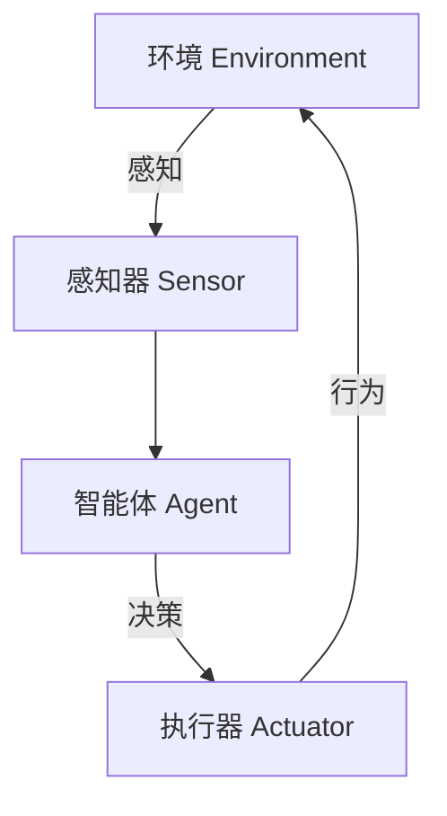
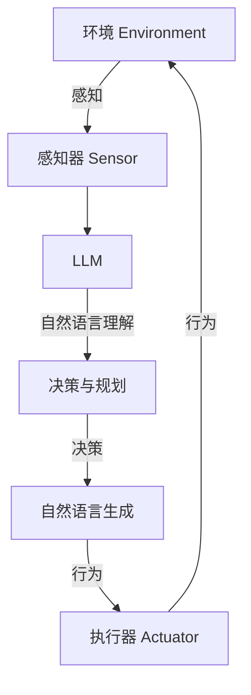

# LLM-based Single-Agent System

## 1. 背景介绍

在人工智能领域,单智能体系统(Single-Agent System)是指由单个智能体(Agent)组成的系统,该智能体能够感知环境、做出决策并执行相应的行为。传统的单智能体系统通常采用符号主义(Symbolism)或连接主义(Connectionism)方法,例如基于规则的系统、决策树、贝叶斯网络等。然而,近年来大型语言模型(Large Language Model,LLM)的兴起为单智能体系统带来了新的发展契机。

LLM是一种基于自然语言处理(Natural Language Processing,NLP)技术训练的大规模语言模型,能够生成类似于人类的自然语言输出。LLM具有广泛的知识覆盖面,可以应用于各种自然语言处理任务,如问答、文本生成、机器翻译等。由于LLM的强大语言理解和生成能力,将其与单智能体系统相结合,可以赋予智能体更加自然、灵活的交互方式,提高系统的智能化水平。

## 2. 核心概念与联系

### 2.1 单智能体系统(Single-Agent System)

单智能体系统是指由单个智能体组成的系统,其核心组成部分包括:

- 智能体(Agent):系统的核心部分,负责感知环境、做出决策并执行行为。
- 环境(Environment):智能体所处的外部世界,包括各种状态和事件。
- 感知器(Sensor):用于获取环境信息的组件。
- 执行器(Actuator):用于执行智能体决策的组件,改变环境状态。

单智能体系统的工作流程如下所示:



### 2.2 大型语言模型(LLM)

大型语言模型(LLM)是一种基于自然语言处理技术训练的大规模语言模型,具有以下核心特点:

- 大规模参数:LLM通常包含数十亿甚至上万亿的参数,使其能够捕获丰富的语言知识。
- 自监督学习:LLM采用自监督学习方式,在大量文本数据上进行预训练,无需人工标注。
- 通用性:LLM具有广泛的知识覆盖面,可以应用于各种自然语言处理任务。
- 上下文理解:LLM能够理解输入文本的上下文语义,生成相关且连贯的输出。

### 2.3 LLM与单智能体系统的结合

将LLM与单智能体系统相结合,可以赋予智能体更加自然、灵活的交互方式,提高系统的智能化水平。LLM可以作为智能体的核心部分,负责理解环境信息、做出决策并生成自然语言输出,实现与用户或其他系统的交互。同时,LLM也可以作为智能体的辅助模块,提供语言理解和生成能力,支持智能体完成特定任务。

## 3. 核心算法原理具体操作步骤

### 3.1 LLM的训练过程

LLM的训练过程通常分为两个阶段:预训练(Pretraining)和微调(Fine-tuning)。

1. 预训练阶段:

   在预训练阶段,LLM在大量未标注的文本数据上进行自监督学习,目标是捕获语言的一般规律和知识。常见的预训练目标包括:

   - 掩码语言模型(Masked Language Modeling,MLM):随机掩码部分输入词,模型需要预测被掩码的词。
   - 下一句预测(Next Sentence Prediction,NSP):判断两个句子是否连贯。
   - 自回归语言模型(Autoregressive Language Modeling,ALM):给定前缀,模型需要预测下一个词。

   预训练过程采用自监督学习,无需人工标注,可以利用大量文本数据进行训练,获得丰富的语言知识。

2. 微调阶段:

   在微调阶段,将预训练好的LLM在特定任务的数据集上进行进一步训练,使模型适应特定任务。微调过程通常采用有监督学习,需要人工标注的数据集。常见的微调方法包括:

   - 序列到序列(Sequence-to-Sequence):将任务建模为从输入序列生成输出序列的问题,如机器翻译、文本摘要等。
   - 分类(Classification):将任务建模为分类问题,如情感分析、文本分类等。
   - 问答(Question Answering):将任务建模为从给定文本中回答问题。

   通过微调,LLM可以在保留预训练知识的基础上,进一步适应特定任务的需求,提高模型在该任务上的性能。

### 3.2 LLM在单智能体系统中的应用

在单智能体系统中,LLM可以作为智能体的核心部分或辅助模块,实现以下功能:

1. 自然语言理解(Natural Language Understanding,NLU):

   LLM可以理解来自环境的自然语言输入,如用户查询、指令等。通过对输入文本的上下文理解,LLM能够捕获语义信息,为智能体的决策提供依据。

2. 决策与规划(Decision Making and Planning):

   基于对环境信息的理解,LLM可以进行推理和决策,制定行动计划。LLM的强大语言生成能力使其能够考虑多种可能的情况,评估不同决策的优劣,选择最优方案。

3. 自然语言生成(Natural Language Generation,NLG):

   LLM可以将智能体的决策转化为自然语言输出,实现与用户或其他系统的交互。无论是回答问题、提供解释还是发出指令,LLM都能生成流畅、连贯的自然语言。

4. 知识获取与推理(Knowledge Acquisition and Reasoning):

   LLM在预训练过程中获得了丰富的语言知识,可以通过推理和关联,从已有知识中获取新的见解,支持智能体的决策过程。

在单智能体系统中引入LLM后,系统的工作流程可以概括为:



## 4. 数学模型和公式详细讲解举例说明

### 4.1 LLM的语言模型

LLM采用自回归语言模型(Autoregressive Language Model,ALM)来捕获语言的概率分布。给定一个长度为 $n$ 的文本序列 $X = (x_1, x_2, \dots, x_n)$,ALM的目标是最大化序列的条件概率:

$$P(X) = \prod_{i=1}^{n} P(x_i | x_1, x_2, \dots, x_{i-1})$$

其中,每个条件概率 $P(x_i | x_1, x_2, \dots, x_{i-1})$ 表示在给定前缀 $(x_1, x_2, \dots, x_{i-1})$ 的情况下,预测第 $i$ 个词 $x_i$ 的概率。

为了计算上述条件概率,LLM通常采用基于Transformer的编码器-解码器(Encoder-Decoder)架构。编码器将输入序列编码为上下文表示,解码器则基于上下文表示和已生成的词,预测下一个词的概率分布。

### 4.2 注意力机制(Attention Mechanism)

注意力机制是Transformer架构的核心组成部分,它允许模型在编码和解码过程中关注输入序列的不同部分。

对于输入序列 $X = (x_1, x_2, \dots, x_n)$,注意力机制计算每个位置 $i$ 对其他位置 $j$ 的注意力权重 $\alpha_{ij}$,表示位置 $i$ 对位置 $j$ 的重要性程度。注意力权重通过以下公式计算:

$$\alpha_{ij} = \frac{\exp(e_{ij})}{\sum_{k=1}^{n} \exp(e_{ik})}$$

其中,$e_{ij}$ 是位置 $i$ 和位置 $j$ 之间的相似性分数,通过点乘或其他方式计算。

然后,注意力机制将每个位置的表示与对应的注意力权重相结合,得到该位置的注意力向量:

$$\text{attn}(i) = \sum_{j=1}^{n} \alpha_{ij} \cdot h_j$$

其中,$h_j$ 是位置 $j$ 的表示向量。

注意力机制允许模型动态地关注输入序列的不同部分,捕获长距离依赖关系,从而提高模型的表现能力。

### 4.3 LLM的优化目标

在训练LLM时,通常采用最大似然估计(Maximum Likelihood Estimation,MLE)作为优化目标。给定训练数据集 $\mathcal{D} = \{X^{(1)}, X^{(2)}, \dots, X^{(m)}\}$,其中每个 $X^{(i)}$ 是一个长度为 $n_i$ 的文本序列,MLE的目标是最大化数据集的对数似然:

$$\mathcal{L}(\theta) = \sum_{i=1}^{m} \log P(X^{(i)}; \theta)$$

其中,$\theta$ 表示LLM的参数,$P(X^{(i)}; \theta)$ 是序列 $X^{(i)}$ 在当前参数 $\theta$ 下的概率。

通过梯度下降等优化算法,可以更新LLM的参数 $\theta$,使对数似然 $\mathcal{L}(\theta)$ 最大化,从而提高模型在训练数据上的概率估计能力。

## 5. 项目实践:代码实例和详细解释说明

在本节中,我们将介绍如何使用Python和Hugging Face的Transformers库来构建一个基于LLM的单智能体系统。

### 5.1 安装依赖库

首先,我们需要安装所需的Python库:

```bash
pip install transformers
```

### 5.2 加载预训练LLM

我们将使用Hugging Face提供的预训练LLM模型。以下代码示例加载了`gpt2`模型:

```python
from transformers import AutoModelForCausalLM, AutoTokenizer

model_name = "gpt2"
tokenizer = AutoTokenizer.from_pretrained(model_name)
model = AutoModelForCausalLM.from_pretrained(model_name)
```

### 5.3 文本生成

现在,我们可以使用加载的LLM模型生成文本。以下代码示例生成一段关于"人工智能"的文本:

```python
input_text = "人工智能"
input_ids = tokenizer.encode(input_text, return_tensors="pt")

output = model.generate(input_ids, max_length=200, do_sample=True, top_k=50, top_p=0.95, num_return_sequences=1)
generated_text = tokenizer.decode(output[0], skip_special_tokens=True)

print(generated_text)
```

上述代码将输出一段关于"人工智能"的生成文本。您可以根据需要调整参数,如`max_length`(生成文本的最大长度)、`top_k`和`top_p`(控制生成文本的多样性)等。

### 5.4 构建单智能体系统

接下来,我们将构建一个简单的基于LLM的单智能体系统,用于回答用户的问题。

```python
import re

def answer_question(question):
    input_text = f"问题: {question}\n回答:"
    input_ids = tokenizer.encode(input_text, return_tensors="pt")

    output = model.generate(input_ids, max_length=200, do_sample=True, top_k=50, top_p=0.95, num_return_sequences=1)
    generated_text = tokenizer.decode(output[0], skip_special_tokens=True)

    # 提取回答部分
    answer = re.sub(r'^问题: .*\n回答:', '', generated_text).strip()
    return answer

# 用户交互
while True:
    user_input = input("请输入您的问题 (输入 'q' 退出): ")
    if user_input.lower() == 'q':
        break
    answer = answer_question(user_input)
    print(f"回答: {answer}")
```

在这个示例中,我们定义了一个`answer_question`函数,它将用户的问题作为输入,并使用LLM生成回答。然后,我们使用正则表达式提取生成文本中的回答部分。

最后,我们实现了一个简单的用户交互界面,用户可以输入问题,