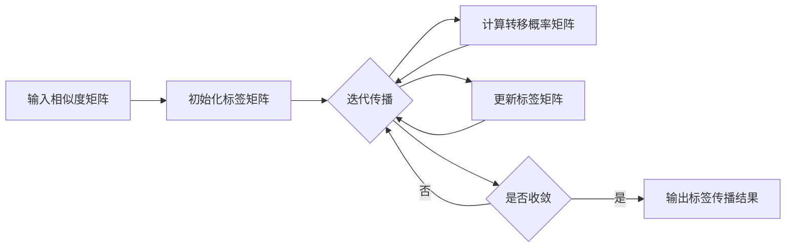

# Label Propagation标签传播算法原理与代码实例讲解

## 1. 背景介绍
### 1.1 半监督学习的概念
### 1.2 标签传播算法的起源与发展
### 1.3 标签传播算法的应用场景

## 2. 核心概念与联系
### 2.1 图的基本概念
#### 2.1.1 无向图
#### 2.1.2 有向图
#### 2.1.3 加权图
### 2.2 相似度矩阵
#### 2.2.1 相似度的度量方式
#### 2.2.2 相似度矩阵的构建
### 2.3 标签矩阵
#### 2.3.1 标签的表示方法 
#### 2.3.2 标签矩阵的初始化
### 2.4 转移概率矩阵
#### 2.4.1 转移概率的计算
#### 2.4.2 转移概率矩阵的归一化

## 3. 核心算法原理具体操作步骤
### 3.1 算法输入
#### 3.1.1 相似度矩阵
#### 3.1.2 初始标签矩阵
### 3.2 迭代传播过程
#### 3.2.1 转移概率矩阵计算
#### 3.2.2 标签矩阵更新
#### 3.2.3 收敛条件判断
### 3.3 算法输出
#### 3.3.1 标签传播结果
#### 3.3.2 置信度评估

## 4. 数学模型和公式详细讲解举例说明
### 4.1 无向图的数学表示
#### 4.1.1 邻接矩阵
#### 4.1.2 度矩阵
#### 4.1.3 拉普拉斯矩阵
### 4.2 相似度矩阵的数学定义
#### 4.2.1 余弦相似度
#### 4.2.2 Jaccard相似度
#### 4.2.3 高斯核函数 
### 4.3 转移概率矩阵的数学推导
#### 4.3.1 转移概率的计算公式
#### 4.3.2 转移概率矩阵的特征
### 4.4 标签传播的迭代公式
#### 4.4.1 标签矩阵更新公式
#### 4.4.2 收敛性分析

## 5. 项目实践：代码实例和详细解释说明
### 5.1 数据准备
#### 5.1.1 数据集介绍
#### 5.1.2 数据预处理
### 5.2 相似度矩阵构建
#### 5.2.1 特征提取
#### 5.2.2 相似度计算
### 5.3 标签传播算法实现
#### 5.3.1 初始化标签矩阵
#### 5.3.2 迭代传播过程
#### 5.3.3 结果输出与可视化
### 5.4 实验结果分析
#### 5.4.1 不同相似度度量方式的比较
#### 5.4.2 超参数的影响
#### 5.4.3 与其他算法的性能对比

## 6. 实际应用场景
### 6.1 社交网络社区发现
#### 6.1.1 用户关系图构建
#### 6.1.2 社区划分与标签传播
### 6.2 图像分割
#### 6.2.1 超像素分割
#### 6.2.2 区域相似度计算与标签传播
### 6.3 文本分类
#### 6.3.1 文本特征表示
#### 6.3.2 文本相似度计算与标签传播

## 7. 工具和资源推荐
### 7.1 图数据处理工具
#### 7.1.1 NetworkX
#### 7.1.2 iGraph
### 7.2 机器学习库
#### 7.2.1 Scikit-learn
#### 7.2.2 TensorFlow
### 7.3 可视化工具
#### 7.3.1 Matplotlib
#### 7.3.2 Gephi

## 8. 总结：未来发展趋势与挑战
### 8.1 标签传播算法的优势与局限性
### 8.2 深度学习与图神经网络的结合
### 8.3 大规模图数据处理的挑战
### 8.4 标签传播算法的改进方向

## 9. 附录：常见问题与解答
### 9.1 标签传播算法的收敛性如何保证？
### 9.2 如何选择合适的相似度度量方式？
### 9.3 标签传播算法对噪声标签的鲁棒性如何？
### 9.4 标签传播算法能否处理多标签问题？
### 9.5 标签传播算法的时间复杂度和空间复杂度如何？



标签传播算法(Label Propagation Algorithm, LPA)是一种简单高效的半监督学习方法,它利用已标记样本的标签信息,通过在数据点之间传播标签,对未标记样本进行标记。LPA基于图模型,将数据点视为图的节点,节点之间的边表示它们的相似性。算法通过迭代的方式更新每个节点的标签,直到整个图达到一个稳定状态。

LPA的核心思想是,相似的数据点应该具有相同的标签。算法首先根据已标记样本初始化标签矩阵,然后在图上进行标签传播。每个节点根据其邻居节点的标签和它们之间的相似度来更新自己的标签。这个过程重复进行,直到标签分布收敛或达到最大迭代次数。

LPA的数学原理可以用矩阵运算来表示。设$W$为图的相似度矩阵,$Y$为标签矩阵,$T$为转移概率矩阵。转移概率矩阵$T$可以通过对相似度矩阵$W$进行行归一化得到:

$$T = D^{-1}W$$

其中,$D$为对角矩阵,对角元素为$W$的行和。

标签传播的迭代公式为:

$$Y^{(t+1)} = TY^{(t)}$$

其中,$Y^{(t)}$表示第$t$次迭代的标签矩阵。

下面是使用Python实现LPA的示例代码:

```python
import numpy as np

class LabelPropagation:
    def __init__(self, max_iter=1000, tol=1e-3):
        self.max_iter = max_iter
        self.tol = tol
    
    def fit(self, X, y):
        # 构建相似度矩阵
        W = self._build_similarity_matrix(X)
        # 初始化标签矩阵
        Y = np.zeros((X.shape[0], y.max()+1))
        Y[np.arange(X.shape[0]), y] = 1
        
        for i in range(self.max_iter):
            Y_prev = Y.copy()
            # 计算转移概率矩阵
            T = self._normalize(W)
            # 更新标签矩阵
            Y = np.dot(T, Y)
            Y_diff = np.abs(Y - Y_prev).sum()
            if Y_diff < self.tol:
                break
        
        self.labels_ = Y.argmax(axis=1)
        return self
    
    def _build_similarity_matrix(self, X):
        # 使用高斯核函数计算相似度矩阵
        K = np.exp(-0.5 * ((X[:, None] - X[None, :])**2).sum(axis=2))
        return K
    
    def _normalize(self, W):
        # 对相似度矩阵进行行归一化
        d = W.sum(axis=1)
        d_inv = np.power(d, -1).flatten()
        d_inv[np.isinf(d_inv)] = 0.
        D = np.diag(d_inv)
        return np.dot(D, W)
```

在上述代码中,`LabelPropagation`类实现了标签传播算法。`fit`方法接受特征矩阵`X`和标签向量`y`,通过迭代更新标签矩阵`Y`,最终得到预测标签`labels_`。`_build_similarity_matrix`方法使用高斯核函数计算相似度矩阵,`_normalize`方法对相似度矩阵进行行归一化得到转移概率矩阵。

LPA的优点是实现简单,计算效率高,对标记样本的数量要求较低。但它也存在一些局限性,如对噪声标签敏感,容易受到图结构的影响等。此外,LPA假设所有的类别在图中都是连通的,这在实际应用中并不总是成立。

未来,标签传播算法可以与深度学习和图神经网络相结合,利用深度特征提高标签传播的性能。此外,如何在大规模图数据上高效地进行标签传播也是一个值得研究的问题。改进方向包括引入正则化项,考虑节点的重要性,以及设计分布式和并行化的算法等。

总之,标签传播算法是半监督学习领域的重要方法之一,在社交网络分析、图像分割、文本分类等任务中有广泛应用。深入理解其原理并结合具体问题进行改进,有助于我们更好地利用有限的标记数据,提高机器学习的性能。

作者：禅与计算机程序设计艺术 / Zen and the Art of Computer Programming