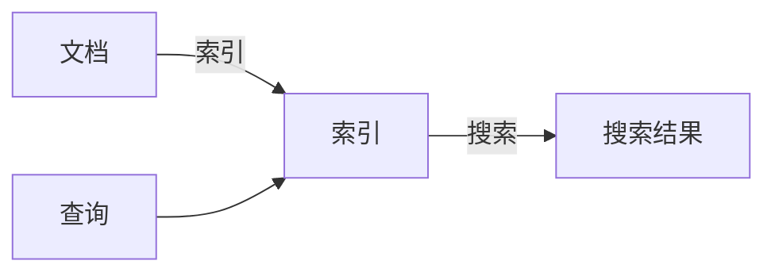
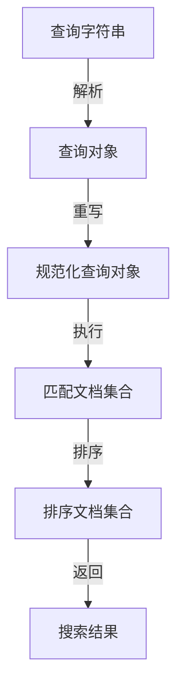

# Lucene中各种Query的用法与场景分析

## 1.背景介绍

在现代信息时代,数据已经成为了企业和个人的重要资产。随着数据量的不断增长,有效地检索和利用这些数据变得至关重要。Apache Lucene是一个高性能、全功能的搜索引擎库,它提供了强大的索引和搜索功能,可以帮助我们快速地从海量数据中找到所需的信息。

作为一个成熟的开源项目,Lucene已经被广泛应用于各种场景,如网站搜索、电子邮件搜索、数据库搜索等。它的核心功能之一就是支持丰富的查询语法,允许用户使用不同类型的查询来精确地定位目标数据。本文将详细探讨Lucene中各种查询的用法和适用场景,帮助读者更好地利用Lucene的查询功能。

## 2.核心概念与联系

在深入探讨Lucene查询之前,我们需要先了解一些核心概念。

### 2.1 索引(Index)

索引是Lucene的核心概念之一。它是一种数据结构,用于存储和组织文档的内容,以便于快速检索。Lucene会将文档的内容分词,并为每个词项建立一个inverted index(倒排索引),记录该词项出现的文档ID和位置信息。这种索引结构使得Lucene可以快速找到包含特定词项的文档。

### 2.2 文档(Document)

在Lucene中,数据被组织为文档(Document)的形式。一个文档可以包含多个字段(Field),每个字段都有自己的名称和值。例如,一个网页文档可能包含"标题"、"内容"、"URL"等字段。

### 2.3 查询(Query)

查询是Lucene用于检索相关文档的核心机制。用户可以使用不同类型的查询来表达搜索需求,Lucene会根据查询条件从索引中找出匹配的文档。

这些核心概念之间的关系如下所示:



## 3.核心算法原理具体操作步骤

Lucene的查询过程可以概括为以下几个步骤:

1. **查询解析(Query Parsing)**: 将用户输入的查询字符串解析为Lucene内部的查询对象(Query Object)。

2. **查询重写(Query Rewriting)**: 对查询对象进行规范化处理,例如将同义词查询转换为多个子查询的并集。

3. **查询执行(Query Execution)**: 将重写后的查询对象与索引进行匹配,找出满足查询条件的文档集合。

4. **结果排序(Result Sorting)**: 根据相关性评分对匹配的文档集合进行排序。

5. **结果返回(Result Returning)**: 返回排序后的文档集合作为最终搜索结果。

该过程可以用下面的流程图来表示:



## 4.数学模型和公式详细讲解举例说明

在Lucene的查询过程中,文档相关性评分是一个关键的环节。Lucene使用了一种基于Vector Space Model(向量空间模型)的相似度算法来计算查询和文档之间的相关性分数。

### 4.1 TF-IDF模型

TF-IDF(Term Frequency-Inverse Document Frequency)是一种常用的相似度计算模型,它将文档表示为一个向量,每个维度对应一个词项,值为该词项在文档中出现的频率(Term Frequency,TF)。同时,它还考虑了词项在整个文档集合中的稀有程度,用逆向文档频率(Inverse Document Frequency,IDF)来表示。

TF-IDF的计算公式如下:

$$
\mathrm{tfidf}(t, d, D) = \mathrm{tf}(t, d) \times \mathrm{idf}(t, D)
$$

其中:

- $\mathrm{tf}(t, d)$ 表示词项 $t$ 在文档 $d$ 中出现的频率
- $\mathrm{idf}(t, D)$ 表示词项 $t$ 在文档集合 $D$ 中的逆向文档频率,计算公式为:

$$
\mathrm{idf}(t, D) = \log \frac{|D|}{|\{d \in D : t \in d\}|} + 1
$$

其中 $|D|$ 表示文档集合的大小,分母表示包含词项 $t$ 的文档数量。

通过将查询和文档都表示为TF-IDF向量,我们可以计算它们之间的相似度,作为文档相关性的度量。常用的相似度计算方法包括余弦相似度、欧几里得距离等。

### 4.2 BM25模型

BM25是Lucene中使用的另一种相似度计算模型,它是对TF-IDF模型的改进,考虑了文档长度的影响。BM25的计算公式如下:

$$
\mathrm{score}(D, Q) = \sum_{q \in Q} \mathrm{idf}(q) \cdot \frac{f(q, D) \cdot (k_1 + 1)}{f(q, D) + k_1 \cdot \left(1 - b + b \cdot \frac{|D|}{\mathrm{avgdl}}\right)}
$$

其中:

- $f(q, D)$ 表示查询词 $q$ 在文档 $D$ 中出现的频率
- $|D|$ 表示文档 $D$ 的长度
- $\mathrm{avgdl}$ 表示文档集合的平均文档长度
- $k_1$ 和 $b$ 是两个调节参数,用于控制词频和文档长度对相关性的影响程度

BM25模型不仅考虑了词频和逆向文档频率,还引入了文档长度的归一化因子,使得较长文档不会因为词频较高而被过度评分。

通过上述数学模型,Lucene可以为每个匹配的文档计算一个相关性分数,并根据这些分数对搜索结果进行排序,从而提供更加准确和有用的搜索结果。

## 5.项目实践:代码实例和详细解释说明

接下来,我们将通过代码示例来演示如何在Lucene中使用各种查询。这些示例使用的是Lucene 8.x版本的API。

### 5.1 创建IndexWriter和IndexReader

在执行查询之前,我们需要先创建IndexWriter和IndexReader对象,用于写入和读取索引。

```java
// 创建Directory对象,指定索引文件的存储位置
Directory directory = FSDirectory.open(Paths.get("path/to/index"));

// 创建IndexWriterConfig对象,配置IndexWriter的行为
IndexWriterConfig config = new IndexWriterConfig(new StandardAnalyzer());

// 创建IndexWriter对象
IndexWriter indexWriter = new IndexWriter(directory, config);

// 创建IndexReader对象
IndexReader indexReader = DirectoryReader.open(directory);
```

### 5.2 基本查询(TermQuery)

TermQuery是Lucene中最基本的查询类型,用于匹配包含特定词项的文档。

```java
// 创建TermQuery对象,查询包含"lucene"词项的文档
Query query = new TermQuery(new Term("content", "lucene"));

// 执行查询并获取TopDocs对象,包含匹配的文档ID和分数
TopDocs topDocs = indexSearcher.search(query, 10);

// 遍历TopDocs,获取每个匹配文档的ID和分数
for (ScoreDoc scoreDoc : topDocs.scoreDocs) {
    Document doc = indexSearcher.doc(scoreDoc.doc);
    System.out.println("Document ID: " + scoreDoc.doc + ", Score: " + scoreDoc.score);
    // 处理文档内容...
}
```

### 5.3 布尔查询(BooleanQuery)

BooleanQuery允许组合多个子查询,使用AND、OR、NOT等逻辑运算符进行组合。

```java
// 创建TermQuery对象
TermQuery termQuery1 = new TermQuery(new Term("content", "lucene"));
TermQuery termQuery2 = new TermQuery(new Term("content", "search"));

// 创建BooleanQuery对象,组合子查询
BooleanQuery.Builder builder = new BooleanQuery.Builder();
builder.add(termQuery1, BooleanClause.Occur.SHOULD);
builder.add(termQuery2, BooleanClause.Occur.SHOULD);
BooleanQuery query = builder.build();

// 执行查询
TopDocs topDocs = indexSearcher.search(query, 10);
```

在上面的示例中,我们创建了两个TermQuery对象,并使用BooleanQuery将它们组合成一个OR查询,即匹配包含"lucene"或"search"词项的文档。

### 5.4 短语查询(PhraseQuery)

PhraseQuery用于匹配包含特定短语的文档,要求词项按照指定的顺序出现。

```java
// 创建PhraseQuery对象,查询包含短语"lucene search"的文档
PhraseQuery query = new PhraseQuery.Builder()
        .add(new Term("content", "lucene"))
        .add(new Term("content", "search"))
        .build();

// 执行查询
TopDocs topDocs = indexSearcher.search(query, 10);
```

### 5.5 前缀查询(PrefixQuery)

PrefixQuery用于匹配以特定前缀开头的词项。

```java
// 创建PrefixQuery对象,查询以"luc"开头的词项
PrefixQuery query = new PrefixQuery(new Term("content", "luc"));

// 执行查询
TopDocs topDocs = indexSearcher.search(query, 10);
```

### 5.6 通配符查询(WildcardQuery)

WildcardQuery允许使用通配符(如`*`和`?`)进行模式匹配。

```java
// 创建WildcardQuery对象,查询包含"lucen*"模式的词项
WildcardQuery query = new WildcardQuery(new Term("content", "lucen*"));

// 执行查询
TopDocs topDocs = indexSearcher.search(query, 10);
```

### 5.7 模糊查询(FuzzyQuery)

FuzzyQuery用于匹配与指定词项相似的词项,可以容忍一定程度的拼写错误。

```java
// 创建FuzzyQuery对象,查询与"lucene"相似的词项
FuzzyQuery query = new FuzzyQuery(new Term("content", "lucene"));

// 执行查询
TopDocs topDocs = indexSearcher.search(query, 10);
```

### 5.8 数值范围查询(NumericRangeQuery)

NumericRangeQuery用于匹配数值型字段落在特定范围内的文档。

```java
// 创建NumericRangeQuery对象,查询"price"字段在10到20之间的文档
Query query = NumericRangeQuery.newIntRange("price", 10, 20, true, true);

// 执行查询
TopDocs topDocs = indexSearcher.search(query, 10);
```

以上只是Lucene查询的一部分示例,还有许多其他类型的查询,如地理位置查询(GeoPointQuery)、日期范围查询(DateRangeQuery)等。通过组合和嵌套这些查询,我们可以构建出非常复杂和精确的搜索条件。

## 6.实际应用场景

Lucene作为一个强大的搜索引擎库,其查询功能可以应用于各种场景,帮助我们从海量数据中快速找到所需的信息。以下是一些常见的应用场景:

1. **网站搜索**: 许多网站都使用Lucene作为后端搜索引擎,为用户提供站内搜索功能。例如,电子商务网站可以使用Lucene查询来搜索符合特定条件的商品。

2. **文档搜索**: Lucene可以用于搜索各种类型的文档,如PDF、Word、电子邮件等。企业可以使用Lucene构建内部知识库,方便员工查找所需的文档资料。

3. **日志分析**: 在IT运维领域,Lucene可以用于搜索和分析大量的日志数据,快速定位和诊断系统问题。

4. **数据库搜索**: 虽然关系型数据库本身提供了查询功能,但对于大规模数据和复杂查询,使用Lucene可以获得更好的性能和灵活性。

5. **地理位置搜索**: 通过Lucene的地理位置查询功能,我们可以搜索附近的餐馆、景点等位置信息。

6. **个性化推荐**: Lucene可以与机器学习技术相结合,根据用户的浏览历史和偏好,为其推荐感兴趣的内容。

7. **数据质量检查**: 在数据处理过程中,我们可以使用Lucene查