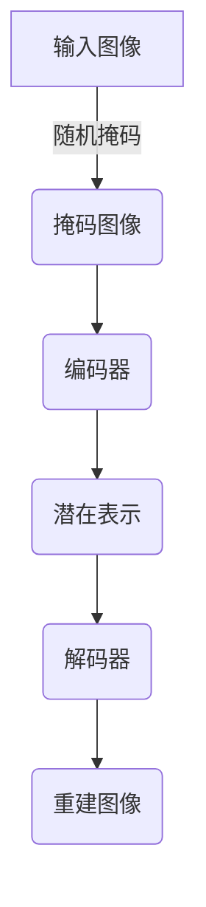

# MAE原理与代码实例讲解

## 1. 背景介绍

在计算机视觉和深度学习领域,有一类重要的任务叫做图像分类(Image Classification),即根据输入的图像数据,判断图像属于哪一类别。例如,判断一张图片是猫还是狗。传统的图像分类方法需要人工提取图像特征,这个过程十分繁琐。而深度学习的出现,使得我们可以自动从数据中学习到有效的特征表示,从而极大地提高了图像分类的性能。

随着深度学习技术的不断发展,各种新的网络模型和训练策略不断涌现。2021年,来自Meta(Facebook)的研究人员提出了一种全新的自监督学习方法,被称为掩码自编码(Masked Auto-Encoder,MAE)。MAE在计算机视觉任务上取得了非常优异的表现,成为当前领域的一股新的潮流。

### 1.1 自监督学习的重要性

在深度学习的发展过程中,监督学习一直占据主导地位。监督学习需要大量的人工标注数据,这是一个非常耗时耗力的过程。而自监督学习(Self-Supervised Learning)则可以利用未标注的原始数据进行训练,从而避免了人工标注的昂贵成本。

自监督学习的核心思想是,通过构造一些预测任务,让模型从原始数据中自动学习到有用的表示。例如,我们可以将一张图像打乱像素的顺序,然后让模型尝试重建原始图像。在这个过程中,模型就会学习到图像的一些底层特征。

自监督学习的优势在于,我们可以利用大量的未标注数据进行预训练,获得一个强大的初始模型。然后,在有标注数据的下游任务上,只需要进行少量的微调(fine-tuning),就可以获得非常出色的性能表现。

### 1.2 MAE的核心创新点

MAE的核心创新点在于,它提出了一种全新的自监督学习范式:掩码自编码(Masked Auto-Encoding)。与传统的自编码器不同,MAE在输入图像上随机掩码一部分像素块,然后让模型尝试重建这些被掩码的像素块。

这种做法有以下几个优势:

1. **高效利用计算资源**:由于只需要重建部分像素,MAE可以在相同的计算资源下处理更高分辨率的图像。
2. **更强的泛化能力**:模型需要从剩余的可见像素中推断出被掩码部分的内容,这促使模型学习到更加丰富和鲁棒的特征表示。
3. **高效的自监督任务**:与其他自监督任务相比,MAE的训练过程更加高效和简单。

通过大规模的预训练,MAE可以学习到强大的图像特征表示,并在下游的计算机视觉任务上取得了非常出色的性能。

## 2. 核心概念与联系

为了更好地理解MAE,我们需要了解一些核心概念和它们之间的联系。

### 2.1 自编码器(AutoEncoder)

自编码器是一种无监督学习模型,它的目标是学习到数据的紧凑表示。自编码器由两部分组成:编码器(Encoder)和解码器(Decoder)。编码器将原始输入数据压缩为一个低维的潜在表示,而解码器则试图从这个潜在表示中重建原始输入数据。

在训练过程中,自编码器会最小化输入数据与重建数据之间的差异,从而学习到一个能够有效捕获输入数据主要特征的潜在表示。自编码器广泛应用于降维、去噪、特征提取等领域。

### 2.2 掩码语言模型(Masked Language Model)

掩码语言模型(Masked Language Model,MLM)是自然语言处理领域中的一种自监督学习方法。它的核心思想是,在输入的文本序列中随机掩码一部分单词,然后让模型尝试预测这些被掩码的单词。

通过这种方式,模型可以学习到单词之间的上下文关系,从而获得更加丰富和鲁棒的语义表示。掩码语言模型被广泛应用于预训练大型语言模型,如BERT、RoBERTa等。

### 2.3 MAE:掩码自编码

MAE将自编码器和掩码语言模型的思想结合到了计算机视觉领域。具体来说,MAE在输入图像上随机掩码一部分像素块,然后让模型尝试重建这些被掩码的像素块。

通过这种方式,MAE可以学习到图像的底层特征和结构信息,从而获得强大的图像表示能力。与传统的自编码器相比,MAE的优势在于它只需要重建部分像素,因此可以在相同的计算资源下处理更高分辨率的图像。

### 2.4 核心概念之间的联系

自编码器、掩码语言模型和MAE之间存在着密切的联系:

- 自编码器和掩码语言模型都是自监督学习的范式,它们通过构造预测任务,让模型从原始数据中自动学习到有用的表示。
- MAE将自编码器和掩码语言模型的思想结合到了计算机视觉领域,提出了一种全新的自监督学习范式:掩码自编码。
- 这三种方法都利用了相同的核心思想:通过预测被掩码或丢失的部分,促使模型学习到更加丰富和鲁棒的特征表示。

## 3. 核心算法原理具体操作步骤

了解了MAE的背景和核心概念之后,我们来深入探讨一下MAE的核心算法原理和具体操作步骤。

### 3.1 MAE的整体架构

MAE的整体架构由两个主要部分组成:编码器(Encoder)和解码器(Decoder)。

1. **编码器(Encoder)**:编码器的作用是将输入图像编码为一个低维的潜在表示。在MAE中,编码器通常采用卷积神经网络(CNN)或者Vision Transformer的结构。

2. **解码器(Decoder)**:解码器的作用是从编码器输出的潜在表示中重建被掩码的像素块。在MAE中,解码器通常采用一种称为"Masking-to-Inpainting"的结构,它可以高效地预测被掩码的像素块。

下图展示了MAE的整体架构:

在训练过程中,MAE的目标是最小化重建图像与原始图像之间的差异,从而学习到一个能够有效捕获图像特征的潜在表示。

### 3.2 具体操作步骤

MAE的训练过程可以分为以下几个步骤:

1. **随机掩码**:在输入图像上随机掩码一部分像素块。通常会掩码掉大约75%的像素块。

2. **编码**:将掩码后的图像输入到编码器中,获得一个低维的潜在表示。

3. **解码**:将编码器输出的潜在表示输入到解码器中,解码器会尝试重建被掩码的像素块。

4. **计算损失**:计算重建图像与原始图像之间的差异,作为训练的损失函数。常用的损失函数包括均方误差(Mean Squared Error,MSE)和绝对误差(Mean Absolute Error,MAE)等。

5. **反向传播**:通过反向传播算法,更新编码器和解码器的参数,使得损失函数最小化。

6. **迭代训练**:重复上述步骤,直到模型收敛或达到预设的训练轮数。

通过上述步骤,MAE可以学习到一个强大的图像特征表示,并在下游的计算机视觉任务上取得出色的性能。

## 4. 数学模型和公式详细讲解举例说明

为了更好地理解MAE的原理,我们需要了解一些相关的数学模型和公式。

### 4.1 自编码器的数学模型

自编码器的数学模型可以表示为:

$$\min_{W,b} \mathcal{L}(X, \hat{X}) = \min_{W,b} \sum_{i=1}^{N} \mathcal{L}(x^{(i)}, \hat{x}^{(i)})$$

其中:

- $X = \{x^{(1)}, x^{(2)}, \ldots, x^{(N)}\}$ 表示输入数据集,每个 $x^{(i)}$ 是一个样本。
- $\hat{X} = \{\hat{x}^{(1)}, \hat{x}^{(2)}, \ldots, \hat{x}^{(N)}\}$ 表示自编码器重建的输出。
- $W$ 和 $b$ 分别表示自编码器的权重和偏置参数。
- $\mathcal{L}$ 是损失函数,用于衡量输入数据与重建数据之间的差异。常用的损失函数包括均方误差(MSE)和交叉熵损失(Cross-Entropy Loss)等。

在训练过程中,我们需要通过优化算法(如梯度下降)来寻找最小化损失函数的参数 $W$ 和 $b$,从而获得一个能够有效重建输入数据的自编码器模型。

### 4.2 MAE的数学模型

MAE的数学模型与传统的自编码器有所不同。在MAE中,我们需要考虑掩码操作和重建被掩码像素块的过程。

MAE的数学模型可以表示为:

$$\min_{W,b} \mathcal{L}(X_{\text{masked}}, \hat{X}_{\text{masked}}) = \min_{W,b} \sum_{i=1}^{N} \mathcal{L}(x_{\text{masked}}^{(i)}, \hat{x}_{\text{masked}}^{(i)})$$

其中:

- $X_{\text{masked}} = \{x_{\text{masked}}^{(1)}, x_{\text{masked}}^{(2)}, \ldots, x_{\text{masked}}^{(N)}\}$ 表示掩码后的输入图像集合。
- $\hat{X}_{\text{masked}} = \{\hat{x}_{\text{masked}}^{(1)}, \hat{x}_{\text{masked}}^{(2)}, \ldots, \hat{x}_{\text{masked}}^{(N)}\}$ 表示MAE重建的被掩码像素块。
- $W$ 和 $b$ 分别表示MAE的编码器和解码器的权重和偏置参数。
- $\mathcal{L}$ 是损失函数,用于衡量被掩码像素块与重建像素块之间的差异。常用的损失函数包括均方误差(MSE)和绝对误差(MAE)等。

在训练过程中,我们需要通过优化算法来寻找最小化损失函数的参数 $W$ 和 $b$,从而获得一个能够有效重建被掩码像素块的MAE模型。

### 4.3 实例讲解

为了更好地理解上述数学模型,我们来看一个具体的例子。

假设我们有一个 $3 \times 3$ 的输入图像 $X$:

$$X = \begin{bmatrix}
1 & 2 & 3\\
4 & 5 & 6\\
7 & 8 & 9
\end{bmatrix}$$

我们对其进行掩码操作,掩码掉中心的像素块,得到掩码后的图像 $X_{\text{masked}}$:

$$X_{\text{masked}} = \begin{bmatrix}
1 & 2 & 3\\
4 & \text{mask} & 6\\
7 & 8 & 9
\end{bmatrix}$$

我们将 $X_{\text{masked}}$ 输入到MAE模型中,模型会尝试重建被掩码的像素块,输出重建图像 $\hat{X}_{\text{masked}}$:

$$\hat{X}_{\text{masked}} = \begin{bmatrix}
1 & 2 & 3\\
4 & \hat{5} & 6\\
7 & 8 & 9
\end{bmatrix}$$

我们可以计算被掩码像素块与重建像素块之间的均方误差(MSE)作为损失函数:

$$\mathcal{L}(X_{\text{masked}}, \hat{X}_{\text{masked}}) = \frac{1}{1}(5 - \hat{5})^2$$

在训练过程中,我们需要通过优化算法来调整MAE模型的参数,使得上述损失函数最小化,从而获得一个能够准确重建被掩码像素块的模型。

通过上述实例,我们可以更好地理解MAE的数学模型和训练过程。