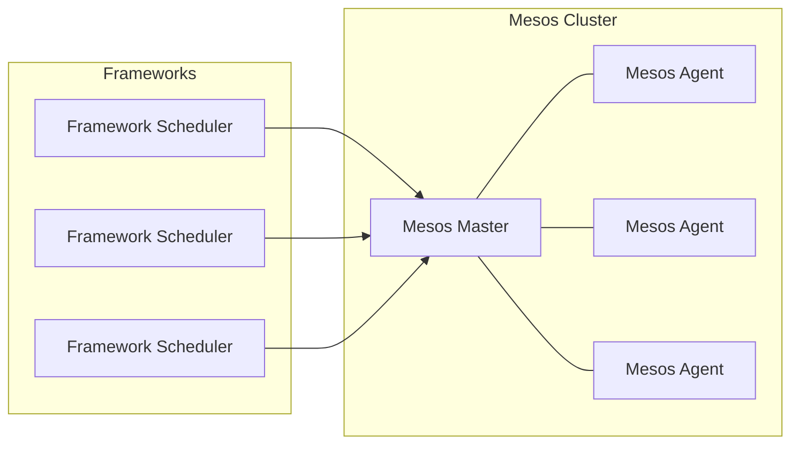

# Mesos 原理与代码实例讲解

## 1. 背景介绍

### 1.1 分布式系统的挑战

随着云计算和大数据时代的到来,应用程序的规模和复杂性不断增加,单机系统已经无法满足日益增长的计算需求。因此,分布式系统应运而生,通过将计算任务分散到多台机器上并行执行,从而提高整体系统的计算能力和可扩展性。然而,构建和管理分布式系统也带来了诸多挑战:

- **资源管理**: 如何高效地管理和调度大量的计算资源,实现资源的合理分配和利用?
- **容错性**: 如何确保系统在硬件故障或软件错误的情况下仍能正常运行?
- **可扩展性**: 如何设计系统,使其能够轻松地扩展以满足不断增长的需求?
- **heterogeneity**: 如何在不同的硬件、操作系统和编程语言环境下实现无缝集成?

### 1.2 Mesos 的诞生

为了解决上述挑战,Apache Mesos 应运而生。Mesos 是一个开源的集群管理系统,它提供了高效的资源管理和调度机制,使得分布式应用程序能够轻松地在大规模集群环境中运行。Mesos 的设计理念是将集群中的计算资源(CPU、内存、磁盘等)抽象为一个共享池,并通过高效的资源隔离和调度算法,将这些资源动态地分配给不同的分布式框架(如 Apache Hadoop、Apache Spark、Apache Kafka 等)。

## 2. 核心概念与联系

### 2.1 Mesos 架构

Mesos 采用了主从架构,主要由以下三个核心组件组成:

1. **Mesos Master**: 负责管理整个集群的资源和任务调度。
2. **Mesos Agent**: 运行在每个节点上,负责管理本地资源并启动和监控任务的执行。
3. **Framework Scheduler**: 由各个分布式框架(如 Hadoop、Spark 等)实现,用于向 Mesos Master 请求资源并启动任务。



### 2.2 资源管理

Mesos 采用了两级资源管理模型:

1. **Mesos 层**: 负责管理整个集群的资源,并将资源分配给不同的框架。
2. **Framework 层**: 各个框架根据自身的调度策略,对分配到的资源进行二次调度和管理。

这种两级资源管理模型使得 Mesos 能够支持多种调度策略,并且框架之间的资源隔离和公平性得到了保证。

### 2.3 资源隔离

Mesos 通过操作系统级的容器技术(如 Linux Containers、Docker 等)实现了资源的隔离。每个任务都运行在一个独立的容器中,拥有自己的 CPU、内存、磁盘等资源,并与其他任务相互隔离。这种隔离机制确保了任务之间不会相互影响,提高了系统的稳定性和安全性。

### 2.4 容错性

Mesos 通过主从架构和检查点机制实现了容错性。当 Mesos Master 发生故障时,可以通过选举机制选出一个新的 Master 接管集群。同时,Mesos Agent 会定期向 Master 发送心跳信号,如果 Agent 长时间未响应,Master 会将其视为失效并将其上的任务重新调度到其他节点上。

## 3. 核心算法原理具体操作步骤

### 3.1 资源提供与回收

Mesos Agent 会定期向 Master 汇报本节点的资源情况,包括可用的 CPU、内存和磁盘空间等。Master 会将这些资源信息汇总,并将可用资源分配给各个框架。

当框架需要资源时,它会向 Master 发送资源请求。Master 会根据预定义的策略(如公平共享、优先级等)为每个框架分配资源。框架获得资源后,可以在该资源上启动任务。

当任务完成或被杀死时,它所占用的资源会被释放,并重新加入到 Mesos 的资源池中,以供后续任务使用。

### 3.2 任务调度算法

Mesos 采用了延迟调度(Delay Scheduling)算法来实现资源的高效利用和公平分配。该算法的核心思想是:当有新的资源可用时,不立即将其分配给任何框架,而是等待一段时间,以便收集更多的资源请求,然后一次性进行批量调度。这种方式可以减少资源碎片化,提高资源利用率。

具体来说,延迟调度算法包括以下步骤:

1. 收集资源请求: Master 会收集所有框架的资源请求,并将它们放入一个请求队列中。
2. 等待延迟时间: Master 会等待一段预定义的延迟时间,以便收集更多的资源请求。
3. 资源匹配: 当延迟时间到期后,Master 会尝试将可用资源与请求队列中的资源请求进行匹配。
4. 资源分配: 对于成功匹配的资源请求,Master 会将相应的资源分配给对应的框架。
5. 重复上述过程: 对于未能匹配的资源请求,Master 会将它们保留在请求队列中,等待下一轮调度。

此外,Mesos 还支持多种调度策略,如公平共享、优先级调度等,用户可以根据自己的需求进行选择和配置。

## 4. 数学模型和公式详细讲解举例说明

### 4.1 资源模型

在 Mesos 中,集群的资源被抽象为一个多维向量,每个维度代表一种资源类型(如 CPU、内存、磁盘等)。我们用 $R$ 表示整个集群的资源向量,用 $r_i$ 表示第 $i$ 个节点的资源向量,则有:

$$
R = \sum_{i=1}^{n} r_i
$$

其中 $n$ 是集群中节点的总数。

对于每个任务,它也有一个资源需求向量 $t$,表示它所需的 CPU、内存和磁盘空间等资源。一个任务只有当集群中有足够的资源满足它的需求时,才能被调度和执行。

### 4.2 资源分配模型

假设我们有 $m$ 个框架,每个框架 $j$ 有一个资源请求队列 $Q_j$,其中包含了该框架所有待分配的任务。我们用 $w_j$ 表示框架 $j$ 的权重,用 $s_j$ 表示它已经获得的资源量。

在每一轮调度中,Mesos 需要决定如何将可用资源 $R$ 分配给不同的框架。这可以通过求解以下优化问题来实现:

$$
\begin{aligned}
\max \quad & \sum_{j=1}^{m} w_j \log x_j \\
\text{s.t.} \quad & \sum_{j=1}^{m} x_j \leq R \\
& x_j \geq s_j, \quad j = 1, \ldots, m
\end{aligned}
$$

其中 $x_j$ 表示分配给框架 $j$ 的资源量。目标函数是一个加权对数公平函数,它可以确保资源在不同框架之间的分配是公平的。约束条件保证了分配的资源不超过集群的总资源,并且每个框架获得的资源不少于它之前已经获得的资源量。

通过求解上述优化问题,Mesos 可以得到一个公平的资源分配方案,并将相应的资源分配给每个框架。

### 4.3 延迟调度模型

在延迟调度算法中,Mesos 需要决定何时开始进行资源分配。我们用 $T$ 表示延迟时间,用 $\lambda(t)$ 表示在时间 $t$ 时资源请求的到达率。则在时间区间 $[0, T]$ 内,总的资源请求量为:

$$
\int_{0}^{T} \lambda(t) \mathrm{d}t
$$

延迟调度算法的目标是最大化在给定延迟时间 $T$ 内可以满足的资源请求量。这可以通过求解以下优化问题来实现:

$$
\begin{aligned}
\max \quad & \int_{0}^{T} \lambda(t) \mathrm{d}t \\
\text{s.t.} \quad & \int_{0}^{T} \lambda(t) \mathrm{d}t \leq R
\end{aligned}
$$

其中约束条件保证了在延迟时间内,总的资源请求量不超过集群的总资源量。

通过求解上述优化问题,Mesos 可以得到一个最优的延迟时间 $T^*$,在该时间点开始进行资源分配,从而最大化可以满足的资源请求量。

以上数学模型为 Mesos 的资源管理和调度算法提供了理论基础,并指导了它们的实现和优化。

## 5. 项目实践: 代码实例和详细解释说明

在本节中,我们将通过一个简单的 Python 示例来演示如何使用 Mesos 框架运行分布式任务。

### 5.1 安装 Mesos

首先,我们需要在集群中安装 Mesos。具体步骤因操作系统而异,这里以 Ubuntu 18.04 为例:

1. 更新软件源:

```bash
sudo apt-get update
```

2. 安装 Mesos:

```bash
sudo apt-get install -y mesos
```

3. 启动 Mesos Master 和 Agent:

```bash
sudo systemctl start mesos-master
sudo systemctl start mesos-agent
```

### 5.2 编写 Mesos 框架

我们将编写一个简单的 Python 框架,用于在 Mesos 集群上运行 Word Count 任务。

```python
import sys
from mesos.native import MesosSchedulerDriver
from mesos.interface import Scheduler, mesos_pb2

class WordCountScheduler(Scheduler):
    def __init__(self, executor):
        self.executor = executor
        self.task_data = {}

    def resourceOffers(self, driver, offers):
        for offer in offers:
            task = mesos_pb2.TaskInfo()
            task.task_id.value = str(uuid.uuid4())
            task.slave_id.value = offer.slave_id.value
            task.name = "Word Count"
            task.executor.MergeFrom(self.executor)

            cpus = task.resources.add()
            cpus.name = "cpus"
            cpus.type = mesos_pb2.Value.SCALAR
            cpus.scalar.value = 1

            mem = task.resources.add()
            mem.name = "mem"
            mem.type = mesos_pb2.Value.SCALAR
            mem.scalar.value = 256

            data = mesos_pb2.CommandInfo.URI()
            data.value = "https://example.com/input.txt"
            task.data.extend([data])

            driver.launchTasks(offer.id, [task])

    def statusUpdate(self, driver, status):
        if status.state == mesos_pb2.TASK_FINISHED:
            driver.stop()

if __name__ == "__main__":
    executor = mesos_pb2.ExecutorInfo()
    executor.executor_id.value = "word-count-executor"
    executor.command.value = "python word_count.py"

    framework = mesos_pb2.FrameworkInfo()
    framework.user = "ubuntu"
    framework.name = "Word Count Framework"

    driver = MesosSchedulerDriver(
        WordCountScheduler(executor),
        framework,
        "master@127.0.0.1:5050"
    )

    status = 0 if driver.run() == mesos_pb2.DRIVER_STOPPED else 1

    driver.stop()
    sys.exit(status)
```

这个框架实现了 `Scheduler` 接口,并定义了两个关键方法:

- `resourceOffers`: 当有新的资源可用时,Mesos 会调用这个方法。我们在这里创建一个新的任务,指定所需的 CPU 和内存资源,并将任务提交给 Mesos。
- `statusUpdate`: 当任务状态发生变化时,Mesos 会调用这个方法。我们在这里检查任务是否已经完成,如果完成则停止框架。

在 `main` 函数中,我们创建了一个 `ExecutorInfo` 对象,指定了要运行的命令(`python word_count.py`)。然后,我们创建一个 `FrameworkInfo` 对象,设置了框架的用户和名称。最后,我们创建一个 `MesosSchedulerDriver` 对象,并运行框架。

### 5.3 编写 Word Count 任务