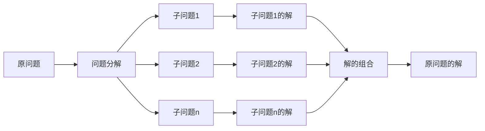

## 1.背景介绍

在计算机科学中，Midjourney是一种有效的问题求解方法，它的核心思想是将复杂的问题分解为若干个相互独立的子问题，然后分别求解这些子问题，最后将各个子问题的解组合起来得到原问题的解。这种方法在很多领域都有广泛的应用，例如在算法设计、软件开发、系统架构等方面。

## 2.核心概念与联系

Midjourney的核心概念包括问题分解、子问题求解和解的组合。问题分解是将原问题分解为若干个相互独立的子问题，子问题求解是对每个子问题进行求解，解的组合是将各个子问题的解组合起来得到原问题的解。



## 3.核心算法原理具体操作步骤

Midjourney的核心算法原理包括以下几个步骤：

1. 对原问题进行分解，将其分解为若干个相互独立的子问题。
2. 对每个子问题进行求解，得到子问题的解。
3. 将各个子问题的解组合起来，得到原问题的解。

在这个过程中，关键的步骤是问题的分解和解的组合。问题的分解需要根据原问题的特性和结构进行，解的组合需要根据子问题的解的特性和结构进行。

## 4.数学模型和公式详细讲解举例说明

Midjourney的数学模型可以用递归的方式来描述。设$P$是原问题，$P_i$是分解后的子问题，$S_i$是子问题$P_i$的解，$S$是原问题$P$的解，那么有以下的关系：

$$
P = \bigcup_{i=1}^{n} P_i
$$

$$
S_i = solve(P_i), i = 1, 2, ..., n
$$

$$
S = combine(S_1, S_2, ..., S_n)
$$

其中，$solve$是求解子问题的函数，$combine$是组合子问题的解得到原问题的解的函数。

## 5.项目实践：代码实例和详细解释说明

下面通过一个具体的例子来说明Midjourney的应用。假设我们要求解一个排序问题，即给定一个无序的数组，我们要将其排序。

首先，我们可以将这个问题分解为两个子问题，即将数组分为两部分，然后分别对这两部分进行排序。然后，我们可以将这两个已排序的部分合并为一个已排序的数组，这就得到了原问题的解。

以下是使用Python实现的代码示例：

```python
def merge_sort(arr):
    if len(arr) <= 1:
        return arr
    mid = len(arr) // 2
    left = merge_sort(arr[:mid])
    right = merge_sort(arr[mid:])
    return merge(left, right)

def merge(left, right):
    result = []
    i = j = 0
    while i < len(left) and j < len(right):
        if left[i] <= right[j]:
            result.append(left[i])
            i += 1
        else:
            result.append(right[j])
            j += 1
    result.extend(left[i:])
    result.extend(right[j:])
    return result
```

## 6.实际应用场景

Midjourney在很多领域都有广泛的应用，例如在算法设计、软件开发、系统架构等方面。在算法设计中，很多复杂的问题都可以通过Midjourney的方法进行分解和求解。在软件开发中，Midjourney可以帮助我们设计出高效、可扩展、易维护的系统。在系统架构中，Midjourney可以帮助我们设计出高可用、高性能、可扩展的系统。

## 7.工具和资源推荐

在进行Midjourney的应用时，我们可以使用一些工具和资源来帮助我们，例如：

1. 在算法设计中，我们可以使用一些算法设计和分析的工具，例如算法可视化工具、算法分析工具等。
2. 在软件开发中，我们可以使用一些软件开发和调试的工具，例如IDE、调试器、版本控制系统等。
3. 在系统架构中，我们可以使用一些系统设计和分析的工具，例如系统建模工具、系统分析工具等。

## 8.总结：未来发展趋势与挑战

Midjourney作为一种有效的问题求解方法，在未来的发展中，有着广阔的应用空间和挑战。随着计算机科学的发展，我们面临的问题将会越来越复杂，如何有效的应用Midjourney来求解这些问题，是我们需要面临的挑战。同时，如何进一步提高Midjourney的效率和效果，也是我们需要研究的问题。

## 9.附录：常见问题与解答

1. 问题：Midjourney适用于所有的问题吗？
答：不是的，Midjourney适用于可以被分解为若干个相互独立的子问题的问题。

2. 问题：如何进行问题的分解和解的组合？
答：问题的分解和解的组合需要根据原问题的特性和结构进行。具体的方法和步骤需要根据具体的问题进行设计和实现。

作者：禅与计算机程序设计艺术 / Zen and the Art of Computer Programming