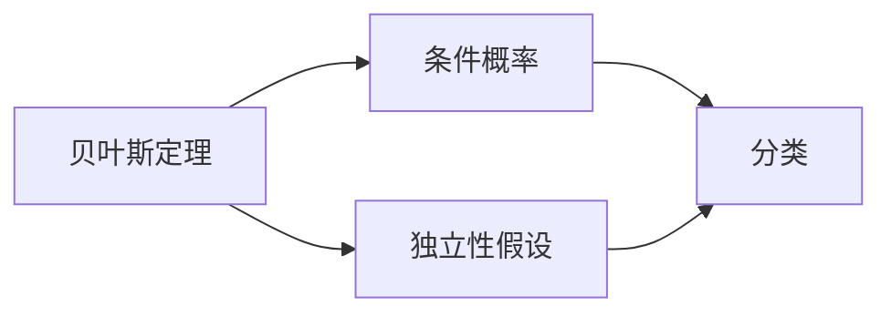

## 1.背景介绍

朴素贝叶斯（Naive Bayes）是一种基于贝叶斯定理的简单概率分类器。这种分类器假设每个特征都是独立的，这就是"朴素"一词的来源。尽管这个假设在现实中往往不成立，但朴素贝叶斯分类器在许多实际应用中表现出了惊人的效果，例如垃圾邮件过滤、文本分类和情感分析。

## 2.核心概念与联系

朴素贝叶斯分类器的核心概念是条件概率和独立性假设。根据贝叶斯定理，我们可以计算给定特征的情况下某个类别发生的概率。这个概率就是条件概率。然后，我们做出一个"朴素"的假设，即所有特征都是互相独立的。这意味着每个特征对分类结果的影响都是独立的。



## 3.核心算法原理具体操作步骤

朴素贝叶斯分类器的工作流程可以分为以下几个步骤：

1. 计算每个类别在数据集中出现的频率。这就是类别的先验概率。
2. 对于每个特征，计算给定类别下该特征出现的条件概率。
3. 对于一个新的数据点，计算它属于每个类别的后验概率。这就是先验概率和条件概率的乘积。
4. 将数据点分类到后验概率最高的类别。

## 4.数学模型和公式详细讲解举例说明

基于贝叶斯定理，我们可以得到以下公式：

$$ P(C_k|X) = \frac{P(X|C_k)P(C_k)}{P(X)} $$

其中，$P(C_k|X)$ 是后验概率，$P(X|C_k)$ 是给定类别下特征的条件概率，$P(C_k)$ 是类别的先验概率，$P(X)$ 是特征的概率。

由于我们假设所有特征都是独立的，所以给定类别下特征的条件概率可以简化为每个特征的条件概率的乘积：

$$ P(X|C_k) = P(x_1|C_k)P(x_2|C_k)...P(x_n|C_k) $$

## 5.项目实践：代码实例和详细解释说明

让我们通过一个Python代码实例来看看朴素贝叶斯分类器是如何工作的。我们将使用scikit-learn库中的GaussianNB模块，它是一种实现了朴素贝叶斯算法的模块。

```python
from sklearn.datasets import load_iris
from sklearn.model_selection import train_test_split
from sklearn.naive_bayes import GaussianNB

# 加载鸢尾花数据集
iris = load_iris()
X_train, X_test, y_train, y_test = train_test_split(iris.data, iris.target, test_size=0.5, random_state=0)

# 创建一个GaussianNB分类器对象
gnb = GaussianNB()

# 使用训练数据训练分类器
gnb.fit(X_train, y_train)

# 使用测试数据预测类别
y_pred = gnb.predict(X_test)

# 打印预测结果和实际结果的对比
print("Number of mislabeled points out of a total %d points : %d" % (X_test.shape[0], (y_test != y_pred).sum()))
```

## 6.实际应用场景

朴素贝叶斯分类器广泛应用于各种场景，包括：

- 垃圾邮件过滤：通过分析邮件内容，判断邮件是否为垃圾邮件。
- 情感分析：通过分析文本内容，判断文本的情感倾向。
- 文本分类：如新闻分类，论文分类等。

## 7.工具和资源推荐

如果你对朴素贝叶斯分类器感兴趣，以下是一些有用的资源：

- [scikit-learn](https://scikit-learn.org/stable/)：一个强大的Python机器学习库，包含多种分类器，包括朴素贝叶斯分类器。
- [《Pattern Recognition and Machine Learning》](https://www.amazon.com/Pattern-Recognition-Learning-Information-Statistics/dp/0387310738)：一本详细介绍模式识别和机器学习的经典教材，包含朴素贝叶斯分类器的详细讲解。

## 8.总结：未来发展趋势与挑战

朴素贝叶斯分类器是一种简单而强大的工具，但它也有一些局限性。最主要的局限性是它的"朴素"假设，即所有特征都是独立的。在许多实际应用中，这个假设并不成立。因此，未来的研究可能会集中在如何放宽这个假设，以及如何处理特征之间的依赖性。

## 9.附录：常见问题与解答

Q: 为什么朴素贝叶斯分类器叫"朴素"？

A: "朴素"一词来源于这个分类器的一个重要假设，即所有特征都是互相独立的。这个假设在现实中往往不成立，但却使得模型的计算变得简单，这就是为什么它被称为"朴素"的。

Q: 朴素贝叶斯分类器适用于哪些类型的数据？

A: 朴素贝叶斯分类器可以处理任何类型的数据，包括数值数据和类别数据。对于数值数据，通常假设数据服从高斯分布（正态分布）。

作者：禅与计算机程序设计艺术 / Zen and the Art of Computer Programming