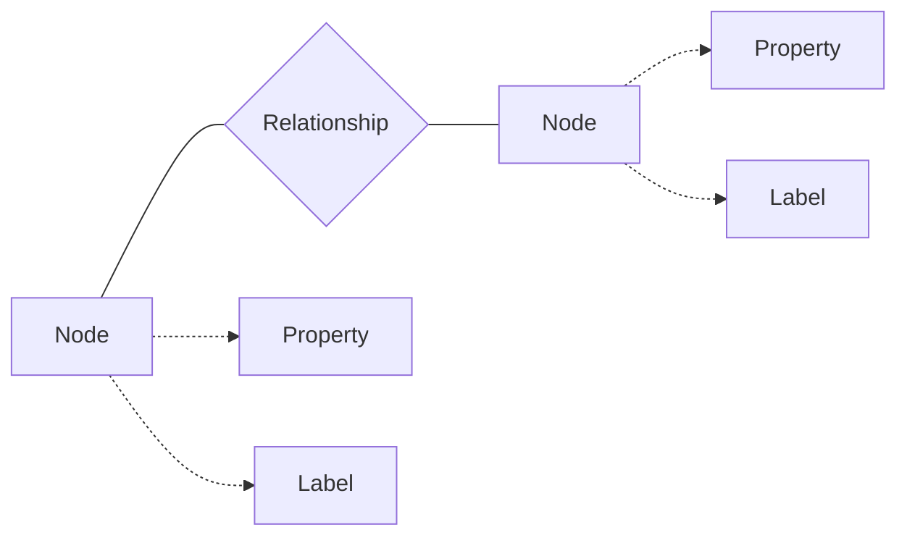
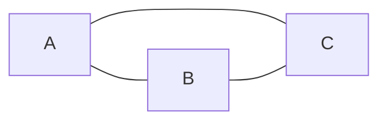
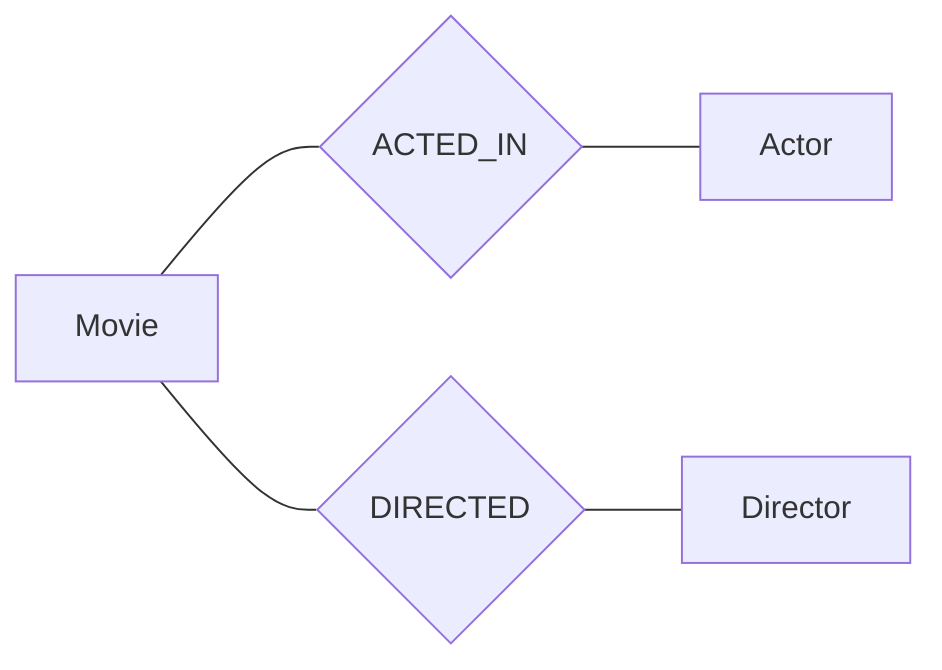

# Neo4j原理与代码实例讲解

## 1.背景介绍
### 1.1 图数据库的兴起
在当今大数据时代,关系型数据库已经无法满足日益复杂的数据关联分析需求。图数据库作为一种新兴的 NoSQL 数据库,以图论为基础,存储实体之间的关系,非常适合处理复杂关联网络数据。
### 1.2 Neo4j 简介
Neo4j 是目前最流行的原生图数据库之一,使用 Cypher 查询语言,支持 ACID 事务,适用于社交网络、推荐系统、欺诈检测等关系型数据密集场景。
### 1.3 Neo4j 的优势
与关系数据库相比,Neo4j 在处理高度关联数据时具有查询速度快、数据模型灵活、无需复杂 join 等优势。

## 2.核心概念与联系
### 2.1 节点(Node)
节点表示图中的实体,如人、地点等,由唯一的 ID 标识,可以包含属性(Property)。
### 2.2 关系(Relationship) 
关系表示节点之间的联系,如朋友、同事等。关系具有方向性,连接两个节点,可包含属性。
### 2.3 属性(Property)
属性是节点和关系的键值对,描述它们的特征,如姓名、年龄等。
### 2.4 标签(Label)
标签是附加在节点上的命名,表示节点的角色或类别,如 Person、Company 等,一个节点可有多个标签。

它们之间的关系可以用下面的 Mermaid 图来表示:


## 3.核心算法原理具体操作步骤
### 3.1 图遍历算法
Neo4j 使用图遍历算法快速查找节点和关系,主要有深度优先搜索(DFS)和广度优先搜索(BFS)两种。
#### 3.1.1 深度优先搜索 
从起始节点开始,沿着一条路径向前探索直到不能再深入,然后回溯到最近的岔路口,继续探索下一条路径,直到遍历所有节点。
#### 3.1.2 广度优先搜索
从起始节点开始,先遍历所有邻接节点,再遍历邻接节点的邻接节点,逐层扩展,直到找到目标节点或遍历整张图。
### 3.2 最短路径算法
在带权图中找出两节点之间的最短路径,Neo4j 支持 Dijkstra 和 A* 算法。
#### 3.2.1 Dijkstra 算法
从起点开始,贪心地选择当前最短路径对应的节点进行扩展,不断更新起点到其他节点的最短距离,直到找到终点。
#### 3.2.2 A* 算法
在 Dijkstra 的基础上引入启发函数,优先扩展更有可能接近目标的节点,提高搜索效率。

## 4.数学模型和公式详细讲解举例说明
图可以表示为 $G=(V,E)$,其中 $V$ 是节点集合,$E$ 是边集合。

以下是一些常见的图论概念和公式:
- 节点的度:与该节点相连的边数,记为 $d(v)$,对于有向图还分为入度 $d^-(v)$ 和出度 $d^+(v)$ 
- 图的稠密程度:$D(G) = \frac{2|E|}{|V|(|V|-1)}$,取值范围 $[0,1]$,越接近1说明图越稠密
- 图的聚类系数:衡量图的节点之间聚集程度,$C(G) = \frac{1}{|V|} \sum_{v \in V} \frac{2|E(v)|}{d(v)(d(v)-1)}$,其中 $|E(v)|$ 表示 $v$ 的邻居节点之间实际存在的边数

例如,对于下面这个无向图:


可以计算出:
- 每个节点的度都为2
- 图的稠密程度 $D(G)=1$
- 图的聚类系数 $C(G)=1$

说明这是一个完全图,节点之间的联系非常紧密。

## 5.项目实践:代码实例和详细解释说明
下面通过一个电影推荐的例子,演示如何使用 Neo4j 进行图数据建模和查询。
### 5.1 数据建模
我们将电影、演员、导演等实体抽象为节点,电影与演职人员之间的关系抽象为边,构建如下的数据模型:



### 5.2 数据导入
使用 Cypher 语句创建节点和关系:

```cypher
CREATE (m:Movie {title:"The Matrix", released:1999, tagline:"Welcome to the Real World"})
CREATE (a:Actor {name:"Keanu Reeves", born:1964})
CREATE (d:Director {name:"Lana Wachowski", born:1965})
CREATE (a)-[:ACTED_IN {roles:["Neo"]}]->(m)
CREATE (d)-[:DIRECTED]->(m)
```

### 5.3 数据查询
查找 Keanu Reeves 演过的所有电影:

```cypher
MATCH (a:Actor {name:"Keanu Reeves"})-[:ACTED_IN]->(m:Movie)
RETURN m.title
```

查找与 The Matrix 类似的电影(有共同演员或导演):

```cypher
MATCH (m:Movie {title:"The Matrix"})<-[:ACTED_IN|DIRECTED]-(p)-[:ACTED_IN|DIRECTED]->(other:Movie) 
WHERE m <> other
RETURN other.title
```

### 5.4 代码解释
- `CREATE` 语句用于创建节点和关系
- `MATCH` 语句用于查找满足条件的节点和关系
- `RETURN` 语句指定返回的结果
- `WHERE` 语句指定过滤条件
- `<>`表示不等于,`|`表示或,`[]`内是关系的属性

通过图数据库,我们可以方便地表达实体之间的复杂关联,快速查询出有意义的关联模式和隐藏的关系网络。

## 6.实际应用场景
### 6.1 社交网络分析
利用图数据库挖掘社交网络中的关键节点、社区结构、传播路径等,为社交产品提供智能化服务。
### 6.2 金融风控
构建客户、账户、设备等实体之间的关系网络,实时检测异常交易和欺诈行为。
### 6.3 知识图谱
将现实世界的实体和关系映射到图数据库中,形成结构化、语义化的知识库,支持智能问答和推理。
### 6.4 推荐系统
根据用户的历史行为和兴趣爱好,利用图算法实现基于内容、协同过滤等个性化推荐。

## 7.工具和资源推荐
- [Neo4j 官网](https://neo4j.com/):提供产品下载、文档、在线沙盒等
- [Neo4j 开发者手册](https://neo4j.com/docs/):详细介绍了 Neo4j 的使用方法和最佳实践
- [Awesome Procedures On Cypher(APOC)](https://neo4j.com/labs/apoc/):Neo4j 的一个强大的存储过程库,提供了很多内置函数
- [Cypher 图形查询语言备忘录](https://neo4j.com/docs/cypher-refcard/current/):Cypher 常用语法速查手册
- [Neo4j 驱动和 OGM](https://neo4j.com/developer/language-guides/):各种编程语言连接 Neo4j 的工具包
- [Neo4j 沙盒](https://neo4j.com/sandbox/):在线试用 Neo4j,无需安装

## 8.总结:未来发展趋势与挑战
图数据库凭借其在复杂关系数据处理上的独特优势,在未来将得到越来越广泛的应用。但同时也面临一些挑战:

- 大规模图的存储和计算:需要设计高效的分布式图存储和图计算引擎,提升性能和扩展性
- 图数据隐私保护:在挖掘关联信息的同时,要采取必要的数据脱敏和访问控制,防止隐私泄露
- 图数据可视化:需要研发易用的可视化工具,帮助用户直观地探索图数据,发现有价值的模式
- 图机器学习:将深度学习等 AI 技术与图数据结合,实现图表示学习、图神经网络等智能算法

图数据库作为大数据分析领域的一个重要分支,必将在智慧城市、智能金融、智慧医疗等新兴产业中扮演越来越重要的角色。

## 9.附录:常见问题与解答
### Q1:Neo4j 适合哪些场景使用?
A1:Neo4j 适合存储和分析高度关联的数据,如社交网络、推荐系统、知识图谱、金融风控等。对于事务性强、数据关联简单的场景,则更适合用关系型数据库。
### Q2:Neo4j 的查询性能如何?
A2:得益于原生图存储和图遍历算法,Neo4j 在处理复杂关联查询时,性能远超关系数据库。但在处理单表查询、聚合分析时,性能不如关系数据库。
### Q3:Neo4j 支持多大数据量?
A3:单台 Neo4j 服务器可以处理百亿节点和关系,通过集群可以进一步扩展。但节点和关系的数量越多,占用内存越大,需要合理设计数据模型和查询语句。
### Q4:学习 Neo4j 的建议?
A4:首先要对图论有基本了解,熟悉节点、边、路径等概念。然后可以参考官方文档,边学边练。从身边的真实案例入手进行建模,加深对图数据库的理解。多思考用图的方式解决问题。

作者:禅与计算机程序设计艺术 / Zen and the Art of Computer Programming