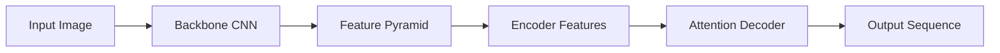

# OCRNet原理与代码实例讲解

## 1. 背景介绍

### 1.1 OCR技术概述
OCR(Optical Character Recognition,光学字符识别)是一种将印刷体或手写体的文字转化为计算机可编辑文本的技术。它广泛应用于文档电子化、身份信息识别、车牌识别等领域,大大提高了信息处理的效率。

### 1.2 深度学习在OCR中的应用
近年来,深度学习技术的发展极大地推动了OCR技术的进步。基于深度学习的OCR方法能够自动学习文字的特征表示,在识别准确率和泛化能力上显著优于传统方法。其中,OCRNet作为一种先进的OCR网络架构,受到了广泛关注。

### 1.3 OCRNet的优势
OCRNet是一种基于编码器-解码器结构的全卷积网络。与其他OCR方法相比,它具有以下优势:

- 端到端的识别:OCRNet可以直接从文本图像中识别出字符序列,无需分割单个字符。
- 强大的特征提取能力:OCRNet采用了骨干网络和金字塔池化等技术,能够有效提取多尺度的文本特征。  
- 高效的解码:OCRNet使用了一种基于注意力机制的解码器,可以快速生成高质量的识别结果。

## 2. 核心概念与联系

### 2.1 编码器-解码器结构
OCRNet采用了编码器-解码器(Encoder-Decoder)的网络结构。编码器负责将输入图像转化为高维特征,解码器则根据编码器提取的特征生成最终的识别结果。

### 2.2 骨干网络
骨干网络是编码器的核心组件,常用的有ResNet、Inception等。它用于提取输入图像中的多层次、多尺度特征。OCRNet采用了ResNet作为默认的骨干网络。

### 2.3 特征金字塔
为了进一步增强特征的表示能力,OCRNet在骨干网络之后引入了特征金字塔(Feature Pyramid)结构。它通过上采样和横向连接,融合了骨干网络不同层次的特征信息。

### 2.4 注意力机制
在解码器中,OCRNet使用了注意力机制来动态地关注输入特征中与当前预测相关的区域。常见的注意力机制有Bahdanau Attention和Luong Attention。

### 2.5 CTC损失函数
OCRNet的训练过程通常使用CTC(Connectionist Temporal Classification)损失函数。CTC可以自动对齐输入序列和目标序列,无需预先分割图像。

下图展示了OCRNet的整体架构和各部分之间的联系:



## 3. 核心算法原理具体操作步骤

### 3.1 图像预处理
首先对输入图像进行预处理,包括尺寸调整、归一化等操作。这有助于加快训练速度和提高模型泛化能力。常用的图像预处理方法有:

1. Resize:将图像缩放到固定尺寸,如32x128。
2. Normalization:对图像像素值进行归一化,使其分布在[-1,1]或[0,1]范围内。 
3. Data Augmentation:使用随机裁剪、旋转等方式增广训练数据。

### 3.2 骨干网络提取特征

将预处理后的图像输入骨干网络,提取多层次的卷积特征。以ResNet为例,具体步骤如下:

1. Stem Layer:包含1-2个卷积层和1个最大池化层,用于初步提取低层特征。
2. Residual Blocks:由多个残差块组成,每个残差块包含2-3个卷积层和一个shortcut连接。随着网络加深,特征图尺寸逐渐减小,通道数逐渐增加。
3. Global Average Pooling:在最后一个残差块之后,使用全局平均池化将特征图压缩为一个向量。

### 3.3 特征金字塔构建
在骨干网络提取的特征基础上,构建特征金字塔。具体步骤如下:

1. 横向连接:将骨干网络的不同层次特征图通过1x1卷积进行通道数对齐。
2. 自顶向下上采样:从最高层特征图开始,逐层进行上采样并与对应层的特征图相加,得到融合后的特征。
3. 独立卷积:对每一层融合后的特征使用3x3卷积进行特征增强。

最终得到一系列尺度不同、语义信息丰富的特征图。

### 3.4 注意力解码
使用注意力机制对编码器提取的特征进行解码,生成最终的字符序列。以Bahdanau Attention为例,具体步骤如下:

1. 初始化隐藏状态和输出序列。
2. 对每一个时间步:
   - 计算注意力权重:将当前隐藏状态与编码器特征进行点积,得到注意力分数,再通过softmax归一化得到注意力权重。
   - 计算上下文向量:用注意力权重对编码器特征进行加权求和,得到当前时间步的上下文向量。
   - 更新隐藏状态:将上一时间步的隐藏状态、当前时间步的上下文向量和输入字符嵌入拼接,通过一个前馈神经网络得到新的隐藏状态。
   - 计算输出概率:将当前隐藏状态通过一个全连接层和softmax激活,得到输出字符的概率分布。
   - 选择概率最大的字符作为当前时间步的输出,并将其作为下一时间步的输入。
3. 重复步骤2,直到生成结束符或达到最大长度。

### 3.5 CTC损失计算
使用CTC损失函数计算预测序列和目标序列之间的距离,作为模型优化的目标。具体步骤如下:

1. 将预测序列通过softmax激活,得到每一时间步的字符概率分布。
2. 将目标序列通过插入空白符扩展为多个可能的对齐路径。
3. 对每一条路径,计算其相对于预测序列的条件概率。
4. 将所有路径的条件概率相加,得到目标序列的概率。
5. 最大化目标序列的对数概率,等价于最小化CTC损失。

通过反向传播不断更新模型参数,使CTC损失最小化,从而得到性能优异的OCR模型。

## 4. 数学模型和公式详细讲解举例说明

### 4.1 图像预处理
对输入图像 $I$ 进行尺寸调整和归一化:

$$
I' = \frac{Resize(I, (H, W)) - \mu}{\sigma}
$$

其中 $H$ 和 $W$ 为目标尺寸,$\mu$ 和 $\sigma$ 为图像像素的均值和标准差。

### 4.2 骨干网络
以ResNet中的残差块为例,假设输入特征为 $x$,残差块的计算过程为:

$$
\begin{aligned}
F(x) &= W_2 * \sigma(W_1 * x) \\
y &= F(x) + x
\end{aligned}
$$

其中 $W_1$ 和 $W_2$ 为卷积层的权重,*表示卷积操作,$\sigma$ 为ReLU激活函数。

### 4.3 特征金字塔
对骨干网络提取的特征图 ${C_2,C_3,C_4,C_5}$ 进行特征融合:

$$
\begin{aligned}
P_5 &= Conv_{1x1}(C_5) \\
P_4 &= Conv_{1x1}(C_4) + Upsample(P_5) \\
P_3 &= Conv_{1x1}(C_3) + Upsample(P_4) \\
P_2 &= Conv_{1x1}(C_2) + Upsample(P_3)
\end{aligned}
$$

其中 $Conv_{1x1}$ 表示1x1卷积,$Upsample$ 表示上采样操作。

### 4.4 注意力机制
假设编码器特征为 $h={h_1,\cdots,h_T}$,解码器隐藏状态为 $s_t$,则注意力权重 $\alpha_t$ 的计算过程为:

$$
\begin{aligned}
e_{ti} &= v^T \tanh(Ws_t + Vh_i + b) \\
\alpha_t &= softmax(e_t) \\
c_t &= \sum_{i=1}^T \alpha_{ti} h_i
\end{aligned}
$$

其中 $v$、$W$、$V$ 和 $b$ 为注意力机制的可学习参数。

### 4.5 CTC损失
设预测序列为 $y={y_1,\cdots,y_T}$,目标序列为 $l={l_1,\cdots,l_N}$,则CTC损失定义为:

$$
Loss = -\log p(l|y) = -\log \sum_{\pi \in \mathcal{B}^{-1}(l)} p(\pi|y)
$$

其中 $\mathcal{B}$ 是从对齐路径 $\pi$ 到目标序列 $l$ 的映射函数。

## 5. 项目实践：代码实例和详细解释说明

下面给出一个简单的OCRNet实现示例,基于PyTorch框架:

```python
import torch
import torch.nn as nn
import torch.nn.functional as F

class OCRNet(nn.Module):
    def __init__(self, num_classes):
        super(OCRNet, self).__init__()
        self.num_classes = num_classes
        
        # 骨干网络
        self.backbone = self._get_backbone()
        
        # 特征金字塔
        self.fpn = self._get_fpn()
        
        # 注意力解码器
        self.decoder = AttentionDecoder(num_classes)
        
    def _get_backbone(self):
        # 使用ResNet50作为骨干网络
        resnet = torchvision.models.resnet50(pretrained=True) 
        layers = list(resnet.children())[:-2]
        backbone = nn.Sequential(*layers)
        return backbone
    
    def _get_fpn(self):
        # 构建特征金字塔
        fpn = FPN(in_channels=[256, 512, 1024, 2048], out_channels=256)
        return fpn
        
    def forward(self, x):
        # 骨干网络提取特征
        features = self.backbone(x)
        
        # 特征金字塔融合
        features = self.fpn(features)
        
        # 注意力解码
        outputs = self.decoder(features)
        
        return outputs

class AttentionDecoder(nn.Module):
    def __init__(self, num_classes):
        super(AttentionDecoder, self).__init__()
        self.hidden_size = 256
        self.num_layers = 2
        self.num_classes = num_classes
        
        # 注意力机制
        self.attention = nn.Linear(self.hidden_size * 2, 1)
        self.embedding = nn.Embedding(num_classes, self.hidden_size)
        self.rnn = nn.LSTM(self.hidden_size * 2, self.hidden_size, 
                           num_layers=self.num_layers)
        self.cls = nn.Linear(self.hidden_size, num_classes)
        
    def forward(self, features):
        # 初始化隐藏状态和输出序列
        batch_size = features.size(0)
        hidden = self.init_hidden(batch_size)
        outputs = []
        
        # 解码循环
        for _ in range(self.max_length):
            # 注意力加权
            attn_weights = self.get_attn_weights(hidden[0][-1], features)
            context = attn_weights.bmm(features.transpose(0, 1))
            context = context.transpose(0, 1)
            
            # 更新隐藏状态
            output, hidden = self.rnn(torch.cat([self.embedding(prev_output), context], dim=2), hidden)
            output = self.cls(output.squeeze(0))
            outputs.append(output)
            prev_output = output.argmax(dim=1)
            
        outputs = torch.stack(outputs, dim=0)
        return outputs
    
    def get_attn_weights(self, hidden, features):
        # 计算注意力权重
        attn_scores = self.attention(torch.cat([hidden.unsqueeze(1).repeat(1, features.size(1), 1), 
                                                features], dim=2))
        attn_weights = F.softmax(attn_scores, dim=1) 
        return attn_weights
    
    def init_hidden(self, batch_size):
        # 初始化隐藏状态
        return (torch.zeros(self.num_layers, batch_size, self.hidden_size),
                torch.zeros(self.num_layers, batch_size, self.hidden_size))

```

主要分为三个部分:

1. OCRNet类:定义了整个网络架构,包括骨干网络、特征金字塔和注意力解码器。前向传播时