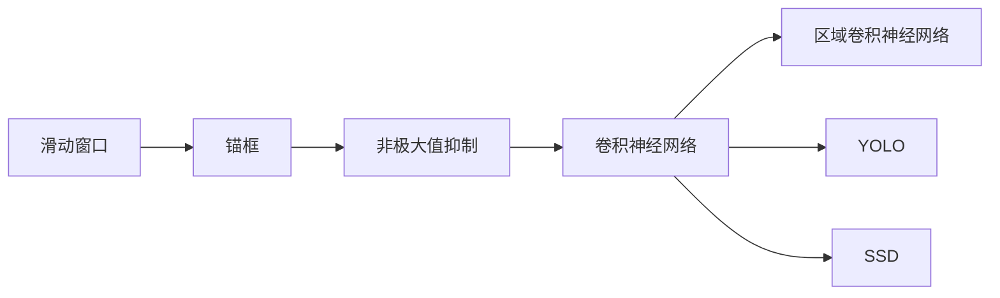

## 1. 背景介绍

物体检测(Object Detection)是计算机视觉中的关键任务之一，它的目标是在图像中找出特定对象，确定它们的位置并进行分类。在过去的几年里，由于深度学习的发展，物体检测领域取得了显著的进步。本文将深入探讨物体检测的原理，并通过代码实例进行讲解。

## 2. 核心概念与联系

物体检测涉及到一系列的核心概念，包括滑动窗口、锚框、非极大值抑制(NMS)，以及深度学习中的一些关键概念，如卷积神经网络(CNN)、区域卷积神经网络(R-CNN)、YOLO(You Only Look Once)和SSD(Single Shot MultiBox Detector)等。



## 3. 核心算法原理具体操作步骤

物体检测的核心算法通常包括以下几个步骤：

### 3.1 特征提取

首先，我们需要对输入图像进行特征提取。这通常通过卷积神经网络来完成，CNN可以提取出图像中的关键特征。

### 3.2 候选区域生成

接下来，我们需要生成一些候选区域，这些区域可能包含我们要检测的对象。这可以通过滑动窗口或者锚框来完成。

### 3.3 区域分类

然后，我们需要对这些候选区域进行分类，确定它们是否包含我们要检测的对象，以及它们包含的是哪一类对象。这通常通过全连接层来完成。

### 3.4 边界框回归

最后，我们需要对这些候选区域的位置进行微调，得到更精确的边界框。这通常通过回归方法来完成。

## 4. 数学模型和公式详细讲解举例说明

在物体检测中，我们通常需要计算一些关键的数值，比如 Intersection over Union (IoU) 和非极大值抑制(NMS)。

### 4.1 Intersection over Union (IoU)

IoU是一个衡量两个边界框重叠程度的指标，它的计算公式如下：

$$ IoU = \frac{Area of Overlap}{Area of Union} $$

### 4.2 非极大值抑制(NMS)

非极大值抑制是一种用于消除多余的候选框的方法。如果两个候选框的IoU超过某个阈值，那么我们就只保留分数更高的那个。

## 5. 项目实践：代码实例和详细解释说明

接下来，我们将通过一个简单的代码实例来演示如何使用YOLO算法进行物体检测。

首先，我们需要导入所需的库：

```python
import cv2
import numpy as np
```

然后，我们需要加载预训练的YOLO模型：

```python
net = cv2.dnn.readNet("yolov3.weights", "yolov3.cfg")
```

接下来，我们需要加载输入图像，并进行预处理：

```python
img = cv2.imread("image.jpg")
blob = cv2.dnn.blobFromImage(img, 0.00392, (416, 416), (0, 0, 0), True, crop=False)
net.setInput(blob)
```

然后，我们需要进行前向传播，得到输出：

```python
outs = net.forward(output_layers)
```

接下来，我们需要处理输出，得到检测结果：

```python
for out in outs:
    for detection in out:
        scores = detection[5:]
        class_id = np.argmax(scores)
        confidence = scores[class_id]
        if confidence > 0.5:
            # Object detected
```

最后，我们需要显示检测结果：

```python
cv2.imshow("Image", img)
cv2.waitKey(0)
cv2.destroyAllWindows()
```

## 6. 实际应用场景

物体检测在许多实际应用场景中都有广泛的应用，包括自动驾驶、视频监控、医疗图像分析等。

## 7. 工具和资源推荐

如果你对物体检测感兴趣，以下是一些有用的工具和资源：

- OpenCV: 一个开源的计算机视觉库，提供了许多用于图像处理和计算机视觉的功能。

- TensorFlow Object Detection API: TensorFlow提供的一个用于物体检测的API，包含了许多预训练的模型。

- PyTorch: 一个强大的深度学习框架，提供了许多用于构建和训练神经网络的工具。

- COCO Dataset: 一个大规模的物体检测、分割和标注的数据集。

## 8. 总结：未来发展趋势与挑战

物体检测领域在过去的几年里取得了显著的进步，但仍然面临许多挑战，比如如何处理小目标、如何处理遮挡等。随着深度学习和计算机视觉技术的进一步发展，我们期待在未来看到更多的创新和突破。

## 9. 附录：常见问题与解答

Q: 什么是滑动窗口？

A: 滑动窗口是一种常用的图像处理技术，它通过在图像上滑动一个窗口来检测图像中的对象。

Q: 什么是锚框？

A: 锚框是一种用于生成候选区域的方法，它通过在图像中的每个位置生成多个不同大小和形状的框来覆盖所有可能的对象。

作者：禅与计算机程序设计艺术 / Zen and the Art of Computer Programming