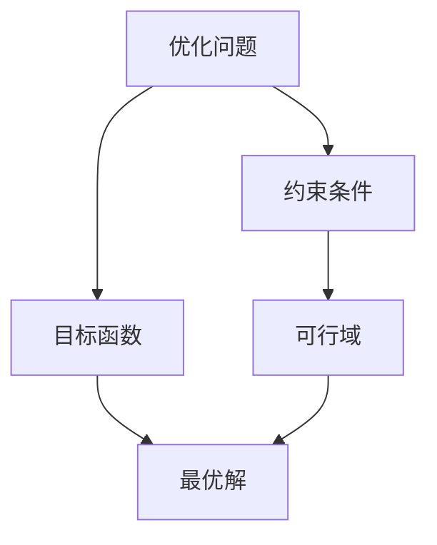

# Optimization Algorithms 原理与代码实战案例讲解

## 1.背景介绍

在各个领域中,优化问题无处不在。无论是制造业中的生产计划、金融领域的投资组合管理,还是机器学习中的模型训练,我们都需要寻找最优解来最大化或最小化某些目标函数。优化算法为我们提供了一种有效的工具,帮助我们在有限的时间和资源内找到满意的解。

优化问题可以分为多种类型,如线性规划、非线性规划、整数规划、组合优化等。不同类型的问题需要采用不同的优化算法。经典的优化算法有梯度下降法、牛顿法、内点法、动态规划等。近年来,随着计算能力的提高和数据量的激增,一些新兴的优化算法也应运而生,如遗传算法、蚁群优化算法、模拟退火算法等。

本文将重点介绍一些常用的优化算法原理,并通过实战案例讲解它们在实际问题中的应用。我们将探讨算法的思想、数学模型、实现细节以及优缺点分析。无论你是数学工作者、工程师还是学生,相信这些内容都会给你带来启发和收获。

## 2.核心概念与联系

在深入探讨具体算法之前,我们先来了解一些核心概念和它们之间的联系。

### 2.1 目标函数(Objective Function)

目标函数是优化问题的核心,它定义了我们想要最大化或最小化的量。在数学上,目标函数可以表示为:

$$
f(x_1, x_2, \ldots, x_n)
$$

其中 $x_1, x_2, \ldots, x_n$ 是决策变量,函数 $f$ 映射这些变量到一个实数值。我们的目标是找到变量的值,使得目标函数达到极大值或极小值。

### 2.2 约束条件(Constraints)

在现实问题中,我们通常需要在一些条件下寻找最优解。这些条件被称为约束条件,可以是等式约束或不等式约束。约束条件可以用数学形式表示为:

$$
g_i(x_1, x_2, \ldots, x_n) \leq 0, \quad i = 1, 2, \ldots, m \\
h_j(x_1, x_2, \ldots, x_n) = 0, \quad j = 1, 2, \ldots, p
$$

其中 $g_i$ 表示第 $i$ 个不等式约束,而 $h_j$ 表示第 $j$ 个等式约束。我们需要找到一组变量值,同时满足所有约束条件。

### 2.3 可行域(Feasible Region)

可行域是指满足所有约束条件的变量值的集合。在可行域内的任何一点,都是问题的可行解。我们的目标就是在可行域内寻找最优解。

以上是优化问题中几个核心概念之间的关系。我们首先定义目标函数和约束条件,从而确定可行域。然后在可行域内寻找使目标函数达到极值的最优解。

## 3.核心算法原理具体操作步骤

接下来,我们将介绍几种常用的优化算法的原理和具体操作步骤。

### 3.1 梯度下降法(Gradient Descent)

梯度下降法是一种用于无约束优化的经典算法。它的思想是沿着目标函数梯度的反方向更新变量值,不断逼近最小值点。算法步骤如下:

1) 初始化变量值 $x^{(0)}$
2) 对于 $k = 0, 1, 2, \ldots$,执行以下操作:
    a) 计算目标函数 $f$ 在 $x^{(k)}$ 处的梯度 $\nabla f(x^{(k)})$  
    b) 更新变量值 $x^{(k+1)} = x^{(k)} - \alpha \nabla f(x^{(k)})$,其中 $\alpha$ 是学习率
3) 重复步骤2),直到收敛或达到最大迭代次数

梯度下降法直观简单,易于实现。但它只能保证收敛到一个局部最小值,并且对初始值和学习率的选择比较敏感。

### 3.2 牛顿法(Newton's Method)

牛顿法是另一种无约束优化算法,它利用目标函数的二阶导数信息,具有更快的收敛速度。算法步骤如下:

1) 初始化变量值 $x^{(0)}$
2) 对于 $k = 0, 1, 2, \ldots$,执行以下操作:
    a) 计算目标函数 $f$ 在 $x^{(k)}$ 处的梯度 $\nabla f(x^{(k)})$ 和 Hessian 矩阵 $H(x^{(k)})$
    b) 求解方程 $H(x^{(k)})d^{(k)} = -\nabla f(x^{(k)})$ 得到方向 $d^{(k)}$
    c) 进行线搜索,找到步长 $\alpha_k$,使得 $f(x^{(k)} + \alpha_k d^{(k)})$ 最小
    d) 更新变量值 $x^{(k+1)} = x^{(k)} + \alpha_k d^{(k)}$
3) 重复步骤2),直到收敛或达到最大迭代次数

牛顿法的收敛速度更快,但需要计算二阶导数,计算代价较高。当目标函数不太光滑或 Hessian 矩阵不正定时,牛顿法可能会失效。

### 3.3 内点法(Interior-Point Methods)

内点法是一种用于求解线性规划和凸优化问题的有效算法。它的核心思想是通过自我正则化,将不等式约束转化为对数障碍函数,从而将原问题转化为无约束优化问题求解。算法步骤如下:

1) 构造对数障碍函数
2) 对于 $k = 0, 1, 2, \ldots$,执行以下操作:
    a) 使用牛顿法求解无约束子问题,得到方向 $d^{(k)}$
    b) 进行线搜索,找到步长 $\alpha_k$,使得障碍函数值下降
    c) 更新变量值 $x^{(k+1)} = x^{(k)} + \alpha_k d^{(k)}$
3) 重复步骤2),直到收敛或达到最大迭代次数

内点法具有理论保证的多项式时间复杂度,可以高效求解大规模线性规划和凸优化问题。但对于一般的非凸优化问题,内点法的性能可能不佳。

### 3.4 动态规划(Dynamic Programming)

动态规划是一种解决最优化问题的范式,它将原问题分解为相互重叠的子问题,避免重复计算,从而降低了时间复杂度。动态规划算法的一般步骤如下:

1) 将原问题分解为重叠的子问题
2) 自底向上地求解子问题,并存储子问题的最优解
3) 利用子问题的最优解构造原问题的最优解

动态规划适用于具有最优子结构的问题,如背包问题、最短路径问题等。它的时间复杂度通常为多项式级别,比暴力搜索方法更加高效。但动态规划需要额外的空间存储子问题的解,因此空间复杂度较高。

以上介绍了几种常用的优化算法原理和操作步骤。每种算法都有其适用场景和局限性,我们需要根据具体问题的特点选择合适的算法。接下来,我们将通过实战案例,进一步展示这些算法在实际问题中的应用。

## 4.数学模型和公式详细讲解举例说明

在上一节中,我们已经介绍了优化算法的核心思想和操作步骤。现在,让我们来看一些具体的数学模型和公式,并通过实例进行详细的讲解和说明。

### 4.1 线性规划(Linear Programming)

线性规划是最基本和最重要的优化问题之一。它的目标函数和约束条件都是线性的,可以表示为:

$$
\begin{aligned}
\max \ &c_1x_1 + c_2x_2 + \cdots + c_nx_n\\
\text{s.t.} \ &a_{11}x_1 + a_{12}x_2 + \cdots + a_{1n}x_n \leq b_1\\
           &a_{21}x_1 + a_{22}x_2 + \cdots + a_{2n}x_n \leq b_2\\
           &\cdots\\
           &a_{m1}x_1 + a_{m2}x_2 + \cdots + a_{mn}x_n \leq b_m\\
           &x_1, x_2, \ldots, x_n \geq 0
\end{aligned}
$$

其中 $c_i$ 是目标函数系数, $a_{ij}$ 和 $b_i$ 分别是约束条件的系数和常数项。我们的目标是在满足所有约束条件的前提下,最大化目标函数的值。

**实例1: 生产计划问题**

一家工厂生产两种产品 A 和 B。生产 A 需要 6 单位的原料 X 和 4 单位的原料 Y,生产 B 需要 3 单位的原料 X 和 5 单位的原料 Y。工厂现有 X 原料 30 单位,Y 原料 20 单位。若 A 产品的利润为 5 元/单位,B 产品的利润为 4 元/单位,求最大利润生产计划。

让我们构造线性规划模型:

- 决策变量:$x_1$ 表示生产 A 产品的数量,$x_2$ 表示生产 B 产品的数量
- 目标函数:$\max \ 5x_1 + 4x_2$ (最大化总利润)
- 约束条件:
    - $6x_1 + 3x_2 \leq 30$ (原料 X 的限制)
    - $4x_1 + 5x_2 \leq 20$ (原料 Y 的限制)
    - $x_1, x_2 \geq 0$ (非负约束)

利用单纯形算法或内点法等线性规划求解器,我们可以得到最优解 $x_1 = 3, x_2 = 4$,即生产 3 单位 A 产品和 4 单位 B 产品可以获得最大利润 35 元。

线性规划广泛应用于生产计划、运输问题、投资组合优化等领域。对于更复杂的情况,我们可以构建整数线性规划或混合整数线性规划模型。

### 4.2 非线性规划(Nonlinear Programming)

非线性规划是指目标函数或约束条件中至少有一个是非线性的优化问题。它的一般形式可以表示为:

$$
\begin{aligned}
\min \ &f(x_1, x_2, \ldots, x_n)\\
\text{s.t.} \ &g_i(x_1, x_2, \ldots, x_n) \leq 0, \quad i = 1, 2, \ldots, m\\
           &h_j(x_1, x_2, \ldots, x_n) = 0, \quad j = 1, 2, \ldots, p
\end{aligned}
$$

其中 $f$ 是目标函数, $g_i$ 和 $h_j$ 分别是不等式和等式约束条件。根据目标函数和约束条件的性质,非线性规划可以进一步分为凸优化、二次规划、几何规划等子类。

**实例2: 最小二乘法**

最小二乘法是一种常用的数据拟合方法,它的目标是找到一条直线或曲线,使得数据点到该线或曲线的距离平方和最小。

设有 $n$ 个数据点 $(x_1, y_1), (x_2, y_2), \ldots, (x_n, y_n)$,我们希望找到一条直线 $y = ax + b$,使得误差平方和最小,即:

$$
\min \ \sum_{i=1}^n (y_i - ax_i - b)^2
$$

通过展开并整理,我们可以得到等价的非线性规划模型:

$$
\begin{aligned}
\min \ &\frac{1}{2}(a^2\sum_{i=1}^n x_i^2 + n b^2 - 2a\sum_{i=1}^n x_iy_i - 2b\sum_{i=1}^n y_i + \sum_{i=1}^n y_i^2)
\end{aligned}
$$

对该无约束优