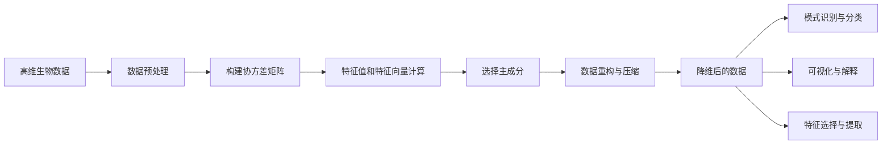

# PCA在生物信息学中的应用

## 1.背景介绍
### 1.1 生物信息学的发展
#### 1.1.1 生物信息学的起源与定义
#### 1.1.2 生物信息学的研究内容
#### 1.1.3 生物信息学的发展历程
### 1.2 高维生物数据的挑战  
#### 1.2.1 生物数据的高维特性
#### 1.2.2 高维数据分析的困难
#### 1.2.3 降维分析的必要性
### 1.3 PCA方法概述
#### 1.3.1 PCA的基本原理
#### 1.3.2 PCA的数学基础
#### 1.3.3 PCA在各领域的应用

## 2.核心概念与联系
### 2.1 PCA的数学基础
#### 2.1.1 矩阵的特征值与特征向量
#### 2.1.2 协方差矩阵
#### 2.1.3 奇异值分解
### 2.2 PCA的几何解释
#### 2.2.1 数据点的投影
#### 2.2.2 最大方差解释
#### 2.2.3 数据重构与压缩
### 2.3 PCA与其他降维方法的联系
#### 2.3.1 因子分析
#### 2.3.2 独立成分分析
#### 2.3.3 多维尺度分析

## 3.核心算法原理具体操作步骤
### 3.1 PCA算法步骤
#### 3.1.1 数据预处理
#### 3.1.2 构建协方差矩阵
#### 3.1.3 计算特征值和特征向量  
#### 3.1.4 选择主成分
#### 3.1.5 数据重构
### 3.2 PCA的变体算法
#### 3.2.1 Kernel PCA
#### 3.2.2 Sparse PCA
#### 3.2.3 Incremental PCA
### 3.3 PCA的实现细节
#### 3.3.1 数据规范化
#### 3.3.2 缺失值处理
#### 3.3.3 计算效率优化

## 4.数学模型和公式详细讲解举例说明
### 4.1 PCA的数学模型 
#### 4.1.1 线性变换模型
#### 4.1.2 优化目标函数
#### 4.1.3 约束条件
### 4.2 PCA的矩阵运算
#### 4.2.1 协方差矩阵的计算
#### 4.2.2 特征值问题求解
#### 4.2.3 数据投影与重构
### 4.3 案例分析：基因表达数据的PCA 
#### 4.3.1 数据集介绍
#### 4.3.2 PCA建模过程
#### 4.3.3 结果解释与可视化

## 5.项目实践：代码实例和详细解释说明
### 5.1 Python实现PCA
#### 5.1.1 数据加载与预处理
#### 5.1.2 PCA模型训练
#### 5.1.3 结果可视化与分析
### 5.2 R语言实现PCA
#### 5.2.1 prcomp函数
#### 5.2.2 主成分提取与解释
#### 5.2.3 Biplot可视化
### 5.3 MATLAB实现PCA  
#### 5.3.1 pca函数
#### 5.3.2 结果分析与绘图
#### 5.3.3 交互式探索

## 6.实际应用场景
### 6.1 基因表达数据分析
#### 6.1.1 肿瘤分型与分类
#### 6.1.2 生物标志物筛选 
#### 6.1.3 药物反应预测
### 6.2 蛋白质组学数据分析
#### 6.2.1 蛋白质表达谱比较
#### 6.2.2 生物标志物鉴定
#### 6.2.3 蛋白质相互作用研究
### 6.3 其他生物信息学应用
#### 6.3.1 遗传变异数据分析
#### 6.3.2 代谢组学数据分析
#### 6.3.3 生态学数据分析

## 7.工具和资源推荐
### 7.1 主流的PCA工具包
#### 7.1.1 scikit-learn
#### 7.1.2 MATLAB PCA工具箱
#### 7.1.3 R语言相关包
### 7.2 在线PCA分析平台
#### 7.2.1 MetaboAnalyst
#### 7.2.2 ClustVis
#### 7.2.3 Omictools
### 7.3 相关数据库资源
#### 7.3.1 GEO数据库
#### 7.3.2 TCGA数据库
#### 7.3.3 PRIDE数据库

## 8.总结：未来发展趋势与挑战
### 8.1 PCA方法的局限性
#### 8.1.1 线性假设的局限
#### 8.1.2 对异常值敏感 
#### 8.1.3 解释性不强
### 8.2 PCA的扩展与改进
#### 8.2.1 非线性PCA方法
#### 8.2.2 稀疏PCA
#### 8.2.3 鲁棒PCA
### 8.3 结合其他方法的综合分析框架
#### 8.3.1 PCA与聚类分析
#### 8.3.2 PCA与机器学习
#### 8.3.3 多组学数据整合分析

## 9.附录：常见问题与解答  
### 9.1 PCA的适用条件
### 9.2 主成分数的选择
### 9.3 PCA结果的生物学解释
### 9.4 PCA的统计显著性检验
### 9.5 PCA与监督学习的区别



主成分分析（PCA）是一种广泛应用于生物信息学领域的降维方法。面对高维度、高噪声的生物数据，PCA通过线性变换将原始数据映射到一个低维空间，同时最大程度地保留数据的方差信息。通过识别数据中的主要模式和结构，PCA可以帮助我们更好地理解复杂的生物学系统，发现潜在的生物标志物，并为后续的分析任务提供便利。

PCA的数学基础是矩阵的特征值分解。给定一个 $n \times p$ 维的数据矩阵 $X$，其中 $n$ 是样本数，$p$ 是特征数，PCA的目标是找到一个 $p \times k$ 维的变换矩阵 $W$，使得变换后的数据矩阵 $Z=XW$ 能够最大化数据的方差。从几何角度看，这相当于将数据点投影到一个低维空间，使得投影后的数据点尽可能分散。数学上，这可以表示为以下优化问题：

$$
\max_{W} \mathrm{tr}(W^T X^T X W) \\
\mathrm{s.t.} \quad W^T W = I
$$

其中，$\mathrm{tr}$ 表示矩阵的迹，$I$ 是单位矩阵。这个优化问题的解可以通过特征值分解来获得。具体地，我们首先计算数据的协方差矩阵 $C=\frac{1}{n-1} X^T X$，然后对其进行特征值分解：

$$
C = V \Lambda V^T
$$

其中，$V$ 是特征向量矩阵，$\Lambda$ 是特征值构成的对角矩阵。变换矩阵 $W$ 就是由协方差矩阵 $C$ 的前 $k$ 个最大特征值对应的特征向量构成。

PCA算法的具体步骤如下：

1. 数据预处理：对原始数据进行中心化和标准化处理，使得每个特征的均值为0，方差为1。
2. 构建协方差矩阵：计算数据的协方差矩阵 $C=\frac{1}{n-1} X^T X$。
3. 特征值分解：对协方差矩阵 $C$ 进行特征值分解，得到特征值和特征向量。
4. 选择主成分：根据特征值的大小，选择前 $k$ 个最大的特征值对应的特征向量作为主成分。
5. 数据投影：将原始数据 $X$ 投影到选定的主成分上，得到降维后的数据 $Z=XW$。

下面是一个使用Python的scikit-learn库实现PCA的示例代码：

```python
from sklearn.decomposition import PCA
from sklearn.preprocessing import StandardScaler

# 加载数据
X = ...  # 假设X是一个n*p维的数据矩阵

# 数据预处理
scaler = StandardScaler()
X_scaled = scaler.fit_transform(X)

# PCA模型训练
pca = PCA(n_components=k)  # 设定降维后的维度k
X_pca = pca.fit_transform(X_scaled)

# 结果分析
explained_variance_ratio = pca.explained_variance_ratio_
print('前k个主成分解释的方差比例：', explained_variance_ratio)
```

在生物信息学研究中，PCA被广泛应用于各种类型的高通量数据分析，如基因表达芯片数据、蛋白质组学数据、代谢组学数据等。通过PCA，研究人员可以识别出数据中的主要模式和趋势，发现潜在的生物标志物，并对样本进行分类和比较。例如，在基因表达数据分析中，PCA可以帮助我们鉴别出不同疾病状态或治疗条件下的特征性表达模式，为后续的生物学验证和临床应用提供线索。

尽管PCA是一种强大的数据降维工具，但它也存在一些局限性。PCA是一种线性变换方法，对于非线性结构的数据，其性能可能受到影响。此外，PCA对数据中的异常值比较敏感，异常值的存在会扭曲主成分的方向。针对这些问题，研究人员提出了多种PCA的扩展和改进方法，如Kernel PCA、Robust PCA等，以适应不同类型数据的特点。

未来，PCA在生物信息学领域的应用将进一步深化和拓展。一方面，PCA将与其他机器学习和统计方法相结合，形成更加综合和有效的数据分析策略，如PCA与聚类分析、PCA与分类器设计等。另一方面，PCA将在多组学数据整合分析中发挥重要作用，帮助我们从基因组、转录组、蛋白组、代谢组等不同层面的数据中提取关键信息，构建更加全面和系统的生物学模型。此外，随着高通量测序技术的不断发展，PCA也将面临新的机遇和挑战，如单细胞数据分析、空间组学数据分析等。

总之，PCA是生物信息学数据分析中的重要工具，其简单、有效、易解释的特点使其在复杂生物数据挖掘中大放异彩。通过与其他计算方法的有机结合，PCA必将为生命科学研究带来更多突破性的发现和认识。

作者：禅与计算机程序设计艺术 / Zen and the Art of Computer Programming