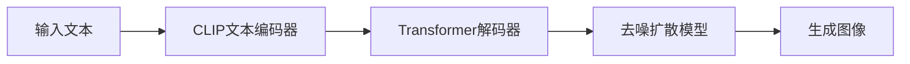

# Parti原理与代码实例讲解

## 1.背景介绍

近年来,随着人工智能技术的飞速发展,大语言模型(LLM)已经成为了自然语言处理领域的研究热点。而在众多LLM中,Parti模型以其出色的图文生成能力脱颖而出,受到了业界的广泛关注。本文将深入探讨Parti模型的原理,并通过代码实例帮助读者更好地理解和应用这一前沿技术。

### 1.1 大语言模型概述
#### 1.1.1 大语言模型的定义与特点
#### 1.1.2 大语言模型的发展历程
#### 1.1.3 大语言模型的应用领域

### 1.2 Parti模型的诞生
#### 1.2.1 Parti模型的研发背景
#### 1.2.2 Parti模型的创新之处
#### 1.2.3 Parti模型的发展前景

## 2.核心概念与联系

要深入理解Parti模型,首先需要掌握一些核心概念。本章将介绍Parti模型涉及的关键术语,并阐明它们之间的联系。

### 2.1 Transformer架构
#### 2.1.1 Transformer的基本结构
#### 2.1.2 Self-Attention机制
#### 2.1.3 位置编码

### 2.2 扩散模型
#### 2.2.1 扩散模型的基本原理 
#### 2.2.2 去噪过程
#### 2.2.3 条件扩散模型

### 2.3 CLIP模型
#### 2.3.1 CLIP模型的结构
#### 2.3.2 图像编码器
#### 2.3.3 文本编码器

### 2.4 Parti模型架构


## 3.核心算法原理具体操作步骤

本章将详细阐述Parti模型的核心算法原理,并给出具体的操作步骤,帮助读者深入理解模型的运作机制。

### 3.1 文本编码
#### 3.1.1 文本预处理
#### 3.1.2 CLIP文本编码器前向传播
#### 3.1.3 获取文本特征向量

### 3.2 图像生成
#### 3.2.1 随机噪声初始化
#### 3.2.2 条件扩散去噪过程
#### 3.2.3 迭代生成高质量图像

### 3.3 训练过程
#### 3.3.1 数据准备与预处理
#### 3.3.2 损失函数设计
#### 3.3.3 优化器选择与超参数调优

## 4.数学模型和公式详细讲解举例说明

为了帮助读者更好地理解Parti模型涉及的数学原理,本章将详细讲解模型中用到的关键数学模型和公式,并给出具体的举例说明。

### 4.1 注意力机制
注意力分数计算公式:

$Attention(Q,K,V) = softmax(\frac{QK^T}{\sqrt{d_k}})V$

其中,$Q$,$K$,$V$分别表示查询向量、键向量和值向量,$d_k$为向量维度。

### 4.2 扩散模型
扩散过程公式:

$q(x_t|x_{t-1}) = \mathcal{N}(x_t; \sqrt{1-\beta_t} x_{t-1}, \beta_t \mathbf{I})$

其中,$x_t$表示t时刻的噪声图像,$\beta_t$为扩散率,$\mathbf{I}$为单位矩阵。

反向去噪过程公式:

$p_\theta(x_{t-1}|x_t) = \mathcal{N}(x_{t-1}; \mu_\theta(x_t, t), \Sigma_\theta(x_t, t))$

其中,$\mu_\theta$和$\Sigma_\theta$分别表示均值和方差,由神经网络参数化。

### 4.3 对比语言-图像预训练(CLIP)
CLIP模型的目标函数:

$$\mathcal{L} = -\frac{1}{N} \sum_{i=1}^N \log \frac{\exp(\text{sim}(I_i, T_i)/\tau)}{\sum_{j=1}^N \exp(\text{sim}(I_i, T_j)/\tau)}$$

其中,$I_i$和$T_i$分别表示第i个图像和文本对,$\text{sim}$为余弦相似度函数,$\tau$为温度超参数。

## 5.项目实践：代码实例和详细解释说明

本章将通过Python代码实例,演示如何使用Parti模型进行图文生成任务,并对关键代码进行详细解释说明。

### 5.1 环境配置
#### 5.1.1 安装PyTorch
#### 5.1.2 安装Transformers库
#### 5.1.3 安装Diffusers库

### 5.2 加载预训练模型

```python
from transformers import CLIPTextModel, CLIPTokenizer
from diffusers import AutoencoderKL, UNet2DConditionModel, PNDMScheduler

# 加载CLIP文本编码器
text_encoder = CLIPTextModel.from_pretrained("openai/clip-vit-large-patch14")
tokenizer = CLIPTokenizer.from_pretrained("openai/clip-vit-large-patch14")

# 加载VAE自编码器
vae = AutoencoderKL.from_pretrained("stabilityai/sd-vae-ft-mse")

# 加载UNet模型
unet = UNet2DConditionModel.from_pretrained("google/parti-1b-distilled")

# 加载PNDM调度器
scheduler = PNDMScheduler(beta_start=0.00085, beta_end=0.012, beta_schedule="scaled_linear",
                          num_train_timesteps=1000)
```

### 5.3 文本到图像生成

```python
from torch import autocast

prompt = "a photo of an astronaut riding a horse on mars"

# 文本编码
text_input = tokenizer(prompt, padding="max_length", max_length=tokenizer.model_max_length, 
                       truncation=True, return_tensors="pt")
with torch.no_grad():
    text_embeddings = text_encoder(text_input.input_ids.to(device))[0]

# 随机噪声初始化    
latents = torch.randn((1, unet.in_channels, height // 8, width // 8), device=device)
latents = latents * scheduler.init_noise_sigma

# 扩散去噪过程
with autocast("cuda"):
    for i, t in enumerate(scheduler.timesteps):
        # 扩散过程中的潜在表示
        latent_model_input = scheduler.scale_model_input(latents, t)
        
        # 预测去噪噪声
        with torch.no_grad():
            noise_pred = unet(latent_model_input, t, encoder_hidden_states=text_embeddings).sample
        
        # 去噪更新潜在表示
        latents = scheduler.step(noise_pred, t, latents).prev_sample
        
# 解码生成图像        
image = vae.decode(latents / vae.config.scaling_factor).sample
image = (image / 2 + 0.5).clamp(0, 1)
image = image.cpu().permute(0, 2, 3, 1).numpy()[0]
```

以上代码实现了使用Parti模型根据文本提示生成图像的完整流程。首先加载预训练的CLIP文本编码器、VAE解码器和UNet模型,然后对输入的文本进行编码得到文本特征向量。接着初始化随机噪声,并通过扩散去噪过程迭代更新潜在表示。最后使用VAE解码器将最终的潜在表示解码为生成的图像。

## 6.实际应用场景

Parti模型强大的图文生成能力使其在许多领域都有广泛的应用前景,本章将介绍几个典型的应用场景。

### 6.1 创意设计
#### 6.1.1 广告图生成
#### 6.1.2 产品设计
#### 6.1.3 游戏场景生成

### 6.2 教育培训
#### 6.2.1 教学课件制作
#### 6.2.2 儿童绘本生成 
#### 6.2.3 虚拟实验环境构建

### 6.3 医疗健康
#### 6.3.1 医学影像分析
#### 6.3.2 药物分子设计
#### 6.3.3 医疗器械设计

## 7.工具和资源推荐

为了方便读者进一步学习和应用Parti模型,本章推荐了一些有用的工具和资源。

### 7.1 开源实现
- [Hugging Face Diffusers](https://github.com/huggingface/diffusers)
- [Stable Diffusion WebUI](https://github.com/AUTOMATIC1111/stable-diffusion-webui) 
- [InvokeAI](https://github.com/invoke-ai/InvokeAI)

### 7.2 相关论文
- [Scaling Autoregressive Models for Content-Rich Text-to-Image Generation](https://arxiv.org/abs/2206.10789)
- [Photorealistic Text-to-Image Diffusion Models with Deep Language Understanding](https://arxiv.org/abs/2205.11487)
- [High-Resolution Image Synthesis with Latent Diffusion Models](https://arxiv.org/abs/2112.10752)

### 7.3 学习资源
- [Hugging Face Course](https://huggingface.co/course/chapter1/1)
- [Diffusion Models Tutorial](https://cvnote.ddlee.cn/2022/09/03/diffusion-models-tutorial.html)
- [StableDiffusionBook](https://github.com/sudoskys/StableDiffusionBook)

## 8.总结：未来发展趋势与挑战

Parti模型代表了图文生成技术的最新进展,展现出了令人振奋的发展前景。然而,要真正实现其商业化应用,仍然面临着一些挑战。本章将总结Parti模型的未来发展趋势,并分析其面临的主要挑战。

### 8.1 发展趋势
#### 8.1.1 模型性能的进一步提升
#### 8.1.2 多模态融合能力增强
#### 8.1.3 应用领域不断拓展

### 8.2 面临的挑战
#### 8.2.1 计算资源需求大
#### 8.2.2 数据版权与隐私问题
#### 8.2.3 生成内容的安全性与伦理性

## 9.附录：常见问题与解答

### 9.1 Parti模型可以处理中文吗？
Parti原始论文中只在英文数据集上进行了训练和测试,尚未见到在中文数据上直接训练的结果。但理论上,Parti模型的架构是语言无关的,只要提供足够的中文图文对数据集,是可以训练出支持中文的Parti模型的。

### 9.2 Parti模型生成一张图像需要多长时间？
生成图像的时间主要取决于硬件条件和图像分辨率。在一张12GB显存的NVIDIA GPU上,生成一张512x512分辨率的图像平均需要10-20秒左右。分辨率越高,所需时间越长。

### 9.3 如何微调Parti模型以适应特定领域？
微调Parti模型需要准备特定领域的图文对数据集,然后在预训练模型的基础上,使用新数据集进行二次训练。可以选择只微调UNet模型,也可以同时微调CLIP文本编码器。微调时需要适当降低学习率,以防止过拟合。

### 9.4 Parti模型能否支持视频生成？
目前的Parti模型还不能直接支持视频生成。但可以考虑将其与时序模型(如LSTM、Transformer等)结合,通过逐帧生成的方式实现视频生成。这是一个很有潜力的研究方向。

作者：禅与计算机程序设计艺术 / Zen and the Art of Computer Programming