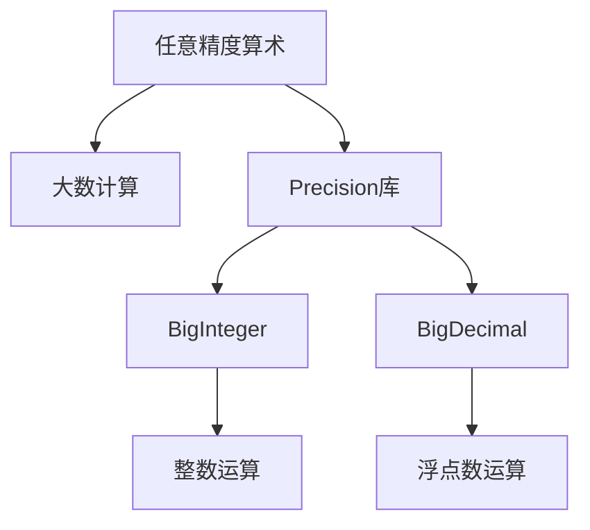

# Precision 原理与代码实战案例讲解

## 1. 背景介绍

在现代计算机系统中,精度(Precision)是一个至关重要的概念。精度指的是数值表示的精确程度,它决定了计算机能够表示和处理数值的精细程度。精度问题不仅影响数值计算的准确性,还关系到系统的可靠性和稳定性。

随着科学计算、金融交易、大数据分析等领域对精确计算的需求日益增长,精度问题已经成为计算机科学研究的一个重要课题。传统的浮点数表示方式存在一些固有的局限性,如有效数字位数的限制、舍入误差的累积等,这使得在一些场景下无法满足高精度计算的要求。

为了解决这一问题,研究人员提出了多种高精度计算的方法和技术,其中最著名的就是Precision库。Precision库是一种用于任意精度数值计算的软件库,它提供了一种高效、可扩展的方式来表示和操作任意精度的数值。

## 2. 核心概念与联系

### 2.1 任意精度算术

任意精度算术(Arbitrary-Precision Arithmetic)是指能够以任意精度表示和操作数值的算术运算。与传统的固定精度算术(如浮点数)不同,任意精度算术可以根据需求动态调整数值的精度,从而避免了精度损失和舍入误差。

任意精度算术的核心思想是将数值表示为一个可扩展的数字序列,而不是使用固定的位数或字节数。这种表示方式允许在内存和计算时间之间进行权衡,从而实现高精度计算。

### 2.2 大数计算

大数计算(Big Number Arithmetic)是任意精度算术的一个重要应用领域。在一些领域,如密码学、金融计算等,需要处理超出传统数据类型表示范围的大整数或大浮点数。大数计算技术可以有效地解决这一问题,确保计算的准确性和可靠性。

### 2.3 Precision库

Precision库是一个流行的任意精度算术库,它提供了一组用于表示和操作任意精度数值的数据类型和算法。Precision库支持整数、有理数和浮点数的任意精度计算,并提供了丰富的数学函数和操作。

Precision库的核心数据类型是`BigInteger`和`BigDecimal`,分别用于表示任意精度的整数和浮点数。这些数据类型提供了一系列算术运算、比较运算和位运算等方法,使得任意精度计算变得简单和高效。



## 3. 核心算法原理具体操作步骤

Precision库的核心算法原理基于经典的大数计算算法,如高精度乘法、高精度除法等。这些算法通过对数字序列进行操作,实现了任意精度的数值运算。

以下是Precision库中一些核心算法的具体操作步骤:

### 3.1 高精度乘法

高精度乘法算法用于计算两个大整数的乘积。它的基本思想是将乘数和被乘数分解为多个小整数,分别计算它们的乘积,然后将所有乘积相加得到最终结果。

1. 将乘数和被乘数分解为多个小整数,每个小整数的位数不超过一个预定义的基数。
2. 计算每对小整数的乘积,并将结果存储在一个临时数组中。
3. 将临时数组中的所有乘积相加,得到最终的乘积结果。

该算法的时间复杂度为O(n^2),其中n是操作数的位数。

### 3.2 高精度除法

高精度除法算法用于计算两个大整数的商和余数。它的基本思想是通过不断试商和修正的方式,逐位计算商的每一位数字。

1. 初始化商为0,余数为被除数。
2. 从高位到低位,对于每一位:
   a. 估计当前位的商数字。
   b. 用估计的商数字乘以除数,并从余数中减去乘积。
   c. 如果减法结果为负,则修正商数字并重新计算。
3. 当所有位都计算完毕后,余数即为最终的余数,商为计算得到的商数。

该算法的时间复杂度为O(n^2),其中n是操作数的位数。

### 3.3 模数运算

模数运算是许多密码学算法的基础,如RSA加密算法。Precision库提供了高效的模数运算算法,用于计算大整数的模运算。

1. 使用高精度除法算法计算被模数除以模数的商和余数。
2. 余数即为模运算的结果。

该算法的时间复杂度取决于除法算法的时间复杂度,通常为O(n^2)。

这些核心算法为Precision库提供了高效的任意精度计算能力,并为更高层次的数学运算和应用程序奠定了基础。

## 4. 数学模型和公式详细讲解举例说明

在任意精度算术中,数学模型和公式扮演着重要的角色。它们不仅为算法提供了理论基础,还为精度分析和误差估计提供了工具。

### 4.1 大数表示

在Precision库中,大整数和大浮点数都是使用数字序列来表示的。对于一个大整数$x$,它可以表示为:

$$x = \sum_{i=0}^{n-1} x_i \cdot b^i$$

其中$b$是基数(通常为$2^{32}$或$10^9$),$x_i$是每一位的数字,满足$0 \leq x_i < b$。这种表示方式允许任意精度的整数表示,只需要扩展数字序列的长度即可。

对于一个大浮点数$y$,它可以表示为:

$$y = \sum_{i=0}^{n-1} y_i \cdot b^i + e$$

其中$e$是指数部分,用于表示小数点的位置。这种表示方式与科学计数法类似,但是可以支持任意精度的尾数部分。

### 4.2 误差分析

在任意精度计算中,误差分析是一个重要的课题。由于计算机只能表示有限精度的数值,因此计算结果会存在一定的误差。

对于一个计算结果$r$,其真实值为$r^*$,则绝对误差可以定义为:

$$\epsilon_a = |r - r^*|$$

相对误差可以定义为:

$$\epsilon_r = \frac{|r - r^*|}{|r^*|}$$

通过控制操作数的精度和计算过程中的舍入模式,可以有效地控制计算结果的误差范围。

### 4.3 舍入模式

在任意精度计算中,舍入模式决定了如何处理尾数的舍入。Precision库提供了多种舍入模式,如向上舍入(CEILING)、向下舍入(FLOOR)、四舍五入(HALF_UP)等。

例如,对于一个大浮点数$x$,如果要将其舍入到小数点后$n$位,可以使用以下公式:

$$x' = \lfloor \frac{x \cdot 10^n + s}{10^n} \rceil \cdot 10^{-n}$$

其中$s$是舍入增量,取决于所选的舍入模式。对于向上舍入,$s = 0.5$;对于向下舍入,$s = -0.5$;对于四舍五入,$s = 0.5$如果最后一位是5且前一位是奇数,否则为0。

通过合理选择舍入模式,可以满足不同应用场景对精度和误差的要求。

这些数学模型和公式为任意精度算术提供了坚实的理论基础,并为算法设计和误差控制提供了指导。

## 5. 项目实践: 代码实例和详细解释说明

为了更好地理解Precision库的使用方式,我们将通过一些代码实例来演示它的核心功能。

### 5.1 BigInteger示例

```java
import java.math.BigInteger;

public class BigIntegerExample {
    public static void main(String[] args) {
        // 创建大整数
        BigInteger a = new BigInteger("9876543210987654321098765432109876543210");
        BigInteger b = new BigInteger("1234567890");

        // 加法
        BigInteger sum = a.add(b);
        System.out.println("Sum: " + sum);

        // 减法
        BigInteger diff = a.subtract(b);
        System.out.println("Difference: " + diff);

        // 乘法
        BigInteger product = a.multiply(b);
        System.out.println("Product: " + product);

        // 除法
        BigInteger[] quotientAndRemainder = a.divideAndRemainder(b);
        BigInteger quotient = quotientAndRemainder[0];
        BigInteger remainder = quotientAndRemainder[1];
        System.out.println("Quotient: " + quotient);
        System.out.println("Remainder: " + remainder);

        // 模运算
        BigInteger modulus = a.mod(b);
        System.out.println("Modulus: " + modulus);

        // 幂运算
        BigInteger power = a.pow(5);
        System.out.println("Power: " + power);

        // 比较
        int comparison = a.compareTo(b);
        System.out.println("Comparison: " + comparison);
    }
}
```

在这个示例中,我们创建了两个大整数`a`和`b`,并演示了加法、减法、乘法、除法、模运算、幂运算和比较操作。

- `add()`方法用于计算两个大整数的和。
- `subtract()`方法用于计算两个大整数的差。
- `multiply()`方法用于计算两个大整数的乘积。
- `divideAndRemainder()`方法用于计算两个大整数的商和余数。
- `mod()`方法用于计算一个大整数对另一个大整数的模。
- `pow()`方法用于计算一个大整数的幂。
- `compareTo()`方法用于比较两个大整数的大小关系。

通过这些示例,我们可以看到Precision库提供了丰富的大整数操作方法,使得任意精度的整数计算变得简单和高效。

### 5.2 BigDecimal示例

```java
import java.math.BigDecimal;
import java.math.RoundingMode;

public class BigDecimalExample {
    public static void main(String[] args) {
        // 创建大浮点数
        BigDecimal a = new BigDecimal("3.1415926535897932384626433832795");
        BigDecimal b = new BigDecimal("2.718281828459045235360287471352662");

        // 加法
        BigDecimal sum = a.add(b);
        System.out.println("Sum: " + sum);

        // 减法
        BigDecimal diff = a.subtract(b);
        System.out.println("Difference: " + diff);

        // 乘法
        BigDecimal product = a.multiply(b);
        System.out.println("Product: " + product);

        // 除法
        BigDecimal quotient = a.divide(b, 20, RoundingMode.HALF_UP);
        System.out.println("Quotient: " + quotient);

        // 舍入
        BigDecimal rounded = a.setScale(10, RoundingMode.HALF_UP);
        System.out.println("Rounded: " + rounded);

        // 比较
        int comparison = a.compareTo(b);
        System.out.println("Comparison: " + comparison);
    }
}
```

在这个示例中,我们创建了两个大浮点数`a`和`b`,并演示了加法、减法、乘法、除法、舍入和比较操作。

- `add()`方法用于计算两个大浮点数的和。
- `subtract()`方法用于计算两个大浮点数的差。
- `multiply()`方法用于计算两个大浮点数的乘积。
- `divide()`方法用于计算两个大浮点数的商,第二个参数指定了小数位数,第三个参数指定了舍入模式。
- `setScale()`方法用于将一个大浮点数舍入到指定的小数位数,第二个参数指定了舍入模式。
- `compareTo()`方法用于比较两个大浮点数的大小关系。

通过这些示例,我们可以看到Precision库提供了丰富的大浮点数操作方法,并支持多种舍入模式,使得任意精度的浮点数计算变得简单和高效。

## 6. 实际应用场景

Precision库在许多领域都有广泛的应用,尤其是在需要高精度计算的场景中。以下是一些典型的应用场景:

### 6.1 科学计算

在科学计算领域,如物理模拟、天文计算等,往往需要进行高精度的数值计算。Precision库可以提供任意精度