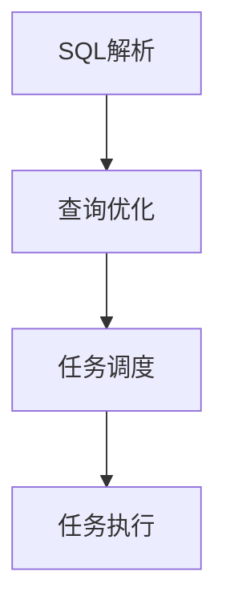

# Presto原理与代码实例讲解

## 1.背景介绍

Presto是由Facebook开源的一个分布式SQL查询引擎,用于交互式分析查询,数据量支持GB到PB字节。Presto的设计和实现吸取了Hive、Dremel、ImpalaDB、F1等大数据分析系统的优点,专注于低延迟和交互式分析。

### 1.1 Presto的诞生背景

- Facebook内部大量不同的数据存储系统,包括HDFS、HBase、Scribe日志等
- 数据分析主要依赖Hive,但Hive延迟较高,且不支持交互式查询 
- 需要一个通用的交互式查询引擎,支持标准SQL,满足数据分析需求

### 1.2 Presto的发展历程

- 2012年由Facebook开发,2013年11月开源
- 2019年PrestoDB和Presto正式分道扬镳
- 目前Presto已经成为大数据交互式分析领域的主流开源项目

### 1.3 Presto的主要特点

- 纯Java开发,部署简单
- 支持标准SQL,学习成本低
- 插件化的连接器设计,支持多种数据源
- 多租户资源隔离与管理
- 优化器支持谓词下推、列裁剪等优化策略
- 动态编译、代码生成等先进技术

## 2.核心概念与联系

### 2.1 Presto架构

#### 2.1.1 Coordinator 
- 负责解析SQL、制定查询计划、任务调度与管理
- 对外提供REST API,接收客户端请求
- 一个集群有一个active的Coordinator

#### 2.1.2 Worker
- 负责执行实际的查询处理任务
- 从数据源读取数据,进行计算处理
- 一个集群可以有多个Worker

#### 2.1.3 Connector
- 连接器,负责与底层数据源交互
- 将数据源的元数据、数据映射为Presto的表
- 插件化设计,支持多种数据源扩展

#### 2.1.4 Catalog
- 数据源在Presto中的抽象
- 一个Catalog包含Schema和Table
- 通过Connector访问实际的底层数据 

#### 2.1.5 数据流


### 2.2 查询处理流程

#### 2.2.1 SQL解析
- Antlr解析SQL生成语法树AST
- 语义分析,检查表、字段是否存在
- 生成逻辑查询计划

#### 2.2.2 查询优化
- 逻辑查询计划优化,如谓词下推 
- 物理查询计划生成,确定join顺序等
- 代价估计,选择最优计划

#### 2.2.3 任务调度
- 将查询计划切分为多个stage
- 每个stage生成多个task在worker上执行
- 调度策略:all-at-once、phased、query-aware

#### 2.2.4 任务执行
- 算子以流水线方式执行
- 数据以page为单位在算子间传输
- 拉取模型,由下游算子主动从上游获取数据



## 3.核心算法原理具体操作步骤

### 3.1 谓词下推优化

#### 3.1.1 原理
- 将过滤条件尽可能下推到数据源
- 减少数据传输和处理,提升查询效率

#### 3.1.2 规则
- 常量表达式计算
- 复杂谓词拆分
- 不相关子查询提升
- 列裁剪

#### 3.1.3 示例
```sql
SELECT a FROM t1 JOIN t2 ON t1.id=t2.id WHERE t1.region='cn' AND t2.age>20
```
优化后:
```sql
SELECT a FROM 
    (SELECT * FROM t1 WHERE region='cn') t1 
  JOIN
    (SELECT * FROM t2 WHERE age>20) t2
  ON t1.id=t2.id
```

### 3.2 动态编译优化

#### 3.2.1 原理
- 将热点查询编译为字节码
- 减少虚拟机解释开销,提升执行效率

#### 3.2.2 触发条件
- 查询执行时间超过一定阈值
- 查询执行次数超过一定阈值

#### 3.2.3 编译过程
- 生成中间代码
- 代码优化
- 生成字节码
- 加载字节码执行

### 3.3 代码生成优化

#### 3.3.1 原理 
- 针对特定查询生成定制代码
- 减少分支判断,提升执行效率

#### 3.3.2 场景
- 布隆过滤器
- 字典编码
- 分组聚合

#### 3.3.3 示例
```java
// 常规group by sum实现
for (Page page : pages) {
    for (int position = 0; position < page.getPositionCount(); position++) {
        long groupId = groupByHash.putIfAbsent(page, position);
        aggregationFunction.add(groupId, page, position); 
    }
}

// 代码生成优化后
for (int position = 0; position < page.getPositionCount(); position++) {
    long value = page.getLong(0,position);
    aggregationFunction.add(value, value); 
}
```

## 4.数学模型和公式详细讲解举例说明

### 4.1 布隆过滤器原理

布隆过滤器是一种概率数据结构,用于检测一个元素是否在集合中。它使用多个哈希函数将元素映射到位数组中,并支持高效地检测元素是否存在。

#### 4.1.1 数学模型

假设布隆过滤器的位数组大小为 $m$,哈希函数个数为 $k$,集合大小为 $n$。

- 某个特定位置为 0 的概率:

$$ P_0 = (1-\frac{1}{m})^{kn} \approx e^{-\frac{kn}{m}} $$

- 某个特定位置为 1 的概率:

$$ P_1 = 1 - P_0 \approx 1 - e^{-\frac{kn}{m}} $$

- 假阳性(false positive)概率,即元素不在集合但判断为在的概率:

$$ P_{FP} = (1 - P_0)^k = (1 - e^{-\frac{kn}{m}})^k $$

#### 4.1.2 参数设置

为了降低假阳性概率,合理设置布隆过滤器的参数非常重要。

- 位数组大小 $m$ :

$$ m = -\frac{n\ln P_{FP}}{(\ln 2)^2} $$

- 哈希函数个数 $k$:

$$ k = \frac{m}{n}\ln 2 $$

### 4.2 HyperLogLog算法原理

HyperLogLog是一种概率算法,用于估计大数据集合的基数(distinct值的个数)。它通过概率统计方法,以较小的空间复杂度估算基数。

#### 4.2.1 数学模型

HyperLogLog将元素哈希到比特串,统计比特串前导零的个数 $\rho$。根据 $\rho$ 的调和平均数来估计基数。

假设哈希函数将元素均匀分布到 $2^{32}$ 个桶中,每个桶的比特串为 $b_1,b_2,...,b_{2^{32}}$。

- 比特串 $b_i$ 前导零个数 $\rho_i$ 的概率分布:

$$ P(\rho_i=k)=2^{-k-1}, k=0,1,2,... $$

- 调和平均数:

$$ E(\frac{1}{2^{\rho}}) = \sum_{k=0}^{\infty} \frac{1}{2^k}P(\rho_i=k) = \sum_{k=0}^{\infty} \frac{1}{2^k}2^{-k-1} = 2 $$

- 基数估计:

$$ n \approx \frac{m^2}{\sum_{i=1}^{m} 2^{-M_i}} $$

其中 $m$ 为桶的个数,$M_i$ 为第 $i$ 个桶的比特串前导零个数。

#### 4.2.2 算法步骤

1. 将元素哈希到 $m$ 个桶中
2. 对每个桶,统计哈希值前导零个数的最大值 $M_i$ 
3. 根据公式计算调和平均数,得到基数估计值

HyperLogLog能以较小的空间复杂度 $O(m)$ 估算大数据集合的基数,广泛应用于数据分析、网络监控等领域。

## 5.项目实践：代码实例和详细解释说明

下面以一个简单的Presto UDF(用户自定义函数)为例,演示如何开发和使用Presto插件。

### 5.1 创建Maven项目

创建一个Maven项目,引入Presto相关依赖:

```xml
<dependencies>
    <dependency>
        <groupId>io.prestosql</groupId>
        <artifactId>presto-spi</artifactId>
        <version>334</version>
        <scope>provided</scope>
    </dependency>
</dependencies>
```

### 5.2 编写UDF函数

创建一个类实现`ScalarFunction`接口,编写自定义函数逻辑:

```java
import io.prestosql.spi.function.Description;
import io.prestosql.spi.function.ScalarFunction;
import io.prestosql.spi.function.SqlType;
import io.prestosql.spi.type.StandardTypes;

public class ReverseFunction {

    @ScalarFunction("reverse")
    @Description("reverse a string")
    @SqlType(StandardTypes.VARCHAR)
    public static String reverse(@SqlType(StandardTypes.VARCHAR) String input) {
        return new StringBuilder(input).reverse().toString();
    }
}
```

这里定义了一个`reverse`函数,用于字符串反转。函数通过注解`@ScalarFunction`、`@Description`、`@SqlType`说明函数名称、描述、参数和返回值类型。

### 5.3 创建Plugin类

创建一个Plugin类,用于注册自定义函数:

```java
import io.prestosql.spi.Plugin;

public class ReversePlugin implements Plugin {

    @Override
    public Iterable<Class<?>> getFunctions() {
        return ImmutableList.<Class<?>>builder()
            .add(ReverseFunction.class)
            .build();
    }
}
```

在`getFunctions`方法中将`ReverseFunction`注册到Presto中。

### 5.4 打包部署

使用Maven打包项目为jar文件,将生成的jar文件放到Presto的`plugin`目录下。

### 5.5 使用自定义函数

启动Presto,就可以在SQL中使用自定义的`reverse`函数了:

```sql
SELECT reverse('hello');
```

结果:
```
 _col0
-------
 olleh
(1 row)
```

可以看到,`reverse`函数已经成功注册并可以在SQL中使用了。Presto的插件机制使得我们可以方便地扩展其功能,满足个性化的需求。

## 6.实际应用场景

### 6.1 互联网广告分析

- 实时分析广告点击、曝光数据,优化广告策略
- 通过Presto对HDFS上的广告日志进行SQL分析
- 与Kafka结合,实现实时数据流处理

### 6.2 游戏数据分析

- 分析游戏玩家行为数据,优化游戏设计
- 通过Presto对不同数据源(如Hive、HBase)的玩家数据进行联合查询分析
- 实现游戏运营指标的实时监控与分析

### 6.3 金融风控分析

- 对交易数据进行实时风险检测与分析
- 通过Presto对交易记录、用户行为等数据进行多维度关联分析
- 结合机器学习算法,实现实时反欺诈

### 6.4 物联网数据分析

- 海量传感器数据的实时分析
- 通过Presto对各种物联网数据源进行统一查询分析
- 实现设备监控、预测性维护等应用

## 7.工具和资源推荐

### 7.1 Yanagishima

一个开源的Presto Web UI工具,简化Presto查询的使用和管理。

### 7.2 Airpal 

Airbnb开源的Presto查询前端工具,支持查询模板、权限管理等功能。

### 7.3 Presto文档

官方网站提供了详尽的Presto文档,包括安装、使用、优化等方方面面。

### 7.4 Presto源码

学习Presto内部实现的最好方式就是阅读其源码,可以从Github上获取。

## 8.总结：未来发展趋势与挑战

### 8.1 云原生支持

随着云计算的发展,Presto需要更好地适应云环境,提供弹性伸