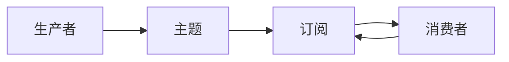

## 1.背景介绍

Apache Pulsar是一个高性能、可扩展的开源消息传递系统，适用于大规模数据处理。它由Yahoo开发并开源，现在在Apache Software Foundation进行维护。Pulsar设计用于实现灵活的消息传递，其特性包括：原生支持多租户、高吞吐量、低延迟、持久化存储、多订阅类型等。其中，Consumer（消费者）是Pulsar中的关键组件，它负责从Pulsar主题中接收并处理消息。在本文中，我们将深入探讨Pulsar Consumer的工作原理，并通过代码示例进行详细解释。

## 2.核心概念与联系

在深入了解Pulsar Consumer之前，我们先来认识一下Pulsar的几个核心概念：

- **主题（Topic）**：主题是Pulsar中用于发布和订阅消息的名称空间。每个主题都有一个唯一的名称，生产者发布消息到主题，消费者从主题订阅和接收消息。

- **生产者（Producer）**：生产者是发布消息到Pulsar主题的实体。

- **消费者（Consumer）**：消费者是从Pulsar主题订阅并接收消息的实体。

- **订阅（Subscription）**：订阅是消费者与主题之间的命名关系。消费者通过订阅来接收主题的消息。Pulsar支持四种订阅模式：Exclusive（独占）、Shared（共享）、Failover（故障转移）和Key_Shared（基于键的共享）。

- **消息（Message）**：消息是生产者发布到主题，消费者从主题接收的数据单元。

这些概念之间的关系可以用以下的Mermaid流程图进行表示：



## 3.核心算法原理具体操作步骤

Pulsar Consumer的工作原理可以概括为以下步骤：

1. **创建Consumer**：首先，消费者需要在客户端创建一个Consumer实例，并指定要订阅的主题和订阅名称。

2. **订阅主题**：Consumer实例创建成功后，消费者通过调用Consumer的subscribe方法订阅主题。这个过程包括与Pulsar服务端建立连接，注册订阅信息，并准备接收消息。

3. **接收消息**：订阅成功后，消费者就可以开始接收消息。消费者可以选择同步接收或异步接收。同步接收会阻塞当前线程，直到接收到消息或者超时；异步接收则不会阻塞当前线程，当接收到消息时，会调用回调函数处理消息。

4. **确认消息**：消费者在成功处理接收到的消息后，需要确认消息。确认消息是告诉Pulsar服务端，这个消息已经被成功处理，Pulsar服务端会删除这个消息，不再发送给消费者。如果消费者没有确认消息，那么在下次消费时，Pulsar服务端可能会再次发送这个消息。

5. **关闭Consumer**：最后，当消费者不再需要接收消息时，需要关闭Consumer，释放资源。

## 4.数学模型和公式详细讲解举例说明

在Pulsar Consumer中，有一个重要的概念叫做“消息确认”。每当消费者成功处理一个消息后，它需要向Pulsar服务端发送一个确认，告诉服务端这个消息已经被处理，服务端可以删除这个消息。如果消费者没有确认消息，那么在下次消费时，服务端可能会再次发送这个消息。

这种机制可以用数学模型来描述。我们设$M$为消息集合，$C$为已处理的消息集合，$U$为未处理的消息集合，那么可以得到以下关系：

$$
M = C \cup U
$$

当消费者处理一个消息$m$并确认后，这个消息就从$U$移动到$C$，可以表示为：

$$
C = C \cup \{m\}, U = U - \{m\}
$$

这个模型可以帮助我们理解Pulsar Consumer的消息确认机制。

## 5.项目实践：代码实例和详细解释说明

下面我们通过一个简单的代码示例来演示如何在Java中使用Pulsar Consumer接收消息。

```java
// 创建Pulsar客户端
PulsarClient client = PulsarClient.builder()
    .serviceUrl("pulsar://localhost:6650")
    .build();

// 创建Consumer
Consumer<byte[]> consumer = client.newConsumer()
    .topic("my-topic")
    .subscriptionName("my-subscription")
    .subscribe();

// 接收消息
Message<byte[]> msg = consumer.receive();

// 处理消息
System.out.println("Message received: " + new String(msg.getData()));

// 确认消息
consumer.acknowledge(msg);

// 关闭Consumer
consumer.close();
```

这个示例中，我们首先创建了一个Pulsar客户端，并指定了Pulsar服务端的地址。然后，我们创建了一个Consumer，指定了要订阅的主题和订阅名称。接着，我们调用Consumer的receive方法接收消息，然后处理消息，并确认消息。最后，我们关闭Consumer。

## 6.实际应用场景

Pulsar Consumer广泛应用于各种实时数据处理场景，例如：

- **日志处理**：消费者可以订阅日志主题，实时接收并处理日志消息，例如进行日志分析、异常检测等。

- **数据同步**：消费者可以订阅数据库变更主题，实时接收并处理数据库变更消息，实现数据同步。

- **消息队列**：消费者可以订阅业务主题，实时接收并处理业务消息，实现异步处理、解耦等。

## 7.工具和资源推荐

- **Pulsar官方文档**：Pulsar的官方文档是学习和使用Pulsar的最佳资源，包括了详细的概念介绍、操作指南、API文档等。

- **Pulsar GitHub**：Pulsar的源代码托管在GitHub上，可以在这里找到最新的代码、问题讨论等。

- **Pulsar用户邮件列表**：Pulsar的用户邮件列表是一个很好的社区资源，可以在这里提问、分享经验、获取最新的Pulsar信息。

## 8.总结：未来发展趋势与挑战

随着大数据和实时计算的发展，消息队列系统的重要性日益显现。Pulsar作为新一代的消息队列系统，以其高性能、高可用性、多租户等特性，越来越受到开发者和企业的青睐。

然而，Pulsar还面临着一些挑战。首先，Pulsar的生态系统还不够完善，与Kafka等成熟的消息队列系统相比，Pulsar的工具和集成资源还相对较少。其次，Pulsar的学习曲线相对较陡峭，新的用户可能需要花费一些时间来理解和掌握Pulsar的概念和使用方式。

未来，我们期待看到Pulsar的生态系统进一步丰富，更多的工具和集成资源的出现，以及更好的文档和教程，帮助用户更容易地理解和使用Pulsar。

## 9.附录：常见问题与解答

**Q：Pulsar Consumer如何处理消息确认失败的情况？**

A：如果Pulsar Consumer在确认消息时失败（例如因为网络问题），它会自动重试确认。如果重试仍然失败，Pulsar Consumer会保持这个消息的未确认状态，这样在下次消费时，Pulsar服务端会再次发送这个消息。

**Q：Pulsar Consumer如何处理订阅不存在的主题？**

A：如果Pulsar Consumer试图订阅一个不存在的主题，Pulsar服务端会自动创建这个主题。但这需要Pulsar服务端的配置允许自动创建主题。

**Q：Pulsar Consumer如何处理主题中没有新消息的情况？**

A：如果Pulsar Consumer试图从一个没有新消息的主题接收消息，它会阻塞等待，直到有新的消息到达，或者达到接收超时。

作者：禅与计算机程序设计艺术 / Zen and the Art of Computer Programming