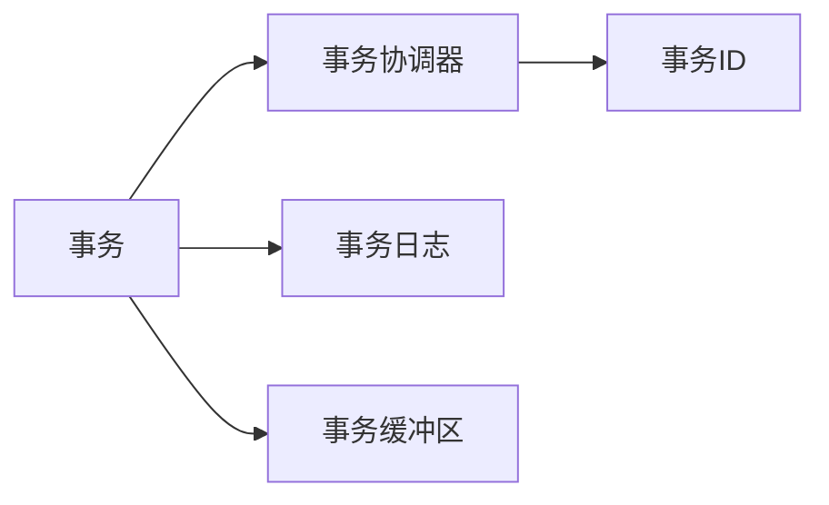

## 1.背景介绍

Apache Pulsar 是一个高性能、可扩展的开源消息传递平台，它提供了一种灵活的消息模型和强大的可扩展性，这使得它可以应对各种数据流处理和事件驱动的应用场景。Pulsar 2.5.0 版本开始，引入了对事务的支持，使得用户可以在分布式环境下进行原子性操作，大大提升了其在复杂业务场景中的应用价值。

## 2.核心概念与联系

在深入了解 Pulsar 事务消息支持的原理之前，我们先来理解几个核心概念：

- **事务**：在 Pulsar 中，事务是一组原子性操作的集合，可以跨越多个主题和分区。事务的执行可以成功（提交）或失败（中止）。

- **事务协调器（TC）**：事务协调器负责管理和协调事务，包括创建事务、提交事务和中止事务。

- **事务日志**：事务日志用于存储事务的所有操作和状态信息，是事务恢复的关键。

- **事务缓冲区（TB）**：事务缓冲区用于存储事务中的消息，直到事务被提交。每个主题分区都有一个与之关联的事务缓冲区。

- **事务ID**：事务ID 是事务的唯一标识，由事务协调器在创建事务时生成。

这些概念之间的关系可以通过以下流程图进行展示：



## 3.核心算法原理具体操作步骤

Pulsar 事务的工作流程如下：

1. 客户端向 TC 发送开始事务的请求，TC 生成一个全局唯一的事务ID，并在事务日志中记录下事务开始的信息。

2. 客户端使用事务ID 发送消息，Broker 将这些消息存储在 TB 中，同时在事务日志中记录下消息发送的信息。

3. 客户端在完成所有操作后，向 TC 发送提交事务的请求，TC 根据事务日志中的信息检查事务的状态，并决定是否可以提交事务。

4. 如果事务可以提交，TC 将在事务日志中记录下事务提交的信息，然后通知 Broker 提交事务，Broker 将 TB 中的消息写入到实际的主题中。

5. 如果事务不能提交，TC 将在事务日志中记录下事务中止的信息，并通知 Broker 中止事务，Broker 将丢弃 TB 中的消息。

## 4.数学模型和公式详细讲解举例说明

在 Pulsar 中，事务的性能主要受以下几个因素影响：

- **事务的大小**：事务的大小指的是事务中的消息数量。事务的大小越大，需要处理的消息越多，事务的处理时间也就越长。

- **事务的并发度**：事务的并发度指的是同时进行的事务数量。并发度越高，系统的资源压力也就越大，可能导致事务的处理时间增加。

- **Broker 的处理能力**：Broker 的处理能力指的是 Broker 在单位时间内能处理的事务数量。Broker 的处理能力越强，事务的处理时间就越短。

我们可以使用以下公式来估计事务的处理时间：

$$ T = \frac{S}{P} \times N $$

其中，$T$ 是事务的处理时间，$S$ 是事务的大小，$P$ 是 Broker 的处理能力，$N$ 是事务的并发度。

## 5.项目实践：代码实例和详细解释说明

下面是一个使用 Pulsar 事务的示例代码：

```java
PulsarClient client = PulsarClient.builder()
    .serviceUrl("pulsar://localhost:6650")
    .build();

Producer<String> producer = client.newProducer(Schema.STRING)
    .topic("my-topic")
    .create();

Consumer<String> consumer = client.newConsumer(Schema.STRING)
    .topic("my-topic")
    .subscriptionName("my-subscription")
    .subscribe();

Transaction transaction = client.newTransaction()
    .withTransactionTimeout(5, TimeUnit.MINUTES)
    .build().get();

producer.newMessage(transaction)
    .value("Hello, World!")
    .sendAsync();

transaction.commit().get();
```

这段代码首先创建了一个 Pulsar 客户端，然后创建了一个生产者和一个消费者。接着，它开始了一个新的事务，并发送了一条消息。最后，它提交了事务。

## 6.实际应用场景

Pulsar 事务可以应用于多种场景，例如：

- **订单处理**：在一个典型的订单处理场景中，用户下单、扣款、库存减少等操作需要在一个事务中完成，以保证数据的一致性。

- **分布式计数**：在一个分布式计数场景中，多个节点需要同时更新一个计数器，通过事务可以保证计数器的准确性。

- **流处理**：在一个流处理场景中，需要对一个数据流进行多个操作，通过事务可以保证操作的原子性和一致性。

## 7.工具和资源推荐

以下是一些有用的 Pulsar 和事务相关的工具和资源：

- **Pulsar 官方文档**：Pulsar 的官方文档详细介绍了 Pulsar 的各种功能和使用方法，是学习 Pulsar 的最好资源。

- **Pulsar GitHub**：Pulsar 的源代码托管在 GitHub 上，你可以在这里找到最新的代码和更新。

- **Pulsar 用户邮件列表**：Pulsar 的用户邮件列表是 Pulsar 用户和开发者交流的地方，你可以在这里提问和分享你的经验。

## 8.总结：未来发展趋势与挑战

Pulsar 事务的引入，使得 Pulsar 在复杂业务场景中的应用价值得到了显著提升。然而，随着事务处理需求的增加，Pulsar 事务也面临着如何提高性能、如何保证事务的隔离性和一致性等挑战。未来，我们期待 Pulsar 能够在事务处理能力和易用性上进行更多的优化和改进。

## 9.附录：常见问题与解答

1. **Pulsar 事务支持哪些操作？**

Pulsar 事务支持发送消息、确认消息和消费消息等操作。

2. **如何处理 Pulsar 事务的失败？**

如果 Pulsar 事务失败，可以选择重试事务或者中止事务。

3. **Pulsar 事务有哪些限制？**

Pulsar 事务的主要限制是事务的大小和并发度，这些限制由 Broker 的配置决定。

作者：禅与计算机程序设计艺术 / Zen and the Art of Computer Programming