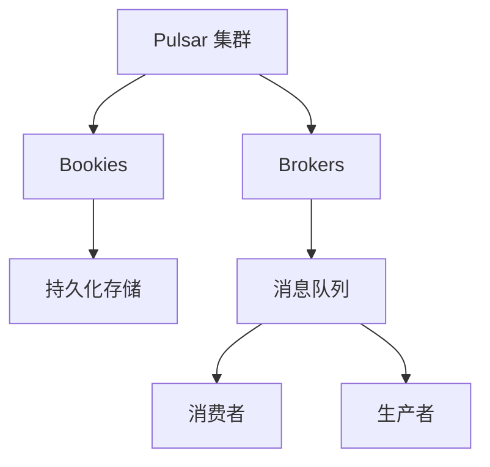
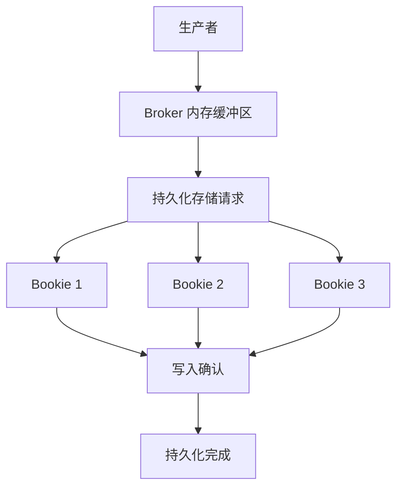
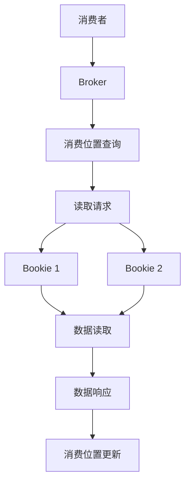

# Pulsar 消息持久化存储原理揭秘

## 1. 背景介绍

在现代分布式系统中,可靠的消息传递是一个关键需求。Apache Pulsar 作为一个云原生、分布式的消息流平台,被广泛应用于各种场景,如实时数据管道、消息驱动架构、物联网数据收集等。Pulsar 的核心优势之一就是其强大的消息持久化存储能力,能够确保消息的持久性、一致性和高可用性。本文将深入探讨 Pulsar 消息持久化存储的原理,揭示其背后的设计思路和实现细节。

### 1.1 消息持久化存储的重要性

在分布式系统中,消息持久化存储扮演着至关重要的角色。它确保了消息在传输过程中的可靠性,防止因为节点故障或网络中断而导致消息丢失。此外,持久化存储还支持消息重播、回溯和审计等高级功能,为构建可靠、健壮的分布式系统奠定了基础。

### 1.2 Pulsar 的设计理念

Pulsar 被设计为一个云原生的消息流平台,具有以下核心设计理念:

- **水平可扩展性**: Pulsar 可以在多个节点之间无缝扩展,支持海量消息的存储和处理。
- **高可用性**: 通过复制和自动故障转移机制,Pulsar 能够提供高度的可用性。
- **持久化存储**: Pulsar 将消息持久化存储在分布式日志系统中,确保消息的持久性和一致性。
- **多租户支持**: Pulsar 支持多租户隔离,适用于多租户环境。
- **统一消息模型**: Pulsar 采用统一的消息模型,支持多种消费模式,如独占、共享和失效订阅等。

## 2. 核心概念与联系

在深入探讨 Pulsar 消息持久化存储原理之前,我们需要了解一些核心概念及其相互关系。



- **Bookies**: Bookies 是 Pulsar 的存储节点,负责消息的持久化存储。它们组成了一个分布式的日志系统,类似于 Apache BookKeeper。
- **Brokers**: Brokers 是 Pulsar 的消息代理,负责接收生产者发送的消息,并将消息分发给相应的消费者。
- **持久化存储**: Bookies 将消息持久化存储在分布式文件系统或对象存储系统中,如 HDFS、AWS S3 等。
- **消息队列**: Brokers 维护着一系列逻辑上的消息队列,每个队列对应一个 Topic。
- **生产者和消费者**: 生产者向 Brokers 发送消息,消费者从 Brokers 消费消息。

Pulsar 的消息持久化存储过程可以概括为:生产者将消息发送给 Brokers,Brokers 将消息写入本地内存缓冲区,然后异步地将消息持久化存储到 Bookies 中。消费者从 Brokers 读取消息时,Brokers 会从 Bookies 获取相应的消息数据。

## 3. 核心算法原理具体操作步骤

### 3.1 写入路径

当生产者向 Broker 发送消息时,Broker 会执行以下步骤来持久化存储消息:

1. **内存缓冲**: Broker 将消息先写入本地内存缓冲区,以提高写入性能。
2. **持久化存储请求**: 当内存缓冲区达到一定阈值时,Broker 会向 Bookies 发送持久化存储请求。
3. **复制写入**: Bookies 会将消息复制写入到多个节点,以确保数据冗余和高可用性。
4. **写入确认**: 当大多数 Bookies 节点成功写入消息后,它们会向 Broker 发送写入确认。
5. **持久化完成**: Broker 收到写入确认后,会将内存缓冲区中的消息标记为已持久化。



### 3.2 读取路径

当消费者从 Broker 读取消息时,Broker 会执行以下步骤:

1. **消费位置查询**: Broker 根据消费者的消费位置,确定需要从哪些 Bookies 读取消息。
2. **读取请求**: Broker 向相应的 Bookies 发送读取请求。
3. **数据读取**: Bookies 从持久化存储中读取消息数据,并返回给 Broker。
4. **数据响应**: Broker 收到消息数据后,将其发送给消费者。
5. **消费位置更新**: 消费者确认消息后,Broker 会更新消费者的消费位置。



## 4. 数学模型和公式详细讲解举例说明

在 Pulsar 的消息持久化存储过程中,涉及到一些关键的数学模型和公式,用于确保数据的一致性和可靠性。

### 4.1 复制写入策略

Pulsar 采用了类似于 Raft 协议的复制写入策略,确保消息被持久化存储到多个 Bookies 节点中。具体来说,Pulsar 使用了 $(N, Q)$ 复制策略,其中 $N$ 表示复制的副本数量,而 $Q$ 表示写入成功所需的最小确认数量。

$$
Q = \left\lceil\frac{N}{2}\right\rceil + 1
$$

例如,如果 $N = 3$,那么 $Q = 2$,这意味着只要有两个 Bookies 节点成功写入消息,写入操作就会被视为成功。这种策略能够在一定程度上容忍节点故障,提高了系统的可用性和可靠性。

### 4.2 消费位置管理

为了确保消费者能够准确地从上次消费的位置继续读取消息,Pulsar 维护了一个名为 `消费位置` 的概念。消费位置是一个逻辑上的指针,指向消费者上次消费的消息位置。

消费位置由两部分组成:`ledger_id` 和 `entry_id`。其中,`ledger_id` 表示消息所在的分布式日志文件,而 `entry_id` 表示消息在该日志文件中的偏移量。

$$
\text{消费位置} = (\text{ledger_id}, \text{entry_id})
$$

例如,假设消费位置为 $(123, 456)$,这意味着消费者上次消费的消息位于编号为 123 的分布式日志文件中,偏移量为 456。

通过精确地管理消费位置,Pulsar 能够确保消费者不会漏消费或重复消费消息,从而保证了消息的一致性和可靠性。

## 5. 项目实践: 代码实例和详细解释说明

为了更好地理解 Pulsar 消息持久化存储的实现细节,我们将通过一个简单的示例项目来进行实践。在这个示例中,我们将创建一个 Pulsar 集群,并编写代码来发送和消费消息。

### 5.1 环境准备

首先,我们需要准备 Pulsar 的运行环境。您可以选择在本地环境或云环境中部署 Pulsar 集群。对于本地环境,您可以使用 Docker Compose 快速启动一个单节点的 Pulsar 集群。

```bash
git clone https://github.com/apache/pulsar
cd pulsar/site2/website/deploy-pulsar
docker-compose up -d
```

### 5.2 生产者示例

下面是一个使用 Java 编写的 Pulsar 生产者示例:

```java
import org.apache.pulsar.client.api.Producer;
import org.apache.pulsar.client.api.PulsarClient;
import org.apache.pulsar.client.api.PulsarClientException;

public class PulsarProducerExample {
    public static void main(String[] args) throws PulsarClientException {
        // 创建 Pulsar 客户端实例
        PulsarClient client = PulsarClient.builder()
                .serviceUrl("pulsar://localhost:6650")
                .build();

        // 创建生产者实例
        Producer<byte[]> producer = client.newProducer()
                .topic("my-topic")
                .create();

        // 发送消息
        for (int i = 0; i < 10; i++) {
            String message = "Hello, Pulsar! Message " + i;
            producer.send(message.getBytes());
        }

        // 关闭生产者和客户端
        producer.close();
        client.close();
    }
}
```

在这个示例中,我们首先创建了一个 `PulsarClient` 实例,并指定了 Pulsar 集群的服务 URL。然后,我们创建了一个 `Producer` 实例,并指定了要发送消息的 Topic。接下来,我们使用 `producer.send()` 方法发送了 10 条消息。最后,我们关闭了生产者和客户端实例。

### 5.3 消费者示例

下面是一个使用 Java 编写的 Pulsar 消费者示例:

```java
import org.apache.pulsar.client.api.Consumer;
import org.apache.pulsar.client.api.Message;
import org.apache.pulsar.client.api.PulsarClient;
import org.apache.pulsar.client.api.PulsarClientException;
import org.apache.pulsar.client.api.SubscriptionType;

public class PulsarConsumerExample {
    public static void main(String[] args) throws PulsarClientException {
        // 创建 Pulsar 客户端实例
        PulsarClient client = PulsarClient.builder()
                .serviceUrl("pulsar://localhost:6650")
                .build();

        // 创建消费者实例
        Consumer<byte[]> consumer = client.newConsumer()
                .topic("my-topic")
                .subscriptionName("my-subscription")
                .subscriptionType(SubscriptionType.Exclusive)
                .subscribe();

        // 消费消息
        while (true) {
            Message<byte[]> msg = consumer.receive();
            String message = new String(msg.getData());
            System.out.println("Received message: " + message);
            consumer.acknowledge(msg);
        }
    }
}
```

在这个示例中,我们首先创建了一个 `PulsarClient` 实例,并指定了 Pulsar 集群的服务 URL。然后,我们创建了一个 `Consumer` 实例,并指定了要消费的 Topic、订阅名称和订阅类型。接下来,我们进入一个无限循环,不断从 Broker 接收消息。每次收到消息后,我们会打印消息内容,并调用 `consumer.acknowledge()` 方法确认消息已被成功消费。

通过这个示例,您可以了解到如何使用 Pulsar 客户端库发送和消费消息。同时,您也可以探索更多高级功能,如批量消息处理、消息重试策略等。

## 6. 实际应用场景

Pulsar 的消息持久化存储能力使其适用于各种实际应用场景,包括但不限于:

1. **实时数据管道**: Pulsar 可以作为实时数据管道的核心组件,将来自各种来源的数据可靠地传输到下游系统进行处理和存储。
2. **消息驱动架构**: Pulsar 支持构建松散耦合的消息驱动架构,各个服务之间通过异步消息进行通信,提高了系统的可扩展性和灵活性。
3. **物联网数据收集**: Pulsar 可以高效地收集来自物联网设备的海量数据,并确保数据的持久性和可靠性。
4. **事件驱动架构**: Pulsar 能够支持事件驱动架构,将各种事件持久化存储,供下游系统进行实时处理和分析。
5. **日志收集和处理**: Pulsar 可以作为日志收集和处理系统的核心组件,确保日志数据的持久性和可靠性。

无论是在传统的企业应用中,还是在新兴的云原生架构中,Pulsar 都能发挥其强大的消息持久化存储能力,为构建可靠、高性能的分布式系统提供坚实的基础。

## 7. 工具和资源推荐

在使用 Pulsar 进行消息